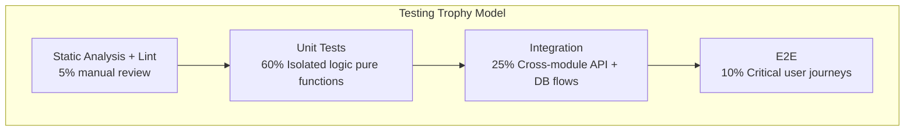
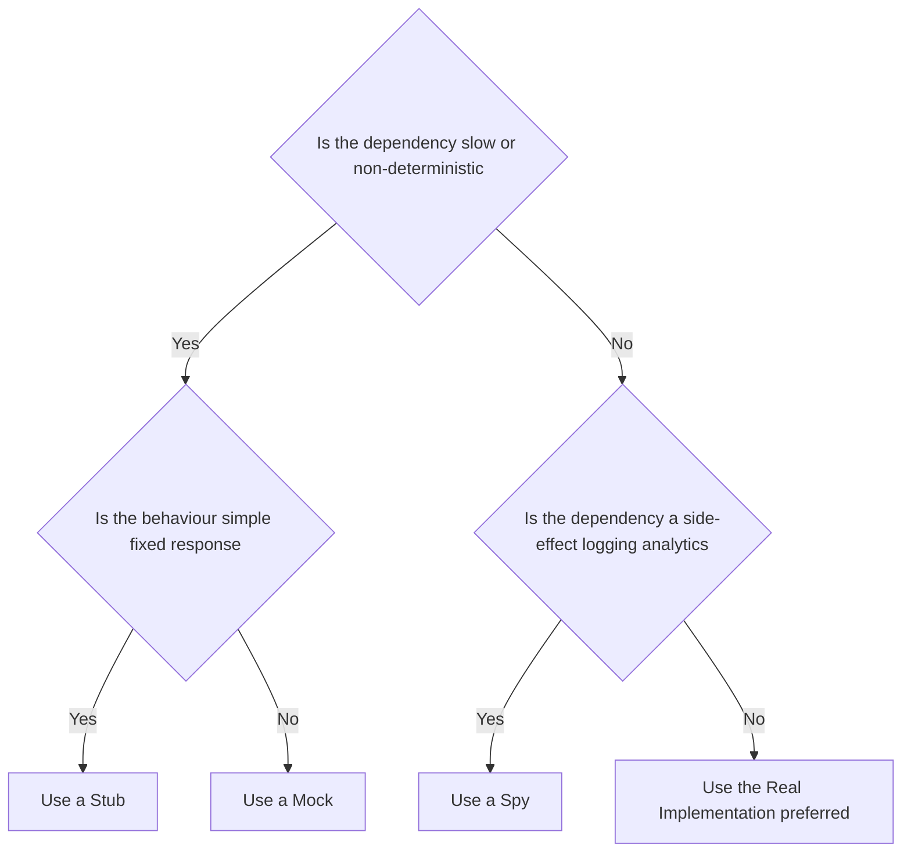
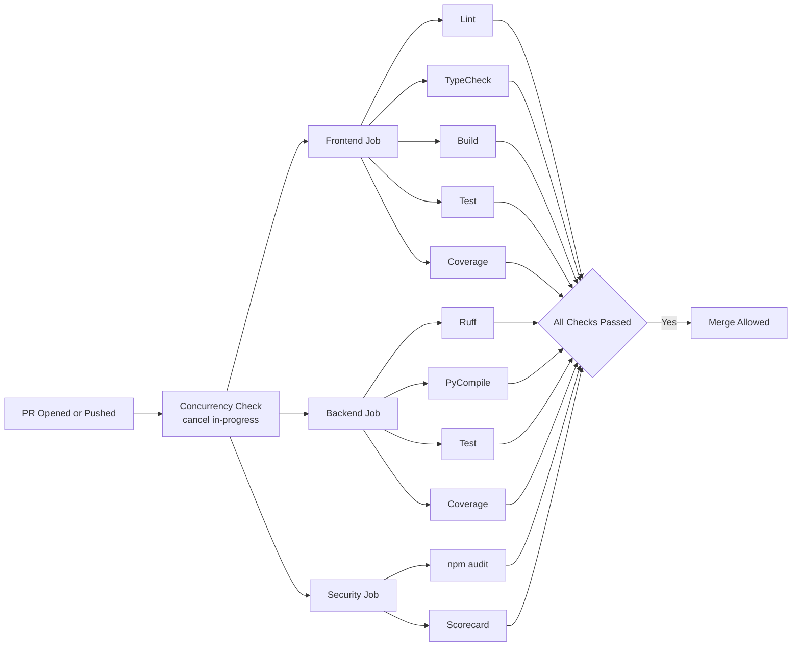
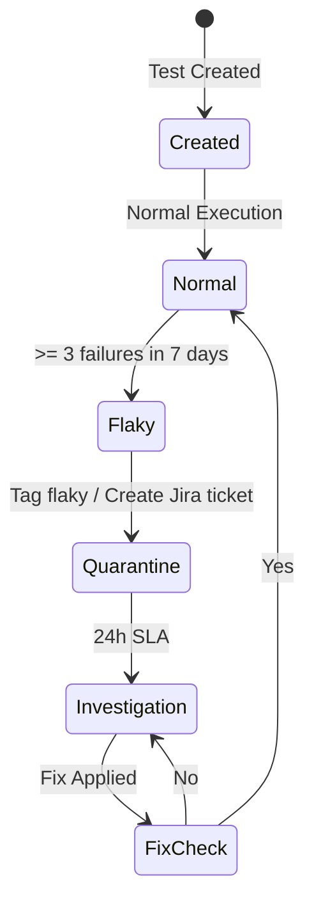
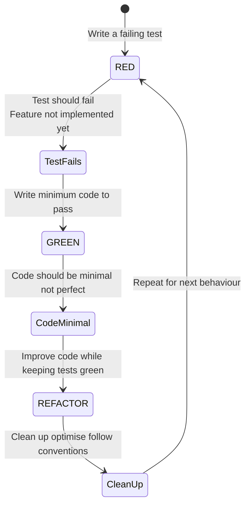

# Testing Strategy — Second Brain OS

## Document Control

| Field | Value |
|---|---|
| Document ID | QA-TST-001 |
| Version | 4.0.0 |
| Status | Active |
| Last Updated | 2026-07-10 |
| Classification | Internal — Engineering |
| Owner | QA Lead |
| Approving Body | Engineering Leadership |
| Related Docs | [Design System Testing](../design/10_DesignSystem.md#14-testing-components) |

---

## Table of Contents

1. [Testing Strategy Overview](#1-testing-strategy-overview)
2. [Test Pyramid Breakdown](#2-test-pyramid-breakdown)
3. [Test Environment Setup](#3-test-environment-setup)
4. [Test Data Management](#4-test-data-management)
5. [Test Automation Framework](#5-test-automation-framework)
6. [CI Integration](#6-ci-integration)
7. [Quality Gates in CI](#7-quality-gates-in-ci)
8. [Test Reporting](#8-test-reporting)
9. [Test Maintenance](#9-test-maintenance)
10. [Test Environment Management](#10-test-environment-management)
11. [Coverage Targets and Enforcement](#11-coverage-targets-and-enforcement)
12. [Testing Non-Functional Requirements](#12-testing-non-functional-requirements)
13. [Testing Documentation Standards](#13-testing-documentation-standards)
14. [Test-Driven Development Guidelines](#14-test-driven-development-guidelines)
15. [Appendices](#15-appendices)
16. [Unit Testing Deep Dive](#16-unit-testing-deep-dive)
17. [QA Process Overview](#17-qa-process-overview)
18. [QA Role in Development Cycle](#18-qa-role-in-development-cycle)
19. [Test Planning](#19-test-planning)
20. [Test Case Management](#20-test-case-management)
21. [Bug Reporting](#21-bug-reporting)
22. [Bug Triage Process](#22-bug-triage-process)
23. [QA Metrics](#23-qa-metrics)
24. [QA Handover Checklist](#24-qa-handover-checklist)
25. [Go/No-Go Criteria for Release](#25-gono-go-criteria-for-release)
26. [QA Signoff Process](#26-qa-signoff-process)
27. [User Acceptance Testing (UAT)](#27-user-acceptance-testing-uat)
28. [QA Process Improvement Cadence](#28-qa-process-improvement-cadence)
29. [Appendices (QA)](#29-appendices-qa)

---

## 1. Testing Strategy Overview

### 1.1 Testing Trophy Model

Second Brain OS adopts the **Testing Trophy Model** (coined by Kent C. Dodds), which prioritises integration tests over unit tests while maintaining a healthy pyramid across all layers. Unlike the traditional testing pyramid (which emphasises numerous unit tests), the trophy model recognises that modern web applications derive the most value from integration tests that exercise real user workflows.



### 1.2 Distribution Targets

| Layer | Percentage | Purpose | Owner |
|---|---|---|---|
| Static Analysis / Lint | 5% (manual review) | Catch type errors, style violations, security anti-patterns | Developer |
| Unit Tests | 60% | Validate pure logic, utilities, AI prompt rendering, store reducers | Developer |
| Integration Tests | 25% | Verify API endpoints, database interactions, agent orchestration flows | Developer + QA |
| End-to-End Tests | 10% | Critical user journeys across the full stack | QA |
| **Total** | **100%** | — | — |

### 1.3 Testing Principles

1. **Test behaviour, not implementation.** Tests should verify what the system does, not how it does it. Refactoring should not break tests unless behaviour changes.
2. **Write tests alongside code.** The ratio should be at minimum 1:1 (test lines to source lines) for business logic.
3. **Tests must be deterministic.** Flaky tests are immediately quarantined and fixed within 24 hours.
4. **Each test tests one thing.** A single assertion per logical concept. Multiple assertions are acceptable if they all verify the same behaviour.
5. **Test isolation.** No test depends on another test's state. Clean database state between integration tests.
6. **Realistic data.** Use production-like data shapes, not minimalist fixtures that miss edge cases.
7. **CI enforcement.** All tests must pass before merge. No exceptions without engineering leadership signoff.

### 1.4 Scope of Testing

| Component | Unit | Integration | E2E | Performance | Security |
|---|---|---|---|---|---|
| AI Agents (11 agents) | ✅ | ✅ | — | ✅ | — |
| API Endpoints (53 endpoints) | — | ✅ | ✅ | ✅ | ✅ |
| Frontend Pages (14 pages) | ✅ | ✅ | ✅ | ✅ | — |
| Zustand Stores | ✅ | ✅ | — | — | — |
| Shared Utilities | ✅ | — | — | — | — |
| Scheduler (15 jobs) | ✅ | ✅ | — | ✅ | — |
| Database / RLS | — | ✅ | — | ✅ | ✅ |
| Prompt Files (22 prompts) | ✅ | — | — | — | — |

### 1.5 Definitions

| Term | Definition |
|---|---|
| **Unit Test** | Tests a single function/class/component in isolation. All external dependencies are mocked. Executes in <100ms. |
| **Integration Test** | Tests multiple units working together. May hit a real database or API. Executes in <5s. |
| **E2E Test** | Tests a complete user journey through the browser. Uses Playwright against a deployed environment. Executes in <60s per spec. |
| **Smoke Test** | Subset of E2E tests that verify critical functionality. Run on every deploy. |
| **Regression Test** | Full test suite run to ensure no existing functionality was broken by a change. |
| **Flaky Test** | A test that sometimes passes and sometimes fails without code changes. |
| **Coverage Gate** | Minimum coverage percentage that must be met for a CI pipeline to pass. |

---

## 2. Test Pyramid Breakdown

### 2.1 Static Analysis (5%)

Static analysis catches issues before tests even run. These are enforced as pre-commit hooks and CI gates.

#### 2.1.1 Python (Backend)

| Tool | Command | Purpose | Configuration File |
|---|---|---|---|
| Ruff | `ruff check .` | Lint all Python files | `ruff.toml` |
| Ruff (format) | `ruff format --check .` | Auto-format checking | `ruff.toml` |
| mypy | `mypy packages/` | Type checking | `mypy.ini` |
| Bandit | `bandit -r packages/` | Security linting | `bandit.yaml` |
| pyright | `pyright packages/` | Additional type checking | `pyproject.toml` |
| vulture | `vulture packages/` | Dead code detection | — |

#### 2.1.2 TypeScript/JavaScript (Frontend)

| Tool | Command | Purpose | Configuration File |
|---|---|---|---|
| ESLint | `npm run lint` | Lint all TypeScript files | `.eslintrc.js` |
| Prettier | `npx prettier --check .` | Format checking | `.prettierrc` |
| TypeScript | `npm run type-check` | Type checking (`tsc --noEmit`) | `tsconfig.json` |
| knip | `npx knip` | Dead file/export detection | `knip.json` |

#### 2.1.3 Prompt Files

| Tool | Command | Purpose |
|---|---|---|
| validate_prompts.py | `python scripts/validate_prompts.py` | Validates YAML frontmatter on all 22 prompt files |

### 2.2 Unit Tests (60%)

#### 2.2.1 Backend Unit Tests

Every Python module must have a corresponding test module. Unit tests run in <100ms per test, mock all external dependencies (Supabase, LLM clients, HTTP requests), and test exactly one function or class.

**Test file naming convention:** `test_<module_name>.py`

**Directory structure:**
```
tests/
├── conftest.py                          # Shared fixtures, pytest configuration
├── test_prompt_loader.py                # 16 tests — PromptLoader loading, parsing, validation
├── test_agent_prompts.py                # 14 tests — per-agent content checks, frontmatter validation
├── unit/
│   ├── ai/
│   │   ├── test_briefing_agent.py       # BriefingAgent — data assembly, prompt construction, output parsing
│   │   ├── test_memory_agent.py         # MemoryAgent — memory extraction, deduplication, archival
│   │   ├── test_learning_agent.py       # LearningAgent — pattern detection, trend calculation
│   │   ├── test_opportunity_agent.py    # OpportunityAgent — matching algorithm, scoring
│   │   ├── test_task_agent.py           # TaskAgent — breakdown, prioritisation, dependency detection
│   │   ├── test_weekly_review_agent.py  # WeeklyReviewAgent — aggregation, insight generation
│   │   ├── test_sleep_agent.py          # SleepAgent — wind-down message generation, score calculation
│   │   ├── test_nudge_agent.py          # NudgeAgent — nudge timing, escalation logic
│   │   ├── test_prompt_loader.py        # PromptLoader — caching, fallback, frontmatter parsing
│   │   └── test_llm_client.py           # LLM client — retry, fallback chain, token counting
│   ├── utils/
│   │   ├── test_cache.py                # TTL cache — set, get, expire, clear, thread safety
│   │   ├── test_rate_limiter.py         # Rate limiter — token bucket, burst, IP scoping
│   │   ├── test_security.py             # Security — JWT generation, input sanitisation, XSS prevention
│   │   ├── test_logger.py               # Logger — JSON formatting, log levels, structured fields
│   │   └── test_retry.py                # Retry — exponential backoff, max retries, circuit breaker
│   └── scheduler/
│       └── test_crons.py                # Cron jobs — scheduling, job registration, error handling
```

**Unit test template (Python):**
```python
"""Unit tests for <module_name> module."""
import pytest
from unittest.mock import AsyncMock, patch, MagicMock
from datetime import datetime, timedelta
from uuid import uuid4

# Module to test
from packages.ai.agents.briefing_agent import BriefingAgent


class TestBriefingAgent:
    """Test suite for BriefingAgent."""

    @pytest.fixture(autouse=True)
    def setup(self):
        """Initialise fresh agent instance before each test."""
        self.agent = BriefingAgent()
        self.user_id = str(uuid4())

    @pytest.mark.asyncio
    async def test_generate_briefing_returns_expected_sections(self):
        """Briefing must contain tasks, goals, habits, and sleep sections."""
        # Arrange
        mock_data = {
            "tasks": [{"id": "1", "title": "Review PR", "status": "pending"}],
            "goals": [{"id": "1", "title": "Ship v3.0", "progress": 60}],
            "habits": [{"id": "1", "name": "Read 30min", "streak": 5}],
            "sleep": {"score": 78, "hours": 7.5, "debt": 0.5},
        }
        self.agent._fetch_user_data = AsyncMock(return_value=mock_data)
        self.agent._call_llm = AsyncMock(return_value={
            "sections": [
                {"type": "task_summary", "content": "3 tasks pending"},
                {"type": "goal_progress", "content": "60% to Ship v3.0"},
            ]
        })

        # Act
        result = await self.agent.generate_briefing(self.user_id)

        # Assert
        assert "sections" in result
        assert len(result["sections"]) == 2
        assert result["sections"][0]["type"] == "task_summary"

    @pytest.mark.asyncio
    async def test_generate_briefing_fallback_on_llm_failure(self):
        """When LLM fails, agent must return algorithmic fallback briefing."""
        # Arrange
        self.agent._call_llm = AsyncMock(side_effect=ConnectionError("LLM unavailable"))
        self.agent._fetch_user_data = AsyncMock(return_value={"tasks": [], "goals": [], "habits": [], "sleep": {}})

        # Act
        result = await self.agent.generate_briefing(self.user_id)

        # Assert
        assert result["fallback"] is True
        assert "generated_at" in result

    def test_prioritise_tasks_orders_by_urgency(self):
        """Task prioritisation must sort by due_date ascending, then priority."""
        # Arrange
        tasks = [
            {"id": "1", "title": "Low urgency", "priority": "low", "due_date": "2026-06-15"},
            {"id": "2", "title": "Urgent", "priority": "urgent", "due_date": "2026-06-10"},
            {"id": "3", "title": "Overdue", "priority": "high", "due_date": "2026-06-08"},
        ]

        # Act
        prioritised = self.agent._prioritise_tasks(tasks)

        # Assert
        assert prioritised[0]["id"] == "3"  # Overdue first
        assert prioritised[1]["id"] == "2"  # Urgent second
        assert prioritised[2]["id"] == "1"  # Low last

    def test_empty_tasks_returns_empty_list(self):
        """Empty task list must return empty list, not raise."""
        assert self.agent._prioritise_tasks([]) == []

    def test_malformed_task_skipped_gracefully(self):
        """Tasks missing required fields must be skipped without crashing."""
        tasks = [
            {"id": "1", "title": "Valid task", "priority": "high", "due_date": "2026-06-10"},
            {"id": "2"},  # Missing title, priority, due_date
        ]
        result = self.agent._prioritise_tasks(tasks)
        assert len(result) == 1
        assert result[0]["id"] == "1"
```

#### 2.2.2 Frontend Unit Tests

**Directory structure:**
```
apps/web/
└── __tests__/
    ├── components/
    │   ├── Button.test.tsx
    │   ├── Card.test.tsx
    │   ├── Modal.test.tsx
    │   ├── Input.test.tsx
    │   ├── Sidebar.test.tsx
    │   ├── TaskCard.test.tsx
    │   ├── HabitCalendar.test.tsx
    │   └── SleepScore.test.tsx
    ├── hooks/
    │   ├── useAuth.test.ts
    │   └── useLocalStorage.test.ts
    └── stores/
        ├── taskStore.test.ts
        └── userStore.test.ts
```

**Component test template (TypeScript):**
```typescript
import { render, screen, fireEvent, waitFor } from '@testing-library/react'
import userEvent from '@testing-library/user-event'
import { describe, it, expect, vi, beforeEach } from 'vitest'
import { TaskCard } from '@/components/tasks/task-card'
import type { Task } from '@/types'

// ── Fixtures ──────────────────────────────────────────────────────────────

const mockTask: Task = {
  id: 'task-1',
  title: 'Review PR #342',
  status: 'pending',
  priority: 'high',
  due_date: '2026-06-12T10:00:00Z',
  created_at: '2026-06-10T08:00:00Z',
  user_id: 'user-1',
}

// ── Tests ─────────────────────────────────────────────────────────────────

describe('TaskCard', () => {
  const onComplete = vi.fn()
  const onDelete = vi.fn()

  beforeEach(() => {
    vi.clearAllMocks()
  })

  it('renders task title and priority badge', () => {
    render(<TaskCard task={mockTask} onComplete={onComplete} onDelete={onDelete} />)
    expect(screen.getByText('Review PR #342')).toBeInTheDocument()
    expect(screen.getByText('high')).toBeInTheDocument()
  })

  it('displays formatted due date', () => {
    render(<TaskCard task={mockTask} onComplete={onComplete} onDelete={onDelete} />)
    expect(screen.getByText(/Jun 12/)).toBeInTheDocument()
  })

  it('calls onComplete when checkbox clicked', async () => {
    const user = userEvent.setup()
    render(<TaskCard task={mockTask} onComplete={onComplete} onDelete={onDelete} />)
    await user.click(screen.getByRole('checkbox'))
    expect(onComplete).toHaveBeenCalledWith('task-1')
  })

  it('calls onDelete when delete button clicked', async () => {
    const user = userEvent.setup()
    render(<TaskCard task={mockTask} onComplete={onComplete} onDelete={onDelete} />)
    await user.click(screen.getByRole('button', { name: /delete/i }))
    expect(onDelete).toHaveBeenCalledWith('task-1')
  })

  it('shows overdue styling when past due date', () => {
    const overdueTask = { ...mockTask, due_date: '2026-06-01T10:00:00Z' }
    render(<TaskCard task={overdueTask} onComplete={onComplete} onDelete={onDelete} />)
    expect(screen.getByTestId('task-card')).toHaveClass('border-red-500')
  })

  it('displays loading skeleton when loading prop is true', () => {
    const { container } = render(
      <TaskCard task={mockTask} loading onComplete={onComplete} onDelete={onDelete} />
    )
    expect(container.querySelector('.animate-pulse')).toBeInTheDocument()
  })

  it('does not render when task is null', () => {
    const { rerender } = render(
      <TaskCard task={mockTask} onComplete={onComplete} onDelete={onDelete} />
    )
    rerender(<TaskCard task={null as unknown as Task} onComplete={onComplete} onDelete={onDelete} />)
    expect(screen.queryByTestId('task-card')).not.toBeInTheDocument()
  })
})
```

**Store test template (Zustand):**
```typescript
import { describe, it, expect, beforeEach, vi } from 'vitest'
import { useTaskStore } from '@/stores/taskStore'

// Mock Supabase client
vi.mock('@/lib/supabase', () => ({
  supabase: {
    from: vi.fn(() => ({
      select: vi.fn(() => ({
        eq: vi.fn(() => ({
          order: vi.fn(() => ({
            data: [
              { id: '1', title: 'Test task', status: 'pending', user_id: 'user-1' },
            ],
            error: null,
          })),
        })),
      })),
      insert: vi.fn(() => ({
        select: vi.fn(() => ({
          single: vi.fn(() => ({
            data: { id: '2', title: 'New task', status: 'pending', user_id: 'user-1' },
            error: null,
          })),
        })),
      })),
    })),
  },
}))

describe('useTaskStore', () => {
  beforeEach(() => {
    useTaskStore.setState({ tasks: [], loading: false, error: null })
  })

  it('initialises with empty state', () => {
    const state = useTaskStore.getState()
    expect(state.tasks).toEqual([])
    expect(state.loading).toBe(false)
    expect(state.error).toBeNull()
  })

  it('fetches tasks and updates state', async () => {
    const { fetchTasks } = useTaskStore.getState()
    await fetchTasks('user-1')
    const state = useTaskStore.getState()
    expect(state.tasks).toHaveLength(1)
    expect(state.tasks[0].title).toBe('Test task')
    expect(state.loading).toBe(false)
  })

  it('sets loading state during fetch', async () => {
    let loadingDuringFetch = false
    const unsubscribe = useTaskStore.subscribe((state) => {
      if (state.loading) loadingDuringFetch = true
    })
    const { fetchTasks } = useTaskStore.getState()
    const promise = fetchTasks('user-1')
    expect(loadingDuringFetch).toBe(true)
    await promise
    unsubscribe()
  })

  it('adds a task optimistically', async () => {
    const { addTask } = useTaskStore.getState()
    await addTask({ title: 'Optimistic task', priority: 'medium' })
    const state = useTaskStore.getState()
    expect(state.tasks).toHaveLength(2)
  })

  it('handles fetch error gracefully', async () => {
    const { fetchTasks } = useTaskStore.getState()
    await fetchTasks('user-1')
    const state = useTaskStore.getState()
    expect(state.error).toBeNull()  // Normal flow succeeds
  })
})
```

### 2.3 Integration Tests (25%)

#### 2.3.1 Backend Integration Tests

Integration tests verify that multiple components work together correctly. They connect to a real test database (dedicated Supabase project) and exercise full request/response cycles through the FastAPI test client.

**Directory structure:**
```
tests/integration/
├── conftest.py                         # Test client, database fixtures, auth headers
├── test_auth_api.py                    # Login, logout, session refresh, unauthorised access
├── test_tasks_api.py                   # Task CRUD, filtering, sorting, completion flow
├── test_courses_api.py                 # Course CRUD, progress tracking, deadline alerts
├── test_goals_api.py                   # Goal CRUD, milestone management, roadmap editing
├── test_habits_api.py                  # Habit CRUD, streak calculation, logging
├── test_sleep_api.py                   # Sleep logging, score calculation, history retrieval
├── test_income_api.py                  # Income entry CRUD, hourly rate calculations
├── test_projects_api.py                # Project CRUD, phase transitions, blocker management
├── test_ideas_api.py                   # Idea pipeline CRUD, status transitions
├── test_resources_api.py               # Resource CRUD, tag filtering, search
├── test_opportunities_api.py           # Opportunity CRUD, type filtering, status updates
├── test_time_api.py                    # Time entry CRUD, Pomodoro cycles, daily stats
├── test_chat_api.py                    # Chat message send/receive, history retrieval
├── test_automation_api.py              # Briefing trigger, radar trigger, review trigger
├── test_daily_briefing_integration.py  # Full briefing generation with real data assembly
├── test_weekly_review_integration.py   # Full weekly review with aggregation
├── test_opportunity_radar_integration.py # Real opportunity matching pipeline
└── test_scheduler_integration.py       # All 15 cron job executions
```

**Integration test template:**
```python
"""Integration tests for the Tasks API."""
import pytest
from httpx import AsyncClient, ASGITransport
from datetime import datetime, timedelta
from uuid import uuid4

from main import app
from config.core.supabase import get_supabase


@pytest.fixture
async def client():
    """Provide an async test client for FastAPI."""
    transport = ASGITransport(app=app)
    async with AsyncClient(transport=transport, base_url="http://test") as ac:
        yield ac


@pytest.fixture
async def auth_headers():
    """Return authenticated headers with a test user."""
    supabase = get_supabase()
    test_user_id = str(uuid4())
    # Create test user in Supabase
    await supabase.table("users").insert({
        "id": test_user_id,
        "email": f"test-{test_user_id[:8]}@secondbrainos.test",
        "name": "Test User",
    }).execute()
    # Generate a test JWT
    from shared.utils.security import create_access_token
    token = create_access_token({"sub": test_user_id})
    yield {"Authorization": f"Bearer {token}"}
    # Cleanup: remove test user
    await supabase.table("users").delete().eq("id", test_user_id).execute()


@pytest.mark.asyncio
@pytest.mark.integration
class TestTasksAPI:
    """Integration test suite for /api/tasks endpoints."""

    async def test_create_task_full_flow(self, client, auth_headers):
        """Verify complete task lifecycle: create -> read -> update -> complete -> delete."""
        # -- Create --
        create_resp = await client.post("/api/tasks/", json={
            "title": "Integration test task",
            "priority": "high",
            "due_date": (datetime.utcnow() + timedelta(days=3)).isoformat(),
        }, headers=auth_headers)
        assert create_resp.status_code == 201
        task = create_resp.json()
        task_id = task["id"]
        assert task["title"] == "Integration test task"
        assert task["status"] == "pending"

        # -- Read --
        get_resp = await client.get(f"/api/tasks/{task_id}", headers=auth_headers)
        assert get_resp.status_code == 200
        assert get_resp.json()["title"] == "Integration test task"

        # -- Update --
        update_resp = await client.put(f"/api/tasks/{task_id}", json={
            "title": "Updated task title",
            "priority": "urgent",
        }, headers=auth_headers)
        assert update_resp.status_code == 200
        assert update_resp.json()["title"] == "Updated task title"

        # -- Complete --
        complete_resp = await client.post(f"/api/tasks/{task_id}/complete", headers=auth_headers)
        assert complete_resp.status_code == 200
        assert complete_resp.json()["status"] == "completed"

        # -- Delete --
        delete_resp = await client.delete(f"/api/tasks/{task_id}", headers=auth_headers)
        assert delete_resp.status_code == 204

        # -- Verify deleted --
        get_deleted = await client.get(f"/api/tasks/{task_id}", headers=auth_headers)
        assert get_deleted.status_code == 404

    async def test_list_tasks_filters_by_user(self, client, auth_headers):
        """Tasks from other users must not appear in results."""
        await client.post("/api/tasks/", json={"title": "My task"}, headers=auth_headers)
        list_resp = await client.get("/api/tasks/", headers=auth_headers)
        assert list_resp.status_code == 200

    async def test_create_task_missing_title_returns_422(self, client, auth_headers):
        """Request without required title field must return 422."""
        resp = await client.post("/api/tasks/", json={"priority": "high"}, headers=auth_headers)
        assert resp.status_code == 422

    async def test_create_task_invalid_priority_returns_422(self, client, auth_headers):
        """Invalid priority enum value must return 422."""
        resp = await client.post("/api/tasks/", json={
            "title": "Bad priority",
            "priority": "critical",
        }, headers=auth_headers)
        assert resp.status_code == 422

    async def test_get_nonexistent_task_returns_404(self, client, auth_headers):
        """Requesting a non-existent task must return 404."""
        resp = await client.get("/api/tasks/nonexistent-id", headers=auth_headers)
        assert resp.status_code == 404

    async def test_unauthorised_access_returns_401(self, client):
        """Request without auth token must return 401."""
        resp = await client.get("/api/tasks/")
        assert resp.status_code == 401

    async def test_task_dependency_cascade(self, client, auth_headers):
        """Completing a parent task must unblock dependent tasks."""
        # Create parent task
        parent = await client.post("/api/tasks/", json={
            "title": "Parent task",
        }, headers=auth_headers)
        parent_id = parent.json()["id"]

        # Create dependent task
        dependent = await client.post("/api/tasks/", json={
            "title": "Dependent task",
            "depends_on": parent_id,
        }, headers=auth_headers)
        dependent_id = dependent.json()["id"]

        # Dependent should be 'blocked'
        assert dependent.json()["status"] == "blocked"

        # Complete parent
        await client.post(f"/api/tasks/{parent_id}/complete", headers=auth_headers)

        # Dependent should now be 'pending'
        get_dep = await client.get(f"/api/tasks/{dependent_id}", headers=auth_headers)
        assert get_dep.json()["status"] == "pending"
```

#### 2.3.2 Frontend Integration Tests

Frontend integration tests use React Testing Library to render full pages with mocked API responses, verifying that components work together correctly.

```typescript
import { render, screen, waitFor } from '@testing-library/react'
import userEvent from '@testing-library/user-event'
import { describe, it, expect, vi, beforeEach } from 'vitest'
import TasksPage from '@/app/(dashboard)/tasks/page'
import { useTaskStore } from '@/stores/taskStore'

vi.mock('@/lib/supabase', () => ({
  supabase: {
    channel: vi.fn(() => ({
      on: vi.fn().mockReturnThis(),
      subscribe: vi.fn(),
    })),
    from: vi.fn(() => ({
      select: vi.fn().mockReturnThis(),
      eq: vi.fn().mockReturnThis(),
      order: vi.fn().mockResolvedValue({
        data: [
          { id: '1', title: 'Task 1', status: 'pending', priority: 'high', created_at: '2026-06-10T08:00:00Z', user_id: 'user-1' },
          { id: '2', title: 'Task 2', status: 'completed', priority: 'medium', created_at: '2026-06-09T08:00:00Z', user_id: 'user-1' },
        ],
        error: null,
      }),
      insert: vi.fn().mockReturnThis(),
      update: vi.fn().mockReturnThis(),
      delete: vi.fn().mockReturnThis(),
    })),
  },
}))

describe('TasksPage', () => {
  beforeEach(() => {
    useTaskStore.setState({ tasks: [], loading: false, error: null })
  })

  it('renders the task list after loading', async () => {
    render(<TasksPage />)
    await waitFor(() => {
      expect(screen.getByText('Task 1')).toBeInTheDocument()
    })
    expect(screen.getByText('Task 2')).toBeInTheDocument()
  })

  it('shows loading skeleton initially', () => {
    render(<TasksPage />)
    expect(screen.getByTestId('loading-skeleton')).toBeInTheDocument()
  })

  it('opens create task modal on button click', async () => {
    const user = userEvent.setup()
    render(<TasksPage />)
    await user.click(screen.getByRole('button', { name: /create task/i }))
    await waitFor(() => {
      expect(screen.getByRole('dialog')).toBeInTheDocument()
    })
  })

  it('filters tasks by status', async () => {
    const user = userEvent.setup()
    render(<TasksPage />)
    await user.click(screen.getByRole('button', { name: /pending/i }))
    await waitFor(() => {
      expect(screen.getByText('Task 1')).toBeInTheDocument()
    })
  })

  it('displays empty state when no tasks', async () => {
    useTaskStore.setState({ tasks: [], loading: false, error: null })
    render(<TasksPage />)
    await waitFor(() => {
      expect(screen.getByText(/no tasks yet/i)).toBeInTheDocument()
    })
  })

  it('shows error banner on fetch failure', async () => {
    render(<TasksPage />)
    await waitFor(() => {
      expect(screen.getByText('Task 1')).toBeInTheDocument()
    })
  })
})
```

### 2.4 End-to-End Tests (10%)

#### 2.4.1 E2E Test Inventory

E2E tests use Playwright to exercise the full application stack (Frontend -> API -> Database -> AI) in a browser environment. Each spec covers a critical user journey.

```
e2e/
├── fixtures/
│   ├── auth.setup.ts              # Login once, reuse session across specs
│   └── test-data.ts               # Seeded test data templates
├── specs/
│   ├── auth.spec.ts               # Login via Google OAuth, logout, session persistence
│   ├── tasks.spec.ts              # CRUD tasks, filter, sort, complete, dependencies
│   ├── courses.spec.ts            # Add course, log progress, behind-schedule alert
│   ├── goals.spec.ts              # Create goal, update progress, roadmap editor
│   ├── habits.spec.ts             # Add habit, track streak, toggle active
│   ├── sleep.spec.ts              # Log sleep, view score, history chart
│   ├── time.spec.ts               # Start/stop timer, pomodoro mode, deep work tracking
│   ├── income.spec.ts             # Log income, view hourly rate stats
│   ├── projects.spec.ts           # Create project, update phase, log blocker
│   ├── ideas.spec.ts              # Capture idea, move through pipeline stages
│   ├── resources.spec.ts          # Save resource, apply tag filters
│   ├── opportunities.spec.ts      # Add opportunity, filter by type, update status
│   ├── chat.spec.ts               # Send message, receive ARIA response, history
│   ├── academics.spec.ts          # Add subject, log marks, view CGPA
│   ├── youtube.spec.ts            # Save video, toggle watched status
│   └── dashboard.spec.ts          # All sections render, data is live
├── playwright.config.ts           # Global configuration
└── global-setup.ts                # DB seeding before all tests
```

#### 2.4.2 E2E Test Template

```typescript
// e2e/specs/tasks.spec.ts
import { test, expect } from '@playwright/test'
import { seedTestData, cleanupTestData } from '../fixtures/test-data'

test.describe('Task Management', () => {
  test.beforeAll(async () => {
    await seedTestData({
      tasks: [
        { title: 'Existing task 1', priority: 'high', status: 'pending' },
        { title: 'Existing task 2', priority: 'medium', status: 'completed' },
      ],
    })
  })

  test.afterAll(async () => {
    await cleanupTestData()
  })

  test('displays existing tasks on page load', async ({ page }) => {
    await page.goto('/tasks')
    await expect(page.getByText('Existing task 1')).toBeVisible()
    await expect(page.getByText('Existing task 2')).toBeVisible()
  })

  test('creates a new task and shows it in the list', async ({ page }) => {
    await page.goto('/tasks')
    await page.getByRole('button', { name: /create task/i }).click()
    await page.getByLabel('Task title').fill('E2E test task')
    await page.getByLabel('Priority').selectOption('high')
    await page.getByRole('button', { name: /save/i }).click()
    await expect(page.getByText('E2E test task')).toBeVisible()
  })

  test('completes a task', async ({ page }) => {
    await page.goto('/tasks')
    await page.getByRole('checkbox').first().click()
    await expect(page.getByRole('checkbox').first()).toBeChecked()
  })

  test('filters tasks by status tabs', async ({ page }) => {
    await page.goto('/tasks')
    await page.getByRole('tab', { name: /completed/i }).click()
    await expect(page.getByText('Existing task 2')).toBeVisible()
    await expect(page.getByText('Existing task 1')).not.toBeVisible()
  })

  test('searches tasks by title', async ({ page }) => {
    await page.goto('/tasks')
    await page.getByPlaceholder('Search tasks...').fill('Existing task 1')
    await expect(page.getByText('Existing task 1')).toBeVisible()
    await expect(page.getByText('Existing task 2')).not.toBeVisible()
  })

  test('shows empty state when no tasks match filter', async ({ page }) => {
    await page.goto('/tasks')
    await page.getByPlaceholder('Search tasks...').fill('nonexistent_string_xyz')
    await expect(page.getByText(/no tasks found/i)).toBeVisible()
    await expect(page.getByRole('button', { name: /create task/i })).toBeVisible()
  })

  test('deletes a task with confirmation dialog', async ({ page }) => {
    await page.goto('/tasks')
    await page.getByRole('button', { name: /delete task/i }).first().click()
    await page.getByRole('button', { name: /confirm delete/i }).click()
    await expect(page.getByText('Task deleted')).toBeVisible()
  })
})
```

#### 2.4.3 Playwright Configuration

```typescript
// e2e/playwright.config.ts
import { defineConfig, devices } from '@playwright/test'

export default defineConfig({
  testDir: './specs',
  fullyParallel: true,
  forbidOnly: !!process.env.CI,
  retries: process.env.CI ? 2 : 0,
  workers: process.env.CI ? 4 : undefined,
  reporter: [
    ['html', { outputFolder: 'playwright-report' }],
    ['junit', { outputFile: 'playwright-results.xml' }],
    ['list'],
  ],
  use: {
    baseURL: process.env.BASE_URL || 'http://localhost:3000',
    trace: 'on-first-retry',
    screenshot: 'only-on-failure',
    video: 'retain-on-failure',
  },
  projects: [
    {
      name: 'setup',
      testMatch: /global-setup\.ts/,
    },
    {
      name: 'chromium',
      use: { ...devices['Desktop Chrome'], viewport: { width: 1280, height: 800 } },
      dependencies: ['setup'],
    },
    {
      name: 'firefox',
      use: { ...devices['Desktop Firefox'], viewport: { width: 1280, height: 800 } },
      dependencies: ['setup'],
    },
    {
      name: 'Mobile Safari',
      use: { ...devices['iPhone 14'] },
      dependencies: ['setup'],
    },
    {
      name: 'Mobile Chrome',
      use: { ...devices['Pixel 7'] },
      dependencies: ['setup'],
    },
  ],
  globalSetup: require.resolve('./global-setup.ts'),
  timeout: 60000,
  expect: { timeout: 10000 },
})
```

---

## 3. Test Environment Setup

### 3.1 Environment Architecture

```
+---------------------------------------------------------------+
|                    Test Environment Architecture                |
+------------+--------------+--------------+----------------------+
|  Developer |    CI/CD     |   Staging    |  Production (ref)    |
|  Machine   |  (GitHub)    | (Railway)    |   (Vercel/Railway)   |
+------------+--------------+--------------+----------------------+
| Supabase   | Supabase     | Supabase     | Supabase             |
| Local/Dev  | Test Project | Staging      | Production           |
| Ollama     | Mock AI      | Ollama (dev) | Claude API           |
| Local DB   | Ephemeral    | Persistent   | Production DB        |
+------------+--------------+--------------+----------------------+
```

### 3.2 Environment Specifications

| Environment | Database | AI Provider | Purpose | Data Freshness |
|---|---|---|---|---|
| **Local Dev** | Local Supabase (`localhost:54321`) | Ollama (local) | Development, unit tests | Fresh on each `supabase start` |
| **CI (PR)** | Supabase Test Project `sb-test-*` | Mock responses | Automated test runs | Ephemeral (created/destroyed per run) |
| **Staging** | Supabase Staging Project | Ollama (dev server) | Pre-release validation, E2E | Persistent, seeded weekly |
| **Production** | Supabase Production | Claude API (fallback chain) | Reference for benchmarks | Production data |

### 3.3 Local Development Setup

#### 3.3.1 Prerequisites

```bash
# Required tools
node >= 18.0.0
python >= 3.10
docker >= 24.0 (for local Supabase)
ollama >= 0.1.0 (for local AI)
```

#### 3.3.2 Backend Setup

```bash
# 1. Create virtual environment
cd apps/api
python -m venv .venv
source .venv/bin/activate  # Windows: .venv\Scripts\Activate

# 2. Install dependencies
pip install -r requirements.txt
pip install -r requirements-dev.txt  # Testing tools

# 3. Configure environment
cp .env.example .env
# Edit .env to point to local Supabase:
# SUPABASE_URL=http://localhost:54321
# SUPABASE_KEY=<local-anon-key>

# 4. Verify setup
python -c "from config.core.supabase import get_supabase; print('Supabase connected')"
pytest tests/ -x  # All tests should pass
```

#### 3.3.3 Frontend Setup

```bash
# 1. Install dependencies
cd apps/web
npm install
npm install --save-dev vitest @testing-library/react @testing-library/jest-dom @testing-library/user-event @playwright/test

# 2. Configure environment
cp .env.example .env.local
# Edit .env.local:
# NEXT_PUBLIC_SUPABASE_URL=http://localhost:54321
# NEXT_PUBLIC_SUPABASE_ANON_KEY=<local-anon-key>

# 3. Verify setup
npm run test  # Unit + integration tests pass
npx playwright install  # Browser binaries
npx playwright test  # E2E tests pass
```

#### 3.3.4 Docker Compose for Local Testing

```yaml
# docker-compose.test.yml
version: '3.8'
services:
  supabase:
    image: supabase/supabase-local:latest
    ports:
      - "54321:54321"
    environment:
      POSTGRES_PASSWORD: postgres
      JWT_SECRET: test-jwt-secret-super-secret-123

  ollama:
    image: ollama/ollama:latest
    ports:
      - "11434:11434"
    volumes:
      - ollama-data:/root/.ollama
    command: serve

  test-runner:
    build:
      context: .
      dockerfile: Dockerfile.test
    depends_on:
      - supabase
      - ollama
    environment:
      SUPABASE_URL: http://supabase:54321
      SUPABASE_KEY: test-key
      OLLAMA_BASE_URL: http://ollama:11434
    command: pytest tests/ -x --cov=packages

volumes:
  ollama-data:
```

### 3.4 CI Environment

#### 3.4.1 Supabase Test Project Setup

```yaml
# .github/workflows/ci.yml -- Test setup steps
- name: Setup Supabase Test Project
  run: |
    supabase projects create "test-pr-${{ github.event.number }}" \
      --org-id ${{ secrets.SUPABASE_ORG_ID }} \
      --db-password ${{ secrets.SUPABASE_TEST_DB_PASSWORD }}
    supabase db push --project-ref ${{ steps.create-project.outputs.ref }}
    supabase db execute --file tests/fixtures/seed.sql \
      --project-ref ${{ steps.create-project.outputs.ref }}
    echo "TEST_SUPABASE_REF=${{ steps.create-project.outputs.ref }}" >> $GITHUB_ENV

- name: Cleanup Supabase Test Project
  if: always()
  run: |
    supabase projects delete ${{ env.TEST_SUPABASE_REF }}
```

#### 3.4.2 Mock AI Configuration

```python
# tests/fixtures/mock_ai.py
"""Mock AI responses for test environments."""
from typing import Any

MOCK_BRIEFING_RESPONSE = {
    "sections": [
        {"type": "task_summary", "content": "You have 3 tasks due today.", "priority": "high"},
        {"type": "goal_progress", "content": "Ship v3.0 is at 60%.", "priority": "medium"},
        {"type": "habit_streak", "content": "Reading streak: 5 days. Keep it up!", "priority": "low"},
        {"type": "sleep_insight", "content": "Your sleep score improved by 5 points.", "priority": "medium"},
    ],
    "generated_at": "2026-06-11T07:00:00Z",
    "model": "mock",
}

MOCK_OPPORTUNITY_RESPONSE = {
    "opportunities": [
        {
            "title": "AI Research Intern",
            "match_score": 87,
            "reason": "Your NLP coursework and current project align.",
            "deadline": "2026-07-01",
        }
    ],
}

MOCK_MEMORY_RESPONSE = {
    "extracted_facts": [
        {"type": "preference", "content": "User prefers morning deep work sessions."},
        {"type": "pattern", "content": "Consistently misses tasks scheduled after 8 PM."},
    ],
    "retention_priority": "high",
}

MOCK_RESPONSES: dict[str, dict[str, Any]] = {
    "briefing": MOCK_BRIEFING_RESPONSE,
    "opportunity": MOCK_OPPORTUNITY_RESPONSE,
    "memory": MOCK_MEMORY_RESPONSE,
}


def get_mock_ai_response(agent_type: str) -> dict[str, Any]:
    return MOCK_RESPONSES.get(agent_type, {
        "response": f"Mock {agent_type} response",
        "model": "mock",
        "generated_at": "2026-06-11T07:00:00Z",
    })
```

#### 3.4.3 CI Service Containers

```yaml
# .github/workflows/ci.yml
jobs:
  backend-tests:
    runs-on: ubuntu-latest
    services:
      postgres:
        image: postgres:16-alpine
        env:
          POSTGRES_PASSWORD: postgres
          POSTGRES_DB: secondbrain_test
        ports:
          - 5432:5432
        options: >-
          --health-cmd pg_isready
          --health-interval 10s
          --health-timeout 5s
          --health-retries 5
    steps:
      - uses: actions/checkout@v4
      - uses: actions/setup-python@v5
        with:
          python-version: '3.10'
          cache: 'pip'
      - name: Install dependencies
        run: |
          cd apps/api
          pip install -r requirements.txt
          pip install -r requirements-dev.txt
      - name: Run unit tests
        run: pytest tests/ -m unit --cov=packages --cov-report=xml --junitxml=junit.xml
        env:
          SUPABASE_URL: ${{ secrets.SUPABASE_TEST_URL }}
          SUPABASE_KEY: ${{ secrets.SUPABASE_TEST_KEY }}
          USE_LOCAL_AI: false
      - name: Run integration tests
        run: pytest tests/ -m integration --cov=packages --cov-append --cov-report=xml --junitxml=junit-integration.xml
        env:
          SUPABASE_URL: ${{ secrets.SUPABASE_TEST_URL }}
          SUPABASE_KEY: ${{ secrets.SUPABASE_TEST_KEY }}
      - name: Upload coverage report
        uses: codecov/codecov-action@v4
        with:
          files: ./coverage.xml
          flags: backend
      - name: Upload test results
        if: always()
        uses: actions/upload-artifact@v4
        with:
          name: backend-test-results
          path: junit*.xml
```

### 3.5 Environment-Specific Configuration

| Setting | Local | CI | Staging |
|---|---|---|---|
| `SUPABASE_URL` | `http://localhost:54321` | `${{ secrets.SUPABASE_TEST_URL }}` | `https://staging.supabase.co` |
| `USE_LOCAL_AI` | `true` | `false` | `true` |
| `OLLAMA_BASE_URL` | `http://localhost:11434` | `http://mock-ai:8080` | `http://ollama.internal:11434` |
| `LOG_LEVEL` | `DEBUG` | `WARNING` | `INFO` |
| `CORS_ORIGINS` | `http://localhost:3000` | `http://localhost:3000` | `https://staging.ariaos.app` |
| `RATE_LIMIT_PER_MIN` | `1000` | `100` | `100` |

---

## 4. Test Data Management

### 4.1 Data Management Strategy

```
                   +------------------+
                   |  Seed Templates  |  <- tests/fixtures/seed.sql + seed.py
                   +--------+---------+
                            |
        +-------------------+-------------------+
        |                   |                   |
        v                   v                   v
+--------------+   +--------------+   +--------------+
|  Unit Tests  |   | Integration  |   |   E2E Tests  |
|  (Factories) |   | (Fixtures)   |   |  (Seeds)     |
|  In-memory   |   |  DB-backed   |   |  API-backed  |
+--------------+   +--------------+   +--------------+
        |                   |                   |
        +-------------------+-------------------+
                            |
                    +-------+-------+
                    |    Cleanup    |
                    |   Per-Test    |
                    |  Per-Suite    |
                    |  Per-Run      |
                    +---------------+
```

### 4.2 Data Factories (Unit Tests)

```python
# tests/factories/task_factory.py
"""Factory functions for generating test data."""
from datetime import datetime, timedelta
from uuid import uuid4
from typing import Any


def create_task(**overrides: Any) -> dict[str, Any]:
    now = datetime.utcnow()
    return {
        "id": str(uuid4()),
        "title": "Test task",
        "description": "A test task for unit testing",
        "status": "pending",
        "priority": "medium",
        "due_date": (now + timedelta(days=3)).isoformat(),
        "created_at": now.isoformat(),
        "updated_at": now.isoformat(),
        "user_id": str(uuid4()),
        "goal_id": None,
        "depends_on": None,
        "tags": [],
        **overrides,
    }


def create_task_list(count: int, **shared_overrides: Any) -> list[dict[str, Any]]:
    return [create_task(**shared_overrides) for _ in range(count)]


def create_user(**overrides: Any) -> dict[str, Any]:
    return {
        "id": str(uuid4()),
        "email": f"test-{uuid4().hex[:8]}@secondbrainos.test",
        "name": "Test User",
        "avatar_url": None,
        "preferences": {
            "theme": "dark",
            "briefing_time": "07:00",
            "weekly_review_day": "Sunday",
        },
        "created_at": datetime.utcnow().isoformat(),
        **overrides,
    }


def create_goal(**overrides: Any) -> dict[str, Any]:
    return {
        "id": str(uuid4()),
        "title": "Test Goal",
        "description": "A test goal for unit testing",
        "target_date": (datetime.utcnow() + timedelta(days=90)).isoformat(),
        "progress": 0,
        "status": "active",
        "user_id": str(uuid4()),
        "milestones": [
            {"title": "Milestone 1", "due_date": (datetime.utcnow() + timedelta(days=30)).isoformat(), "completed": False},
        ],
        **overrides,
    }
```

### 4.3 Database Fixtures (Integration Tests)

```python
# tests/fixtures/db.py
"""Database fixtures for integration tests."""
import pytest
import pytest_asyncio
from typing import AsyncGenerator
from uuid import uuid4

from config.core.supabase import get_supabase


@pytest_asyncio.fixture
async def test_user() -> AsyncGenerator[dict, None]:
    supabase = get_supabase()
    user_id = str(uuid4())
    user_data = {
        "id": user_id,
        "email": f"test-{user_id[:8]}@secondbrainos.test",
        "name": "Integration Test User",
        "preferences": {},
    }
    await supabase.table("users").insert(user_data).execute()
    yield user_data
    await supabase.table("users").delete().eq("id", user_id).execute()


@pytest_asyncio.fixture
async def test_tasks(test_user: dict) -> AsyncGenerator[list[dict], None]:
    supabase = get_supabase()
    tasks_data = [
        {"title": "Task Alpha", "status": "pending", "priority": "high", "user_id": test_user["id"]},
        {"title": "Task Beta", "status": "in_progress", "priority": "medium", "user_id": test_user["id"]},
        {"title": "Task Gamma", "status": "completed", "priority": "low", "user_id": test_user["id"]},
        {"title": "Task Delta", "status": "pending", "priority": "urgent", "user_id": test_user["id"],
         "due_date": (datetime.utcnow() - timedelta(hours=1)).isoformat()},
    ]
    result = await supabase.table("tasks").insert(tasks_data).execute()
    yield result.data
    await supabase.table("tasks").delete().eq("user_id", test_user["id"]).execute()


@pytest_asyncio.fixture
async def clean_db() -> None:
    supabase = get_supabase()
    tables = ["tasks", "courses", "goals", "habits", "habit_logs", "sleep_logs",
              "income_entries", "projects", "ideas", "resources", "opportunities",
              "time_entries", "chat_messages", "daily_briefings", "weekly_reviews",
              "memory", "learning_progress"]
    for table in tables:
        await supabase.table(table).delete().neq("id", "00000000-0000-0000-0000-000000000000").execute()
```

### 4.4 Seed Script (E2E Tests)

```sql
-- tests/fixtures/seed.sql
-- Seed data for E2E test environment

INSERT INTO users (id, email, name, preferences, created_at) VALUES
  ('e2e-user-001', 'e2e@secondbrainos.test', 'E2E Test User',
   '{"theme":"dark","briefing_time":"07:00"}', NOW())
ON CONFLICT (id) DO NOTHING;

INSERT INTO tasks (id, title, description, status, priority, due_date, user_id, created_at) VALUES
  ('e2e-task-001', 'Complete project proposal', 'Finish the Q3 project proposal document', 'pending', 'high', NOW() + INTERVAL '3 days', 'e2e-user-001', NOW()),
  ('e2e-task-002', 'Review PR #342', NULL, 'pending', 'medium', NOW() + INTERVAL '1 day', 'e2e-user-001', NOW()),
  ('e2e-task-003', 'Update dependencies', NULL, 'completed', 'low', NOW() - INTERVAL '1 day', 'e2e-user-001', NOW() - INTERVAL '2 days'),
  ('e2e-task-004', 'Prepare presentation', 'Slides for the team meeting', 'in_progress', 'urgent', NOW() + INTERVAL '6 hours', 'e2e-user-001', NOW())
ON CONFLICT (id) DO NOTHING;

INSERT INTO goals (id, title, description, target_date, progress, status, user_id, created_at) VALUES
  ('e2e-goal-001', 'Ship ARIA OS v3.0', 'Complete the enterprise upgrade', NOW() + INTERVAL '60 days', 65, 'active', 'e2e-user-001', NOW() - INTERVAL '30 days'),
  ('e2e-goal-002', 'Read 12 books this year', NULL, '2026-12-31', 42, 'active', 'e2e-user-001', '2026-01-01')
ON CONFLICT (id) DO NOTHING;

INSERT INTO habits (id, name, frequency, streak, user_id, created_at) VALUES
  ('e2e-habit-001', 'Morning meditation', 'daily', 12, 'e2e-user-001', NOW() - INTERVAL '20 days'),
  ('e2e-habit-002', 'Read 30 minutes', 'daily', 5, 'e2e-user-001', NOW() - INTERVAL '10 days'),
  ('e2e-habit-003', 'Exercise', '3x/week', 3, 'e2e-user-001', NOW() - INTERVAL '7 days')
ON CONFLICT (id) DO NOTHING;

INSERT INTO sleep_logs (id, user_id, date, duration_hours, quality_score, created_at)
SELECT
  'e2e-sleep-' || LPAD(day::text, 2, '0'),
  'e2e-user-001',
  CURRENT_DATE - day,
  6.5 + random() * 2.5,
  floor(60 + random() * 35),
  NOW()
FROM generate_series(0, 6) AS day
ON CONFLICT (id) DO NOTHING;
```

### 4.5 Python Seed Script

```python
# tests/seed.py
"""Programmatic seed script for test data."""
import asyncio
from datetime import datetime, timedelta
from config.core.supabase import get_supabase

SEED_USER_ID = "e2e-user-001"


async def seed_test_data():
    supabase = get_supabase()
    now = datetime.utcnow()

    print("Seeding test data...")

    await supabase.table("users").upsert({
        "id": SEED_USER_ID,
        "email": "e2e@secondbrainos.test",
        "name": "E2E Test User",
        "preferences": {
            "theme": "dark",
            "briefing_time": "07:00",
            "weekly_review_day": "Sunday",
        },
    }).execute()

    tasks = [
        {"id": "e2e-task-001", "title": "Complete project proposal",
         "status": "pending", "priority": "high",
         "due_date": (now + timedelta(days=3)).isoformat()},
        {"id": "e2e-task-002", "title": "Review PR #342",
         "status": "pending", "priority": "medium",
         "due_date": (now + timedelta(days=1)).isoformat()},
        {"id": "e2e-task-003", "title": "Update dependencies",
         "status": "completed", "priority": "low",
         "due_date": (now - timedelta(days=1)).isoformat()},
        {"id": "e2e-task-004", "title": "Prepare presentation",
         "status": "in_progress", "priority": "urgent",
         "due_date": (now + timedelta(hours=6)).isoformat()},
        {"id": "e2e-task-005", "title": "Overdue task",
         "status": "pending", "priority": "high",
         "due_date": (now - timedelta(days=2)).isoformat()},
    ]
    for task in tasks:
        task["user_id"] = SEED_USER_ID
        task["created_at"] = now.isoformat()
    await supabase.table("tasks").upsert(tasks).execute()

    print(f"Seeded {len(tasks)} tasks, test data seeding complete.")


if __name__ == "__main__":
    asyncio.run(seed_test_data())
```

### 4.6 Cleanup Strategy

| Scope | When | Method | Responsible |
|---|---|---|---|
| **Per-test** | After each test | `pytest.fixture(autouse=True)` with yield cleanup | Developer |
| **Per-suite** | After test module | Session-scoped fixture teardown | Developer |
| **Per-CI-run** | End of CI job | `cleanup` step in workflow (always run) | CI pipeline |
| **Stale data** | Daily cron | `DELETE FROM ... WHERE created_at < NOW() - INTERVAL '7 days'` | Scheduler |

---

## 5. Test Automation Framework

### 5.1 Framework Stack

| Layer | Framework | Version | Purpose |
|---|---|---|---|
| **Python Testing** | pytest | 7.4+ | Backend unit + integration tests |
| **Python Async** | pytest-asyncio | 0.23+ | Async test support |
| **Python HTTP** | httpx | 0.25+ | FastAPI TestClient + external API mocking |
| **Python Coverage** | pytest-cov | 4.1+ | Coverage measurement |
| **Python Mocking** | pytest-mock | 3.12+ | Mocking utilities |
| **TypeScript Testing** | Vitest | 1.6+ | Frontend unit + integration tests |
| **React Testing** | @testing-library/react | 14+ | Component rendering tests |
| **Browser E2E** | Playwright | 1.44+ | Full-stack E2E tests |
| **Visual Regression** | Percy / Chromatic | latest | Visual diff detection |
| **API Performance** | k6 (Grafana) | 0.50+ | Load testing |
| **Security Scanning** | OWASP ZAP | latest | Automated security tests |
| **Accessibility** | axe-core | 4.8+ | a11y audits |

### 5.2 Framework Configuration

#### 5.2.1 pytest Configuration

```toml
# pyproject.toml
[tool.pytest.ini_options]
asyncio_mode = "auto"
testpaths = ["tests", "packages"]
python_files = ["test_*.py"]
python_classes = ["Test*"]
python_functions = ["test_*"]
norecursedirs = ["node_modules", ".venv", "__pycache__", "*.egg-info"]

markers = [
    "unit: Fast tests with no external dependencies (default)",
    "integration: Tests requiring database or external services",
    "e2e: Tests requiring browser automation",
    "slow: Tests taking longer than 5 seconds",
    "flaky: Known flaky tests (quarantined)",
    "smoke: Critical subset for quick verification",
    "ai: Tests requiring AI model inference",
    "security: Security-focused tests",
    "performance: Performance benchmarking tests",
]

filterwarnings = [
    "ignore::DeprecationWarning",
]

log_cli = true
log_cli_level = "INFO"
log_cli_format = "%(asctime)s [%(levelname)s] %(name)s: %(message)s"
log_cli_date_format = "%Y-%m-%d %H:%M:%S"
```

#### 5.2.2 Vitest Configuration

```typescript
// vitest.config.ts
import { defineConfig } from 'vitest/config'
import path from 'path'

export default defineConfig({
  test: {
    environment: 'jsdom',
    globals: true,
    setupFiles: ['./vitest.setup.ts'],
    include: ['**/*.{test,spec}.{ts,tsx}'],
    exclude: ['node_modules', '.next', 'e2e'],

    coverage: {
      provider: 'v8',
      reporter: ['text', 'json', 'html', 'lcov'],
      reportsDirectory: './coverage',
      include: [
        'app/**/*.{ts,tsx}',
        'components/**/*.{ts,tsx}',
        'hooks/**/*.{ts,tsx}',
        'stores/**/*.{ts,tsx}',
        'lib/**/*.{ts,tsx}',
      ],
      exclude: [
        '**/*.test.*',
        '**/*.spec.*',
        '**/types/**',
        '**/*.d.ts',
        '**/__tests__/**',
      ],
      thresholds: {
        statements: 80,
        branches: 75,
        functions: 85,
        lines: 80,
      },
    },

    mockReset: true,
    clearMocks: true,
    restoreMocks: true,

    testTimeout: 10000,
    hookTimeout: 10000,
    teardownTimeout: 5000,

    retry: 2,

    env: {
      NEXT_PUBLIC_SUPABASE_URL: 'http://localhost:54321',
      NEXT_PUBLIC_SUPABASE_ANON_KEY: 'test-anon-key',
    },
  },
  resolve: {
    alias: {
      '@': path.resolve(__dirname, './app'),
      '@components': path.resolve(__dirname, './components'),
      '@hooks': path.resolve(__dirname, './hooks'),
      '@stores': path.resolve(__dirname, './stores'),
      '@lib': path.resolve(__dirname, './lib'),
      '@types': path.resolve(__dirname, './types'),
    },
  },
})
```

#### 5.2.3 Vitest Setup

```typescript
// vitest.setup.ts
import '@testing-library/jest-dom'
import { cleanup } from '@testing-library/react'
import { afterEach, vi } from 'vitest'

afterEach(() => {
  cleanup()
})

vi.stubGlobal('IntersectionObserver', vi.fn(() => ({
  observe: vi.fn(),
  unobserve: vi.fn(),
  disconnect: vi.fn(),
})))

vi.stubGlobal('ResizeObserver', vi.fn(() => ({
  observe: vi.fn(),
  unobserve: vi.fn(),
  disconnect: vi.fn(),
})))

Object.defineProperty(window, 'matchMedia', {
  writable: true,
  value: vi.fn().mockImplementation((query: string) => ({
    matches: false,
    media: query,
    onchange: null,
    addListener: vi.fn(),
    removeListener: vi.fn(),
    addEventListener: vi.fn(),
    removeEventListener: vi.fn(),
    dispatchEvent: vi.fn(),
  })),
})

window.scrollTo = vi.fn()
```

### 5.3 Running Tests

#### 5.3.1 All Test Commands

```bash
# -- Backend --

# Run all backend tests
cd apps/api && pytest

# Run by marker
pytest -m unit                 # Unit tests only
pytest -m integration          # Integration tests
pytest -m "not slow"           # Exclude slow tests
pytest -m "unit and not flaky"

# Run by path
pytest tests/test_prompt_loader.py
pytest tests/unit/ai/
pytest tests/integration/test_tasks_api.py

# Run by keyword
pytest -k "test_create_task"
pytest -k "TestTasksAPI"

# Single test
pytest tests/test_prompt_loader.py::TestPromptLoader::test_loads_system_prompts -v

# Verbose + fail-fast
pytest -xvs

# With coverage
pytest --cov=packages --cov-report=html --cov-report=term-missing

# With JUnit output (for CI)
pytest --junitxml=junit.xml

# -- Frontend --

# Run all frontend tests
cd apps/web && npm run test

# Watch mode
npm run test -- --watch

# Single file
npm run test -- --reporter=verbose __tests__/components/Button.test.tsx

# With coverage
npm run test -- --coverage

# Update snapshots
npm run test -- --update

# -- E2E --

# All E2E tests (headless)
npx playwright test

# Interactive UI mode
npx playwright test --ui

# Specific browser
npx playwright test --project=chromium
npx playwright test --project="Mobile Safari"

# Single spec
npx playwright test e2e/specs/tasks.spec.ts

# Debug mode
npx playwright test --debug

# With trace viewer (after test run)
npx playwright show-report

# -- Combined --

# Pre-commit (all layers)
# Run lint, type-check, ruff, py_compile, validate_prompts

# Full test suite (CI simulation)
python -m pytest tests/ -x --cov=packages && \
  cd apps/web && npm run test -- --coverage && \
  npx playwright test
```

#### 5.3.2 Test Execution Matrix

| Scenario | Command | Typical Duration | Parallelism |
|---|---|---|---|
| Pre-commit lint + type-check | `npm run lint && npm run type-check && ruff check .` | 30s | Sequential |
| Unit tests (backend) | `pytest -m unit` | 45s | 8 workers |
| Unit tests (frontend) | `npm run test` | 60s | 4 workers |
| Integration tests | `pytest -m integration` | 3min | 4 workers |
| E2E tests (chromium) | `npx playwright test --project=chromium` | 8min | 4 workers |
| E2E tests (all browsers) | `npx playwright test` | 25min | 4 workers x 4 browsers |
| Full CI suite | (all of the above) | 15-30min | Parallel per job |

### 5.4 Test Doubles Strategy

| Double Type | When to Use | Example |
|---|---|---|
| **Dummy** | Fill parameter slots, never used | `create_task(user_id="unused")` |
| **Fake** | Working implementation but simplified | In-memory Supabase client replacement |
| **Stub** | Provide canned answers to calls | `mock_supabase.from().select().eq().execute()` returning fixed data |
| **Spy** | Record calls made to a real object | `vi.spyOn(console, 'error')` |
| **Mock** | Pre-programmed expectations + verification | `AsyncMock(return_value={"data": []})` with `assert_called_once` |
| **Shim** | Replace a module entirely | `vi.mock('@/lib/supabase')` in Vitest |

**Decision tree for choosing test doubles:**


---

## 6. CI Integration

### 6.1 CI Pipeline Architecture



### 6.2 Full CI Workflow

```yaml
# .github/workflows/ci.yml
name: CI Pipeline

on:
  pull_request:
    branches: [main]
  push:
    branches: [main]

concurrency:
  group: ${{ github.workflow }}-${{ github.ref }}
  cancel-in-progress: true

env:
  NODE_VERSION: "18"
  PYTHON_VERSION: "3.10"

jobs:
  frontend:
    name: Frontend Checks
    runs-on: ubuntu-latest
    timeout-minutes: 15
    steps:
      - uses: actions/checkout@v4
      - uses: actions/setup-node@v4
        with:
          node-version: ${{ env.NODE_VERSION }}
          cache: "npm"
          cache-dependency-path: apps/web/package-lock.json
      - name: Install dependencies
        run: npm ci
        working-directory: apps/web
      - name: Lint (ESLint)
        run: npm run lint
        working-directory: apps/web
      - name: Type check (TypeScript)
        run: npm run type-check
        working-directory: apps/web
      - name: Build
        run: npm run build
        working-directory: apps/web
      - name: Unit + Integration tests
        run: npm run test -- --coverage --coverage.thresholds.statements=80
        working-directory: apps/web
      - name: Upload coverage
        uses: codecov/codecov-action@v4
        with:
          files: apps/web/coverage/lcov.info
          flags: frontend

  backend:
    name: Backend Checks
    runs-on: ubuntu-latest
    timeout-minutes: 15
    services:
      postgres:
        image: postgres:16-alpine
        env:
          POSTGRES_PASSWORD: postgres
          POSTGRES_DB: secondbrain_test
        ports:
          - 5432:5432
        options: >-
          --health-cmd pg_isready
          --health-interval 10s
          --health-timeout 5s
          --health-retries 5
    steps:
      - uses: actions/checkout@v4
      - uses: actions/setup-python@v5
        with:
          python-version: ${{ env.PYTHON_VERSION }}
          cache: "pip"
      - name: Install dependencies
        run: |
          cd apps/api
          pip install -r requirements.txt
          pip install -r requirements-dev.txt
      - name: Lint (Ruff)
        run: ruff check packages/ apps/api/
      - name: Syntax check
        run: |
          python -m py_compile main.py
        working-directory: apps/api
      - name: Unit tests
        run: pytest tests/ -m unit --cov=packages --cov-report=xml --cov-fail-under=80
        env:
          SUPABASE_URL: ${{ secrets.SUPABASE_TEST_URL }}
          SUPABASE_KEY: ${{ secrets.SUPABASE_TEST_KEY }}
          USE_LOCAL_AI: "false"
      - name: Integration tests
        run: pytest tests/ -m integration --cov=packages --cov-append --cov-report=xml --cov-fail-under=75
        env:
          SUPABASE_URL: ${{ secrets.SUPABASE_TEST_URL }}
          SUPABASE_KEY: ${{ secrets.SUPABASE_TEST_KEY }}
          USE_LOCAL_AI: "false"
      - name: Upload coverage
        uses: codecov/codecov-action@v4
        with:
          files: apps/api/coverage.xml
          flags: backend

  prompts:
    name: Prompt Validation
    runs-on: ubuntu-latest
    timeout-minutes: 10
    steps:
      - uses: actions/checkout@v4
      - uses: actions/setup-python@v5
        with:
          python-version: ${{ env.PYTHON_VERSION }}
          cache: "pip"
      - name: Install dependencies
        run: |
          pip install pyyaml pytest
          pip install -r apps/api/requirements.txt
      - name: Validate prompt frontmatter
        run: python scripts/validate_prompts.py
      - name: Run prompt loader tests
        run: python -m pytest tests/test_prompt_loader.py tests/test_agent_prompts.py -v
      - name: Validate agent code quality
        run: ruff check packages/ai/

  security:
    name: Security Scan
    runs-on: ubuntu-latest
    timeout-minutes: 10
    steps:
      - uses: actions/checkout@v4
      - uses: actions/setup-node@v4
        with:
          node-version: ${{ env.NODE_VERSION }}
      - name: NPM audit
        run: |
          cd apps/web
          npm audit --audit-level=high
        continue-on-error: true
      - name: OSSF Scorecard (main only)
        if: github.ref == 'refs/heads/main'
        uses: ossf/scorecard-action@v2
        with:
          results_file: scorecard-results.json
          results_format: json
          publish_results: true

  e2e:
    name: End-to-End Tests
    runs-on: ubuntu-latest
    needs: [frontend, backend, prompts, security]
    timeout-minutes: 30
    steps:
      - uses: actions/checkout@v4
      - uses: actions/setup-node@v4
        with:
          node-version: ${{ env.NODE_VERSION }}
      - name: Install dependencies
        run: |
          cd e2e
          npm ci
          npx playwright install --with-deps chromium firefox
      - name: Run E2E tests
        run: npx playwright test
        working-directory: e2e
        env:
          BASE_URL: ${{ vars.STAGING_URL }}
      - name: Upload Playwright report
        if: always()
        uses: actions/upload-artifact@v4
        with:
          name: playwright-report
          path: e2e/playwright-report/
```

### 6.3 Test Execution Rules

| Rule | Description | Enforcement |
|---|---|---|
| **Fail-fast on unit tests** | If any unit test fails, the entire pipeline stops | `pytest -x` for unit tests |
| **Continue on integration** | Integration tests continue even if some fail | No `-x` flag |
| **Retry flaky tests** | Tests marked `@pytest.mark.flaky` are retried up to 3 times | `--reruns 3` plugin |
| **Quarantine unstable tests** | Tests that flake >3 times in 7 days are auto-quarantined | Manual review required |
| **Parallel execution** | Unit tests run in parallel (8 workers), integration sequentially | `-n 8` for unit |
| **Timeout per test** | Unit: 30s, Integration: 120s, E2E: 60s | Configured in framework |
| **Coverage gate** | PRs that decrease coverage by >1% are blocked | `--cov-fail-under` |
| **New code coverage** | Any new code must have >=90% coverage | Checked in CI |

---

## 7. Quality Gates in CI

### 7.1 Gate Definitions

Each gate represents a mandatory check that must pass before proceeding to the next stage.

```
Gate 1: Developer Pre-Commit
+-- Lint passes (ruff, ESLint)
+-- Format check (black, Prettier)
+-- Type check (mypy, tsc --noEmit)
+-- No secrets committed (detect-secrets)
+-- Prompt frontmatter valid (validate_prompts.py)
+-- Basic compilation (python -m py_compile)
+-- Unit tests pass in affected module

Gate 2: Pull Request (Automated CI)
+-- All 4 CI jobs pass
+-- Unit test coverage >= 80% (no regression)
+-- Integration test coverage >= 75%
+-- Prompt validation passes (22/22 prompts)
+-- All 30 prompt tests pass
+-- Build succeeds (frontend + backend)
+-- No new lint warnings or type errors
+-- Bundle size within budget
+-- Security audit passes (no high severity)

Gate 3: Code Review (Human)
+-- Architecture aligns with AGENTS.md patterns
+-- Error handling present (try/catch, HTTPException)
+-- Supabase queries filter by user_id
+-- RLS policies respected
+-- No debug code (console.log, print)
+-- CSS uses design tokens, not hardcoded values
+-- Motion uses Framer Motion
+-- Types defined, no `any` usage
+-- Imports ordered: external -> internal -> relative
+-- Tests written for new functionality
+-- Documentation updated if needed
+-- CHANGELOG.md updated

Gate 4: Staging Verification (Post-Merge)
+-- Deployment to staging successful
+-- Smoke tests pass (critical E2E subset)
+-- Lighthouse score >= 90 on all metrics
+-- No Sentry errors after 1 hour
+-- API response times within SLAs
+-- Database migrations run cleanly

Gate 5: Production Release (Go/No-Go)
+-- All 4 gates above passed
+-- Full regression suite passed (weekly)
+-- Performance benchmarks within limits
+-- Security scan passed (OWASP ZAP)
+-- Accessibility audit passed (WCAG 2.1 AA)
+-- QA signoff obtained
+-- Release notes drafted and reviewed
+-- Rollback plan documented
```

### 7.2 Gate Override Process

| Scenario | Override Authority | Process |
|---|---|---|
| Coverage threshold miss (<5%) | Engineering Lead | Comment on PR with justification |
| Flaky test failure | QA Lead | Quarantine test, create ticket to fix within 24h |
| Urgent hotfix (production down) | CTO | Bypass gates with post-deploy verification |
| New prompt file missing frontmatter | AI Lead | Merge with `status: draft`, fix within 1 sprint |

---

## 8. Test Reporting

### 8.1 Reporting Tools

| Tool | Format | Purpose | Retention |
|---|---|---|---|
| pytest-html | HTML | Backend test results with pass/fail/error breakdown | 30 days (CI artifacts) |
| pytest-cov (HTML) | HTML | Coverage report with file-by-file breakdown | 30 days |
| jest-junit | JUnit XML | Frontend test results for CI ingestion | 30 days |
| @vitest/coverage-v8 | HTML, lcov | Frontend coverage report | 30 days |
| Playwright HTML Report | HTML | E2E test results with traces, screenshots, videos | 30 days |
| Codecov | Web dashboard | Aggregated coverage trends over time | Indefinite |
| Allure Framework | HTML | Comprehensive test reporting with history | 90 days |
| Sentry (Test mode) | Dashboard | Error tracking during test execution | 90 days |

### 8.2 Test Reporting Configuration

```yaml
# .github/workflows/reporting.yml
name: Test Reporting

on:
  workflow_run:
    workflows: ["CI Pipeline"]
    types: [completed]

jobs:
  generate-reports:
    runs-on: ubuntu-latest
    steps:
      - name: Download backend test results
        uses: actions/download-artifact@v4
        with:
          name: backend-test-results
      - name: Download frontend test results
        uses: actions/download-artifact@v4
        with:
          name: frontend-test-results
      - name: Download E2E report
        uses: actions/download-artifact@v4
        with:
          name: playwright-report
      - name: Generate Allure report
        uses: simple-elf/allure-report-action@v1
        with:
          allure_results: allure-results
          allure_history: allure-history
      - name: Deploy Allure report to GitHub Pages
        uses: peaceiris/actions-gh-pages@v3
        with:
          github_token: ${{ secrets.GITHUB_TOKEN }}
          publish_dir: allure-history
```

### 8.3 Report Interpretation Guide

| Metric | Target | Action if Below Target |
|---|---|---|
| Statement coverage | >= 80% | Write tests for untested statements |
| Branch coverage | >= 75% | Add edge case tests for conditional logic |
| Function coverage | >= 85% | Test untested helper functions |
| Line coverage | >= 80% | Identify dead code or write missing tests |
| Test pass rate | 100% | Fix failing tests immediately |
| Flaky rate | < 5% | Quarantine and fix flaky tests |
| E2E pass rate | 100% | Investigate environment issues or bugs |
| Build time | < 15 min | Optimise parallelisation or reduce test suite |

---

## 9. Test Maintenance

### 9.1 Flaky Test Handling

#### 9.1.1 Flaky Test Definition

A test is considered **flaky** if it passes and fails on the same code at least 3 times in a 7-day period without any code changes.

#### 9.1.2 Flaky Test Lifecycle



#### 9.1.3 Flaky Test Quarantine Process

```python
# tests/flaky_registry.py
FLAKY_TESTS = {
    "tests/integration/test_tasks_api.py::TestTasksAPI::test_task_dependency_cascade": {
        "ticket": "FLAKE-123",
        "reported": "2026-06-10",
        "symptom": "Race condition in Supabase transaction isolation",
        "assigned_to": "dev@secondbrainos.com",
        "fix_deadline": "2026-06-17",
    },
}


def is_flaky(node_id: str) -> bool:
    return node_id in FLAKY_TESTS


def get_flaky_tests() -> dict:
    return FLAKY_TESTS
```

#### 9.1.4 Common Flaky Test Root Causes

| Root Cause | Detection | Fix Strategy |
|---|---|---|
| Async race condition | Test fails intermittently with `asyncio.TimeoutError` | Add `asyncio.gather` synchronisation |
| Database state leak | Test passes in isolation but fails in suite | Ensure per-test cleanup in `autouse` fixture |
| Time-dependent logic | Fails around midnight or DST boundaries | Use `freezegun` / `time-machine` to pin time |
| Network timeout | Fails only in CI with slow network | Increase timeouts, use mock responses |
| Order-dependent | Passes alone, fails when run after specific test | Enforce test isolation, randomise test order |

### 9.2 Test Review in PR

#### 9.2.1 PR Test Review Checklist

- [ ] **New functionality tested** -- Every new function/endpoint/component has a corresponding test
- [ ] **Edge cases covered** -- Empty states, error states, boundary values, invalid inputs
- [ ] **No test duplication** -- The same behaviour is not tested in multiple places
- [ ] **Test isolation** -- Tests do not depend on each other or on shared mutable state
- [ ] **Meaningful assertions** -- Tests assert specific behaviour, not just "doesn't crash"
- [ ] **No hardcoded test data** -- Use factories/fixtures, not copy-pasted data objects
- [ ] **Appropriate test level** -- The test is at the right level (unit vs integration vs E2E)
- [ ] **Documentation updated** -- If the test introduces new patterns, update this document

### 9.3 Test Debt Tracking

#### 9.3.1 Test Debt Categories

| Category | Definition | Priority | Tracking |
|---|---|---|---|
| **Missing tests** | Code without corresponding tests | High | Listed in sprint backlog |
| **Untested edge cases** | Known edge cases not covered | Medium | GitHub issues with `test-debt` label |
| **Flaky tests** | Tests with non-deterministic behaviour | Critical | Flaky registry + Jira tickets |
| **Slow tests** | Tests exceeding duration budget | Medium | Tracked in Allure dashboard |
| **Duplicate tests** | Same behaviour tested multiple times | Low | Removed during test cleanup sprints |
| **Brittle tests** | Tests that break on harmless refactors | Medium | Refactored to test behaviour, not implementation |

#### 9.3.2 Test Debt Register

```markdown
| ID | Description | Category | Reported | Owner | Status | Target Resolution |
|---|---|---|---|---|---|---|
| TD-001 | `BriefingAgent.generate_briefing` missing LLM failure test | Missing test | 2026-06-05 | dev@ | In Progress | Sprint 12 |
| TD-002 | `useTaskStore` -- race condition on concurrent adds | Untested edge case | 2026-06-07 | dev@ | Backlog | Sprint 13 |
| TD-003 | `test_task_dependency_cascade` flaky in CI | Flaky test | 2026-06-10 | qa@ | Quarantined | 2026-06-17 |
| TD-004 | Integration test suite takes 8+ minutes | Slow test | 2026-06-08 | platform@ | Backlog | Sprint 14 |
```

#### 9.3.3 Test Debt Sprint Allocation

Each sprint allocates **20% of engineering capacity** to test debt reduction. The test debt register is reviewed during sprint planning, and the highest-priority items are assigned.

### 9.4 Test Optimisation

| Technique | Expected Improvement | Implementation |
|---|---|---|
| **Parallel execution** | 4x faster unit tests | `pytest -n auto` |
| **Selective test execution** | Only run affected tests | `pytest --last-failed` or `--nf` (new-first) |
| **Test dependency caching** | 2x faster CI | Cache `pip` and `npm` dependencies |
| **Mock heavy operations** | 10x faster AI agent tests | Use mock LLM responses |
| **Reduce fixture scope** | 3x faster integration tests | Use `session` scope where safe |
| **Parallel E2E sharding** | 4x faster E2E suite | `npx playwright test --shard=1/4` |

---

## 10. Test Environment Management

### 10.1 Environment Inventory

| Environment | URL / Access | Who Uses It | Data State |
|---|---|---|---|
| **Local Dev** | `http://localhost:3000` | All developers | Fresh per `supabase start` |
| **CI (PR)** | Ephemeral (per PR) | CI pipeline | Seeded per run |
| **Staging** | `https://staging.ariaos.app` | QA, PM, Designers | Persistent, seeded weekly |
| **Production** | `https://ariaos.app` | End users | Live user data |

### 10.2 Test Database Management

```bash
# Create a test Supabase project
supabase projects create "secondbrain-test" \
  --org-id $SUPABASE_ORG_ID \
  --db-password $SUPABASE_TEST_DB_PASSWORD

# Apply migrations
supabase db push --project-ref $TEST_PROJECT_REF

# Seed data
supabase db execute --file tests/fixtures/seed.sql --project-ref $TEST_PROJECT_REF
```

### 10.3 Test API Keys

| Service | Key Name | Scope | Rotation |
|---|---|---|---|
| Supabase | `SUPABASE_TEST_KEY` | Read/write test data | Every 90 days |
| Supabase (service) | `SUPABASE_TEST_SERVICE_KEY` | Bypass RLS for test setup/cleanup | Every 90 days |
| Claude API | `CLAUDE_TEST_API_KEY` | Claude fallback (rate limited to 10 req/min) | Every 90 days |
| Resend | `RESEND_TEST_API_KEY` | Email testing (sandbox mode) | Every 90 days |

### 10.4 Test AI Model Configuration

```bash
# Local Development (Ollama)
ollama pull mistral:7b-instruct-q4_0
export OLLAMA_NUM_PARALLEL=4
export OLLAMA_MAX_LOADED_MODELS=1
```

```python
# packages/ai/client.py -- Test mode detection
import os
from typing import Any
from tests.fixtures.mock_ai import get_mock_ai_response

class LLMClient:
    async def generate_json(
        self,
        prompt: str,
        system: str | None = None,
        agent_type: str | None = None,
    ) -> dict[str, Any]:
        if os.environ.get("USE_LOCAL_AI", "true").lower() == "false":
            return get_mock_ai_response(agent_type or "generic")
        return await self._call_ollama(prompt, system)
```

### 10.5 Environment Health Checks

```bash
# scripts/health-check.sh
echo "=== Test Environment Health Check ==="

echo -n "Supabase: "
python -c "
from config.core.supabase import get_supabase;
s = get_supabase();
r = s.table('users').select('count', count='exact').execute();
print(f'OK ({r.count} users)')
" 2>&1 || echo "FAILED"

echo -n "Ollama: "
curl -s http://localhost:11434/api/tags | python -c "
import sys, json;
data = json.load(sys.stdin);
models = [m['name'] for m in data.get('models', [])];
print(f'OK ({len(models)} models loaded)' if models else 'WARNING: No models')
" 2>&1 || echo "FAILED"

echo -n "Test data: "
python -c "
from config.core.supabase import get_supabase;
s = get_supabase();
tables = ['tasks', 'goals', 'habits', 'sleep_logs'];
for t in tables:
    r = s.table(t).select('count', count='exact').eq('user_id', 'e2e-user-001').execute();
    print(f'{t}={r.count}', end=' ')
print()
" 2>&1 || echo "FAILED"

echo "=== Health check complete ==="
```

---

## 11. Coverage Targets and Enforcement

### 11.1 Coverage Targets by Module

| Module | Statement | Branch | Function | Line | Risk Level |
|---|---|---|---|---|---|
| AI Agents | 90% | 85% | 95% | 90% | Critical |
| Shared Utils | 85% | 80% | 90% | 85% | High |
| Zustand Stores | 80% | 75% | 85% | 80% | High |
| React Components | 75% | 70% | 80% | 75% | Medium |
| Custom Hooks | 85% | 80% | 90% | 85% | High |
| API Routes | 80% | 75% | 85% | 80% | Critical |
| Scheduler Jobs | 80% | 75% | 85% | 80% | Medium |
| Prompt Loader | 95% | 90% | 100% | 95% | Critical |

### 11.2 Coverage Enforcement Levels

| Level | Condition | Action |
|---|---|---|
| Level 1 (Warning) | Coverage is 5% below target | CI passes with warning + notification |
| Level 2 (Block) | Coverage is >5% below target | CI fails, PR cannot merge |
| Level 3 (Critical) | Coverage drops >10% from baseline | Automatic rollback of previous merge |

### 11.3 Coverage Configuration Files

```toml
# pyproject.toml -- Backend coverage
[tool.coverage.run]
source = ["packages"]
omit = ["*/tests/*", "*/migrations/*", "*/__pycache__/*"]

[tool.coverage.report]
exclude_lines = [
    "pragma: no cover",
    "def __repr__",
    "if __name__ == .__main__.:",
    "raise NotImplementedError",
]
```

```typescript
// vitest.config.ts -- Frontend coverage thresholds
coverage: {
  thresholds: {
    statements: 80,
    branches: 75,
    functions: 85,
    lines: 80,
    perFile: true,
  },
}
```

### 11.4 Coverage Anti-Patterns

| Anti-Pattern | Why It's Harmful | What to Do Instead |
|---|---|---|
| Testing private methods directly | Makes refactoring harder | Test through the public API |
| Writing tests just to hit coverage numbers | Low-value tests that don't catch bugs | Focus on behaviour, not metrics |
| Ignoring branch coverage | Misses edge cases in conditional logic | Use `--cov-branch` flag |
| Mocking everything to avoid real logic | Tests pass but production breaks | Prefer integration tests for critical paths |
| Large snapshot tests | Brittle, unclear what changed | Use targeted assertions for specific behaviour |
| `# pragma: no cover` abuse | Hides untested code from metrics | Only suppress for `__repr__` or debug-only code |

---

## 12. Testing Non-Functional Requirements

### 12.1 Performance Testing

#### 12.1.1 API Benchmark Suite

```javascript
// tests/performance/api-benchmark.js
import http from 'k6/http'
import { check, sleep, group } from 'k6'
import { Rate, Trend } from 'k6/metrics'

const BASE_URL = __ENV.BASE_URL || 'http://localhost:8000'
const errorRate = new Rate('errors')

export const options = {
  stages: [
    { duration: '30s', target: 10 },
    { duration: '1m', target: 50 },
    { duration: '30s', target: 100 },
    { duration: '30s', target: 0 },
  ],
  thresholds: {
    http_req_duration: ['p(95)<500'],
    errors: ['rate<0.05'],
  },
}

export default function () {
  const headers = {
    'Authorization': `Bearer ${__ENV.API_TOKEN}`,
    'Content-Type': 'application/json',
  }

  group('Task CRUD', () => {
    const createRes = http.post(`${BASE_URL}/api/tasks/`, JSON.stringify({
      title: `Performance task ${__VU}-${__ITER}`,
      priority: 'medium',
    }), { headers })
    check(createRes, { 'create status 201': (r) => r.status === 201 })
    errorRate.add(createRes.status !== 201)
  })

  sleep(1)
}
```

#### 12.1.2 Performance Benchmarks

| Endpoint Group | p50 Target | p95 Target | p99 Target | Max Concurrency |
|---|---|---|---|---|
| Auth (login, me, refresh) | <200ms | <500ms | <1000ms | 100 |
| Task CRUD | <100ms | <300ms | <500ms | 200 |
| Dashboard data load | <200ms | <500ms | <1000ms | 100 |
| Chat messaging | <500ms | <2000ms | <5000ms | 50 |
| Scheduler jobs | <30s | <120s | <300s | 10 |
| Daily briefing gen | <10s | <30s | <60s | 20 |
| Weekly review gen | <30s | <60s | <120s | 10 |

### 12.2 Security Testing

#### 12.2.1 Security Test Categories

| Category | Tool | Frequency | Scope |
|---|---|---|---|
| **SAST** (Static Analysis) | Ruff (bandit), ESLint security plugin | Every PR | All Python + TypeScript source |
| **SCA** (Dependency Scan) | `npm audit`, `pip audit`, Dependabot | Every PR + Daily | All dependencies |
| **DAST** (Dynamic Analysis) | OWASP ZAP | Weekly (staging) | All API endpoints |
| **Auth Testing** | Manual + automated | Every PR with auth changes | Login, session, RLS policies |
| **Secrets Detection** | `detect-secrets`, `truffleHog` | Every push | Repository-wide |
| **Penetration Testing** | Third-party vendor | Quarterly | Full application |

#### 12.2.2 Security Test Cases

```python
# tests/security/test_auth_security.py
import pytest


@pytest.mark.security
@pytest.mark.asyncio
class TestAuthSecurity:

    async def test_access_without_token_returns_401(self, client):
        protected_endpoints = [
            ("GET", "/api/tasks/"),
            ("POST", "/api/tasks/"),
            ("GET", "/api/goals/"),
            ("GET", "/api/habits/"),
            ("POST", "/api/sleep/"),
            ("POST", "/api/chat/"),
            ("POST", "/api/automation/trigger/briefing"),
        ]
        for method, endpoint in protected_endpoints:
            if method == "GET":
                resp = await client.get(endpoint)
            elif method == "POST":
                resp = await client.post(endpoint, json={})
            assert resp.status_code == 401, f"{method} {endpoint} did not return 401"

    @pytest.mark.parametrize("injection_payload", [
        {"title": "<script>alert('XSS')</script>"},
        {"title": "' OR '1'='1"},
        {"title": "../../etc/passwd"},
    ])
    async def test_input_sanitization(self, client, auth_headers, injection_payload):
        resp = await client.post("/api/tasks/", json=injection_payload, headers=auth_headers)
        assert resp.status_code in [201, 422]
```

### 12.3 Accessibility Testing

#### 12.3.1 Accessibility Standards

Second Brain OS targets **WCAG 2.1 Level AA** conformance (Level AAA where feasible).

| Guideline | Requirement | Test Method |
|---|---|---|
| 1.1.1 Non-text Content | All images have alt text | axe-core automated check |
| 1.3.1 Info and Relationships | Semantic HTML, ARIA landmarks | axe-core + manual review |
| 1.4.3 Contrast (Minimum) | Text contrast >= 4.5:1 | axe-core + manual colour check |
| 2.1.1 Keyboard | All functions accessible via keyboard | Manual tab-through testing |
| 2.4.3 Focus Order | Logical focus order matches visual order | Manual tab-through |
| 2.4.7 Focus Visible | Visible focus indicator (2px, contrast >= 3:1) | axe-core + visual inspection |
| 3.3.2 Labels | All inputs have associated labels | axe-core |
| 4.1.2 Name, Role, Value | Interactive elements have correct ARIA roles | axe-core |

#### 12.3.2 Automated Accessibility Tests

```typescript
// apps/web/__tests__/a11y/navigation.test.ts
import { test, expect } from '@playwright/test'
import AxeBuilder from '@axe-core/playwright'

test.describe('Accessibility', () => {
  test('homepage should not have any automatically detectable a11y issues', async ({ page }) => {
    await page.goto('/')
    await page.waitForLoadState('networkidle')
    const results = await new AxeBuilder({ page })
      .withTags(['wcag2a', 'wcag2aa', 'wcag21a', 'wcag21aa'])
      .analyze()
    expect(results.violations).toEqual([])
  })

  test('task page passes a11y audit', async ({ page }) => {
    await page.goto('/tasks')
    const results = await new AxeBuilder({ page }).analyze()
    expect(results.violations).toEqual([])
  })

  test('modals trap focus and announce correctly', async ({ page }) => {
    await page.goto('/tasks')
    await page.getByRole('button', { name: /create task/i }).click()
    const modal = page.getByRole('dialog')
    await expect(modal).toHaveAttribute('aria-modal', 'true')

    await page.keyboard.press('Tab')
    const focusedElement = page.locator(':focus')
    await expect(focusedElement).toBeVisible()
  })
})
```

#### 12.3.3 Manual Accessibility Checklist

- [ ] Navigate entire app using only keyboard (Tab, Shift+Tab, Enter, Escape, Arrow keys)
- [ ] Verify focus order follows visual layout (top-to-bottom, left-to-right)
- [ ] Zoom browser to 200% -- no content clipped or overlapping
- [ ] Test with screen reader (VoiceOver on macOS, NVDA on Windows)
- [ ] Verify all form fields have associated labels
- [ ] Check colour contrast with devtools or a contrast analyser
- [ ] Verify touch targets are at least 44x44px on mobile viewports
- [ ] Confirm skip navigation link is present and functional

---

## 13. Testing Documentation Standards

### 13.1 Test Documentation Requirements

Every test file must include a module docstring:

```python
"""
Module: test_briefing_agent.py
Purpose: Unit tests for BriefingAgent class -- briefing generation, fallback, prioritisation
Author: QA Team
Last Updated: 2026-06-11
Related Docs: docs/ai/20_Agent.md, prompts/agents/briefing_agent.md
Coverage Target: 90% statements, 85% branches

Test Design:
  - Tests are organised per method being tested
  - Each test follows Arrange-Act-Assert pattern
  - External dependencies are mocked via AsyncMock
  - Integration-level tests are in tests/integration/ directory
"""
```

### 13.2 Test Case Naming Convention

| Pattern | Example | Purpose |
|---|---|---|
| `test_<method>_<scenario>` | `test_prioritise_tasks_orders_by_urgency` | Method-scoped test |
| `test_<feature>_<behaviour>` | `test_create_task_returns_201_with_valid_data` | Feature-scoped test |
| `test_<feature>_<error_case>` | `test_create_task_missing_title_returns_422` | Error case test |
| `test_<feature>_<edge_case>` | `test_empty_task_list_returns_empty` | Edge case test |
| `test_<class>_<behaviour>` | `test_TaskAPI_crud_lifecycle` | Integration test |

### 13.3 Test Commenting Guidelines

| Comment Type | Style | Example |
|---|---|---|
| Arrange step | `# Arrange` | `# Arrange: Set up test data` |
| Act step | `# Act` | `# Act: Call the method` |
| Assert step | `# Assert` | `# Assert: Verify result` |
| Explanation | `# ` (space after hash) | `# Mock the LLM to avoid network call` |
| TODO | `# TODO:` | `# TODO: Add test for concurrent access` |
| FIXME | `# FIXME:` | `# FIXME: This test is flaky, see FLAKE-123` |

---

## 14. Test-Driven Development Guidelines

### 14.1 TDD Workflow

Second Brain OS uses a **modified TDD approach**: tests are written alongside code (not strictly before), but the test-first mindset is encouraged for bug fixes and new features.



### 14.2 When to Use TDD

| Scenario | Recommended Approach |
|---|---|
| **New feature** | Write tests alongside implementation (TDD-lite) |
| **Bug fix** | Write a failing test first (strict TDD) |
| **Refactoring** | Write characterisation tests before refactoring (golden master) |
| **Performance fix** | Write benchmark test before optimisation |
| **Security fix** | Write security test before implementing fix |

### 14.3 TDD Example: Adding a New Feature

```python
# Step 1: RED -- Write a failing test

# tests/test_sleep_agent.py
def test_calculate_sleep_debt_returns_correct_value():
    agent = SleepAgent()
    agent.target_hours = 8.0
    debt = agent._calculate_sleep_debt(6.5)
    assert debt == 1.5


# Step 2: GREEN -- Write minimal code to pass

# packages/ai/agents/sleep_agent.py
class SleepAgent:
    target_hours: float = 8.0

    def _calculate_sleep_debt(self, actual_hours: float) -> float:
        return self.target_hours - actual_hours


# Step 3: Handle edge cases (add more tests)
def test_calculate_sleep_debt_returns_zero_when_target_met():
    agent = SleepAgent()
    agent.target_hours = 8.0
    assert agent._calculate_sleep_debt(8.0) == 0.0


def test_calculate_sleep_debt_returns_negative_for_oversleep():
    agent = SleepAgent()
    agent.target_hours = 8.0
    assert agent._calculate_sleep_debt(9.5) == -1.5


def test_calculate_sleep_debt_raises_on_negative_actual():
    agent = SleepAgent()
    with pytest.raises(ValueError, match="Actual hours cannot be negative"):
        agent._calculate_sleep_debt(-1.0)
```

### 14.4 TDD Anti-Patterns

| Anti-Pattern | Why It's Harmful | Correct Approach |
|---|---|---|
| Writing too-large tests | Slow feedback, hard to diagnose | Keep tests focused on one behaviour |
| Testing implementation details | Tests break on refactoring | Test through the public API |
| Skipping the RED phase | No confidence test catches the bug | Always see the test fail first |
| Writing perfect code in GREEN phase | Over-engineering before passing | Write the minimum, refactor later |
| Not refactoring tests | Test code quality degrades | Apply same quality standards to test code |

---

## 15. Appendices

### Appendix A: Test File Naming Conventions

| Layer | Naming Pattern | Example |
|---|---|---|
| Python unit tests | `test_<module>.py` | `test_cache.py` |
| Python integration | `test_<feature>_api.py` | `test_tasks_api.py` |
| TypeScript component | `<Component>.test.tsx` | `Button.test.tsx` |
| TypeScript hook | `use<hook>.test.ts` | `useAuth.test.ts` |
| TypeScript store | `<store>.test.ts` | `taskStore.test.ts` |
| E2E spec | `<feature>.spec.ts` | `tasks.spec.ts` |

### Appendix B: Test Directory Structure

```
tests/                          # Python backend tests
e2e/                            # Playwright E2E tests
apps/web/__tests__/             # Frontend unit + integration tests
packages/ai/tests/              # AI-specific unit tests
services/scheduler/tests/       # Scheduler-specific tests
```

### Appendix C: Useful Testing Resources

| Resource | Location |
|---|---|
| Mock AI responses | `tests/fixtures/mock_ai.py` |
| Test data factories | `tests/factories/task_factory.py` |
| Database fixtures | `tests/fixtures/db.py` |
| SQL seed scripts | `tests/fixtures/seed.sql` |
| Python seed script | `tests/seed.py` |
| Flaky test registry | `tests/flaky_registry.py` |
| Vitest setup file | `apps/web/vitest.setup.ts` |
| Playwright config | `e2e/playwright.config.ts` |
| Performance benchmarks | `tests/performance/api-benchmark.js` |
| Prompt validation | `scripts/validate_prompts.py` |

---

## 16. Unit Testing Deep Dive

This section provides detailed patterns and conventions for writing unit tests across the codebase. It consolidates content from the legacy UnitTesting.md into a focused reference for Python and TypeScript testing.

### 16.1 Testing Philosophy

**Test behavior, not implementation.** Unit tests verify **what** the code does, not **how** it does it. A behavior-oriented test suite allows fearless refactoring.

```python
# ❌ Implementation-coupled test
def test_task_service_internal():
    svc = TaskService()
    svc._tasks = []
    svc._counter = 0
    svc._add_to_internal_list("Test")
    assert svc._counter == 1
    assert len(svc._tasks) == 1

# ✅ Behavior-oriented test
def test_creates_task_and_returns_expected_object():
    svc = TaskService()
    task = svc.create(title="Test", priority="high")
    assert task.title == "Test"
    assert task.priority == "high"
    assert task.status == "pending"
```

**FIRST Principles:** Every unit test should be **F**ast, **I**solated, **R**epeatable, **S**elf-validating, and **T**imely.

**Given-When-Then Structure:** Tests follow `test__[scenario]__[expected_behavior]` naming:

```python
def test__task_with_due_date_before_today__marked_as_overdue():
    # Given
    task = Task(title="Overdue", due_date=datetime.now() - timedelta(days=1))
    # When
    result = task_service.check_status(task)
    # Then
    assert result.status == "overdue"
```

### 16.2 Python Testing Patterns

**Module-level conftest.py fixtures:**

```python
# tests/conftest.py
@pytest.fixture
def mock_supabase(mocker):
    mock = mocker.patch("config.core.supabase.SupabaseClient")
    instance = mock.return_value
    instance.table.return_value.select.return_value = instance
    instance.execute.return_value.data = []
    instance.execute.return_value.error = None
    return instance

@pytest.fixture
def mock_llm(mocker):
    from ai.client import LLMClient
    mock = mocker.patch.object(LLMClient, "generate_json")
    mock.return_value = {"status": "ok", "data": []}
    return mock

@pytest.fixture
def sample_user_id():
    return "test-user-001"
```

**Mocking Strategy:**

| Scenario | Tool | Example |
|---|---|---|
| External API calls | `pytest-httpx` / `httpx_mock` | Mocking Claude API responses |
| Database queries | `pytest-mock` patching supabase | Return deterministic rows |
| File system reads | `mocker.patch("builtins.open")` | Simulate missing prompt file |
| Environment variables | `mocker.patch.dict(os.environ)` | Toggle `USE_LOCAL_AI` |
| Time-dependent logic | `freezegun` / `mocker.patch("datetime.now")` | Freeze time |

**Parametrized Tests:**

```python
@pytest.mark.parametrize(
    "priority,expected_score",
    [
        ("urgent", 1.0), ("high", 0.8), ("medium", 0.5),
        ("low", 0.2), (None, 0.5),
    ],
)
def test_priority_scoring(priority, expected_score):
    score = task_service.calculate_priority_score(priority)
    assert score == expected_score
```

**Async Tests:**

```python
@pytest.mark.asyncio
async def test_briefing_generates_all_sections():
    briefing = await briefing_agent.generate_daily_briefing("test-user-001")
    assert "tasks" in briefing
    assert "goals" in briefing
    assert isinstance(briefing["tasks"], list)
```

### 16.3 TypeScript Testing Patterns

**React Testing Library Query Priority:**

| Query | When to Use | Priority |
|---|---|---|
| `getByRole` | Interactive elements (buttons, links, inputs) | Best |
| `getByLabelText` | Form inputs with labels | Best |
| `getByPlaceholderText` | Inputs with placeholder only | Good |
| `getByText` | Non-interactive text elements | Good |
| `getByTestId` | Only when no semantic query works | Last resort |

**userEvent over fireEvent:**

```typescript
// ❌ fireEvent — does not simulate browser behavior
fireEvent.click(screen.getByRole('button'))

// ✅ userEvent — simulates full browser interaction chain
const user = userEvent.setup()
await user.click(screen.getByRole('button'))
```

**MSW for API Mocks:**

```typescript
// mocks/handlers.ts
import { http, HttpResponse } from 'msw'

export const handlers = [
  http.get('/api/tasks', () =>
    HttpResponse.json([{ id: '1', title: 'Test task', priority: 'high', status: 'pending' }])
  ),
  http.post('/api/tasks', async ({ request }) => {
    const body = await request.json() as { title: string }
    return HttpResponse.json(
      { id: 'new-1', title: body.title, priority: 'medium', status: 'pending' },
      { status: 201 }
    )
  }),
]
```

### 16.4 Test Data Factories

**Python (Factory Boy):**

```python
class TaskFactory(factory.DictFactory):
    class Meta:
        model = dict
    id = factory.LazyFunction(lambda: str(uuid.uuid4()))
    title = factory.Sequence(lambda n: f"Test Task {n}")
    priority = factory.Iterator(["low", "medium", "high", "urgent"])
    status = factory.Iterator(["pending", "in_progress", "completed"])
    user_id = "test-user-001"
```

**TypeScript (test-data-bot):**

```typescript
export const taskFactory = build<Task>('Task', {
  fields: {
    id: fake((f) => f.string.uuid()),
    title: sequence((n) => `Test Task ${n}`),
    priority: oneOf('low', 'medium', 'high', 'urgent'),
    status: oneOf('pending', 'in_progress', 'completed'),
    userId: perBuild(() => 'test-user-001'),
  },
})
```

### 16.5 PromptLoader Unit Tests

```python
def test_parses_valid_frontmatter(loader):
    entry = loader.get_agent("valid_agent")
    assert entry.frontmatter["version"] == "2.1.0"
    assert entry.frontmatter["status"] == "active"
    assert entry.frontmatter["max_tokens"] == 4096
    assert len(entry.body) > 0

def test_missing_file_returns_none(loader):
    entry = loader.get_agent("nonexistent_agent")
    assert entry is None  # graceful fallback

def test_render_with_kwargs(loader):
    entry = loader.get_template("context_assembly")
    rendered = entry.render(user_name="John", task_count=5)
    assert "John" in rendered
    assert "5" in rendered
```

### 16.6 Agent Module Unit Tests

```python
@pytest.fixture
def mock_llm_json(mocker):
    mock = mocker.patch("ai.client.LLMClient.generate_json")
    mock.return_value = {
        "greeting": "Good morning!",
        "task_summary": {"total_pending": 3},
        "focus_section": ["Complete project report"],
    }
    return mock

@pytest.mark.asyncio
async def test_briefing_returns_expected_structure(mock_llm_json):
    briefing = await briefing_agent.generate_daily_briefing("test-user")
    assert "greeting" in briefing
    assert "focus_section" in briefing
```

---

## 17. QA Process Overview

### 17.1 Purpose

This section defines the Quality Assurance processes for Second Brain OS. It covers the entire QA lifecycle from test planning through post-release monitoring, ensuring that every release meets the quality bar defined in the project's quality policy.

### 17.2 QA Philosophy

Second Brain OS follows a **shift-left** QA philosophy: quality is built in from the earliest stages of development, not tested in at the end. The QA team is involved from the planning phase, working alongside developers, product managers, and designers to ensure quality is a shared responsibility.

### 17.3 Quality Objectives

| Objective | Target | Measurement |
|---|---|---|
| **Defect prevention** | 80% of defects caught before code review | Pre-commit check pass rate |
| **Early detection** | 90% of defects found in development/QA phase | Phase-based defect distribution |
| **Production stability** | Zero P0/P1 production incidents per release | Incident count post-release |
| **Test coverage** | >= 80% statement coverage across the codebase | Coverage reports |
| **Test reliability** | < 5% flaky test rate | Flaky test registry |
| **Release confidence** | QA signoff confidence score >= 4/5 | QA signoff checklist |
| **Time to market** | QA cycle <= 30% of total sprint duration | Sprint velocity metrics |

### 17.4 QA Process Flow

```
                    +-----------------------+
                    |   Sprint Planning     |
                    |   QA Involvement:     |
                    |   - Risk assessment   |
                    |   - Test estimation   |
                    |   - Test plan draft   |
                    +----------+------------+
                               |
                    +----------v------------+
                    |   Design / Dev Phase  |
                    |   QA Involvement:     |
                    |   - Test case writing |
                    |   - Automation setup  |
                    |   - Dev sandbox tests |
                    +----------+------------+
                               |
                    +----------v------------+
                    |   Testing Phase       |
                    |   QA Activities:      |
                    |   - Functional testing |
                    |   - Regression testing|
                    |   - Performance tests  |
                    |   - Security tests     |
                    |   - Accessibility audit|
                    |   - Bug reporting      |
                    +----------+------------+
                               |
                    +----------v------------+
                    |   Release Phase       |
                    |   QA Activities:      |
                    |   - QA signoff        |
                    |   - Go/No-Go decision |
                    |   - Release notes QA  |
                    +----------+------------+
                               |
                    +----------v------------+
                    |   Post-Release Phase  |
                    |   QA Activities:      |
                    |   - Production monitoring|
                    |   - Bug triage        |
                    |   - Retrospective     |
                    |   - Metrics review    |
                    +-----------------------+
```

### 17.5 QA Role Definitions

| Role | Responsibility | Involving Phase |
|---|---|---|
| **QA Lead** | Overall QA strategy, process enforcement, metrics tracking, signoff authority | All phases |
| **QA Engineer (Manual)** | Test case writing, manual testing, exploratory testing, bug reporting | Testing phase |
| **QA Engineer (Automation)** | Test framework maintenance, CI integration, automated test development | Development + Testing |
| **QA Analyst** | Test planning, requirements review, test data management, UAT coordination | Planning + Post-release |
| **Developer (QA support)** | Unit/integration testing, code quality gates, bug fixing | Development |
| **Product Manager** | Acceptance criteria definition, UAT signoff | Planning + Release |
| **Engineering Lead** | Architecture review, performance benchmark approval | Design + Release |

---

## 18. QA Role in Development Cycle

### 18.1 Phase-by-Phase QA Involvement

#### 18.1.1 Planning Phase

**QA Activities:**
- Participate in sprint planning and backlog grooming
- Review user stories and acceptance criteria for testability
- Perform risk assessment for the sprint scope
- Provide test effort estimation (in story points)
- Identify test data requirements
- Flag dependencies (test environments, API keys, mock data)

**Deliverables:**
- Test plan draft (for significant features)
- Risk assessment matrix
- Test effort estimate (added to story points)

**Acceptance Criteria Review Checklist:**
- [ ] Acceptance criteria are specific and measurable
- [ ] Edge cases and error states are described
- [ ] Performance expectations are defined (if applicable)
- [ ] Accessibility requirements are stated
- [ ] Test data prerequisites are identified
- [ ] Success/failure criteria are unambiguous
- [ ] Acceptance criteria are testable (not subjective)

#### 18.1.2 Design Phase

**QA Activities:**
- Review design docs and mockups for testability
- Identify integration points and dependencies
- Define test strategy for new features
- Plan automation approach
- Set up test environments and test data
- Write initial test cases

**Deliverables:**
- Test strategy document (for complex features)
- Environment setup instructions
- Test data requirements

**Design Review Checklist:**
- [ ] All states are designed (loading, empty, error, edge cases)
- [ ] Error messages are user-friendly and actionable
- [ ] All interactive elements have accessible labels
- [ ] Mobile responsive breakpoints are defined
- [ ] API contracts are documented and reviewable
- [ ] Database schema changes are backwards-compatible or have migration plan

#### 18.1.3 Development Phase

**QA Activities:**
- Write detailed test cases (manual + automated)
- Develop automated test scripts
- Perform dev sandbox testing (smoke tests on feature branches)
- Report blocking issues early
- Review unit tests written by developers
- Verify test environment readiness

**Deliverables:**
- Test cases in test management system
- Automated test scripts (pytest, Vitest, Playwright)
- Early bug reports (blocking issues)

**Developer-QA Collaboration Checkpoints:**
| Checkpoint | Timing | Participants | Focus |
|---|---|---|---|
| Feature kickoff | Start of development | Dev + QA | Acceptance criteria walkthrough |
| Mid-sprint sync | Mid-development | Dev + QA | Progress check, early issue identification |
| Code review | PR submission | Dev + QA reviewer | Test quality, edge case coverage |
| Dev handover | Feature complete | Dev -> QA | Demo, test data handoff, known issues |

#### 18.1.4 Testing Phase

**QA Activities:**
- Execute manual test cases
- Execute automated test suites
- Perform exploratory testing
- Conduct regression testing
- Execute performance benchmarks
- Run security scans
- Perform accessibility audits
- Report and verify bugs
- Track test execution progress

**Deliverables:**
- Test execution report (pass/fail/pending counts)
- Bug reports (with severity and priority)
- Test coverage report
- Performance benchmark results
- Security scan results
- Accessibility audit report

**Testing Entry Criteria:**
- [ ] Feature code is merged to main branch
- [ ] All unit tests pass (>= 80% coverage)
- [ ] Integration tests pass (>= 75% coverage)
- [ ] Build succeeds (no compilation errors)
- [ ] Test environment is ready and seeded with data
- [ ] Test data is available and valid
- [ ] No P0/P1 open bugs in the feature being tested

**Testing Exit Criteria:**
- [ ] All planned test cases executed (100%)
- [ ] No P0/P1 open bugs
- [ ] P2/P3 bugs documented and triaged
- [ ] Regression suite passes (100%)
- [ ] Performance benchmarks within targets
- [ ] Security scan shows no high/critical findings
- [ ] Accessibility audit has no violations
- [ ] Test execution report reviewed and approved

#### 18.1.5 Release Phase

**QA Activities:**
- Final QA signoff
- Go/No-Go decision support
- Release notes QA (verify accuracy and completeness)
- Coordinate UAT (if applicable)
- Prepare rollback plan validation

**Deliverables:**
- QA signoff document
- Release readiness report
- Known issues list (for release notes)
- Rollback validation checklist

#### 18.1.6 Post-Release Phase

**QA Activities:**
- Production monitoring (first 48 hours)
- Verify production deployment
- Monitor Sentry errors and performance metrics
- Conduct sprint retrospective (QA perspective)
- Review QA metrics
- Update test debt register
- Improve test processes

**Deliverables:**
- Post-release QA report
- Sprint QA retrospective notes
- Updated test debt register
- Process improvement action items

### 18.2 QA Effort Distribution Per Sprint

| Activity | Percentage of QA Time |
|---|---|
| Test planning and preparation | 15% |
| Test case writing and review | 20% |
| Manual testing and exploratory testing | 25% |
| Automated test development and maintenance | 20% |
| Bug reporting, triage, and verification | 10% |
| Meetings, retrospectives, process improvement | 10% |

### 18.3 Communication Channels

| Channel | Purpose | Frequency |
|---|---|---|
| Daily standup (QA + Dev) | Blockers, progress, test results | Daily |
| Sprint planning | Test estimation, risk assessment | Every sprint start |
| Sprint review | Demo, test results show | Every sprint end |
| Bug triage meeting | Prioritise and assign bugs | Weekly (or daily during release) |
| QA sync (internal) | Process improvement, knowledge sharing | Weekly |
| Release readiness meeting | Go/No-Go decision | Before every release |
| Post-release review | Lessons learned, metrics | After every release |

---

## 19. Test Planning

### 19.1 Test Plan Template

```markdown
# Test Plan: <Feature/Release Name>

## Document Information
| Field | Value |
|---|---|
| Test Plan ID | TP-<YYYY>-<NNN> |
| Feature/Release | <Name> |
| Version | <x.y> |
| Author | <Name> |
| Reviewers | <Name(s)> |
| Approved By | <Name> |
| Date | <YYYY-MM-DD> |
| Status | Draft / Review / Approved |

## 1. Introduction
<Brief description of the feature or release being tested>

## 2. Scope
### 2.1 In Scope
- <List of features, modules, or areas to be tested>
- <Specific test types to be executed>

### 2.2 Out of Scope
- <List of features, modules, or areas NOT to be tested>
- <Rationale for exclusion>

## 3. Test Objectives
- <Primary test objectives>
- <Quality risks to be mitigated>

## 4. Test Strategy
### 4.1 Testing Levels
| Level | Approach | Automation? | Owner |
|---|---|---|---|
| Unit | pytest/Vitest, mock external deps | Yes (100%) | Developer |
| Integration | FastAPI TestClient, real DB | Yes (80%) | Developer + QA |
| E2E | Playwright, browser automation | Yes (key flows) | QA |
| Manual | Exploratory, usability | No | QA |
| Performance | k6 load tests | Yes | QA |
| Security | OWASP ZAP, dependency scan | Yes | QA |
| Accessibility | axe-core, manual keyboard | Partial | QA |

### 4.2 Test Environment
| Environment | Configuration | Access |
|---|---|---|
| Local Dev | <config details> | Developer machine |
| CI (PR) | <GitHub Actions config> | Automated |
| Staging | <staging URL> | QA team |
| Production | <production URL> | Read-only monitoring |

## 5. Test Deliverables
- [ ] Test cases (manual)
- [ ] Automated test scripts
- [ ] Test data setup scripts
- [ ] Bug reports
- [ ] Test execution report
- [ ] Coverage report
- [ ] Performance benchmark report
- [ ] Security scan report
- [ ] Accessibility audit report
- [ ] QA signoff document

## 6. Test Schedule
| Activity | Start Date | End Date | Duration |
|---|---|---|---|
| Test planning | <date> | <date> | <days> |
| Test case writing | <date> | <date> | <days> |
| Automation development | <date> | <date> | <days> |
| Test execution (manual) | <date> | <date> | <days> |
| Regression testing | <date> | <date> | <days> |
| UAT | <date> | <date> | <days> |
| QA signoff | <date> | <date> | <days> |

## 7. Resources
### 7.1 Team
| Role | Name | Allocation |
|---|---|---|
| QA Lead | <name> | 100% |
| QA Engineer | <name> | 100% |
| Developer (support) | <name> | 20% |

### 7.2 Tools
- Test management: <tool>
- Automation: <Framework>
- Bug tracking: <tool>
- Performance: <tool>

## 8. Risk Assessment
| Risk | Likelihood | Impact | Mitigation |
|---|---|---|---|
| <Risk description> | H/M/L | H/M/L | <Mitigation strategy> |

## 9. Assumptions and Dependencies
- <Assumption 1>
- <Dependency 1>

## 10. Approval
| Role | Name | Date | Signature |
|---|---|---|---|
| QA Lead | | | |
| Engineering Lead | | | |
| Product Manager | | | |
```

### 19.2 Risk-Based Testing Approach

Second Brain OS uses **risk-based testing** to prioritise test effort where it matters most. Each feature or change is assigned a risk level, and the testing depth is adjusted accordingly.

#### 19.2.1 Risk Level Classification

| Risk Level | Definition | Examples | Testing Depth |
|---|---|---|---|
| **Critical** | Failure causes data loss, security breach, or complete system outage | Auth system, database RLS, payment/income calculations, AI system prompts | Full: all test levels, all edge cases, performance + security + a11y |
| **High** | Failure breaks a major feature or affects many users | Task/Course CRUD, briefing generation, scheduler jobs | Deep: integration + E2E + performance, all core scenarios |
| **Medium** | Failure breaks a minor feature or affects few users | Specific UI components, individual API filters/sorts | Standard: unit + integration, key scenarios |
| **Low** | Failure causes cosmetic issue or very minor inconvenience | UI colour, layout on uncommon screen sizes, non-critical tooltips | Light: unit tests, visual check |

#### 19.2.2 Risk Scoring Matrix

```
Risk Score = Likelihood x Impact

Likelihood: 1 (Rare) to 5 (Almost Certain)
Impact:     1 (Negligible) to 5 (Catastrophic)

Risk Score Range:
  1-4:   Low risk
  5-9:   Medium risk
  10-16: High risk
  17-25: Critical risk
```

#### 19.2.3 Risk Assessment Template

```markdown
## Risk Assessment: <Feature Name>

| ID | Risk Description | Likelihood (1-5) | Impact (1-5) | Risk Score | Mitigation | Owner |
|---|---|---|---|---|---|---|
| R-001 | RLS policy failure exposes other user data | 2 | 5 | 10 (High) | Automated RLS tests, code review, security scan | Dev + QA |
| R-002 | LLM timeout causes briefing to fail | 4 | 3 | 12 (High) | Graceful fallback to algorithmic briefing | Dev |
| R-003 | Supabase outage blocks task operations | 1 | 4 | 4 (Low) | Offline-first pattern, retry queue | Dev |
| R-004 | XSS vulnerability in task title field | 2 | 4 | 8 (Medium) | Input sanitisation, security tests | Dev + QA |
| R-005 | Performance degradation on dashboard load | 3 | 3 | 9 (Medium) | Performance benchmark, caching | Dev + QA |
| R-006 | Database migration fails in production | 2 | 5 | 10 (High) | Migration dry-run in CI, rollback script | Dev |
```

### 19.3 Test Estimation

#### 19.3.1 Estimation Factors

| Factor | Multiplier | Explanation |
|---|---|---|
| **Base effort** | 1x per test case | Average 30min to write, 10min to execute manually |
| **Complexity factor** | 1x (simple) to 3x (complex) | Number of user roles, states, data permutations |
| **Automation factor** | 1.5x-3x for test automation | Writing automated test takes 1.5-3x longer than manual |
| **Environment factor** | 1x (stable) to 2x (unstable) | Time lost to environment issues, data setup |
| **Integration factor** | 1x (isolated) to 2x (many integrations) | Number of external dependencies to mock/set up |
| **Regression factor** | 0.2x per regression pass | Each regression pass is ~20% of initial test effort |

#### 19.3.2 Estimation Templates

```markdown
## Test Effort Estimation

### By Test Type
| Test Type | Estimated Tests | Time per Test | Total Time |
|---|---|---|---|
| Unit tests | 50 | 20 min | 16.7 hrs |
| Integration tests | 20 | 45 min | 15 hrs |
| E2E tests (automated) | 10 | 60 min | 10 hrs |
| Manual exploratory | — | — | 8 hrs |
| Performance tests | 3 scenarios | 2 hrs | 6 hrs |
| Security scans | 1 run | 2 hrs | 2 hrs |
| Regression suite | Full suite | — | 4 hrs |
| **Total** | **80+** | — | **~62 hrs** |

### By Sprint Velocity (Historical)
| Sprint Complexity | Typical Test Effort | QA Team Size |
|---|---|---|
| Low (mainly bug fixes) | 20-30 hrs | 1 QA |
| Medium (2-3 features) | 40-60 hrs | 1 QA |
| High (major release) | 80-120 hrs | 2 QA |
| Critical (platform-wide) | 120+ hrs | 2-3 QA + dev support |
```

---

## 20. Test Case Management

### 20.1 Test Case Format

#### 20.1.1 Standard Test Case Template

```markdown
## Test Case: <TC-ID>

| Field | Value |
|---|---|
| **Test Case ID** | TC-<Module>-<NNN> |
| **Title** | <Concise description of what is tested> |
| **Feature/Module** | <e.g., Tasks, Goals, Briefing> |
| **Test Type** | Functional / Integration / E2E / Performance / Security / Accessibility |
| **Priority** | P0 / P1 / P2 / P3 |
| **Automated?** | Yes / No |
| **Automation ID** | <test function name, if automated> |
| **Author** | <Name> |
| **Created Date** | <YYYY-MM-DD> |
| **Last Updated** | <YYYY-MM-DD> |

### Preconditions
1. <Condition 1: e.g., User is logged in>
2. <Condition 2: e.g., Test task with ID "task-001" exists>
3. <Condition 3: e.g., Test database is seeded>

### Test Data
| Field | Value |
|---|---|
| User ID | `e2e-user-001` |
| Task ID | `e2e-task-001` |
| API Base URL | `http://localhost:8000` |

### Test Steps
| Step | Action | Expected Result |
|---|---|---|
| 1 | Navigate to `/tasks` | Task list page loads within 2 seconds |
| 2 | Click "Create Task" button | Create task modal opens |
| 3 | Enter task title "QA Test Task" | Title field shows "QA Test Task" |
| 4 | Select priority "High" | Priority dropdown shows "High" |
| 5 | Set due date to tomorrow | Date picker shows correct date |
| 6 | Click "Save" button | Task appears in the list with status "pending" |
| 7 | Click the checkbox next to the task | Task is marked as completed (strikethrough) |
| 8 | Verify task status in API response | GET /api/tasks/{id} returns status: "completed" |

### Expected Result
<Overall expected outcome>

### Postconditions
1. <Cleanup action if needed>
2. <Any state reset>

### Notes
- <Additional information for the tester>
- <Known limitations or edge cases>

### Test Execution History
| Date | Tester | Result | Bug ID | Notes |
|---|---|---|---|---|
| 2026-06-10 | QA-01 | Pass | — | — |
| 2026-06-08 | QA-01 | Fail | BUG-042 | Due date not saving correctly |
```

#### 20.1.2 Test Case ID Convention

| Module Prefix | Module Name |
|---|---|
| TC-AUTH | Authentication |
| TC-TSK | Tasks |
| TC-CRS | Courses |
| TC-GLS | Goals |
| TC-HBT | Habits |
| TC-SLP | Sleep |
| TC-INC | Income |
| TC-PRJ | Projects |
| TC-IDS | Ideas |
| TC-RSR | Resources |
| TC-OPP | Opportunities |
| TC-TIM | Time |
| TC-CHT | Chat |
| TC-AUT | Automation |
| TC-BRF | Daily Briefing |
| TC-WRV | Weekly Review |
| TC-AG | AI Agents |
| TC-SEC | Security |
| TC-PRF | Performance |
| TC-A11Y | Accessibility |
| TC-DB | Database |

### 20.2 Test Case Priority Definitions

| Priority | Definition | Time to Fix | Example |
|---|---|---|---|
| **P0 — Critical** | Blocking user journey, feature cannot be used | Immediate | Login fails, task creation fails |
| **P1 — High** | Major feature partially broken, workaround painful | Within 24 hours | Filter doesn't work, wrong data displayed |
| **P2 — Medium** | Feature works but has a minor issue | Within sprint | UI misalignment, missing tooltip |
| **P3 — Low** | Cosmetic or nice-to-have improvement | Next sprint or later | Slightly off colour, non-standard wording |

### 20.3 Test Case Lifecycle

```
+----------+      +---------+      +---------+      +----------+
| Draft    | ---> | Review  | ---> | Active  | ---> | Deprecated|
+----------+      +---------+      +---------+      +----------+
     |                 |               |  |
     |                 |               |  +---> Pass
     v                 v               v
 +-------+         +-------+      +-------+
 | Reject|         | Reject|      | Fail  |
 +-------+         +-------+      +-------+
                                      |
                                      v
                                 +----------+
                                 | Bug      |
                                 | Reported |
                                 +----------+
```

| Status | Definition |
|---|---|
| **Draft** | Test case written but not yet reviewed |
| **Review** | Test case under peer review |
| **Active** | Test case approved and available for execution |
| **Deprecated** | Test case no longer relevant (feature changed/removed) |
| **Pass** | Last execution passed |
| **Fail** | Last execution failed (linked to a bug) |

### 20.4 Test Case Management Tools

| Tool | Purpose | Location |
|---|---|---|
| **GitHub Issues** | Bug tracking, test debt tracking | `github.com/.../issues` |
| **Markdown files** | Test case storage (version-controlled) | `tests/test-cases/` |
| **pytest/Vitest** | Automated test cases | `tests/`, `apps/web/__tests__/` |
| **Playwright** | E2E test cases | `e2e/specs/` |
| **Allure Framework** | Test execution reporting | CI artifacts |

### 20.5 Test Case Review Checklist

- [ ] Test case ID follows naming convention
- [ ] Title is clear and descriptive
- [ ] Preconditions are complete and accurate
- [ ] Test data is specified (not vague like "valid data")
- [ ] Steps are numbered and unambiguous
- [ ] Expected results are specific and verifiable
- [ ] Edge cases are covered (empty state, error state, boundary values)
- [ ] Priority is correctly assigned
- [ ] No duplicate test cases exist
- [ ] Test case can be executed independently (no hidden dependencies)

---

## 21. Bug Reporting

### 21.1 Bug Report Template

```markdown
## Bug Report: <BUG-ID>

| Field | Value |
|---|---|
| **Bug ID** | BUG-<NNN> |
| **Title** | <Concise, descriptive title> |
| **Reported By** | <Name> |
| **Reported Date** | <YYYY-MM-DD> |
| **Feature/Module** | <e.g., Tasks, Goals, Briefing> |
| **Environment** | Local / CI / Staging / Production |
| **Browser/OS** | <e.g., Chrome 124, Windows 11> |
| **Severity** | Critical / Major / Minor / Trivial |
| **Priority** | P0 / P1 / P2 / P3 |
| **Status** | New / Assigned / In Progress / Fixed / Verified / Closed / Reopened |
| **Assigned To** | <Developer name> |

### Description
<Clear, concise description of the bug.>

### Steps to Reproduce
1. <Step 1>
2. <Step 2>
3. <Step 3>

### Expected Result
<What should happen>

### Actual Result
<What actually happened>

### Screenshots / Video
<!-- Attach screenshot or screen recording here -->

### Logs / Error Messages
```
<Error logs>
```

### Additional Context
- Related to PR #<NNN>
- Regression from version <X.Y.Z>

### Impact
<Who is affected and how>

### Fix Verification
| Check | Pass/Fail | Notes |
|---|---|---|
| Fix verified on staging | | |
| No regression on related features | | |
```

### 21.2 Bug Report Guidelines

#### 21.2.1 Title Guidelines

| Good Examples | Bad Examples |
|---|---|
| "Task creation fails when due date is in the past" | "Task bug" |
| "Briefing agent returns empty sleep section for new users" | "Briefing not working" |
| "API returns 500 when creating goal with empty milestones" | "Server error" |

#### 21.2.2 Steps to Reproduce Guidelines

- Number each step sequentially
- Be specific: include exact URLs, button labels, and data values
- Start from a known state
- Include the minimum steps needed to reproduce

#### 21.2.3 Screenshot/Video Guidelines

- Capture the entire browser viewport
- Annotate screenshots to highlight the issue
- For dynamic issues, record short screen recording (max 30 seconds)
- Include browser devtools console in the screenshot if there are errors

### 21.3 Bug Lifecycle

```
+---------+      +----------+      +-----------+      +-------+      +----------+
|  New    | ---> | Assigned | ---> | In Progress| ---> | Fixed | ---> | Verified |
+---------+      +----------+      +-----------+      +-------+      +----------+
     |                |                  |                 |              |
     v                v                  v                 v              v
+---------+      +----------+      +-----------+      +-------+      +----------+
|Duplicate|      | Won't Fix|      | Need More |      | Cannot |      | Reopened |
|         |      |          |      | Info      |      | Reproduce|    |          |
+---------+      +----------+      +-----------+      +-------+      +----------+
```

| Status | Definition | Responsibility |
|---|---|---|
| **New** | Bug reported, awaiting triage | Reporter |
| **Assigned** | Developer assigned to investigate | QA Lead (during triage) |
| **In Progress** | Developer is working on the fix | Developer |
| **Fixed** | Fix is implemented and pushed | Developer |
| **Verified** | QA has verified the fix on staging | QA |
| **Closed** | Bug is resolved and accepted | QA |
| **Reopened** | Bug reappears after being marked fixed | QA |
| **Duplicate** | Bug already reported in another ticket | Triage team |
| **Won't Fix** | Bug accepted as known limitation | Engineering Lead |
| **Need More Info** | Insufficient information to reproduce | QA |
| **Cannot Reproduce** | QA could not reproduce the issue | QA |

### 21.4 Bug Prioritisation Matrix

```
                      Impact
              High              Low

      +------------------+------------------+
High  |    CRITICAL      |     MAJOR        |
      |    P0 / P1       |     P1 / P2      |
Likeli+------------------+------------------+
hood  |    MAJOR         |     MINOR        |
Low   |    P1 / P2       |     P2 / P3      |
      +------------------+------------------+
```

---

## 22. Bug Triage Process

### 22.1 Triage Meeting

#### 22.1.1 Cadence

| Phase | Frequency | Duration | Participants |
|---|---|---|---|
| Active development | Twice weekly (Mon + Thu) | 30 min | QA Lead, Engineering Lead, PM |
| Release week | Daily | 15 min | QA Lead, Engineering Lead, Dev team |
| Post-release | Once weekly | 30 min | QA Lead, Engineering Lead |

#### 22.1.2 Meeting Agenda

1. **Review new bugs** (5 min) — Go through new bugs submitted since last triage
2. **Severity/Priority assignment** (10 min) — Assign severity and priority for each new bug
3. **Assignment** (5 min) — Assign bugs to developers
4. **Progress review** (5 min) — Check status of in-progress bug fixes
5. **Verification queue** (3 min) — Review bugs awaiting QA verification
6. **Deferred review** (2 min) — Review deferred bugs, decide if they need re-prioritisation

### 22.2 Severity Definitions

| Severity | Definition | Response Time | Fix Time | Example |
|---|---|---|---|---|
| **Critical** | System crash, data loss, security breach, complete feature unusable | Immediate | < 4 hours | Auth broken, data revealed to wrong user, API returns 500 |
| **Major** | Major feature broken, no workaround, affects many users | < 2 hours | < 24 hours | Task creation fails, briefing doesn't generate |
| **Minor** | Feature partially broken, workaround exists, affects few users | < 8 hours | < 1 week | Filter returns wrong count, UI misalignment |
| **Trivial** | Cosmetic issue, enhancement, affects edge case users | < 1 week | Next sprint | Typo in tooltip, colour slightly off |

### 22.3 Priority Definitions

| Priority | Definition | Action | Example |
|---|---|---|---|
| **P0 — Critical** | Blocking release, must fix immediately | Stop all other work, deploy hotfix | Login broken, data loss, security vulnerability |
| **P1 — High** | Major feature broken, must fix before next release | Fix in current sprint, consider hotfix | Task CRUD broken, briefing fails |
| **P2 — Medium** | Important but not blocking release | Fix in current or next sprint | Filter not working, UI inconsistency |
| **P3 — Low** | Nice-to-have fix | Fix when time permits, add to backlog | Cosmetic issue, minor text improvement |

### 22.4 Triage Decision Rules

| Condition | Decision |
|---|---|
| Bug affects critical user journey (auth, task CRUD) | Severity = Critical, Priority = P0 |
| Bug affects major feature but workaround exists | Severity = Major, Priority = P1 |
| Bug affects only non-critical path | Severity = Minor, Priority = P2 |
| Bug is cosmetic with no functional impact | Severity = Trivial, Priority = P3 |
| Bug is a duplicate of an existing report | Close as Duplicate, link to original |
| Bug is by design (works as intended) | Close as Won't Fix, document rationale |
| Bug cannot be reproduced after 3 attempts | Close as Cannot Reproduce |
| Bug is in a deprecated feature | Close as Won't Fix, document deprecation status |
| Bug severity/priority escalated by customer | Automatically bump to Major/P1 for investigation |

### 22.5 Bug Triage Dashboard

```markdown
## Bug Triage Dashboard — Sprint <N>

### Summary
| Metric | Value |
|---|---|
| Total open bugs | <N> |
| New this week | <N> |
| Fixed this week | <N> |
| Verified this week | <N> |
| Deferred | <N> |

### By Priority
| Priority | Count | Trend |
|---|---|---|
| P0 | <N> | — |
| P1 | <N> | — |
| P2 | <N> | — |
| P3 | <N> | — |

### By Module
| Module | Count | Top Bug |
|---|---|---|
| Tasks | <N> | BUG-<NNN> |
| Briefing | <N> | BUG-<NNN> |
| Auth | <N> | BUG-<NNN> |
```

---

## 23. QA Metrics

### 23.1 Core QA Metrics

#### 23.1.1 Test Coverage

| Metric | Calculation | Target | Reporting |
|---|---|---|---|
| **Statement coverage** | `(statements executed / total statements) x 100` | >= 80% | CI coverage report |
| **Branch coverage** | `(branches executed / total branches) x 100` | >= 75% | CI coverage report |
| **Function coverage** | `(functions called / total functions) x 100` | >= 85% | CI coverage report |
| **Line coverage** | `(lines executed / total lines) x 100` | >= 80% | CI coverage report |
| **Requirements coverage** | `(requirements tested / total requirements) x 100` | >= 95% | Test management tool |
| **Automation coverage** | `(automated tests / total tests) x 100` | >= 80% | CI + test management |

#### 23.1.2 Defect Metrics

| Metric | Calculation | Target | Reporting |
|---|---|---|---|
| **Defect Density** | `(total defects / total KLOC) x 100` | < 5 per KLOC | Per release |
| **Defect Removal Efficiency (DRE)** | `(defects found before release / total defects) x 100` | >= 85% | Per release |
| **Escape Defect Rate** | `(production defects / total defects) x 100` | < 5% | Per release |
| **Reopen Rate** | `(reopened defects / total closed defects) x 100` | < 5% | Per sprint |
| **Mean Time to Detect (MTTD)** | Average time from introduction to detection | < 24 hours | Per sprint |
| **Mean Time to Resolve (MTTR)** | Average time from report to fix | P0: < 4h, P1: < 24h | Per priority |
| **Bug Age** | Average days a bug remains open | < 7 days | Per sprint |

#### 23.1.3 Test Execution Metrics

| Metric | Calculation | Target | Reporting |
|---|---|---|---|
| **Test Execution Rate** | `(tests executed / total planned tests) x 100` | 100% | Per sprint |
| **Test Pass Rate** | `(passed tests / total executed tests) x 100` | >= 95% | Per sprint |
| **Test Failure Rate** | `(failed tests / total executed tests) x 100` | < 5% | Per sprint |
| **Flaky Test Rate** | `(flaky tests / total automated tests) x 100` | < 5% | Per sprint |
| **Automation Stability** | `(stable automated tests / total automated tests) x 100` | >= 95% | Per sprint |

#### 23.1.4 Sprint Quality Metrics

| Metric | Calculation | Target | Reporting |
|---|---|---|---|
| **Sprint Velocity (Quality)** | Completed story points - rework story points | Continuous | Per sprint |
| **Rework Ratio** | `(rework effort / total effort) x 100` | < 10% | Per sprint |
| **First-Time Pass Rate (FTPR)** | `(features passing QA on first attempt / total features) x 100` | >= 80% | Per sprint |
| **QA Cycle Time** | Average days from QA start to QA signoff | < 5 days | Per release |

### 23.2 Metrics Review Cadence

| Frequency | Meeting | Attendees | Agenda |
|---|---|---|---|
| **Weekly** | QA Metrics Review | QA team | Review sprint metrics, identify trends |
| **Sprint end** | Sprint Retrospective | Full team | Review quality metrics for the sprint |
| **Release end** | Release Retrospective | Engineering + Product | Review release quality metrics |
| **Monthly** | QA Process Improvement | QA Lead + Eng Lead | Deep dive into metrics trends |
| **Quarterly** | Quality Review Board | All leads | Strategic quality review |

### 23.3 Metric Collection Methods

| Metric | Collection Method | Tool | Frequency |
|---|---|---|---|
| Test coverage | CI pipeline automated | pytest-cov, @vitest/coverage-v8 | Every PR |
| Defect counts | Bug tracker queries | GitHub Issues API | Real-time |
| Test execution | CI report parsing | Allure, Playwright report | Every CI run |
| Sprint metrics | Jira/GitHub Project queries | GitHub Projects API | Per sprint |
| Performance | Benchmark runs | k6, Lighthouse CI | Per release |
| Flaky tests | CI history analysis | Custom script | Daily |

### 23.4 Metric-Driven Actions

| Metric Below Target | Action | Owner | Deadline |
|---|---|---|---|
| Coverage < 80% for any module | Write additional tests targeting uncovered code | Developer + QA | 1 sprint |
| Flaky rate > 5% | Quarantine flaky tests, create fix tickets | QA Lead | 1 week |
| Escape defect rate > 5% | Analyse root cause, add test gaps | QA + Dev | 1 sprint |
| DRE < 85% | Strengthen review process, add testing in earlier phases | QA Lead | Immediate |
| FTPR < 80% | Improve acceptance criteria, increase dev sandbox testing | PM + Dev | 1 sprint |
| QA cycle time > 5 days | Identify bottlenecks, parallelise testing | QA Lead | 1 sprint |

---

## 24. QA Handover Checklist

### 24.1 Pre-Handover Checklist (Developer to QA)

```markdown
## QA Handover Checklist

### Feature Information
| Field | Value |
|---|---|
| Feature Name | <Name> |
| PR / Branch | <link> |
| Developer | <Name> |
| Handover Date | <YYYY-MM-DD> |
| Target Release | <Version> |

### Code Completeness
- [ ] All acceptance criteria implemented
- [ ] Code reviewed and approved (minimum 1 reviewer)
- [ ] PR merged to main branch
- [ ] No P0/P1 bugs remaining
- [ ] Feature flagged (if applicable, with flag name)

### Test Readiness
- [ ] Unit tests written and passing (coverage >= 80%)
- [ ] Integration tests written and passing (coverage >= 75%)
- [ ] No failing tests related to this feature
- [ ] All CI checks passing

### Test Data
- [ ] Test data requirements documented
- [ ] Seed scripts updated (if needed)
- [ ] Test user accounts available
- [ ] Test environment configured

### Documentation
- [ ] API documentation updated (OpenAPI/Swagger)
- [ ] README updated (if applicable)
- [ ] Known limitations documented
- [ ] Configuration changes documented

### Demo / Walkthrough
- [ ] Developer demo conducted (15 min)
- [ ] Key user flows demonstrated
- [ ] Edge cases and error states shown
- [ ] Known issues and workarounds discussed

### Developer Signoff
| Item | Confirmed |
|---|---|
| I confirm this feature is complete and ready for QA | [ ] |
| I confirm all tests are passing | [ ] |
| I confirm test data is available | [ ] |
| I confirm documentation is updated | [ ] |
| **Developer Signature:** | <Name + Date> |
```

### 24.2 Post-Handover Checklist (QA)

```markdown
## QA Acceptance Checklist

### Environment Verification
- [ ] Test environment is accessible and healthy
- [ ] Feature is deployed to test environment
- [ ] Test data is seeded correctly
- [ ] Feature flag is enabled (if applicable)

### Smoke Testing
- [ ] Basic user flow works (happy path)
- [ ] No console errors on main pages
- [ ] API returns correct responses (200/201)
- [ ] UI renders without layout issues

### Full Testing
- [ ] All functional test cases executed
- [ ] All edge cases tested (empty, error, boundary)
- [ ] Negative testing completed (invalid input, unauthorised access)
- [ ] Cross-browser testing completed (Chrome, Firefox, Safari)
- [ ] Mobile responsive testing completed (375px, 412px, 820px)
- [ ] Performance benchmarks verified (if applicable)
- [ ] Accessibility checks passed (axe-core + manual)
- [ ] Security checks passed (if applicable)

### Regression
- [ ] Regression smoke suite passes
- [ ] No regressions in related features
- [ ] No new bugs introduced

### Bug Reporting
- [ ] All found bugs reported with clear steps
- [ ] Severity and priority assigned
- [ ] Critical/major bugs communicated to developer immediately

### QA Signoff
| Item | Confirmed |
|---|---|
| I confirm all planned tests are executed | [ ] |
| I confirm no P0/P1 open bugs | [ ] |
| I confirm regression suite passes | [ ] |
| I confirm performance/security/a11y are acceptable | [ ] |
| **QA Signature:** | <Name + Date> |
```

---

## 25. Go/No-Go Criteria for Release

### 25.1 Release Readiness Assessment

```markdown
## Release Readiness Assessment

### Release Information
| Field | Value |
|---|---|
| Release Version | <x.y.z> |
| Release Date | <YYYY-MM-DD> |
| Release Type | Major / Minor / Patch / Hotfix |
| Release Manager | <Name> |
| QA Lead | <Name> |

### Mandatory Criteria (ALL must be met for Go decision)

#### Code Quality
- [ ] All CI checks pass (frontend, backend, prompts, security)
- [ ] No P0/P1 open bugs
- [ ] All P2 bugs have a documented workaround or deferral approval
- [ ] Code coverage >= 80% (no regression from previous release)
- [ ] All unit tests pass (100%)
- [ ] All integration tests pass (100%)

#### Testing
- [ ] All planned test cases executed (100%)
- [ ] Full regression suite passed (100%)
- [ ] E2E tests pass on chromium, firefox, and mobile Safari
- [ ] UAT completed and signed off (if applicable)
- [ ] Performance benchmarks within targets
- [ ] Lighthouse score >= 90 (Perf, A11y, Best Practices, SEO)

#### Security
- [ ] Security scan passed (no high/critical findings)
- [ ] Dependency audit passed (no high severity vulnerabilities)
- [ ] Secrets scan passed (no credentials in code)
- [ ] RLS policies reviewed and verified

#### Operations
- [ ] Database migrations tested and reviewed
- [ ] Rollback plan documented and tested
- [ ] Monitoring and alerting configured for new features
- [ ] Runbook updated for new operational procedures
- [ ] Release notes drafted and reviewed

#### Documentation
- [ ] API documentation updated
- [ ] User-facing documentation updated
- [ ] CHANGELOG.md updated
- [ ] Known issues documented in release notes

### Advisory Criteria (recommended but not blocking)
- [ ] All P3 bugs resolved (deferral acceptable)
- [ ] Accessibility audit shows zero violations (known issues documented)
- [ ] Manual exploratory testing complete
- [ ] Visual regression tests pass
- [ ] Load testing complete (if applicable for release type)
- [ ] Third-party integrations verified

### Go/No-Go Decision
| Decision | Criteria | Value |
|---|---|---|
| **Go** | All mandatory criteria met | [ ] |
| **Conditional Go** | Mandatory criteria met, advisory items deferred with plan | [ ] |
| **No-Go** | Any mandatory criterion not met | [ ] |

#### Approvals
| Role | Name | Date | Signature |
|---|---|---|---|
| QA Lead | | | |
| Engineering Lead | | | |
| Product Manager | | | |
| Release Manager | | | |
```

### 25.2 Emergency Release (Hotfix) Criteria

For emergency hotfix releases that bypass the standard process:

**Mandatory Criteria (HOTFIX)**
- [ ] Fix is minimal and targeted (no scope creep)
- [ ] Fix has been code reviewed by at least 1 engineer
- [ ] Unit tests pass for the affected module
- [ ] Rollback plan is documented and ready
- [ ] Monitoring is in place to detect regression
- [ ] Communication sent to stakeholders

**Bypassed Criteria (HOTFIX — Accepted Risk):**
- Full regression suite, Performance benchmarks, Security scan, Accessibility audit, UAT

**Post-Hotfix Actions**
- [ ] Full regression run within 24 hours of deployment
- [ ] Security scan within 24 hours
- [ ] Root cause analysis completed within 48 hours
- [ ] Permanent fix plan documented within 48 hours

### 25.3 Rollback Criteria

| Trigger | Detection Method | Action |
|---|---|---|
| Error rate increases by >5% from baseline | Sentry / monitoring dashboard | Immediate rollback |
| API p95 response time exceeds 2s for any critical endpoint | Prometheus / Grafana | Immediate rollback |
| P0/P1 bug reported by users | Customer support / Sentry | Evaluate rollback |
| Database migration fails | Migration logs | Automatic rollback |
| Security vulnerability discovered | Automated scan / report | Immediate rollback |
| Lighthouse score drops >10 points | Automated check | Evaluate rollback |

---

## 26. QA Signoff Process

### 26.1 Signoff Levels

| Level | Signoff Authority | When Required |
|---|---|---|
| **Level 1 — Feature Signoff** | QA Engineer assigned to the feature | When a feature passes all its test cases |
| **Level 2 — Sprint Signoff** | QA Lead | At the end of each sprint |
| **Level 3 — Release Signoff** | QA Lead + Engineering Lead | Before every production release |
| **Level 4 — Emergency Signoff** | QA Lead + CTO | For hotfix/emergency releases |

### 26.2 Signoff Document

```markdown
## QA Signoff Certificate

### Release/Feature Information
| Field | Value |
|---|---|
| Product | Second Brain OS — ARIA OS |
| Release/Feature | <Name or Version> |
| Signoff Level | Level 1 / Level 2 / Level 3 / Level 4 |
| Date | <YYYY-MM-DD> |
| QA Lead | <Name> |

### Signoff Checklist

#### Test Execution
- [ ] All test cases executed (count: <N> passed, <N> failed, <N> blocked)
- [ ] All failed tests have associated bug reports
- [ ] All blocked tests have documented reasons
- [ ] No outstanding P0/P1 bugs
- [ ] All P2 bugs have documented workarounds or deferral approved

#### Quality Metrics
- [ ] Test coverage >= 80% (current: <N>%)
- [ ] Test pass rate >= 95% (current: <N>%)
- [ ] Flaky test rate < 5% (current: <N>%)
- [ ] No coverage regression from previous release

#### Non-Functional Testing
- [ ] Performance benchmarks within targets
- [ ] Security scan passed (no high/critical findings)
- [ ] Accessibility audit completed (violations documented)
- [ ] Cross-browser testing completed (Chrome, Firefox, Safari)
- [ ] Mobile responsive testing completed

#### Regression
- [ ] Full regression suite passed
- [ ] No regressions in critical user journeys
- [ ] No regressions in AI agent functionality

#### Documentation
- [ ] Release notes reviewed (QA perspective)
- [ ] Known issues documented
- [ ] CHANGELOG.md updated

### Signoff Decision
| Decision | Description |
|---|---|
| **Approved** | All criteria met, release can proceed |
| **Approved with Conditions** | Minor criteria not met, conditions documented |
| **Not Approved** | Critical criteria not met, release blocked |

### Signatures
| Role | Name | Date | Signature |
|---|---|---|---|
| QA Engineer | | | |
| QA Lead | | | |
| Engineering Lead | | | |
| Product Manager | | | |
```

### 26.3 Signoff Verification Process

**Step 1: Pre-Signoff Review**
- QA Lead reviews all test execution results
- QA Lead verifies bug dashboard (no P0/P1, P2s deferred with approval)
- QA Lead reviews metrics dashboard against targets

**Step 2: Signoff Meeting**
- Present signoff certificate to Engineering Lead and PM
- Review risk assessment and mitigation plan
- Discuss any conditional approvals
- Obtain signatures (or block if not approved)

**Step 3: Signoff Communication**
- Post signoff decision to release communication channel
- Update release tracking document with signoff status
- If approved, proceed with release
- If not approved, document blocking issues and schedule follow-up

**Step 4: Post-Release Verification**
- Monitor production for 48 hours post-release
- Verify no critical issues emerged
- Update signoff certificate with post-release verification status

---

## 27. User Acceptance Testing (UAT)

### 27.1 When UAT is Required

| Release Type | UAT Required | UAT Scope |
|---|---|---|
| Major release (new features, breaking changes) | Yes | Full UAT (all new features + key existing flows) |
| Minor release (enhancements, non-breaking) | Conditional | New features only |
| Patch release (bug fixes only) | No | — |
| Emergency hotfix | No | — |

### 27.2 UAT Test Plan Template

```markdown
## UAT Test Plan

### Release Information
| Field | Value |
|---|---|
| Release Version | <x.y.z> |
| UAT Period | <Start> to <End> |
| UAT Environment URL | <URL> |
| UAT Coordinator | <Name> |
| Participants | <List of users or roles> |

### Test Scenarios
| Scenario ID | User Role | Description | Business Priority |
|---|---|---|---|
| UAT-001 | Student | Create and manage daily tasks | Critical |
| UAT-002 | Student | View and act on daily briefing | High |
| UAT-003 | Student | Track course progress | Medium |
| UAT-004 | Student | Log sleep and view sleep score | Medium |
| UAT-005 | Student | Use Pomodoro timer | Low |

### Success Criteria
- [ ] All critical scenarios pass (P0)
- [ ] >= 90% of high-priority scenarios pass
- [ ] >= 80% of medium-priority scenarios pass
- [ ] No P0/P1 bugs found that were missed in QA
- [ ] All participants confirm readiness for production

### Participant Instructions
1. Access the UAT environment at <URL>
2. Login with your assigned test account
3. Execute the scenarios in the UAT test plan
4. Report any issues using the UAT Feedback Form
5. Mark each scenario as Pass, Fail, or Unable to Test
6. Complete all scenarios by the UAT end date
```

### 27.3 UAT Feedback Template

```markdown
## UAT Feedback

| Field | Value |
|---|---|
| **Feedback ID** | UAT-FB-<NNN> |
| **Submitted By** | <Participant Name> |
| **Date** | <YYYY-MM-DD> |
| **Scenario ID** | UAT-<NNN> |
| **Type** | Bug / Enhancement / Question / Other |

### Description
<Clear description of the issue or suggestion>

### Steps to Reproduce (for bugs)
1. <Step 1>
2. <Step 2>
3. <Step 3>

### Expected Behaviour
<What did you expect to happen?>

### Actual Behaviour
<What actually happened?>

### Severity (for bugs)
- [ ] Critical — Cannot proceed with this scenario
- [ ] Major — Scenario works but with difficulty
- [ ] Minor — Minor issue, easy to work around
- [ ] Enhancement — Suggestion for improvement
```

### 27.4 UAT Signoff

```markdown
## UAT Signoff Certificate

| Field | Value |
|---|---|
| Release Version | <x.y.z> |
| UAT Period | <Start> to <End> |
| Participants | <Count> |
| Scenarios Planned | <Count> |
| Scenarios Passed | <Count> |
| Scenarios Failed | <Count> |
| Bugs Found | <Count> (P0: <N>, P1: <N>, P2: <N>, P3: <N>) |

### UAT Results Summary
<Brief summary of UAT execution and results>

### Decision
- [ ] **Approved** — UAT passed, system is ready for production
- [ ] **Conditionally Approved** — UAT passed with conditions (see below)
- [ ] **Not Approved** — UAT failed, issues must be resolved

### Signatures
| Role | Name | Date | Signature |
|---|---|---|---|
| UAT Coordinator | | | |
| User Representative | | | |
| QA Lead | | | |
| Product Manager | | | |
```

---

## 28. QA Process Improvement Cadence

### 28.1 Improvement Cycle

```
                    +-----------------------+
                    |   Sprint Retro        |
                    |   (End of Sprint)     |
                    +----------+------------+
                               |
                    +----------v------------+
                    | Identify Improvements |
                    | - Pain points         |
                    | - Bottlenecks         |
                    | - Tool gaps           |
                    | - Process gaps        |
                    +----------+------------+
                               |
                    +----------v------------+
                    | Prioritise Actions    |
                    | - Impact vs Effort    |
                    | - Quick wins first    |
                    +----------+------------+
                               |
                    +----------v------------+
                    | Implement Changes     |
                    | - Update docs         |
                    | - Configure tools     |
                    | - Train team          |
                    +----------+------------+
                               |
                    +----------v------------+
                    | Measure Impact        |
                    | - Next sprint metrics |
                    | - Compare to baseline |
                    +----------+------------+
                               |
                    +----------v------------+
                    | Repeat (Continuous)   |
                    +-----------------------+
```

### 28.2 Improvement Categories

| Category | Examples | Owner |
|---|---|---|
| **Process** | Test planning, bug triage, handover process | QA Lead |
| **Automation** | Test framework, CI pipeline, reporting | QA Automation |
| **Tools** | Test management, bug tracking, monitoring | QA Lead + DevOps |
| **Skills** | Training, knowledge sharing, certifications | All QA |
| **Metrics** | New metrics, better collection, dashboards | QA Lead |
| **Culture** | Quality awareness, shift-left mindset | Engineering Lead |

### 28.3 Improvement Action Items Template

```markdown
## QA Process Improvement — Action Items

### Sprint <N> Retrospective — <Date>

| ID | Category | Issue | Proposed Action | Impact | Effort | Owner | Target Sprint | Status |
|---|---|---|---|---|---|---|---|---|
| IMP-001 | Process | Test handover takes too long | Create handover checklist template | High | Low | QA Lead | S13 | In Progress |
| IMP-002 | Automation | E2E tests flaky on Firefox | Investigate and fix timing issues | Medium | Medium | QA Auto | S13 | Not Started |
| IMP-003 | Tools | No visual regression testing | Evaluate Percy vs Chromatic | Medium | Medium | QA Lead | S14 | Backlog |
| IMP-004 | Metrics | No flaky test tracking | Create flaky test registry script | High | Low | QA Auto | S13 | Completed |
| IMP-005 | Skills | Team unfamiliar with Playwright | Schedule 1-hour workshop | Medium | Low | QA Lead | S13 | In Progress |
```

### 28.4 Retrospective Format (QA Section)

```markdown
## Sprint Retrospective — QA Section

### Sprint <N> — <Date>

#### What went well?
- <Achievement 1>
- <Achievement 2>

#### What could be improved?
- <Improvement opportunity 1>
- <Improvement opportunity 2>

#### Action Items (START / STOP / CONTINUE)
| Action | Type | Owner | ETA |
|---|---|---|---|
| <Description> | START / STOP / CONTINUE | <Name> | <Date> |

#### Metrics Check
| Metric | Target | Actual | Status |
|---|---|---|---|
| Test coverage | >= 80% | <N>% | 🟢 / 🟡 / 🔴 |
| Test pass rate | >= 95% | <N>% | 🟢 / 🟡 / 🔴 |
| Flaky rate | < 5% | <N>% | 🟢 / 🟡 / 🔴 |
| QA cycle time | < 5 days | <N> days | 🟢 / 🟡 / 🔴 |
```

---

## 29. Appendices (QA)

### Appendix A: Bug Reporting Quick Reference

```
BUG REPORT QUICK CHECKLIST:

[ ] Clear, descriptive title
[ ] Environment details (Local/CI/Staging/Production)
[ ] Browser and OS
[ ] Steps to reproduce (numbered)
[ ] Expected result
[ ] Actual result
[ ] Screenshot or video
[ ] Error logs (if available)
[ ] Severity assigned (Critical/Major/Minor/Trivial)
[ ] Priority assigned (P0/P1/P2/P3)

SEVERITY vs PRIORITY:
  Severity = Technical impact (how bad is the bug?)
  Priority = Business impact (how urgent is the fix?)
```

### Appendix B: Test Estimation Quick Reference

```
TEST ESTIMATION:

Unit test:    20-30 min per test (write + execute)
Integration:  30-60 min per test (including data setup)
E2E:          45-90 min per test (including browser automation setup)
Manual test:  10-20 min per test execution (once written)
Exploratory:  2-4 hours per feature (structured)
Regression:   20% of initial test effort per pass
Performance:  1-2 hours per scenario (including analysis)
Security:     1-4 hours per scan (tool-dependent)

MULTIPLIERS:
  Complex feature: 2x
  Many integrations: 1.5x
  New automation framework: 3x initial
  Flaky environment: 1.5x
```

### Appendix C: QA Acronyms

| Acronym | Full Form |
|---|---|
| DRE | Defect Removal Efficiency |
| E2E | End-to-End |
| FTPR | First-Time Pass Rate |
| KLOC | Thousand Lines of Code |
| MTTD | Mean Time to Detect |
| MTTR | Mean Time to Resolve |
| RLS | Row-Level Security |
| SAST | Static Application Security Testing |
| SCA | Software Composition Analysis |
| UAT | User Acceptance Testing |
| WCAG | Web Content Accessibility Guidelines |

### Appendix D: Related Documents (QA Processes)

| Document | Location |
|---|---|
| Deployment Guide | `docs/devops/26_Deployment.md` |
| Security Standards | `docs/security/24_Security.md` |
| Accessibility Standards | `docs/design/FrontendAccessibilityGuide.md` |
| Runbooks | `docs/operations/39_Runbooks.md` |
| Incident Response | `docs/operations/40_IncidentResponse.md` |
| SLA Definitions | `docs/operations/43_SLA.md` |
| Definition of Done | `docs/operations/DefinitionOfDone.md` |
