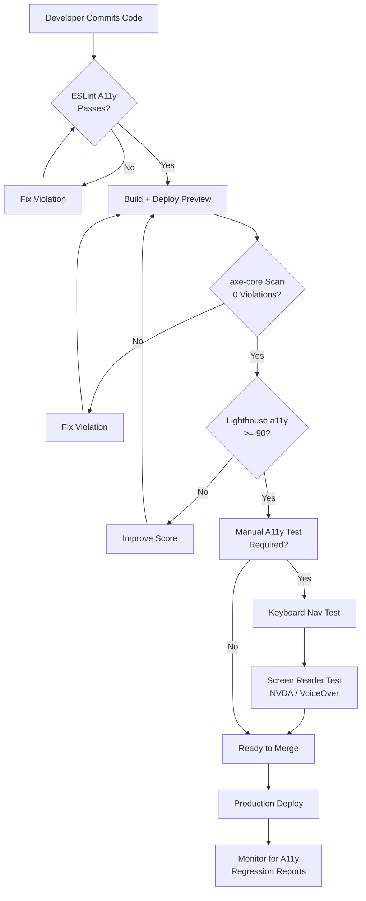

# Accessibility Testing — Second Brain OS

## Document Control

| Field | Value |
|---|---|
| Document ID | QA-ACC-002 |
| Version | 1.0.0 |
| Status | Approved |
| Date | 2026-07-10 |
| Classification | Internal |
| Owner | Developer |

---

## Table of Contents

- [1. Executive Summary](#1-executive-summary)
- [2. Purpose](#2-purpose)
- [3. Scope](#3-scope)
- [4. Business Context](#4-business-context)
- [5. Functional Specification](#5-functional-specification)
- [6. Non-Functional Requirements](#6-non-functional-requirements)
- [7. Architecture](#7-architecture)
- [8. Diagrams](#8-diagrams)
- [9. Data Models](#9-data-models)
- [10. APIs](#10-apis)
- [11. Security](#11-security)
- [12. Performance Targets](#12-performance-targets)
- [13. Edge Cases](#13-edge-cases)
- [14. Failure Scenarios](#14-failure-scenarios)
- [15. Risks & Mitigations](#15-risks--mitigations)
- [16. Acceptance Criteria](#16-acceptance-criteria)
- [17. Traceability](#17-traceability)
- [18. Implementation Notes](#18-implementation-notes)
- [19. Testing Strategy](#19-testing-strategy)
- [20. References](#20-references)

---

## 1. Executive Summary

Second Brain OS targets WCAG 2.1 AA conformance across all user-facing interfaces. Accessibility testing is integrated into the development workflow through automated tools (axe-core in CI, Lighthouse a11y audits, ESLint accessibility plugin) and manual testing (keyboard navigation, screen reader testing with NVDA/VoiceOver). The cyberpunk design theme presents unique accessibility challenges (dark colour contrasts, neon accents, custom fonts) that are addressed through careful token design and testing. Known accessibility gaps are tracked in a living document and remediated by priority.

---

## 2. Purpose

Accessibility ensures that Second Brain OS can be used by people with diverse abilities, including those using screen readers, keyboard-only navigation, or high-contrast settings. Beyond ethical considerations, accessibility improves usability for all users: keyboard shortcuts speed up power users, proper heading structure aids navigation, and sufficient colour contrast benefits users in bright environments. Accessibility is not a feature toggle; it is a fundamental quality attribute.

---

## 3. Scope

This document covers:

- WCAG 2.1 AA conformance target
- Automated accessibility testing: axe-core, Lighthouse, ESLint
- Manual testing: keyboard navigation, screen reader (NVDA, VoiceOver)
- Accessibility regression testing in CI
- Known accessibility gaps and remediation prioritisation
- Design token accessibility (contrast ratios, focus indicators)
- Component-level accessibility requirements

Out of scope: WCAG AAA conformance, mobile native accessibility, PDF accessibility.

---

## 4. Business Context

The cyberpunk design theme (dark backgrounds, neon accent colours, custom fonts) inherently risks accessibility failures if not carefully managed. The dark theme (#0A0B0F background, #F1F5F9 text) provides good contrast by default, but neon accents (#00FFA3 on dark backgrounds) require careful sizing to ensure they meet AA contrast for small text. The project treats accessibility as a design constraint, not an afterthought: every design token is checked for contrast compliance before adoption.

---

## 5. Functional Specification

### 5.1 WCAG 2.1 AA Conformance Target

| Principle | Guideline | Key Requirements |
|---|---|---|
| Perceivable | 1.1 Text Alternatives | All non-text content has text alternatives |
| Perceivable | 1.4 Distinguishable | Colour contrast >= 4.5:1 (normal text), >= 3:1 (large text) |
| Operable | 2.1 Keyboard Accessible | All functionality via keyboard |
| Operable | 2.4 Navigable | Skip links, page titles, focus order |
| Understandable | 3.3 Input Assistance | Labels, error identification, suggestions |
| Robust | 4.1 Compatible | Semantic HTML, ARIA roles where needed |

### 5.2 Automated Testing Tools

| Tool | Integration | Scope | Threshold |
|---|---|---|---|
| axe-core | CI (GitHub Actions) | All pages | 0 critical, 0 serious violations |
| Lighthouse a11y | CI (lighthouse.yml) | Homepage + key pages | Score >= 90 |
| eslint-plugin-jsx-a11y | Pre-commit + IDE | All TSX files | All rules enabled |
| Contrast checker | Design review | All colour tokens | AA pass (4.5:1 / 3:1) |

### 5.3 Manual Testing Requirements

| Test Type | Frequency | Tester | Tools |
|---|---|---|---|
| Keyboard navigation | Per PR (new pages) | Developer | Tab, Shift+Tab, Enter, Escape, Arrow keys |
| Screen reader (NVDA) | Per release | Developer | NVDA on Windows |
| Screen reader (VoiceOver) | Per release | Developer | VoiceOver on macOS |
| Zoom testing | Per PR | Developer | 200% browser zoom |
| High contrast mode | Per release | Developer | Windows High Contrast, forced-colors |

### 5.4 Design Token Accessibility

All design tokens have been verified for colour contrast:

| Token | Foreground | Background | Ratio | WCAG AA |
|---|---|---|---|---|
| `--text-primary` | #F1F5F9 | #0A0B0F | 16.2:1 | Pass |
| `--text-secondary` | #94A3B8 | #0A0B0F | 8.1:1 | Pass |
| `--accent-primary` | #6366F1 | #0A0B0F | 6.5:1 | Pass (large text) |
| `--accent-neon` | #00FFA3 | #0A0B0F | 7.8:1 | Pass (large text) |
| `--accent-danger` | #EF4444 | #0A0B0F | 5.9:1 | Pass |
| `--text-primary` | #F1F5F9 | #13151A | 14.1:1 | Pass |
| `--text-secondary` | #94A3B8 | #13151A | 7.0:1 | Pass |

Note: Neon accents (`--accent-neon`, `--accent-primary`) are used only for large text (>= 18px bold or >= 24px regular) and decorative elements, ensuring AA compliance.

---

## 6. Non-Functional Requirements

| ID | Requirement | Target |
|---|---|---|
| ACC-NFR-001 | Colour contrast for normal text | >= 4.5:1 |
| ACC-NFR-002 | Colour contrast for large text | >= 3:1 |
| ACC-NFR-003 | axe-core violations (critical/serious) | 0 |
| ACC-NFR-004 | Lighthouse a11y score | >= 90 |
| ACC-NFR-005 | Keyboard navigable components | 100% |
| ACC-NFR-006 | Screen reader tested components | 100% of interactive components |

---

## 7. Architecture

```mermaid
flowchart LR
    subgraph Design["Design Phase"]
        Tokens[Contrast Checker<br/>on All Tokens]
        Comp[Component A11y Spec<br/>ARIA roles, keyboard handling]
        Review[Design Review<br/>Focus states, labels]
    end

    subgraph Development["Development Phase"]
        Lint[eslint-plugin-jsx-a11y<br/>Pre-commit Hook]
        DevTest[Keyboard Nav Test<br/>Per Component]
        Storybook[Storybook Tests<br/>A11y Addon]
    end

    subgraph CI["CI Pipeline"]
        Axe[axe-core Scan<br/>All Pages]
        LH[Lighthouse a11y<br/>Score >= 90]
        Playwright[Playwright A11y<br/>E2E + Assertions]
    end

    subgraph Release["Release Phase"]
        NVDA[NVDA Screen Reader<br/>Full Walkthrough]
        VoiceOver[VoiceOver<br/>Full Walkthrough]
        Zoom[200% Zoom Test<br/>No Overflow]
        HighContrast[High Contrast Mode<br/>Windows + forced-colors]
    end

    subgraph Tracking["Tracking"]
        Gaps[Known Gaps List<br/>docs/qa/AccessibilityTesting.md]
        Priority[Remediation Priority<br/>P0-P4]
        Regression[A11y Regression<br/>Vercel Preview Checks]
    end

    Design --> Development
    Development --> CI
    CI --> Release
    Release --> Tracking
    Tracking --> Design
```



---

## 8. Diagrams

### 8.1 Accessibility Testing Flow



---

## 9. Data Models

### 9.1 Accessibility Issue Schema

```python
class A11yIssue(BaseModel):
    id: str
    component: str  # e.g., "Button", "TaskCard", "Modal"
    wcag_criterion: str  # e.g., "1.4.3 Contrast (Minimum)"
    severity: str  # critical, serious, moderate, minor
    description: str
    automated_detected: bool
    remediation: str
    priority: str  # P0-P4
    status: str  # open, in_progress, fixed, wont_fix
    reported_by: str
    reported_at: datetime
    fixed_at: Optional[datetime]
    notes: Optional[str]
```

### 9.2 Component A11y Spec

```typescript
interface ComponentA11ySpec {
  componentName: string
  role: string  // ARIA role
  keyboardInteraction: {
    keys: string[]  // e.g., ["Enter", "Space", "Escape"]
    expectedBehavior: string
  }
  ariaAttributes: Record<string, string>
  focusManagement: string  // e.g., "auto-focus on open", "trap focus"
  labels: {
    required: boolean
    source: string  // e.g., "aria-label from prop", "visible label"
  }
  knownIssues: A11yIssue[]
}
```

---

## 10. APIs

No dedicated accessibility API. Accessibility is enforced through UI components and testing infrastructure.

| Component | ESLint Rule | WCAG Criterion |
|---|---|---|
| Button | `jsx-a11y/role-has-required-aria-props` | 4.1.2 |
| Image | `jsx-a11y/alt-text` | 1.1.1 |
| Anchor | `jsx-a11y/anchor-is-valid` | 2.4.4 |
| Form Input | `jsx-a11y/label-has-associated-control` | 1.3.1, 3.3.2 |
| Dialog | `jsx-a11y/no-noninteractive-element-interactions` | 2.1.1 |

---

## 11. Security

- Accessible components do not expose sensitive information through ARIA labels
- Focus management never moves focus to hidden/off-screen elements
- Screen reader announcements do not include system internals (error codes, stack traces)
- Skip links do not reveal admin-only navigation targets
- High contrast mode does not bypass authentication checks

---

## 12. Performance Targets

| Metric | Target |
|---|---|
| axe-core scan time (per page) | < 5 seconds |
| Lighthouse a11y score | >= 90 |
| Keyboard navigation coverage | 100% of interactive elements |
| Screen reader test coverage (release) | 100% of new components |
| Known a11y issues (critical) | 0 |
| Known a11y issues (serious) | < 5 |

---

## 13. Edge Cases

| Edge Case | Handling |
|---|---|
| Custom font (Syne, DM Sans) loading delay | `font-display: swap`; visible fallback font |
| User forces high contrast mode | `forced-colors` media query; preserve all information |
| Animation reduced by user preference | `prefers-reduced-motion`; disable Framer Motion animations |
| Screen reader with forms that have no visible label | `aria-label` on all interactive elements |
| Keyboard focus indicator visibility on dark theme | 3px `#6366F1` outline with 2px offset (visible on dark bg) |

---

## 14. Failure Scenarios

| Scenario | Impact | Mitigation |
|---|---|---|
| New component lacks ARIA attributes | Screen reader cannot interact | ESLint rule catches; CI blocks merge |
| Colour token change reduces contrast | Text unreadable for low-vision users | CI colour contrast check; design review |
| Third-party dependency introduces a11y issue | Degraded experience | Pin dependency version; test after update |
| Dynamic content not announced to screen reader | User misses updates | Use `aria-live` regions for dynamic updates |
| Focus management broken in modal | Keyboard trap / focus loss | Integration test for modal open/close focus behaviour |

---

## 15. Risks & Mitigations

| Risk | Likelihood | Impact | Mitigation |
|---|---|---|---|
| Cyberpunk aesthetics prioritised over accessibility | Medium | High | Contrast-check every token; large text only for neon accents |
| Complex animations cause motion sickness | Low | Medium | `prefers-reduced-motion` respected; motion budgets per component |
| Custom fonts not accessible (Syne) | Low | Medium | Fallback fonts; font-display: swap; adequate font sizes |
| AI-generated content not a11y-compliant | Medium | Medium | Sanitise AI output; add ARIA roles to generated widgets |
| Accessibility knowledge gap (single developer) | High | Medium | Automated tools catch most issues; screen reader testing per release |

---

## 16. Acceptance Criteria

- [ ] All colour tokens meet WCAG AA contrast ratios
- [ ] axe-core scan passes with 0 critical/serious violations
- [ ] Lighthouse a11y score >= 90
- [ ] All interactive elements are keyboard accessible
- [ ] Screen reader (NVDA + VoiceOver) walkthrough passes for key flows
- [ ] Page works at 200% browser zoom without content loss
- [ ] High contrast mode does not hide information
- [ ] Reduced motion preference disables non-essential animations

---

## 17. Traceability

| Requirement | Covered By | Verified By |
|---|---|---|
| ACC-NFR-001 | Token audit | CI colour contrast check |
| ACC-NFR-002 | Token audit | CI colour contrast check |
| ACC-NFR-003 | axe-core CI scan | Playwright + axe integration |
| ACC-NFR-004 | Lighthouse CI | `lighthouse.yml` workflow |
| ACC-NFR-005 | Keyboard test plan | Manual verification per PR |
| ACC-NFR-006 | Screen reader test plan | Per-release checklist |

---

## 18. Implementation Notes

### 18.1 Known Accessibility Gaps

| Component | Issue | WCAG | Priority | Status |
|---|---|---|---|---|
| Chart components | Data not available as text table | 1.1.1 | P3 | Open |
| Drag-and-drop task reorder | Keyboard-only reorder not implemented | 2.1.1 | P2 | Open |
| AI chat message streaming | New messages not announced | 4.1.3 | P2 | Open |
| Animated background (dashboard) | Cannot be disabled; motion risk | 2.3.3 | P2 | Open |
| Date picker (tasks) | Keyboard navigation limited | 2.1.1 | P2 | In progress |
| Habit streak calendar | Streak colours not descriptive | 1.4.1 | P3 | Open |

### 18.2 Remediation Prioritisation

| Priority | Criteria | Target Timeline |
|---|---|---|
| P0 | Blocks critical user flow for assistive tech users | Immediate |
| P1 | Major barrier for specific disability group | This sprint |
| P2 | Significant inconvenience; workaround available | Next sprint |
| P3 | Minor issue; low user impact | This quarter |
| P4 | Enhancement; cosmetic a11y | Backlog |

### 18.3 Component Accessibility Checklist

Every new component must:

- [ ] Have a semantic HTML element or explicit ARIA `role`
- [ ] Be keyboard navigable (Tab, Enter/Space, Escape)
- [ ] Have visible focus indicator (3px outline, 2px offset)
- [ ] Have accessible name (visible label or `aria-label`)
- [ ] Announce dynamic changes via `aria-live`
- [ ] Support `prefers-reduced-motion`
- [ ] Pass `eslint-plugin-jsx-a11y` rules
- [ ] Maintain colour contrast ratios

---

## 19. Testing Strategy

| Test Type | Tool | Scope | Frequency |
|---|---|---|---|
| Static lint | `eslint-plugin-jsx-a11y` | All TSX files | Pre-commit |
| Automated scan | axe-core via Playwright | All pages | CI (every push) |
| Performance | Lighthouse a11y audit | Homepage + key pages | CI (daily) |
| Manual keyboard | Developer manual test | All interactive elements | Per PR |
| Manual screen reader | NVDA (Windows) / VoiceOver (macOS) | Key user flows | Per release |
| Manual zoom | Browser zoom 200% | All pages | Per release |
| Manual contrast | Colour contrast analyser | All tokens | Design review |
| Regression | Playwright a11y snapshot | Changed components | CI (every push) |

---

## 20. References

| Reference | Description |
|---|---|
| [Design System](../design/10_DesignSystem.md) | Design tokens with contrast verification |
| [UI/UX Guidelines](../design/08_UIUX.md) | UI component accessibility specifications |
| [Frontend Accessibility Guide](../design/FrontendAccessibilityGuide.md) | Detailed frontend accessibility documentation |
| [Testing Strategy](./28_Testing.md) | Overall testing approach |
| [E2E Testing](../qa/E2ETesting.md) | Playwright test integration with axe |
| [CI Pipeline](../devops/CI.md) | Accessibility test CI configuration |
| [WCAG 2.1](https://www.w3.org/TR/WCAG21/) | W3C Web Content Accessibility Guidelines |
| [axe-core Docs](https://www.deque.com/axe/) | axe-core accessibility testing engine |

---

## Revision History

| Version | Date | Author | Changes |
|---|---|---|---|
| 1.0.0 | 2026-07-10 | Developer | Initial accessibility testing document |
