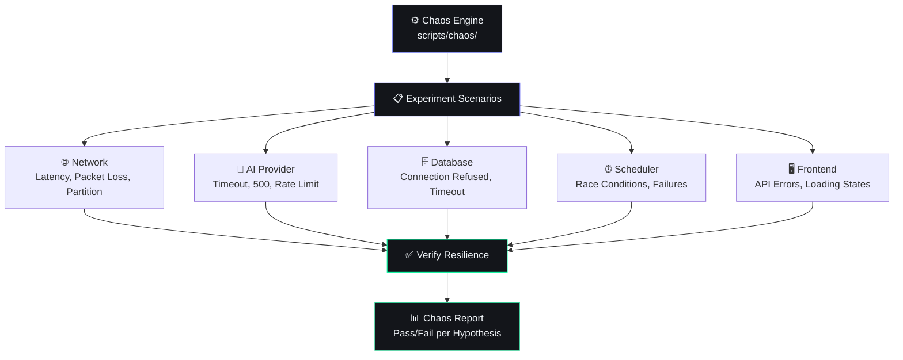

# Chaos Testing

## Document Control

| Field | Value |
|---|---|
| Document ID | QA-CHS-007 |
| Version | 1.0.0 |
| Status | Draft |
| Date | 2026-07-10 |
| Classification | Internal |
| Owner | Developer |

---

## 1. Executive Summary

### Purpose
Define the chaos testing strategy for Second Brain OS. Chaos testing validates system resilience by intentionally injecting failures — simulating network partitions, API timeouts, high latency, resource exhaustion, and unexpected data. The goal is to verify that graceful degradation and circuit breakers work correctly under real-world failure conditions.

### Scope
Covers chaos experiments for FastAPI backend, AI providers (Ollama/Claude/Groq), Supabase database connectivity, APScheduler, notification services, and frontend error handling.

### Chaos Philosophy
- **Test failure modes, not happy paths**
- **Start small, expand scope** — From single endpoint to full workflow
- **Automate experiments** — Repeatable, documented chaos runs
- **Blast radius limited** — Experiments on staging, never production

---

## 2. Architecture



---

## 2. Resistance Architecture

Second Brain OS is designed for resilience from the ground up. Chaos testing validates that these protections work:

```mermaid
graph LR
    subgraph Defenses["Built-in Resilience Layers"]
        CB["🔒 Circuit Breaker<br/>5 failures → 60s cooldown"]
        Retry["🔄 Exponential Backoff<br/>3 attempts: 2s, 4s, 8s"]
        Failover["⬇️ Provider Failover<br/>Ollama → Claude → Groq"]
        Fallback["📉 Graceful Degradation<br/>Algorithmic fallback"]
        Cache["💾 Response Caching<br/>5 min TTL"]
        TTL["⏱️ Request Timeout<br/>30s AI, 10s API"]
    end

    Chaos["💥 Chaos Injection"] --> Defenses
    Defenses --> Outcome["✅ System Survives"]

    style CB fill:#13151A,stroke:#EF4444,color:#F1F5F9
    style Retry fill:#13151A,stroke:#F59E0B,color:#F1F5F9
    style Failover fill:#13151A,stroke:#818CF8,color:#F1F5F9
    style Fallback fill:#13151A,stroke:#34D399,color:#F1F5F9
    style Cache fill:#13151A,stroke:#F472B6,color:#F1F5F9
    style TTL fill:#13151A,stroke:#94A3B8,color:#F1F5F9
```



---

## 3. Experiment Inventory

### 3.1 Network Fault Experiments

| Experiment | Injection | Expected Behavior | Verification |
|---|---|---|---|
| `net-001` | API latency +3s on `/tasks` | Request times out after 10s, client shows error toast | Error boundary activated |
| `net-002` | AI provider latency +8s | Circuit breaker opens after 5 failures, falls to algorithmic | Response returns < 2s without AI |
| `net-003` | Supabase connection timeout | Backend returns 503 with graceful message | No crash, error logged |
| `net-004` | Packet loss 20% (Ollama) | Retry logic kicks in (3 attempts), eventual success | JSON response within 30s |
| `net-005` | DNS resolution failure for AI | Provider failover chain activates | Response using next provider |

### 3.2 AI Provider Experiments

| Experiment | Injection | Expected Behavior | Verification |
|---|---|---|---|
| `ai-001` | Ollama returns 500 error | Circuit breaker counts failure, retries with backoff | 3 retries observed |
| `ai-002` | Claude returns rate limit (429) | Failover to Groq, then to Ollama | Non-blocking response |
| `ai-003` | All providers return errors | Graceful fallback returns algorithmic result | User sees functional response |
| `ai-004` | Malformed JSON from LLM | `parse_json()` retries, then falls to default | Valid structured output |
| `ai-005` | Extremely long response (>10K tokens) | Truncation at `max_tokens`, no crash | Response under limit |

### 3.3 Database Experiments

| Experiment | Injection | Expected Behavior | Verification |
|---|---|---|---|
| `db-001` | Supabase connection limit exceeded | Connection pool waits, retries with backoff | Eventual success or 503 |
| `db-002` | Slow query (full table scan) | Query timeout after 30s, error returned | No hang, error logged |
| `db-003` | RLS policy failure | 403 error returned, no data leak | Error, not data exposure |
| `db-004` | Upsert conflict | Returns 409 with conflict details | Proper error handling |
| `db-005` | Missing table (schema change) | Returns 500, logged with full trace | Quick detection via Sentry |

### 3.4 Scheduler Experiments

| Experiment | Injection | Expected Behavior | Verification |
|---|---|---|---|
| `sched-001` | Job throws unhandled exception | APScheduler catches, logs error, job marked as failed | No crash, next run works |
| `sched-002` | Job running longer than interval | APScheduler skips overlapping run | No concurrent execution |
| `sched-003` | Database unavailable at job time | Job fails gracefully, logs error, retries next window | No data corruption |
| `sched-004` | Max retries exceeded | Job marked as permanently failed, alert sent | Alert triggered |

### 3.5 Frontend Experiments

| Experiment | Injection | Expected Behavior | Verification |
|---|---|---|---|
| `fe-001` | API returns 500 | Error boundary shows friendly message | No white screen |
| `fe-002` | API returns non-JSON | Parse error caught, toast shown | UI remains functional |
| `fe-003` | Supabase realtime disconnected | Fallback to polling, toast "reconnecting" | Data still loads |
| `fe-004` | Slow chunk loading (< 30s) | Loading skeleton stays visible | No frozen UI |
| `fe-005` | Offline mode | All mutations queued, "offline" indicator shown | On reconnect, mutations sync |

---

## 4. Automation Framework

### 4.1 Chaos Runner

```python
# scripts/chaos/runner.py
"""
Chaos experiment runner for Second Brain OS.
"""
import asyncio
import httpx
import time
import json
from typing import Callable, Awaitable

class ChaosExperiment:
    def __init__(self, name: str, description: str, hypothesis: str):
        self.name = name
        self.description = description
        self.hypothesis = hypothesis
        self.passed = False
        self.observations = []
    
    async def run(self, inject_fn: Callable, verify_fn: Callable):
        """Run a chaos experiment."""
        print(f"\n🧪 Running experiment: {self.name}")
        print(f"   {self.description}")
        print(f"   Hypothesis: {self.hypothesis}")
        
        # Inject fault
        print("   → Injecting fault...")
        await inject_fn()
        
        # Wait for propagation
        await asyncio.sleep(1)
        
        # Verify behavior
        print("   → Verifying...")
        try:
            result = await verify_fn()
            self.passed = result
            print(f"   {'✅ PASSED' if self.passed else '❌ FAILED'}")
        except Exception as e:
            self.passed = False
            print(f"   ❌ FAILED with exception: {e}")
            self.observations.append(str(e))
        
        return self.passed


async def network_latency_injector(endpoint: str, latency_ms: int):
    """Simulate network latency by wrapping proxy."""
    # Implementation uses httpx with delays
    pass

async def ai_provider_failover_test():
    """Test that AI calls fall through provider chain."""
    experiments = [
        ChaosExperiment(
            "ai-failover-001",
            "When Ollama returns 500, Claude handles the request",
            "Circuit breaker opens for Ollama, request succeeds via Claude"
        ),
        ChaosExperiment(
            "ai-failover-002",
            "When all providers fail, algorithmic fallback activates",
            "User receives functional non-AI response"
        ),
    ]
    
    results = []
    for exp in experiments:
        result = await exp.run(
            inject_fn=lambda: mock_ollama_error(),
            verify_fn=lambda: verify_ai_response(),
        )
        results.append(result)
    
    return results
```

### 4.2 Experiment Configuration

```yaml
# scripts/chaos/experiments.yaml
experiments:
  - name: "ai-failover-001"
    category: "ai_provider"
    injection:
      type: "http_error"
      target: "ollama"
      status_code: 500
      duration_seconds: 30
    verification:
      type: "response_check"
      expected_status: 200
      max_latency_ms: 5000
      require_fallback_header: true
  
  - name: "db-timeout-001"
    category: "database"
    injection:
      type: "proxy_delay"
      target: "supabase"
      delay_ms: 15000
    verification:
      type: "timeout_behavior"
      expected_error: "timeout"
      circuit_breaker_opens: true
```

---

## 5. Experiment Execution

### 5.1 Running Chaos Tests

```bash
# Run all chaos experiments
python scripts/chaos/runner.py --all

# Run specific category
python scripts/chaos/runner.py --category ai_provider

# Run single experiment
python scripts/chaos/runner.py --experiment ai-failover-001

# Dry run (no actual injection, just verify setup)
python scripts/chaos/runner.py --dry-run
```

### 5.2 CI Integration

```yaml
# .github/workflows/chaos.yml
name: Chaos Testing
on:
  schedule:
    - cron: '0 6 * * 1'  # Every Monday 6 AM
  workflow_dispatch:

jobs:
  chaos:
    runs-on: ubuntu-latest
    steps:
      - uses: actions/checkout@v4
      - name: Setup Python
        uses: actions/setup-python@v5
        with:
          python-version: '3.10'
      - name: Install dependencies
        run: pip install -r requirements-chaos.txt
      - name: Run chaos experiments
        run: python scripts/chaos/runner.py --all --ci
      - name: Upload chaos report
        uses: actions/upload-artifact@v4
        with:
          name: chaos-report
          path: reports/chaos/
```

---

## 6. Success Criteria

| Criteria | Target | Measurement |
|---|---|---|
| API availability during experiments | > 99% | Requests succeed despite faults |
| AI response within SLO | < 30s | Response time with failover |
| No data corruption | 100% | Verify data integrity post-experiment |
| Error logged for every fault | 100% | Check structured logs |
| Frontend not crashed | 100% | No unhandled exceptions |

---

## 7. Blast Radius Controls

| Control | Implementation |
|---|---|
| Staging-only execution | Experiments never target production |
| Automatic rollback | Faults auto-cleanup after 60 seconds |
| Kill switch | `CHAOS_ENABLED=false` disables all injection |
| Rate-limited injection | Max 1 experiment per 5 minutes |
| User isolation | No experiment touches user data |

---

## 8. Performance Targets

| Metric | Target |
|---|---|
| Experiment setup time | < 10 seconds |
| Fault injection delay | < 500ms |
| Fault cleanup time | < 5 seconds |
| Report generation | < 30 seconds |
| Full suite run | < 10 minutes |

---

## 9. Edge Cases

| Edge Case | Handling |
|---|---|
| Chaos engine fails | Report as inconclusive, not failure |
| Recovery takes longer than expected | Extend verification window |
| Fault affects other experiments | Sequential execution, cleanup between runs |
| Experiment times out | Mark as inconclusive, kill injection |

---

## 10. Failure Scenarios

| Scenario | Impact | Mitigation |
|---|---|---|
| Chaos injection escapes staging | Potential prod impact | Strict environment check, kill switch |
| Circuit breaker not opening | Repeated failures to same provider | Test CB state after experiment |
| Fallback not triggering | User sees error instead of degraded mode | Add fallback coverage tests |
| False positive (pass when should fail) | False confidence | Review experiment design quarterly |

---

## 11. Risks

| Risk | Likelihood | Impact | Mitigation |
|---|---|---|---|
| Complex mock setup | Medium | Low | Reusable fixtures |
| Coverage gaps | Medium | Medium | Review experiments per release |
| Flaky experiments | Medium | Low | 3-run threshold, report flakiness |
| Resource constraints (staging) | Low | Medium | Minimal experiment footprint |

---

## 12. Related Documents

| Document | Relation |
|---|---|
| docs/qa/28_Testing.md | Overall testing strategy |
| docs/qa/29_QA.md | QA process |
| docs/qa/LoadTesting.md | Performance load tests |
| docs/qa/StressTesting.md | Stress test methodology |
| docs/operations/39_Runbooks.md | Incident response for real faults |

---

## 13. Appendices

### 13.1 Chaos Test Report Template

```markdown
# Chaos Test Report

**Date:** YYYY-MM-DD
**Run ID:** chaos-YYYYMMDD-001
**Environment:** staging

## Summary
- Experiments executed: [N]
- Passed: [N]
- Failed: [N]
- Inconclusive: [N]
- Pass rate: [N]%

## Failed Experiments
| Name | Category | Failure Reason | Action Item |
|---|---|---|---|
| ai-failover-001 | AI | Fallback not triggered | Fix PR #123 |

## Notable Observations
- [Observation 1]
- [Observation 2]

## Recommendations
- [Recommendation 1]
- [Recommendation 2]
```

### 13.2 Adding New Experiments

```python
# templates/chaos_experiment.py
from chaos.runner import ChaosExperiment

experiment = ChaosExperiment(
    name="my-experiment-001",
    description="What happens when X fails?",
    hypothesis="System should handle X failure by Y"
)

@experiment.register
async def my_experiment():
    # 1. Inject fault
    await inject_fault()
    
    # 2. Wait
    await asyncio.sleep(1)
    
    # 3. Verify
    result = await verify_behavior()
    assert result, "Expected behavior not observed"
```
