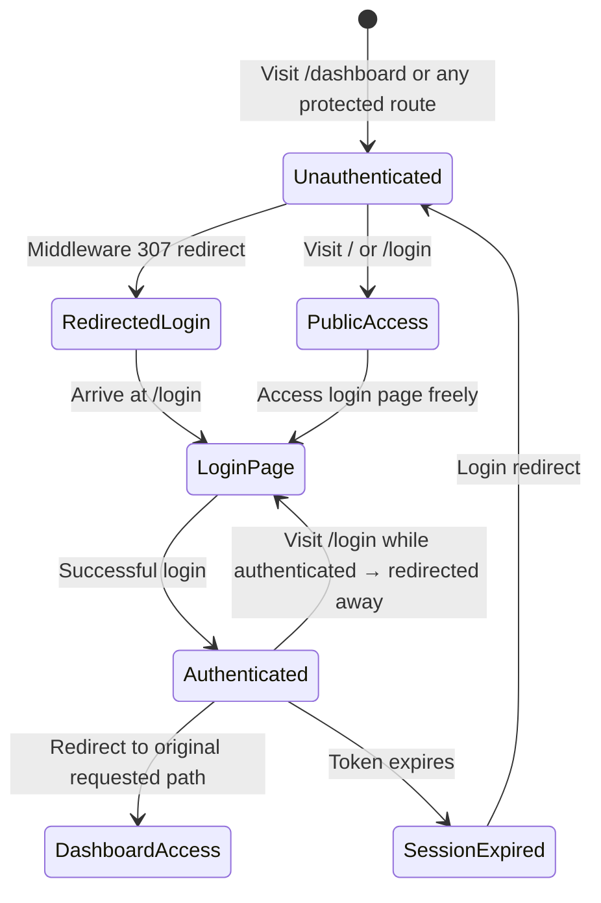
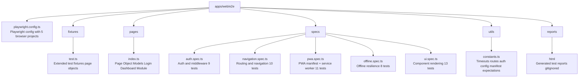

# E2E Test Plan — ARIA OS Second Brain

| Field | Value |
|---|---|
| **Document ID** | SB-QA-E2E-PLAN-001 |
| **Version** | 1.0.0 |
| **Status** | Active |
| **Last Updated** | 2026-06-13 |
| **Classification** | Internal — QA |
| **Framework** | Playwright v1.52+ |
| **Target** | Production-like dev server (`localhost:3000`) |

---

## 1. Test Strategy

### 1.1 Scope

| In Scope | Out of Scope |
|----------|-------------|
| Auth lifecycle (login, logout, protected route redirect) | Backend API contract testing (covered by pytest) |
| Middleware auth guard behavior | Database integrity (covered by unit tests) |
| Route group resolution (all 16 modules) | Performance/load testing |
| PWA manifest validation | Visual regression (future: Percy/Chromatic) |
| Service worker registration | Cross-browser visual diffs |
| Offline detection + banner | Accessibility audits (future: axe-core) |
| Navigation (sidebar + navbar) | Mobile gesture testing |
| New component rendering (Checkbox, FormField, DataTable) | Third-party integrations |
| Network condition simulation (offline, slow 3G) | Email verification flow |

### 1.2 Test Levels

| Level | Scope | Runner | Frequency |
|-------|-------|--------|-----------|
| **Smoke** | Auth + Middleware + Core Navigation | CI (push) | Every push |
| **Functional** | All modules + PWA + Components | CI (nightly) | Daily |
| **Regression** | Full suite | CI (pre-release) | Before release |

### 1.3 Browser Matrix

| Project | Browser | Viewport | Priority |
|---------|---------|----------|----------|
| `chromium` | Chrome 125+ | 1280×720 | Critical |
| `firefox` | Firefox 126+ | 1280×720 | High |
| `webkit` | Safari 17+ | 1280×720 | High |
| `mobile-chrome` | Chrome (Pixel 5) | 393×851 | Medium |
| `mobile-safari` | Safari (iPhone 13) | 390×844 | Medium |

### 1.4 Environment Configuration

```env
BASE_URL=http://localhost:3000
TEST_USER_EMAIL=test@secondbrain.local
TEST_USER_PASSWORD=TestPassword123!
CI=false
```

---

## 2. Test Suites

### 2.1 Auth & Middleware (`auth.spec.ts`)



| ID | Test Case | Priority | Automation |
|----|-----------|----------|------------|
| AUTH-01 | Unauthenticated user is redirected to `/login` from `/dashboard` | P0 | ✅ |
| AUTH-02 | Unauthenticated user is redirected from _all 16 protected routes_ | P0 | ✅ |
| AUTH-03 | Authenticated user can access `/dashboard` without redirect | P0 | ✅ |
| AUTH-04 | Public routes `/` and `/login` are accessible without auth | P0 | ✅ |
| AUTH-05 | After login, user is redirected to original requested path | P0 | ✅ |
| AUTH-06 | Redirect preserves query parameters | P1 | ✅ |
| AUTH-07 | Expired session shows login redirect | P1 | ✅ |
| AUTH-08 | Login page is not accessible when already authenticated | P1 | ✅ |
| AUTH-09 | Middleware returns 307 redirect (not 401/403) | P2 | ✅ |

### 2.2 Navigation & Routing (`navigation.spec.ts`)

| ID | Test Case | Priority | Automation |
|----|-----------|----------|------------|
| NAV-01 | All 16 module pages load without JS errors | P0 | ✅ |
| NAV-02 | Sidebar is visible on all dashboard pages | P0 | ✅ |
| NAV-03 | Navbar is visible on all dashboard pages | P0 | ✅ |
| NAV-04 | Sidebar navigation links navigate to correct URLs | P0 | ✅ |
| NAV-05 | Page title matches module name (h1) | P1 | ✅ |
| NAV-06 | Clicking active sidebar link does not cause full page reload | P1 | ✅ |
| NAV-07 | Browser back/forward navigation works correctly | P1 | ✅ |
| NAV-08 | Deep link to `/tasks/123` resolves (if detail pages exist) | P2 | ❌ (no detail pages) |
| NAV-09 | All module pages have loading state on initial render | P1 | ✅ |
| NAV-10 | 404 page renders for unknown routes | P1 | ✅ |

### 2.3 PWA (Progressive Web App) (`pwa.spec.ts`)

| ID | Test Case | Priority | Automation |
|----|-----------|----------|------------|
| PWA-01 | Web app manifest is served at `/manifest.json` | P0 | ✅ |
| PWA-02 | Manifest has required fields (name, short_name, icons, start_url, display) | P0 | ✅ |
| PWA-03 | Manifest icon files are accessible and valid PNGs | P0 | ✅ |
| PWA-04 | Manifest start_url is `/dashboard` | P0 | ✅ |
| PWA-05 | Service worker is registered on page load | P0 | ✅ |
| PWA-06 | Service worker scope is `/` | P0 | ✅ |
| PWA-07 | Service worker caches static assets | P1 | ✅ |
| PWA-08 | PWA install prompt criteria are met (`display: standalone`) | P1 | ✅ |
| PWA-09 | Theme color matches design token `#6366F1` | P1 | ✅ |
| PWA-10 | Background color matches design token `#0A0B0F` | P1 | ✅ |
| PWA-11 @serwist/next runtime caching policies are applied | P2 | ✅ |

### 2.4 Offline & Network Resilience (`offline.spec.ts`)

| ID | Test Case | Priority | Automation |
|----|-----------|----------|------------|
| OFFL-01 | Offline banner appears when network is disconnected | P0 | ✅ |
| OFFL-02 | Offline banner has correct styling (warning colors) | P1 | ✅ |
| OFFL-03 | Offline banner disappears when network is restored | P0 | ✅ |
| OFFL-04 | Previously cached dashboard page renders while offline | P1 | ✅ |
| OFFL-05 | Offline navigation shows cached pages (not login redirect) | P1 | ✅ |
| OFFL-06 | `useNetworkStatus` hook detects online→offline transition | P1 | ✅ |
| OFFL-07 | Retry button on offline banner re-checks connectivity | P2 | ✅ |
| OFFL-08 | Network status change fires within 5 seconds | P2 | ✅ |

### 2.5 UI Component Rendering (`ui.spec.ts`)

| ID | Test Case | Priority | Automation |
|----|-----------|----------|------------|
| UI-01 | Checkbox renders unchecked, checked, and indeterminate states | P0 | ✅ |
| UI-02 | Checkbox responds to click events | P0 | ✅ |
| UI-03 | FormField renders label, helper text, and error message | P0 | ✅ |
| UI-04 | FormField error state overrides helper text | P0 | ✅ |
| UI-05 | FormField renders required indicator | P1 | ✅ |
| UI-06 | DataTable renders with data rows | P0 | ✅ |
| UI-07 | DataTable shows empty state when no data | P0 | ✅ |
| UI-08 | DataTable shows loading skeleton | P0 | ✅ |
| UI-09 | DataTable shows error state with retry button | P0 | ✅ |
| UI-10 | DataTable pagination renders and functions | P1 | ✅ |
| UI-11 | DataTable column sorting toggles asc/desc/none | P1 | ✅ |
| UI-12 | DataTable row selection checkbox selects individual rows | P1 | ✅ |
| UI-13 | DataTable select-all checkbox selects all rows | P1 | ✅ |

---

## 3. Test Architecture



---

## 4. CI Integration

```yaml
# .github/workflows/e2e.yml
name: E2E Tests
on: [push, pull_request]
jobs:
  e2e:
    runs-on: ubuntu-latest
    steps:
      - uses: actions/checkout@v4
      - uses: actions/setup-node@v4
        with: { node-version: 18 }
      - run: npm ci
      - run: npx playwright install chromium
      - run: npx playwright test --project=chromium --grep @smoke
      - uses: actions/upload-artifact@v4
        if: failure()
        with:
          name: playwright-report
          path: apps/web/e2e/reports/
```

---

## 5. Execution Instructions

```bash
# Install dependencies
cd apps/web && npm install

# Install Playwright browsers
npx playwright install

# Run all E2E tests
npx playwright test

# Run with specific project
npx playwright test --project=chromium

# Run smoke tests only
npx playwright test --grep @smoke

# Run a single spec file
npx playwright test e2e/specs/auth.spec.ts

# Run in UI mode (interactive)
npx playwright test --ui

# View HTML report
npx playwright show-report e2e/reports/html
```

---

## 6. Defect Management

| Severity | Definition | Response Time | Fix Window |
|----------|------------|---------------|------------|
| **P0 - Critical** | Auth bypass, data exposure, all routes broken | Immediate | 2 hours |
| **P1 - High** | Module fails to load, PWA broken, major UX broken | 4 hours | 1 day |
| **P2 - Medium** | Component rendering issue, missing animation | 1 day | 3 days |
| **P3 - Low** | Styling inconsistency, cosmetic issue | 3 days | Next sprint |

---

## 7. Risk Register

| Risk | Likelihood | Impact | Mitigation |
|------|------------|--------|------------|
| Supabase auth requires real credentials | High | High | Use `page.route()` to intercept auth API calls; create auth fixture with storage state |
| Offline mode depends on service worker | Medium | Medium | Test SW registration separately; use `page.context().serviceWorkers()` |
| Animations cause flaky assertions | Low | Medium | Use `disableAnimation: true` in config for CI runs |
| Module pages load slow due to API calls | Medium | Low | Use 30s timeouts + networkidle waits |
| Port 3000 already in use | Low | Low | `webServer` config with `reuseExistingServer: true` |
