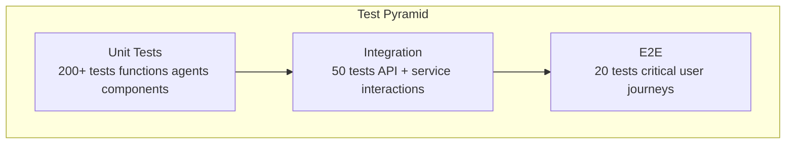
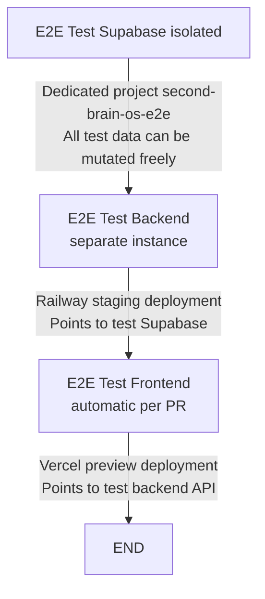

## Document Control

| Field | Value |
|---|---|
| Document ID | QA-E2E-001 |
| Version | 1.0.0 |
| Status | Active |
| Last Updated | 2026-07-11 |

---

# End-to-End Testing Strategy

## 1. E2E Testing Philosophy

### User Journey Completeness, Not Page-by-Page

End-to-end tests validate **complete user workflows** across system boundaries. Unlike unit tests (which verify a single function) or integration tests (which verify component interactions), E2E tests simulate real user behavior from start to finish.

**Core principles:**

| Principle | Meaning |
|---|---|
| **Journey-first** | Each test covers a complete user goal (e.g., "create a task and complete it"), not isolated page interactions |
| **Production-like** | Tests run against a dedicated test environment with real database and third-party mocks at the network boundary |
| **Critical path only** | ~15-20 E2E tests cover the most valuable user journeys; edge cases are handled at lower test levels |
| **Deterministic** | Test data is seeded before each run; no dependence on previous test state |
| **Self-documenting** | Test names read as user stories: `"user can create a task and verify it appears in the dashboard"` |

### The Test Pyramid Applied



E2E tests sit at the top of the pyramid: fewest in number, slowest to execute, broadest in scope. They catch integration failures that unit tests cannot.

---

## 2. Tool Selection

### 2.1 Playwright vs Cypress vs Selenium

| Criteria | **Playwright** | Cypress | Selenium |
|---|---|---|---|
| **Browser support** | Chromium, Firefox, WebKit (3 engines) | Chromium only (Firefox/WebKit beta) | All major browsers |
| **Language support** | TypeScript, Python, Java, C# | JavaScript/TypeScript only | JS, Python, Java, Ruby, C# |
| **Network mocking** | Native route interception | Limited to same-origin | Requires proxy tools |
| **Auto-wait** | Built-in for all locators | Built-in | Manual `WebDriverWait` |
| **Mobile emulation** | Native device emulation | Limited viewport only | Appium for mobile |
| **Parallel execution** | Native sharding + workers | Dashboard required | Grid + external |
| **Trace viewer** | Built-in (traces.zip) | Screenshots + video | Screenshots only |
| **API testing** | Integrated APIRequestContext | `cy.request()` | Separate HTTP client |
| **Component testing** | Yes (experimental) | Yes (first-class) | No |
| **CI integration** | Direct GitHub Actions, Docker | Dashboard required | Any CI |
| **Community** | Growing rapidly | Large | Mature |

### 2.2 Rationale for Playwright

**Second Brain OS chooses Playwright** for the following reasons:

1. **Cross-browser coverage**: With WebKit support, we test Safari (critical for iOS PWA users) and Firefox alongside Chromium
2. **Built-in network interception**: Mock Claude/Ollama API responses at the network level without modifying application code
3. **Auto-waiting**: Eliminates flaky `sleep()` calls; Playwright automatically waits for elements to be actionable
4. **API testing integrated**: Single tool for both UI interactions and API calls (data seeding, assertions)
5. **Trace viewer**: Debug failures with full DOM snapshots, network logs, and timeline
6. **Mobile emulation**: Test responsive layouts without physical devices
7. **TypeScript natively**: Matches our frontend language

### 2.3 Installation

```bash
# Install Playwright
npm init playwright@latest -- --yes

# Install browsers (choose chromium, firefox, webkit)
npx playwright install --with-deps

# Install additional tools
npm install -D @axe-core/playwright    # Accessibility testing
npm install -D lighthouse              # Performance assertions
```

**Configuration (`playwright.config.ts`):**

```typescript
import { defineConfig, devices } from '@playwright/test'

export default defineConfig({
  testDir: './e2e',
  fullyParallel: true,
  forbidOnly: !!process.env.CI,
  retries: process.env.CI ? 2 : 0,
  workers: process.env.CI ? 4 : undefined,
  reporter: [
    ['html', { outputFolder: 'playwright-report' }],
    ['json', { outputFile: 'playwright-report/results.json' }],
    ['junit', { outputFile: 'playwright-report/junit.xml' }],
    ['list'],
  ],
  use: {
    baseURL: process.env.E2E_BASE_URL || 'http://localhost:3000',
    trace: 'on-first-retry',
    screenshot: 'only-on-failure',
    video: 'retain-on-failure',
    actionTimeout: 10_000,
    navigationTimeout: 15_000,
  },
  projects: [
    {
      name: 'chromium',
      use: { ...devices['Desktop Chrome'] },
    },
    {
      name: 'firefox',
      use: { ...devices['Desktop Firefox'] },
    },
    {
      name: 'webkit',
      use: { ...devices['Desktop Safari'] },
    },
    {
      name: 'Mobile Chrome',
      use: { ...devices['Pixel 5'] },
    },
    {
      name: 'Mobile Safari',
      use: { ...devices['iPhone 14'] },
    },
  ],
  globalSetup: require.resolve('./e2e/global-setup'),
  globalTeardown: require.resolve('./e2e/global-teardown'),
})
```

---

## 3. Test Environment Setup

### 3.1 Dedicated Test Supabase Project



**Environment variables for E2E:**

```env
# .env.e2e
E2E_BASE_URL=http://localhost:3000
E2E_API_URL=http://localhost:8000
E2E_SUPABASE_URL=https://your-project.supabase.co
E2E_SUPABASE_ANON_KEY=eyJhbGciOiJ...
E2E_TEST_USER_EMAIL=e2e-test-user@secondbrain-os.com
E2E_TEST_USER_PASSWORD=E2eTestPassword123!
```

### 3.2 Seeded Test Data

Before each E2E test run, the global setup script seeds deterministic test data:

```typescript
// e2e/global-setup.ts
import { request } from '@playwright/test'
import type { APIRequestContext } from '@playwright/test'

let apiContext: APIRequestContext

async function globalSetup() {
  apiContext = await request.newContext({
    baseURL: process.env.E2E_API_URL,
  })

  // Authenticate as test user
  const authResponse = await apiContext.post('/api/auth/test-login', {
    data: {
      email: process.env.E2E_TEST_USER_EMAIL,
      password: process.env.E2E_TEST_USER_PASSWORD,
    },
  })
  const { token } = await authResponse.json()

  // Seed all required test data
  await seedTestData(apiContext, token)

  // Save auth state for tests
  await apiContext.storageState({
    path: 'e2e/.auth/user.json',
  })
}

async function seedTestData(api: APIRequestContext, token: string) {
  const authHeaders = { Authorization: `Bearer ${token}` }

  // Tasks
  await api.post('/api/tasks/', {
    headers: authHeaders,
    data: [
      { title: 'Complete project report', priority: 'high', status: 'pending', due_date: '2026-06-20' },
      { title: 'Review pull request', priority: 'medium', status: 'pending', due_date: '2026-06-12' },
      { title: 'Prepare for exam', priority: 'urgent', status: 'in_progress' },
      { title: 'Buy groceries', priority: 'low', status: 'completed' },
    ],
  })

  // Courses
  await api.post('/api/courses/', {
    headers: authHeaders,
    data: [
      { title: 'Linear Algebra', progress: 0.45, total_modules: 12, completed_modules: 5 },
      { title: 'Data Structures', progress: 0.72, total_modules: 10, completed_modules: 7 },
    ],
  })

  // Habits
  await api.post('/api/habits/', {
    headers: authHeaders,
    data: [
      { name: 'Morning meditation', frequency: 'daily', streak: 5 },
      { name: 'Read for 30 min', frequency: 'daily', streak: 3 },
    ],
  })

  // Sleep logs (past week)
  const sleepLogs = Array.from({ length: 7 }, (_, i) => ({
    date: new Date(Date.now() - i * 86400000).toISOString().split('T')[0],
    duration_hours: 7 + Math.random() * 2,
    quality_score: Math.floor(6 + Math.random() * 4),
  }))
  await api.post('/api/sleep/batch', { headers: authHeaders, data: sleepLogs })

  // Goals
  await api.post('/api/goals/', {
    headers: authHeaders,
    data: [
      { title: 'Complete BTech with 8.5+ CGPA', target_date: '2028-06-30' },
      { title: 'Build portfolio project', target_date: '2026-12-31' },
    ],
  })

  console.log('✅ Test data seeded successfully')
}

export default globalSetup
```

### 3.3 Test User Accounts

| Account | Role | Purpose |
|---|---|---|
| `e2e-test-user@secondbrain-os.com` | Standard user | Primary test user (data seeded) |
| `e2e-empty-user@secondbrain-os.com` | Standard user | Empty profile (no tasks/goals/habits) |
| `e2e-busy-user@secondbrain-os.com` | Standard user | 50+ tasks, 10 courses, 8 habits (stress test) |
| `e2e-admin@secondbrain-os.com` | Admin | Admin panel testing (future) |

---

## 4. Critical User Journeys

### 4.1 Journey Inventory

| ID | Journey | Test File | Priority | Est. Duration |
|---|---|---|---|---|
| J01 | Login → Dashboard → Create Task → Complete Task | `tasks.spec.ts` | P0 | 30s |
| J02 | Login → View Briefing → Act on Suggestion | `briefing.spec.ts` | P1 | 25s |
| J03 | Create Course → Log Progress → Complete | `courses.spec.ts` | P0 | 35s |
| J04 | Create Habit → Track Streak → Miss Day | `habits.spec.ts` | P0 | 40s |
| J05 | Chat with ARIA → Send Message → View Response | `chat.spec.ts` | P1 | 20s |
| J06 | Weekly Review → View Progress → Dismiss | `weekly_review.spec.ts` | P1 | 30s |
| J07 | Opportunity Radar → View Matches → Apply | `opportunities.spec.ts` | P2 | 25s |
| J08 | Sleep Logging → View Score → View History | `sleep.spec.ts` | P0 | 25s |
| J09 | Time Tracking → Start Timer → Pomodoro → Stop | `time.spec.ts` | P0 | 45s |
| J10 | Income Logging → Add Entry → View Stats | `income.spec.ts` | P2 | 20s |
| J11 | Idea Pipeline → Capture → Promote → Build | `ideas.spec.ts` | P1 | 30s |
| J12 | Project Management → Create → Update Phase → Blocker | `projects.spec.ts` | P2 | 35s |
| J13 | Resource Library → Save → Tag → Search | `resources.spec.ts` | P2 | 20s |
| J14 | Goal Setting → Create → Update Progress → Roadmap | `goals.spec.ts` | P1 | 30s |
| J15 | Navigation → All Pages → Verify 200 Status | `navigation.spec.ts` | P0 | 20s |

### 4.2 Journey Detail: J01 — Login → Dashboard → Create Task → Complete Task

```typescript
// e2e/tasks.spec.ts
import { test, expect } from '@playwright/test'
import { LoginPage } from './pages/login-page'
import { DashboardPage } from './pages/dashboard-page'
import { TasksPage } from './pages/tasks-page'

test.describe('J01: Task lifecycle', () => {
  test('user can create a task and verify it appears on the dashboard', async ({ page }) => {
    // Step 1: Login
    const login = new LoginPage(page)
    await login.goto()
    await login.loginAs('e2e-test-user@secondbrain-os.com', 'E2eTestPassword123!')

    // Step 2: Dashboard loads with expected widgets
    const dashboard = new DashboardPage(page)
    await dashboard.waitForLoad()
    await expect(dashboard.taskSummaryWidget).toBeVisible()
    await expect(dashboard.habitStreakWidget).toBeVisible()

    // Step 3: Navigate to Tasks page
    await dashboard.navigateTo('Tasks')
    const tasks = new TasksPage(page)
    await tasks.waitForLoad()

    // Step 4: Create a new task
    const taskTitle = 'E2E Test Task ' + Date.now()
    await tasks.createTask({
      title: taskTitle,
      priority: 'high',
      dueDate: '2026-06-20',
    })

    // Step 5: Verify task appears in the list
    await expect(tasks.taskCard(taskTitle)).toBeVisible()
    await expect(tasks.taskPriorityBadge(taskTitle)).toHaveText(/high/i)

    // Step 6: Complete the task
    await tasks.completeTask(taskTitle)

    // Step 7: Verify task is marked as completed
    await expect(tasks.taskStatus(taskTitle)).toHaveText(/completed/i)

    // Step 8: Return to dashboard — verify task count updates
    await dashboard.navigateTo('Dashboard')
    await expect(dashboard.taskSummaryWidget).toContainText(/completed/i)
  })
})
```

### 4.3 Journey Detail: J03 — Create Course → Log Progress → Complete

```typescript
// e2e/courses.spec.ts
import { test, expect } from '@playwright/test'
import { LoginPage } from './pages/login-page'
import { CoursesPage } from './pages/courses-page'

test.describe('J03: Course lifecycle', () => {
  test('user can create a course, log progress, and complete it', async ({ page }) => {
    // Login
    const login = new LoginPage(page)
    await login.goto()
    await login.loginAs('e2e-test-user@secondbrain-os.com', 'E2eTestPassword123!')

    // Navigate to Courses
    const courses = new CoursesPage(page)
    await courses.goto()

    // Create a new course
    const courseName = 'E2E Course ' + Date.now()
    await courses.createCourse({
      title: courseName,
      totalModules: 10,
    })

    // Verify course appears
    await expect(courses.courseCard(courseName)).toBeVisible()

    // Log progress (complete 5 out of 10 modules)
    await courses.logProgress(courseName, 5)
    await expect(courses.progressBar(courseName)).toHaveText(/50%/i)

    // Complete remaining modules
    await courses.logProgress(courseName, 10)
    await expect(courses.progressBar(courseName)).toHaveText(/100%/i)
    await expect(courses.courseStatus(courseName)).toHaveText(/completed/i)

    // Verify course appears in completed list
    await courses.filterBy('completed')
    await expect(courses.courseCard(courseName)).toBeVisible()
  })
})
```

### 4.4 Journey Detail: J09 — Time Tracking with Pomodoro

```typescript
// e2e/time.spec.ts
import { test, expect } from '@playwright/test'
import { LoginPage } from './pages/login-page'
import { TimePage } from './pages/time-page'

test.describe('J09: Time tracking with Pomodoro', () => {
  test('user can start a pomodoro timer, complete a session, and see the log', async ({ page }) => {
    const login = new LoginPage(page)
    await login.goto()
    await login.loginAs('e2e-test-user@secondbrain-os.com', 'E2eTestPassword123!')

    const time = new TimePage(page)
    await time.goto()

    // Start a Pomodoro timer
    await time.selectMode('pomodoro')
    await time.startTimer()

    // Verify timer is running
    await expect(time.timerDisplay).toBeVisible()
    await expect(time.timerDisplay).not.toHaveText(/00:00/)

    // Pause and resume
    await time.pauseTimer()
    await expect(time.timerDisplay).toHaveText(/paused/i)
    await time.resumeTimer()

    // Stop the timer early
    await time.stopTimer()

    // Verify session logged
    await expect(time.sessionLog).toBeVisible()
    await expect(time.sessionLog).toContainText(/pomodoro/i)

    // Check stats
    await time.viewStats()
    await expect(time.todayStats).toBeVisible()
    await expect(time.todayStats).toContainText(/session/i)
  })
})
```

---

## 5. Page Object Model

### 5.1 Base Page Class

```typescript
// e2e/pages/base-page.ts
import { Page, Locator, expect } from '@playwright/test'

export abstract class BasePage {
  constructor(protected readonly page: Page) {}

  abstract readonly url: string
  abstract readonly pageLoadIndicator: Locator

  async goto() {
    await this.page.goto(this.url)
    await this.waitForLoad()
  }

  async waitForLoad() {
    await expect(this.pageLoadIndicator).toBeVisible({ timeout: 15_000 })
    // Ensure no loading spinners remain
    await expect(this.page.locator('[data-testid="loading-spinner"]')).toHaveCount(0, { timeout: 10_000 })
  }

  async takeScreenshot(name: string) {
    await this.page.screenshot({ path: `e2e/screenshots/${name}.png`, fullPage: true })
  }

  async navigateTo(section: string) {
    const navButton = this.page.getByRole('link', { name: new RegExp(section, 'i') })
    await navButton.click()
    await this.page.waitForURL(new RegExp(section.toLowerCase(), 'i'))
  }

  protected async toastMessage() {
    return this.page.locator('[data-testid="toast"]')
  }

  protected async expectSuccessToast(message?: string) {
    const toast = this.page.locator('[data-testid="toast-success"]')
    await expect(toast).toBeVisible({ timeout: 5_000 })
    if (message) {
      await expect(toast).toContainText(message)
    }
  }
}
```

### 5.2 Login Page

```typescript
// e2e/pages/login-page.ts
import { Page, Locator } from '@playwright/test'
import { BasePage } from './base-page'

export class LoginPage extends BasePage {
  readonly url = '/login'
  readonly pageLoadIndicator: Locator

  private readonly emailInput: Locator
  private readonly passwordInput: Locator
  private readonly submitButton: Locator
  private readonly googleButton: Locator
  private readonly errorMessage: Locator

  constructor(page: Page) {
    super(page)
    this.pageLoadIndicator = page.getByRole('heading', { name: /welcome back/i })
    this.emailInput = page.getByLabel(/email/i)
    this.passwordInput = page.getByLabel(/password/i)
    this.submitButton = page.getByRole('button', { name: /sign in/i })
    this.googleButton = page.getByRole('button', { name: /google/i })
    this.errorMessage = page.locator('[data-testid="login-error"]')
  }

  async loginAs(email: string, password: string) {
    await this.emailInput.fill(email)
    await this.passwordInput.fill(password)
    await this.submitButton.click()
    // Wait for dashboard to load
    await this.page.waitForURL(/dashboard/i, { timeout: 15_000 })
  }

  async loginWithGoogle() {
    await this.googleButton.click()
    // Redirects to Google OAuth — we mock this in E2E
  }

  async expectLoginError(expectedMessage: string) {
    await expect(this.errorMessage).toBeVisible()
    await expect(this.errorMessage).toContainText(expectedMessage)
  }

  async expectValidationErrors(count: number) {
    const errors = this.page.locator('[data-testid="field-error"]')
    await expect(errors).toHaveCount(count)
  }
}
```

### 5.3 Tasks Page

```typescript
// e2e/pages/tasks-page.ts
import { Page, Locator } from '@playwright/test'
import { BasePage } from './base-page'

export class TasksPage extends BasePage {
  readonly url = '/tasks'
  readonly pageLoadIndicator: Locator

  private readonly createButton: Locator
  private readonly titleInput: Locator
  private readonly prioritySelect: Locator
  private readonly dueDateInput: Locator
  private readonly saveButton: Locator
  private readonly taskList: Locator
  private readonly filterSelect: Locator

  constructor(page: Page) {
    super(page)
    this.pageLoadIndicator = page.getByRole('heading', { name: /tasks/i })
    this.createButton = page.getByRole('button', { name: /create task/i })
    this.titleInput = page.getByLabel(/task title/i)
    this.prioritySelect = page.getByLabel(/priority/i)
    this.dueDateInput = page.getByLabel(/due date/i)
    this.saveButton = page.getByRole('button', { name: /save/i })
    this.taskList = page.locator('[data-testid="task-list"]')
    this.filterSelect = page.getByLabel(/filter/i)
  }

  async createTask(data: { title: string; priority: string; dueDate?: string }) {
    await this.createButton.click()
    await expect(this.titleInput).toBeVisible()
    await this.titleInput.fill(data.title)
    await this.prioritySelect.selectOption(data.priority)
    if (data.dueDate) {
      await this.dueDateInput.fill(data.dueDate)
    }
    await this.saveButton.click()
    await this.expectSuccessToast('Task created')
  }

  taskCard(title: string): Locator {
    return this.page.locator(`[data-testid="task-card"][data-title="${title}"]`)
  }

  taskPriorityBadge(title: string): Locator {
    return this.taskCard(title).locator('[data-testid="priority-badge"]')
  }

  taskStatus(title: string): Locator {
    return this.taskCard(title).locator('[data-testid="task-status"]')
  }

  async completeTask(title: string) {
    await this.taskCard(title).locator('[data-testid="complete-button"]').click()
    await this.expectSuccessToast('Task completed')
  }

  async deleteTask(title: string) {
    await this.taskCard(title).locator('[data-testid="delete-button"]').click()
    await this.page.locator('[data-testid="confirm-delete"]').click()
    await this.expectSuccessToast('Task deleted')
  }

  async filterBy(status: string) {
    await this.filterSelect.selectOption(status)
    await this.page.waitForTimeout(500) // Allow re-render
  }

  async expectEmptyState() {
    await expect(this.page.locator('[data-testid="empty-state"]')).toBeVisible()
  }
}
```

### 5.4 Dashboard Page

```typescript
// e2e/pages/dashboard-page.ts
import { Page, Locator } from '@playwright/test'
import { BasePage } from './base-page'

export class DashboardPage extends BasePage {
  readonly url = '/dashboard'
  readonly pageLoadIndicator: Locator

  readonly taskSummaryWidget: Locator
  readonly habitStreakWidget: Locator
  readonly courseProgressWidget: Locator
  readonly sleepScoreWidget: Locator
  readonly weeklyBriefingWidget: Locator
  readonly timeStatsWidget: Locator
  readonly greeting: Locator

  constructor(page: Page) {
    super(page)
    this.pageLoadIndicator = page.getByRole('heading', { name: /dashboard/i })
    this.greeting = page.locator('[data-testid="greeting"]')
    this.taskSummaryWidget = page.locator('[data-testid="widget-task-summary"]')
    this.habitStreakWidget = page.locator('[data-testid="widget-habit-streak"]')
    this.courseProgressWidget = page.locator('[data-testid="widget-course-progress"]')
    this.sleepScoreWidget = page.locator('[data-testid="widget-sleep-score"]')
    this.weeklyBriefingWidget = page.locator('[data-testid="widget-weekly-briefing"]')
    this.timeStatsWidget = page.locator('[data-testid="widget-time-stats"]')
  }

  async expectAllWidgetsVisible() {
    await expect(this.taskSummaryWidget).toBeVisible()
    await expect(this.habitStreakWidget).toBeVisible()
    await expect(this.courseProgressWidget).toBeVisible()
    await expect(this.sleepScoreWidget).toBeVisible()
    await expect(this.timeStatsWidget).toBeVisible()
  }
}
```

---

## 6. Data Seeding Strategy

### 6.1 API-Based Seeding

All E2E test data is seeded via REST API calls in the global setup. This approach has several advantages over database-level seeding:

| Approach | Pros | Cons |
|---|---|---|
| **API seeding** | Tests business logic; easy to maintain; works with any backend | Slower (HTTP calls) |
| **DB seeding (SQL inserts)** | Fastest; bypasses business logic | Tightly coupled to schema; breaks on migration |
| **UI seeding** | Tests full stack | Extremely slow; fragile |
| **Fixtures files** | Deterministic; version-controlled | Stale data; migration drift |

**We use API seeding** because it:

- Exercises the same code paths as real users
- Automatically validates API contracts during setup
- Can be reused for both E2E and integration tests
- Works across environments (local, staging, CI)

### 6.2 Deterministic Test Data

```typescript
// e2e/data/seed-data.ts
export const SEED_DATA = {
  tasks: [
    {
      title: 'Complete project report',
      priority: 'high',
      status: 'pending',
      due_date: '2026-06-20',
    },
    {
      title: 'Review pull request',
      priority: 'medium',
      status: 'pending',
      due_date: '2026-06-12',
    },
    {
      title: 'Prepare for exam',
      priority: 'urgent',
      status: 'in_progress',
    },
    {
      title: 'Buy groceries',
      priority: 'low',
      status: 'completed',
    },
  ],
  courses: [
    {
      title: 'Linear Algebra',
      progress: 0.45,
      total_modules: 12,
      completed_modules: 5,
    },
    {
      title: 'Data Structures',
      progress: 0.72,
      total_modules: 10,
      completed_modules: 7,
    },
  ],
  habits: [
    { name: 'Morning meditation', frequency: 'daily', streak: 5 },
    { name: 'Read for 30 min', frequency: 'daily', streak: 3 },
    { name: 'Exercise', frequency: 'daily', streak: 0 },
  ],
  sleepLogs: [
    { date: '2026-06-05', duration_hours: 7.5, quality_score: 8 },
    { date: '2026-06-06', duration_hours: 6.0, quality_score: 5 },
    { date: '2026-06-07', duration_hours: 8.0, quality_score: 9 },
    { date: '2026-06-08', duration_hours: 7.0, quality_score: 7 },
    { date: '2026-06-09', duration_hours: 5.5, quality_score: 4 },
    { date: '2026-06-10', duration_hours: 7.5, quality_score: 8 },
    { date: '2026-06-11', duration_hours: 8.5, quality_score: 9 },
  ],
  goals: [
    {
      title: 'Complete BTech with 8.5+ CGPA',
      target_date: '2028-06-30',
      progress: 0.35,
    },
    {
      title: 'Build portfolio project',
      target_date: '2026-12-31',
      progress: 0.60,
    },
  ],
}
```

### 6.3 Cleanup Strategy

```typescript
// e2e/global-teardown.ts
import { request } from '@playwright/test'

async function globalTeardown() {
  const apiContext = await request.newContext({
    baseURL: process.env.E2E_API_URL,
  })

  // Delete all test data by user
  await apiContext.delete('/api/e2e/cleanup', {
    data: { email: process.env.E2E_TEST_USER_EMAIL },
  })

  console.log('🗑️ E2E test data cleaned up')
}

export default globalTeardown
```

---

## 7. Assertion Patterns

### 7.1 Functional Assertions

```typescript
// DOM presence and content
await expect(page.locator('[data-testid="task-card"]')).toHaveCount(5)
await expect(page.locator('[data-testid="empty-state"]')).toBeVisible()
await expect(page.locator('[data-testid="toast"]')).toContainText('Task created')

// URL navigation
await expect(page).toHaveURL(/\/tasks/)
await expect(page).toHaveTitle(/Tasks | Second Brain OS/)

// Form validation
await expect(page.locator('[data-testid="field-error"]')).toHaveText('Title is required')
await expect(page.locator('input:invalid')).toHaveCount(1)

// State changes
await expect(page.locator('[data-testid="toggle"]')).toBeChecked()
await expect(page.locator('[data-testid="progress-bar"]')).toHaveAttribute('style', /width: 50%/)

// Network responses
const response = await page.waitForResponse(resp =>
  resp.url().includes('/api/tasks') && resp.status() === 200
)
const tasks = await response.json()
expect(tasks.length).toBeGreaterThan(0)
```

### 7.2 Visual Regression

```typescript
import { test, expect } from '@playwright/test'

test('dashboard layout matches baseline', async ({ page }) => {
  await page.goto('/dashboard')
  await page.waitForLoadState('networkidle')

  await expect(page).toHaveScreenshot('dashboard-full-page.png', {
    maxDiffPixels: 100,
    threshold: 0.2,
    fullPage: true,
  })
})

test('task card components render consistently', async ({ page }) => {
  await page.goto('/tasks')
  await page.waitForLoadState('networkidle')

  // Capture individual component for diff
  const taskCard = page.locator('[data-testid="task-card"]').first()
  await expect(taskCard).toHaveScreenshot('task-card.png')
})
```

### 7.3 Performance Assertions

```typescript
import { test } from '@playwright/test'
import { chromium } from 'playwright'

test('dashboard loads within performance budget', async ({ page }) => {
  // Collect performance metrics
  await page.goto('/dashboard', { waitUntil: 'networkidle' })

  const metrics = await page.evaluate(() => JSON.stringify(
    performance.getEntriesByType('navigation')
  ))
  const navigation = JSON.parse(metrics)[0]

  // Assert performance budgets
  expect(navigation.domContentLoadedEventEnd).toBeLessThan(3000) // 3s
  expect(navigation.loadEventEnd).toBeLessThan(5000) // 5s
  expect(navigation.domInteractive).toBeLessThan(2500) // 2.5s
})

test('API responses meet latency targets', async ({ page }) => {
  const responses: { url: string; duration: number }[] = []

  page.on('response', (response) => {
    const timing = response.timing()
    if (response.url().includes('/api/')) {
      responses.push({
        url: response.url(),
        duration: timing.responseEnd - timing.startTime,
      })
    }
  })

  await page.goto('/dashboard', { waitUntil: 'networkidle' })

  for (const resp of responses) {
    expect(resp.duration).toBeLessThan(2000) // all API calls < 2s
  }
})
```

### 7.4 Accessibility Assertions

```typescript
import AxeBuilder from '@axe-core/playwright'

test('dashboard page should have no automatic accessibility violations', async ({ page }) => {
  await page.goto('/dashboard')
  await page.waitForLoadState('networkidle')

  const results = await new AxeBuilder({ page })
    .withTags(['wcag2a', 'wcag2aa', 'wcag21a', 'wcag21aa'])
    .include('[data-testid="main-content"]')
    .analyze()

  expect(results.violations).toHaveLength(0)
})

test('task creation form is keyboard accessible', async ({ page }) => {
  await page.goto('/tasks')
  await page.keyboard.press('Tab') // focus first element
  await page.keyboard.press('Tab') // focus create button
  await page.keyboard.press('Enter') // open form

  // Tab through form fields
  await expect(page.locator('[data-testid="task-title-input"]')).toBeFocused()
  await page.keyboard.press('Tab')
  await expect(page.locator('[data-testid="priority-select"]')).toBeFocused()
  await page.keyboard.press('Tab')
  await expect(page.locator('[data-testid="due-date-input"]')).toBeFocused()
  await page.keyboard.press('Tab')
  await expect(page.locator('[data-testid="save-button"]')).toBeFocused()
  await page.keyboard.press('Enter') // submit

  // Verify task was created
  await expect(page.locator('[data-testid="toast"]')).toBeVisible()
})
```

---

## 8. CI Integration

### 8.1 GitHub Actions Workflow

```yaml
# .github/workflows/e2e.yml
name: E2E Tests
on:
  push:
    branches: [main]
  pull_request:
    types: [opened, synchronize, ready_for_review]
  schedule:
    - cron: '0 6 * * *'  # daily run

jobs:
  test:
    timeout-minutes: 30
    runs-on: ubuntu-latest
    strategy:
      fail-fast: false
      matrix:
        project: [chromium, firefox, webkit, 'Mobile Chrome', 'Mobile Safari']

    steps:
      - uses: actions/checkout@v4

      - uses: actions/setup-node@v4
        with:
          node-version: 18
          cache: 'npm'

      - name: Install dependencies
        run: npm ci

      - name: Install Playwright browsers
        run: npx playwright install --with-deps ${{ matrix.project }}

      - name: Start backend (mocked)
        run: |
          pip install -r apps/api/requirements.txt
          uvicorn main:app --host 0.0.0.0 --port 8000 &
          sleep 5

      - name: Start frontend
        run: |
          npm run build
          npm run start -- --port 3000 &
          sleep 10

      - name: Seed test data
        run: npm run e2e:seed

      - name: Run Playwright tests
        run: npx playwright test --project=${{ matrix.project }}
        env:
          E2E_BASE_URL: http://localhost:3000
          E2E_API_URL: http://localhost:8000

      - uses: actions/upload-artifact@v4
        if: failure()
        with:
          name: playwright-report-${{ matrix.project }}
          path: playwright-report/
          retention-days: 7
```

### 8.2 Sharding Across Test Files

```yaml
# .github/workflows/e2e-sharded.yml
name: E2E Tests (Sharded)
on:
  push:
    branches: [main]

jobs:
  test:
    timeout-minutes: 30
    runs-on: ubuntu-latest
    strategy:
      matrix:
        shardIndex: [1, 2, 3, 4]
        shardTotal: [4]

    steps:
      - uses: actions/checkout@v4
      - uses: actions/setup-node@v4
        with:
          node-version: 18

      - name: Install dependencies
        run: npm ci

      - name: Install Playwright
        run: npx playwright install chromium --with-deps

      - name: Run tests (shard ${{ matrix.shardIndex }} of ${{ matrix.shardTotal }})
        run: npx playwright test --shard=${{ matrix.shardIndex }}/${{ matrix.shardTotal }}
        env:
          E2E_BASE_URL: ${{ secrets.E2E_BASE_URL }}
```

### 8.3 Retry Flaky Tests

```typescript
// playwright.config.ts
export default defineConfig({
  // Retry on CI only
  retries: process.env.CI ? 2 : 0,

  // Configure retries per test file if needed
  // projects: [
  //   {
  //     name: 'flaky-tests',
  //     testMatch: /flaky\.spec\.ts/,
  //     retries: 5,
  //   },
  // ],
})
```

**Flaky test tracking:**

```bash
# Extract flaky tests from CI runs
grep -r "flaky" playwright-report/results.json | jq '.suites[] | select(.status == "flaky") | .title'
```

---

## 9. Test Reporting

### 9.1 HTML Report

Playwright generates a comprehensive HTML report on every run:

```bash
npx playwright show-report playwright-report/
```

The report includes:
- **Summary**: Pass/fail/skip counts, duration, browser matrix
- **Per-test details**: Video, trace, screenshot, error stack
- **Timeline**: Waterfall chart of test execution
- **Filtering**: By status, browser, file, tags

### 9.2 Video Recording on Failure

```typescript
// playwright.config.ts
export default defineConfig({
  use: {
    video: 'retain-on-failure',  // Record video, keep only on failure
    screenshot: 'only-on-failure', // Screenshot on failure
    trace: 'on-first-retry',      // Trace on first retry
  },
})
```

**Video artifacts:**
```
playwright-report/
├── data/
│   └── videos/
│       ├── J01-task-lifecycle-chromium.webm
│       └── J01-task-lifecycle-firefox.webm
├── index.html
└── trace.zip
```

### 9.3 Trace Viewer

Playwright's Trace Viewer provides a full debugging experience:

```bash
npx playwright show-trace playwright-report/data/trace.zip
```

The trace includes:
- **DOM snapshots** at each action
- **Network requests** and responses
- **Console logs** and errors
- **Timeline** of all interactions
- **Source map** to test code

---

## 10. Accessibility Testing in E2E

### 10.1 axe-core Integration

```typescript
// e2e/a11y.spec.ts
import { test, expect } from '@playwright/test'
import AxeBuilder from '@axe-core/playwright'

test.describe('Accessibility audit', () => {
  const pages = [
    { name: 'Login', url: '/login' },
    { name: 'Dashboard', url: '/dashboard' },
    { name: 'Tasks', url: '/tasks' },
    { name: 'Courses', url: '/courses' },
    { name: 'Goals', url: '/goals' },
    { name: 'Habits', url: '/habits' },
    { name: 'Sleep', url: '/sleep' },
    { name: 'Chat', url: '/chat' },
    { name: 'Time', url: '/time' },
    { name: 'Income', url: '/income' },
    { name: 'Projects', url: '/projects' },
    { name: 'Ideas', url: '/ideas' },
    { name: 'Resources', url: '/resources' },
    { name: 'Opportunities', url: '/opportunities' },
  ]

  for (const { name, url } of pages) {
    test(`${name} page has no critical accessibility violations`, async ({ page }) => {
      await page.goto(url)
      await page.waitForLoadState('networkidle')

      const results = await new AxeBuilder({ page })
        .withTags(['wcag2a', 'wcag2aa', 'best-practice'])
        .analyze()

      // Only fail on critical/serious violations
      const criticalViolations = results.violations.filter(
        v => v.impact === 'critical' || v.impact === 'serious'
      )

      expect(criticalViolations).toEqual([])
    })
  }
})
```

### 10.2 Color Contrast Verification

```typescript
test('text meets WCAG AA color contrast', async ({ page }) => {
  await page.goto('/dashboard')
  await page.waitForLoadState('networkidle')

  const bodyColor = await page.evaluate(() => {
    const el = document.querySelector('body')!
    const style = getComputedStyle(el)
    return {
      color: style.color,
      backgroundColor: style.backgroundColor,
    }
  })

  // Use a contrast ratio API to verify
  const contrastRatio = await calculateContrastRatio(
    bodyColor.color,
    bodyColor.backgroundColor
  )
  expect(contrastRatio).toBeGreaterThanOrEqual(4.5) // AA for normal text
})
```

### 10.3 Keyboard Navigation Audit

```typescript
test('all interactive elements are reachable via keyboard', async ({ page }) => {
  await page.goto('/tasks')
  await page.waitForLoadState('networkidle')

  // Tab through all elements and track focus
  const focusedElements: string[] = []
  page.on('focus', (el) => {
    focusedElements.push(el.textContent || el.getAttribute('aria-label') || 'unknown')
  })

  // Tab 50 times to traverse the page
  for (let i = 0; i < 50; i++) {
    await page.keyboard.press('Tab')
  }

  // Verify critical elements were focused
  const focusLog = focusedElements.join(', ')
  expect(focusLog).toContain('Create Task')
  expect(focusLog).toContain('Filter')
})
```

---

## 11. Mobile Viewport Testing

### 11.1 Device Configuration

```typescript
// playwright.config.ts
import { devices } from '@playwright/test'

export default defineConfig({
  projects: [
    {
      name: 'Mobile Chrome',
      use: {
        ...devices['Pixel 5'],
        // Override with custom settings
        viewport: { width: 390, height: 844 },
        isMobile: true,
        hasTouch: true,
        userAgent:
          'Mozilla/5.0 (Linux; Android 13; Pixel 5) AppleWebKit/537.36 (KHTML, like Gecko) Chrome/120.0.0.0 Mobile Safari/537.36',
      },
    },
    {
      name: 'Mobile Safari',
      use: {
        ...devices['iPhone 14'],
        viewport: { width: 390, height: 844 },
        isMobile: true,
        hasTouch: true,
      },
    },
    {
      name: 'Tablet',
      use: {
        ...devices['iPad Mini'],
        viewport: { width: 768, height: 1024 },
        isMobile: false,
      },
    },
  ],
})
```

### 11.2 Mobile-Specific Test Cases

```typescript
test('mobile sidebar navigation works with swipe gesture', async ({ page }) => {
  await page.setViewportSize({ width: 390, height: 844 })
  await page.goto('/dashboard')

  // Confirm sidebar is hidden by default
  await expect(page.locator('[data-testid="sidebar"]')).not.toBeVisible()

  // Open via hamburger button
  await page.locator('[data-testid="menu-button"]').click()
  await expect(page.locator('[data-testid="sidebar"]')).toBeVisible()

  // Close via swipe
  const sidebar = page.locator('[data-testid="sidebar"]')
  const box = await sidebar.boundingBox()
  await page.mouse.move(box!.x + box!.width - 10, box!.y + 50)
  await page.mouse.down()
  await page.mouse.move(box!.x + box!.width + 200, box!.y + 50, { steps: 10 })
  await page.mouse.up()

  await expect(page.locator('[data-testid="sidebar"]')).not.toBeVisible()
})

test('forms are usable on mobile viewport', async ({ page }) => {
  await page.setViewportSize({ width: 390, height: 844 })
  await page.goto('/tasks')

  // Open create task form
  await page.locator('[data-testid="create-task-button"]').click()

  // Verify form is scrollable and all fields visible
  const form = page.locator('[data-testid="task-form"]')
  await form.locator('[data-testid="task-title-input"]').fill('Mobile test task')
  await form.locator('[data-testid="priority-select"]').selectOption('high')

  // Scroll down to date picker
  await form.locator('[data-testid="due-date-input"]').scrollIntoViewIfNeeded()
  await form.locator('[data-testid="due-date-input"]').fill('2026-06-20')

  // Scroll to save button
  await form.locator('[data-testid="save-button"]').scrollIntoViewIfNeeded()
  await form.locator('[data-testid="save-button"]').click()

  await expect(page.locator('[data-testid="toast"]')).toBeVisible()
})
```

---

## 12. Performance Budget Tests (Lighthouse CI)

### 12.1 Lighthouse CI Configuration

```yaml
# .github/workflows/lighthouse.yml
name: Lighthouse CI
on:
  pull_request:
    types: [opened, synchronize]

jobs:
  lighthouse:
    runs-on: ubuntu-latest
    steps:
      - uses: actions/checkout@v4
      - name: Use Node.js
        uses: actions/setup-node@v4
        with:
          node-version: 18

      - name: Install and build
        run: |
          npm ci
          npm run build

      - name: Run Lighthouse CI
        run: |
          npm install -g @lhci/cli
          lhci autorun
        env:
          LHCI_GITHUB_APP_TOKEN: ${{ secrets.LHCI_GITHUB_APP_TOKEN }}
```

**Configuration (`lighthouserc.json`):**

```json
{
  "ci": {
    "collect": {
      "startServerCommand": "npm run start -- --port 3000",
      "url": [
        "http://localhost:3000/",
        "http://localhost:3000/login",
        "http://localhost:3000/dashboard",
        "http://localhost:3000/tasks"
      ],
      "numberOfRuns": 3,
      "settings": {
        "preset": "desktop",
        "throttlingMethod": "simulate"
      }
    },
    "assert": {
      "preset": "lighthouse:recommended",
      "assertions": {
        "categories:performance": ["error", { "minScore": 0.9 }],
        "categories:accessibility": ["error", { "minScore": 0.95 }],
        "categories:best-practices": ["error", { "minScore": 0.95 }],
        "categories:seo": ["error", { "minScore": 0.95 }],
        "first-contentful-paint": ["error", { "maxNumericValue": 1500 }],
        "largest-contentful-paint": ["error", { "maxNumericValue": 2500 }],
        "cumulative-layout-shift": ["error", { "maxNumericValue": 0.1 }],
        "total-blocking-time": ["error", { "maxNumericValue": 200 }],
        "interactive": ["error", { "maxNumericValue": 3500 }],
        "max-potential-fid": ["error", { "maxNumericValue": 100 }],
        "uses-webp-images": ["warn"],
        "offscreen-images": ["warn"],
        "unminified-javascript": ["error"],
        "unused-javascript": ["warn", { "maxLength": 0.3 }],
        "modern-image-formats": ["warn"]
      }
    },
    "upload": {
      "target": "temporary-public-storage"
    }
  }
}
```

### 12.2 Lighthouse Assertions in Playwright

```typescript
import { test } from '@playwright/test'
import { playAudit } from 'playwright-lighthouse'

test('dashboard meets Lighthouse performance budget', async ({ page }) => {
  await page.goto('/dashboard')
  await page.waitForLoadState('networkidle')

  await playAudit({
    page,
    thresholds: {
      performance: 90,
      accessibility: 95,
      'best-practices': 95,
      seo: 95,
      'first-contentful-paint': 1500,
      'largest-contentful-paint': 2500,
      'cumulative-layout-shift': 0.1,
      'total-blocking-time': 200,
    },
    reports: {
      formats: { html: true },
      directory: 'lighthouse-reports',
    },
  })
})
```

---

## Appendix A: E2E Test Directory Structure

```
e2e/
├── .auth/
│   └── user.json                     # Saved auth state (gitignored)
├── pages/
│   ├── base-page.ts                  # Abstract base class
│   ├── login-page.ts                 # Login page object
│   ├── dashboard-page.ts             # Dashboard page object
│   ├── tasks-page.ts                 # Tasks page object
│   ├── courses-page.ts               # Courses page object
│   ├── habits-page.ts                # Habits page object
│   ├── goals-page.ts                 # Goals page object
│   ├── sleep-page.ts                 # Sleep page object
│   ├── chat-page.ts                  # Chat page object
│   ├── time-page.ts                  # Time tracking page object
│   ├── income-page.ts                # Income page object
│   ├── ideas-page.ts                 # Ideas page object
│   ├── projects-page.ts              # Projects page object
│   ├── resources-page.ts             # Resources page object
│   └── opportunities-page.ts         # Opportunities page object
├── data/
│   └── seed-data.ts                  # Deterministic seed data
├── helpers/
│   ├── api-client.ts                 # API helper for seeding/cleanup
│   ├── auth-helper.ts                # Authentication helper
│   └── db-helper.ts                  # Database query helper
├── global-setup.ts                   # Data seeding before all tests
├── global-teardown.ts                # Data cleanup after all tests
├── tasks.spec.ts                     # J01: Task lifecycle
├── courses.spec.ts                   # J03: Course lifecycle
├── habits.spec.ts                    # J04: Habit streak flow
├── chat.spec.ts                      # J05: Chat with ARIA
├── briefing.spec.ts                  # J02: Daily briefing
├── weekly-review.spec.ts             # J06: Weekly review
├── opportunities.spec.ts             # J07: Opportunity radar
├── sleep.spec.ts                     # J08: Sleep logging
├── time.spec.ts                      # J09: Time tracking
├── income.spec.ts                    # J10: Income logging
├── ideas.spec.ts                     # J11: Idea pipeline
├── projects.spec.ts                  # J12: Project management
├── resources.spec.ts                 # J13: Resource library
├── goals.spec.ts                     # J14: Goal setting
├── navigation.spec.ts                # J15: Navigation audit
├── a11y.spec.ts                      # Accessibility audit
└── performance.spec.ts               # Performance budget tests
```

---

## Appendix B: Playwright CLI Cheatsheet

```bash
# Run all tests
npx playwright test

# Run a single file
npx playwright test e2e/tasks.spec.ts

# Run with specific browser
npx playwright test --project=chromium

# Run in UI mode (interactive)
npx playwright test --ui

# Run with debug mode
npx playwright test --debug

# Run tests matching a pattern
npx playwright test -g "task lifecycle"

# Update snapshots
npx playwright test --update-snapshots

# Generate code (record interactions)
npx playwright codegen http://localhost:3000

# Open last HTML report
npx playwright show-report

# Open trace viewer
npx playwright show-trace trace.zip

# Install new browsers
npx playwright install --with-deps

# List all available browsers
npx playwright install --list
```

---

*Document ID: SB-QA-E2E-001 | Version: 1.0.0 | Status: Active | Last Updated: 2026-06-11*
