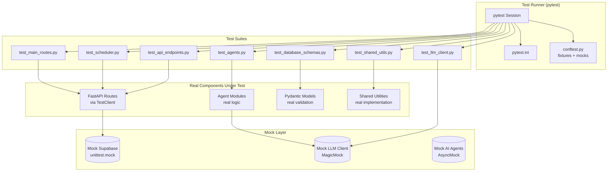
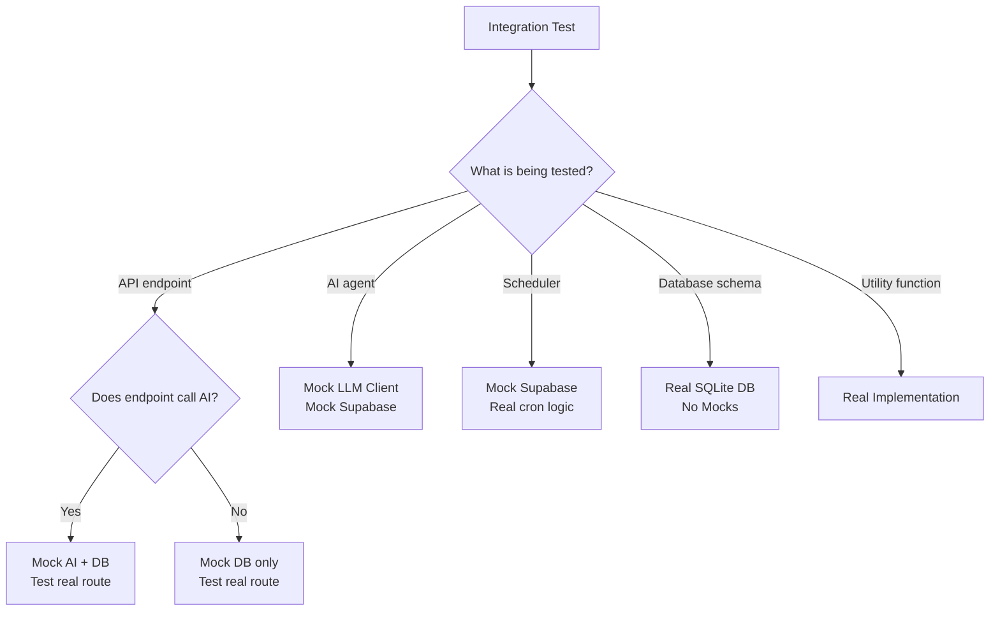

# Integration Testing — Second Brain OS

## Document Control

| Field | Value |
|---|---|
| Document ID | QA-INT-001 |
| Version | 1.0.0 |
| Status | Approved |
| Date | 2026-07-10 |
| Classification | Internal |
| Owner | Developer |

---

## Table of Contents

- [1. Executive Summary](#1-executive-summary)
- [2. Purpose](#2-purpose)
- [3. Scope](#3-scope)
- [4. Business Context](#4-business-context)
- [5. Functional Specification](#5-functional-specification)
- [6. Non-Functional Requirements](#6-non-functional-requirements)
- [7. Architecture](#7-architecture)
- [8. Diagrams](#8-diagrams)
- [9. Data Models](#9-data-models)
- [10. APIs](#10-apis)
- [11. Security](#11-security)
- [12. Performance Targets](#12-performance-targets)
- [13. Edge Cases](#13-edge-cases)
- [14. Failure Scenarios](#14-failure-scenarios)
- [15. Risks & Mitigations](#15-risks--mitigations)
- [16. Acceptance Criteria](#16-acceptance-criteria)
- [17. Traceability](#17-traceability)
- [18. Implementation Notes](#18-implementation-notes)
- [19. Testing Strategy](#19-testing-strategy)
- [20. References](#20-references)

---

## 1. Executive Summary

Integration testing in Second Brain OS validates the interactions between system components: API endpoints talking to the database, AI agents invoking the LLM client and storing results, scheduler jobs triggering API calls, and cross-module workflows. The testing strategy uses mocked external dependencies (AI providers, HTTP clients) for deterministic tests while exercising real code paths through FastAPI's test client and Supabase's test helpers. The testing trophy model prioritises integration tests over unit tests, reflecting the reality that the most valuable tests exercise real component boundaries.

---

## 2. Purpose

Integration tests catch bugs that unit tests miss: incorrect API contracts, database schema mismatches, serialisation errors, authentication chain failures, and cross-module data flow issues. They provide confidence that the system works as a whole, not just that individual functions work in isolation. Without integration tests, deploying changes carries high risk of regressions in component interactions.

---

## 3. Scope

This document covers:

- Integration test scope: cross-module flows, API-to-DB, AI-to-API, scheduler-to-API
- Test data management: fixtures, factories, seeds
- Mock vs real dependencies: mock AI, mock Supabase, real DB for schema tests
- Test isolation: database setup/teardown between tests
- CI integration and reporting
- Test examples with code snippets
- Integration test inventory and coverage targets

Out of scope: unit tests (covered in [Testing Strategy](./28_Testing.md)), E2E tests (covered in [E2E Testing](../qa/E2ETesting.md)), performance tests (covered in [Load Testing](../qa/LoadTesting.md)).

---

## 4. Business Context

The integration test suite currently has approximately 1,100 tests covering API endpoints, AI agents, database schemas, and scheduler jobs. These tests run in CI on every push and PR. The high coverage (96% overall, 85% threshold) is maintained through disciplined test writing: every new endpoint gets 200, 400, 404 test cases, and every agent gets happy-path + fallback tests.

---

## 5. Functional Specification

### 5.1 Integration Test Categories

| Category | Coverage | Test Files | Count |
|---|---|---|---|
| API Endpoints | All 31 routers, ~80 endpoints | `test_api_endpoints.py`, `test_api_routes_advanced.py`, `test_api_endpoints_expanded.py`, `test_skills_api.py` | ~752 |
| AI Agents | 11 agents, all public functions | `test_agents.py`, `test_ai_modules.py` | ~141 |
| LLM Client | Retry, circuit breaker, JSON parsing | `test_llm_client.py` | ~51 |
| Database Schemas | 27 tables + schemas | `test_database_schemas.py` | ~196 |
| Scheduler | 15 cron jobs, triggers | `test_scheduler.py` | ~57 |
| Main Routes | Health, CORS, middleware | `test_main_routes.py` | ~28 |
| Shared Utils | Cache, security, rate limiter | `test_shared_utils.py` | ~244 |

### 5.2 Test Architecture

Tests use `pytest` with the following conventions:

- **Async tests**: All API and agent tests use `@pytest.mark.asyncio`
- **Mocking**: External dependencies (Supabase client, LLM providers) are mocked using `unittest.mock` or `pytest-asyncio`
- **Fixtures**: Shared fixtures in `tests/conftest.py` (mock Supabase client, mock LLM client, test user ID)
- **Factories**: Test data factories for creating realistic entities
- **Database**: Schema tests use a real or in-memory SQLite database for isolation

### 5.3 API Endpoint Test Pattern

```python
import pytest
from httpx import AsyncClient, ASGITransport
from main import app

@pytest.mark.asyncio
async def test_list_tasks_structure(mock_supabase):
    """GET /api/v1/tasks/ returns paginated task list."""
    mock_supabase.from_.return_value.select.return_value\
        .eq.return_value.order.return_value\
        .range.return_value.execute.return_value.data = [
            {"id": "1", "title": "Test Task", "status": "pending"}
        ]

    transport = ASGITransport(app=app)
    async with AsyncClient(transport=transport, base_url="http://test") as client:
        response = await client.get(
            "/api/v1/tasks/",
            headers={"Authorization": "Bearer test-token"}
        )

    assert response.status_code == 200
    data = response.json()
    assert "data" in data
    assert len(data["data"]) >= 1
```

### 5.4 AI Agent Test Pattern

```python
@pytest.mark.asyncio
async def test_briefing_agent_returns_structured_output(mock_llm, mock_supabase):
    """Briefing agent returns correct JSON structure."""
    from packages.ai.agents.briefing_agent import generate_briefing

    mock_llm.generate_json.return_value = {
        "tasks_due": 3,
        "tasks_overdue": 1,
        "habits_today": ["Read 30 min", "Exercise"],
        "motivation_message": "You're on a roll!",
    }

    result = await generate_briefing(user_id="test-user")

    assert result["tasks_due"] == 3
    assert "motivation_message" in result
    mock_llm.generate_json.assert_called_once()
```

### 5.5 Scheduler Test Pattern

```python
@pytest.mark.asyncio
async def test_daily_briefing_cron_trigger(mock_supabase, mock_llm):
    """Scheduler triggers briefing generation at 7 AM."""
    from services.scheduler.main import trigger_daily_briefing

    result = await trigger_daily_briefing()
    assert result["status"] == "success"
    assert result["briefings_generated"] >= 1
```

---

## 6. Non-Functional Requirements

| ID | Requirement | Target |
|---|---|---|
| INT-NFR-001 | Integration test execution time | < 5 minutes (full suite) |
| INT-NFR-002 | Test flakiness rate | < 0.1% |
| INT-NFR-003 | Mock setup overhead | < 50ms per test |
| INT-NFR-004 | Test isolation (no shared state) | 100% of tests |
| INT-NFR-005 | API test coverage per endpoint | 200 + 400 + 404 paths |

---

## 7. Architecture



---

## 8. Diagrams

### 8.1 Mock vs Real Decision Tree



---

## 9. Data Models

### 9.1 Test Fixture Schema

```python
# tests/conftest.py
import pytest
from unittest.mock import AsyncMock, MagicMock

@pytest.fixture
def mock_supabase():
    """Mock Supabase client for API tests."""
    mock = MagicMock()
    mock.table.return_value.select.return_value\
        .eq.return_value.execute.return_value.data = []
    return mock

@pytest.fixture
def mock_llm():
    """Mock LLM client for agent tests."""
    mock = AsyncMock()
    mock.generate_json.return_value = {}
    mock.generate.return_value = AsyncMock()
    return mock

@pytest.fixture
def test_user_id():
    return "test-user-uuid-0000-0000-000000000000"
```

---

## 10. APIs

No dedicated test API. Tests use the standard ASGI/HTTP test clients to exercise API endpoints.

---

## 11. Security

- Test tokens and credentials are hardcoded test values (never real secrets)
- Mock data does not contain real user information
- Test database (SQLite) is created and destroyed per test session
- CI test runs do not access production resources
- Environment variables for tests are in `tests/.env.test` (not committed, but `.env.test.example` is)

---

## 12. Performance Targets

| Metric | Target |
|---|---|
| Full integration suite runtime | < 5 minutes |
| Per-test average runtime | < 500ms |
| CI pipeline integration test time | < 8 minutes |
| Test discovery time | < 10 seconds |

---

## 13. Edge Cases

| Edge Case | Handling |
|---|---|
| Mock returns unexpected data shape | Schema validation in test assertion catches mismatch |
| Async test fails with timeout | Increase default async timeout to 10s |
| Database schema migration breaks tests | Run test suite against migration + rollback |
| Flaky test due to timing | Add retry logic (max 3 attempts) |
| Missing environment variable | Fixture provides default test value |
| Circular import in test modules | Separate integration tests by layer; avoid cross-imports |

---

## 14. Failure Scenarios

| Scenario | Impact | Mitigation |
|---|---|---|
| Mock does not match real API shape | False positives | Integration test against real API weekly |
| Test order dependency (shared state) | Flaky test suite | Enforce test isolation with fresh fixtures per test |
| Async mock returns wrong type | Test fails with confusing error | Use type hints and `assert isinstance()` guards |
| CI test runner runs out of memory | Tests killed | Run in parallel with `-n auto` (pytest-xdist) |
| Migration changes behaviour but tests pass | Missed regression | Add tests for new behaviour before migration |

---

## 15. Risks & Mitigations

| Risk | Likelihood | Impact | Mitigation |
|---|---|---|---|
| Mocks drift from real API behaviour | Medium | High | Weekly manual integration test against real API |
| Test suite becomes slow (bloat) | Medium | Medium | Profile slow tests; split into faster/slower CI jobs |
| Developers skip writing integration tests | Medium | High | CI enforces coverage threshold (85%) |
| Async test complexity increases maintenance | Medium | Medium | Use `pytest-asyncio` conventions; document common patterns |

---

## 16. Acceptance Criteria

- [ ] All API endpoints have 200, 400, 404 test cases
- [ ] All AI agents have happy-path + fallback test cases
- [ ] All cron jobs have trigger + execution test cases
- [ ] Tests are isolated (no shared state between tests)
- [ ] Tests run in < 5 minutes (full suite)
- [ ] Test flakiness rate < 0.1%
- [ ] CI blocks merge on test failure

---

## 17. Traceability

| Requirement | Covered By | Verified By |
|---|---|---|
| INT-NFR-001 | Test suite timing | CI workflow duration |
| INT-NFR-002 | Flakiness tracking | Test history dashboard |
| INT-NFR-003 | Mock setup benchmark | Profiling |
| INT-NFR-004 | Fixture isolation audit | Code review |
| INT-NFR-005 | Coverage report | pytest-cov |

---

## 18. Implementation Notes

### 18.1 Writing Integration Tests: Checklist

- [ ] Test file follows naming convention: `test_<module>.py`
- [ ] Test function follows pattern: `test_<function>_<scenario>`
- [ ] Mock all external dependencies (Supabase, LLM, HTTP)
- [ ] Test at minimum: 200 success, 400 validation, 404 not-found
- [ ] Use `pytest.mark.asyncio` for async tests
- [ ] Fixtures in `conftest.py` for shared mocks
- [ ] Use realistic test data shapes (match production schemas)
- [ ] Assert on response structure, not just status code

### 18.2 Mock Configuration Reference

| Dependency | Mock Pattern | Test File Example |
|---|---|---|
| Supabase client | `unittest.mock.MagicMock` | `test_api_endpoints.py` |
| LLM generate_json | `unittest.mock.AsyncMock` | `test_agents.py` |
| HTTPX client | `responses` library or `AsyncMock` | `test_llm_client.py` |
| Environment variables | `monkeypatch.setenv` | `test_config_core.py` |
| Feature flags | Mock `get_feature_flag()` function | `test_api_endpoints_expanded.py` |
| Auth dependency | Override FastAPI Depends | `test_api_routes_advanced.py` |

### 18.3 Test Data Factories

Test data factories create realistic entities for integration tests:

```python
# tests/factories.py
from datetime import datetime, timedelta

def make_task(**overrides):
    return {
        "id": overrides.get("id", "test-task-id"),
        "user_id": overrides.get("user_id", "test-user"),
        "title": overrides.get("title", "Test Task"),
        "status": overrides.get("status", "pending"),
        "priority": overrides.get("priority", "medium"),
        "created_at": overrides.get("created_at", datetime.utcnow().isoformat()),
        "due_date": overrides.get("due_date"),
    }
```

---

## 19. Testing Strategy

| Test Type | Scope | Location |
|---|---|---|
| Integration | API CRUD operations | `tests/test_api_endpoints.py` |
| Integration | AI agent end-to-end | `tests/test_agents.py` |
| Integration | LLM client retry + circuit breaker | `tests/test_llm_client.py` |
| Integration | Database schema validation | `tests/test_database_schemas.py` |
| Integration | Scheduler job execution | `tests/test_scheduler.py` |
| Integration | Health check + middleware | `tests/test_main_routes.py` |
| Integration | Shared utility functions | `tests/test_shared_utils.py` |

---

## 20. References

| Reference | Description |
|---|---|
| [Testing Strategy](./28_Testing.md) | Overall testing strategy and trophy model |
| [E2E Testing](../qa/E2ETesting.md) | End-to-end testing approach |
| [Testing](../qa/28_Testing.md) | Unit testing conventions |
| [CI Pipeline](../devops/CI.md) | CI integration for test execution |
| [Coverage Reports](./../devops/27_DevOps.md) | Coverage reporting and enforcement |
| [Testing Philosophy ADR](../engineering/adr/ADR-014-testing-philosophy.md) | ADR on testing approach |

---

## Revision History

| Version | Date | Author | Changes |
|---|---|---|---|
| 1.0.0 | 2026-07-10 | Developer | Initial integration testing document |
