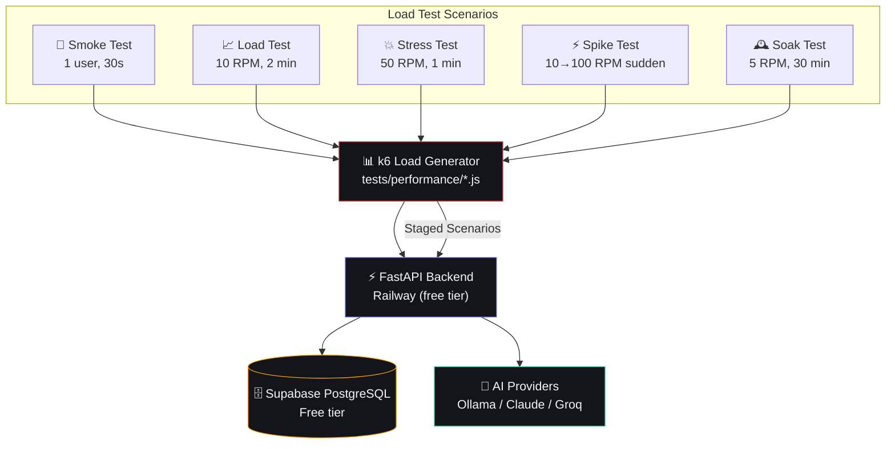

# Load Testing

## Document Control

| Field | Value |
|---|---|
| Document ID | QA-LDT-010 |
| Version | 1.0.0 |
| Status | Draft |
| Date | 2026-07-10 |
| Classification | Internal |
| Owner | Developer |

---

## 1. Executive Summary

### Purpose
Define the load testing strategy for Second Brain OS. Load testing validates that the system handles expected traffic volumes within acceptable performance thresholds, identifies bottlenecks, and establishes baseline capacity for a single-user personal OS with multiple concurrent AI agent operations.

### Scope
Covers load testing for FastAPI backend endpoints, Supabase database queries, AI provider calls, and frontend rendering performance. Uses k6 as the primary load testing tool.

### Current Profile
- **Users:** 1 (primary), occasional multi-device (2-3 concurrent)
- **API requests:** ~7 RPM baseline, ~20 RPM peak
- **AI calls:** ~5-15 per day, burst during briefing/review generation
- **DB queries:** ~50-100 per hour

---

## 2. Load Test Architecture



---

## 3. Load Test Scenarios

### 3.1 Smoke Test

```javascript
// tests/performance/smoke-test.js
import http from 'k6/http';
import { check } from 'k6';

export const options = {
  vus: 1,
  duration: '30s',
  thresholds: {
    http_req_duration: ['p(95) < 500'],
    http_req_failed: ['rate < 0.01'],
  },
};

export default function () {
  const res = http.get('http://localhost:8000/api/v1/health');
  check(res, { 'health check ok': (r) => r.status === 200 });
}
```

### 3.2 Load Test

```javascript
// tests/performance/load-test-crud.js
import http from 'k6/http';
import { check, sleep } from 'k6';

export const options = {
  stages: [
    { duration: '30s', target: 5 },   // Ramp up
    { duration: '1m', target: 10 },    // Sustained load (10 RPM)
    { duration: '30s', target: 0 },    // Ramp down
  ],
  thresholds: {
    http_req_duration: ['p(95) < 1000', 'p(99) < 2000'],
    http_req_failed: ['rate < 0.01'],
  },
};

const BASE_URL = 'http://localhost:8000/api/v1';

export default function () {
  // Simulate a user session: list tasks, create one, read it
  const token = 'test-jwt-token';
  const params = {
    headers: {
      'Authorization': `Bearer ${token}`,
      'Content-Type': 'application/json',
    },
  };

  // List tasks
  let res = http.get(`${BASE_URL}/tasks`, params);
  check(res, { 'list tasks: 200': (r) => r.status === 200 });

  // Create task
  const payload = JSON.stringify({
    title: `Load test task ${__VU}-${__ITER}`,
    priority: 'medium',
  });
  res = http.post(`${BASE_URL}/tasks`, payload, params);
  check(res, { 'create task: 201': (r) => r.status === 201 });
  
  sleep(1);
}
```

### 3.3 Stress Test

```javascript
// tests/performance/load-test-spike.js
export const options = {
  stages: [
    { duration: '10s', target: 10 },
    { duration: '10s', target: 50 },   // Spike to 50 RPM
    { duration: '30s', target: 50 },   // Sustained peak
    { duration: '10s', target: 0 },    // Cool down
  ],
  thresholds: {
    http_req_duration: ['p(90) < 2000', 'p(95) < 5000'],
    http_req_failed: ['rate < 0.05'],  // Allow some failures under stress
  },
};
```

### 3.4 AI Endpoint Load Test

```javascript
// tests/performance/load-test-ai.js
export const options = {
  stages: [
    { duration: '30s', target: 1 },   // Only 1 concurrent AI call
    { duration: '1m', target: 3 },    // Max 3 concurrent AI calls
  ],
  thresholds: {
    http_req_duration: ['p(95) < 30000'],  // AI calls can be slow
    'ai_fallback': ['count < 5'],         // Few fallbacks expected
  },
  // AI calls are expensive — limit concurrency
  max_vus: 3,
};

export default function () {
  const res = http.post(`${BASE_URL}/chat`, {
    message: 'Summarize my tasks for today',
  }, params);
  check(res, { 'chat: 200': (r) => r.status === 200 });
  
  // Check if fallback was used
  const isFallback = res.json()._fallback === true;
  check(res, { 'ai used, not fallback': !isFallback });
}
```

---

## 4. Load Test Scenarios Quick Reference

| Test | VUs | Duration | Requests | Purpose |
|---|---|---|---|---|
| **Smoke** | 1 | 30s | ~7 | Verify test infrastructure |
| **Load (CRUD)** | 10 | 2 min | ~200 | Baseline performance |
| **Load (AI)** | 3 | 1.5 min | ~45 | AI endpoint behavior |
| **Stress** | 50 | 1 min | ~500 | Find breaking point |
| **Spike** | 10→100 | 30s | ~300 | Sudden burst handling |
| **Soak** | 5 | 30 min | ~750 | Memory leaks over time |

---

## 5. Metrics & Thresholds

| Metric | Smoke | Load | Stress | Spike | Soak |
|---|---|---|---|---|---|
| P95 latency (CRUD) | < 500ms | < 1000ms | < 2000ms | < 2000ms | < 1000ms |
| P95 latency (AI) | — | < 15000ms | < 30000ms | < 30000ms | < 15000ms |
| Error rate | < 1% | < 1% | < 5% | < 5% | < 1% |
| Circuit breaker | — | Not open | < 3 opens | < 3 opens | Not open |
| Rate limited | — | < 10% | < 20% | < 20% | < 5% |

---

## 6. Test Execution

### 6.1 Running Tests

```bash
# Prerequisites
choco install k6  # Windows
# OR
winget install k6

# Run all load tests
cd tests/performance
bash run-k6.sh

# Run specific test
k6 run load-test-crud.js --out json=report.json

# Run with custom thresholds
k6 run load-test-crud.js --threshold "http_req_duration[p(95)]<1500"
```

### 6.2 CI Integration

```yaml
# .github/workflows/load-test.yml
name: Load Tests
on:
  schedule:
    - cron: '0 6 * * 1'  # Weekly Monday
  workflow_dispatch:

jobs:
  load-test:
    runs-on: ubuntu-latest
    services:
      api:
        image: secondbrain-api:ci
        ports:
          - 8000:8000
    steps:
      - uses: actions/checkout@v4
      - name: Setup k6
        run: |
          sudo apt-key adv --keyserver hkp://keyserver.ubuntu.com:80 --recv-keys C5AD17C747E3415A3642D57D77C6C491D6AC1D69
          echo "deb https://dl.k6.io/deb stable main" | sudo tee /etc/apt/sources.list.d/k6.list
          sudo apt-get update && sudo apt-get install k6
      - name: Run load tests
        run: |
          k6 run tests/performance/load-test-crud.js
          k6 run tests/performance/load-test-ai.js
```

---

## 7. Test Data Strategy

| Endpoint | Data Volume | Data Generation |
|---|---|---|
| Tasks | 100 records | Seeded via script |
| Goals | 20 records | Seeded via script |
| Habits | 10 records with 30-day logs | Seeded via script |
| Chat | 200 messages | Seeded via script |
| Sleep | 30-day logs | Seeded via script |

```bash
# Seed test data
python scripts/seed_performance_data.py --users 1 --tasks 100 --habits 30
```

---

## 8. Bottleneck Analysis

| Component | Expected Bottleneck | Mitigation |
|---|---|---|
| FastAPI on Railway Free | 512MB RAM, shared CPU | Optimize request handling, caching |
| Supabase Free Tier | 500MB DB, 2 connections | Query optimization, pagination |
| Ollama (local AI) | GPU-dependent | Async, circuit breaker |
| Claude API | 5 RPM limit | Queue, provider failover |

---

## 9. Performance Targets

| Metric | Current Baseline | Target |
|---|---|---|
| CRUD endpoint P95 | < 150ms | < 200ms |
| Chat endpoint P95 | < 5000ms | < 3000ms |
| Briefing generation | < 10000ms | < 8000ms |
| Error rate under load | < 2% | < 1% |
| Requests before degradation | ~100 RPM | ~50 RPM (acceptable) |

---

## 10. Reporting

```bash
# Generate HTML report
k6 run load-test-crud.js --out json=report.json
# Use k6-reporter or manual parsing
```

### 10.1 Report Template

```markdown
# Load Test Report

**Date:** YYYY-MM-DD
**Test:** [Smoke/Load/Stress/Spike/Soak]
**Environment:** [Local/Staging/Production]

## Summary
- Total requests: [N]
- Passed: [N]
- Failed: [N]
- P95 latency: [N]ms
- Error rate: [N]%

## Per-Endpoint Breakdown
| Endpoint | Count | P50 | P95 | P99 | Errors |
|---|---|---|---|---|---|
| GET /tasks | 50 | 45ms | 120ms | 200ms | 0 |
| POST /tasks | 50 | 80ms | 200ms | 350ms | 0 |

## Observations
- [Observation 1]
- [Observation 2]

## Recommendations
- [Recommendation 1]
```

---

## 11. Edge Cases

| Edge Case | Handling |
|---|---|
| Rate limiting during test | Increase `RATE_LIMIT_MAX` for test duration |
| AI quota exhausted | Use API key with sufficient quota |
| Database connection limit | Test with `--vus 1` for soak |
| Railway sleep on inactivity | Warm up with health checks before test |

---

## 12. Failure Scenarios

| Scenario | Impact | Mitigation |
|---|---|---|
| Out of memory | Tests fail, API crashes | Lower VUs, test on staging with same resources |
| Supabase rate limit | Queries fail temporarily | Add retry logic in test script |
| AI provider unavailable | Test failures for AI endpoints | Mark AI tests as optional |
| Test data contamination | Skewed results | Use fresh seed per test run |

---

## 13. Risks

| Risk | Likelihood | Impact | Mitigation |
|---|---|---|---|
| Free tier infrastructure limits | High | Medium | Test within known limits |
| Single-user system over-engineering | High | Low | Focus on AI latency, not CRUD throughput |
| Ollama performance inconsistent | Medium | Medium | Mock Ollama in CI, test real in staging |
| Railway cold starts | Medium | Low | Warm-up phase in test script |

---

## 14. Related Documents

| Document | Relation |
|---|---|
| docs/qa/28_Testing.md | Overall testing strategy |
| docs/qa/29_QA.md | QA process |
| docs/qa/StressTesting.md | Stress test methodology |
| docs/qa/PerformanceTesting.md | Performance benchmarks |
| docs/engineering/45_PerformanceScalability.md | Performance architecture |

---

## 15. Appendices

### 15.1 k6 Installation

```bash
# Windows
choco install k6
# OR download from https://k6.io/docs/get-started/installation/

# Verify
k6 version
```

### 15.2 Test Environment Requirements

```bash
# Environment variables for load testing
LOAD_TEST_API_URL=http://localhost:8000
LOAD_TEST_TOKEN=<test-jwt-token>
LOAD_TEST_USER_ID=test-user
```
