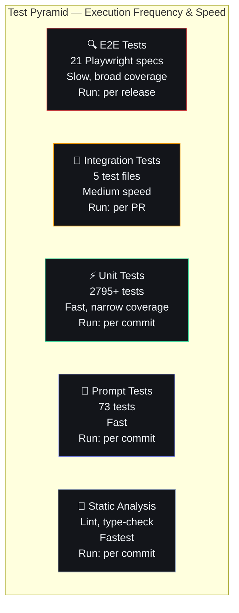

# Regression Testing

## Document Control

| Field | Value |
|---|---|
| Document ID | QA-RGT-008 |
| Version | 1.0.0 |
| Status | Draft |
| Date | 2026-07-10 |
| Classification | Internal |
| Owner | Developer |

---

## 1. Executive Summary

### Purpose
Define the regression testing strategy for Second Brain OS. Regression testing ensures that new code changes, dependency updates, and infrastructure modifications do not break existing functionality. The strategy balances thorough coverage with execution speed appropriate for a single-developer project.

### Scope
Covers regression testing across all layers: frontend (TypeScript/React), backend (Python/FastAPI), AI agents, prompts, database migrations, and infrastructure.

---

## 2. Regression Test Pyramid



---

## 3. What Triggers Regression Testing

| Trigger | Required Tests | Runner | SLA |
|---|---|---|---|
| Any commit to `main` | Static analysis, Unit tests | GitHub CI | < 10 min |
| Pull request opened | Static, Unit, Integration, Prompt | GitHub CI | < 15 min |
| Dependency update (patch) | Static, Unit | GitHub CI | < 10 min |
| Dependency update (minor) | Static, Unit, Integration | GitHub CI | < 15 min |
| Dependency update (major) | Full suite | Manual trigger | < 1 hour |
| Database migration | Unit, Integration, Data integrity | GitHub CI | < 20 min |
| Prompt change | Static, Unit, Prompt | GitHub CI | < 10 min |
| Release candidate | Full suite + UAT | Manual | < 2 hours |
| Production incident fix | Full suite | GitHub CI | < 20 min |

---

## 4. Regression Test Suites

### 4.1 Quick Regression (~5 min)

Run before every commit:

```bash
# Static analysis
ruff check apps/api/ packages/ services/scheduler/ scripts/ tests/
black --check apps/ packages/ services/ tests/ scripts/

# Prompt validation
python scripts/validate_prompts.py

# Unit tests (fast subset)
pytest tests/test_prompt_loader.py tests/test_agent_prompts.py -x

# Frontend
cd apps/web && npm run lint
cd apps/web && npm run type-check
```

### 4.2 Standard Regression (~15 min)

Run for every PR:

```bash
# All Python unit tests
python -m pytest tests/ -x --timeout=60

# Frontend tests
cd apps/web && npm run test:ci

# Integration tests
python -m pytest tests/test_integration.py -v
```

### 4.3 Full Regression (~1 hour)

Run for release candidates:

```bash
# All tests with coverage
python -m pytest tests/ --cov=packages --cov=apps/api --cov-fail-under=80

# E2E tests
cd apps/web && npx playwright test

# Performance tests
cd tests/performance && k6 run load-test-crud.js

# Chaos tests
python scripts/chaos/runner.py --all
```

---

## 5. Critical Paths — High-Risk Regression Areas

| Module | Risk Level | Why | Regression Focus |
|---|---|---|---|
| **Authentication** | Critical | All features depend on auth | Login, session, token refresh, RLS |
| **Task CRUD** | Critical | Most-used feature | Create, complete, list, search |
| **Chat/ARIA** | High | AI orchestration | Message flow, context, error handling |
| **Database Access Layer** | Critical | Every module depends on Supabase | Query building, error propagation |
| **AI Circuit Breaker** | High | System resilience | Open/half-open/closed states |
| **Prompt Loader** | High | All agents depend on prompts | Loading, rendering, fallback |
| **Scheduler Jobs** | Medium | 15 cron jobs | Execution, logging, error recovery |
| **Feature Flags** | Medium | Controls rollout | Flag evaluation, toggling, persistence |

---

## 6. Regression Test Patterns

### 6.1 Mock External Dependencies

```python
# tests/conftest.py - Mock Supabase for unit tests
@pytest.fixture
def mock_supabase():
    with patch('apps.api.app.api.tasks.supabase') as mock:
        mock.table.return_value.select.return_value \
            .eq.return_value.execute.return_value.data = []
        yield mock
```

### 6.2 Snapshot Testing for AI Outputs

```python
# tests/test_agents.py - Verify AI response structure hasn't changed
def test_task_agent_output_structure():
    result = task_agent.generate("Write project proposal")
    assert "title" in result
    assert "steps" in result
    assert isinstance(result["steps"], list)
    assert len(result["steps"]) >= 2
```

### 6.3 Prompt Frontmatter Validation

```python
# tests/test_agent_prompts.py
def test_all_prompts_have_required_fields():
    for name in prompts.list_prompts():
        entry = prompts.get_required(name)
        assert entry.frontmatter.get("version"), f"{name} missing version"
        assert entry.frontmatter.get("status"), f"{name} missing status"
        assert entry.frontmatter.get("model"), f"{name} missing model"
```

---

## 7. Regression Risk Assessment

| Change Type | Risk Level | Required Regression Scope |
|---|---|---|
| Comment/typo fix | Minimal | None (CI lint only) |
| Test changes | Low | Related test suite |
| Refactor (no behavior change) | Low | All tests |
| Bug fix | Medium | Related module + integration |
| New feature (new module) | Medium | All existing tests |
| New feature (modifies core) | High | Full regression |
| Dependency major bump | High | Full regression |
| Database migration | High | Full regression + data integrity |
| Infrastructure change | Critical | Full regression + deploy tests |

---

## 8. Automated Regression in CI

### 8.1 CI Pipeline Flow

```yaml
# .github/workflows/ci.yml (core jobs)
jobs:
  lint:
    runs-on: ubuntu-latest
    steps:
      - run: ruff check .
      - run: black --check .
      - run: cd apps/web && npm run lint && npm run type-check
  
  test-backend:
    needs: lint
    runs-on: ubuntu-latest
    steps:
      - run: python -m pytest tests/ --cov=packages --cov=apps/api
  
  test-frontend:
    needs: lint
    runs-on: ubuntu-latest
    steps:
      - run: cd apps/web && npm run test:ci
  
  test-prompts:
    needs: lint
    runs-on: ubuntu-latest
    steps:
      - run: python scripts/validate_prompts.py
      - run: python -m pytest tests/test_prompt_loader.py tests/test_agent_prompts.py
  
  e2e:
    needs: [test-backend, test-frontend]
    runs-on: ubuntu-latest
    steps:
      - run: cd apps/web && npx playwright test
```

### 8.2 Caching Strategy

```yaml
- uses: actions/cache@v4
  with:
    path: |
      ~/.cache/pip
      ~/.npm
      .next/cache
    key: ${{ runner.os }}-deps-${{ hashFiles('**/requirements.txt', '**/package-lock.json') }}
```

---

## 9. Regression Test Expansion Rules

| Rule | When to Apply |
|---|---|
| New endpoint → Add 3 test cases | Every new API endpoint |
| New agent → Add test_agent_prompts + test_agents | Every new agent module |
| New prompt → Add frontmatter + content test | Every new prompt file |
| Fixed bug → Add regression test for the scenario | Every bug fix |
| Dependency update → Run full suite | Major/minor version changes |
| Schema change → Add schema validation test | Every new/modified Pydantic model |

---

## 10. Performance Targets

| Metric | Quick | Standard | Full |
|---|---|---|---|
| Execution time | < 5 min | < 15 min | < 60 min |
| Test count | ~500 | ~2500 | ~4500 |
| Coverage check | No | Min 80% | Min 80% |
| Blocking on failure | Yes | Yes | Yes |

---

## 11. Edge Cases

| Edge Case | Handling |
|---|---|
| Flaky test | Retry 3 times, then mark as failure |
| Timeout | Set `--timeout=60` for unit, `--timeout=300` for integration |
| Network-dependent tests | Mock all external calls |
| Environment-specific failures | Check env vars match CI expectations |

---

## 12. Failure Scenarios

| Scenario | Impact | Mitigation |
|---|---|---|
| CI test failure blocks all PRs | Developer productivity hit | Fix forward, revert if needed |
| Test suite takes too long | Developers skip running locally | Quick regression in pre-commit hook |
| Flaky tests reduce trust | Ignored failures | Weekly flaky test review |
| Coverage decreases | Risk of untested paths | Gate on coverage threshold |

---

## 13. Risks

| Risk | Likelihood | Impact | Mitigation |
|---|---|---|---|
| Test maintenance burden | Medium | Medium | Shared fixtures, generate test templates |
| False sense of security from passing tests | Low | High | Pair with manual E2E smoke tests |
| Missing regression for edge case | Medium | Medium | Expand test case library per bug |
| CI minutes cost on free tier | Medium | Low | Cache dependencies, optimize test order |

---

## 14. Related Documents

| Document | Relation |
|---|---|
| docs/qa/28_Testing.md | Overall testing strategy |
| docs/qa/29_QA.md | QA process |
| docs/qa/E2ETesting.md | E2E test details |
| docs/qa/ChaosTesting.md | Resilience verification |
| docs/qa/UAT.md | Manual acceptance testing |

---

## 15. Appendices

### 15.1 Quick Regression Checklist

```bash
# Run these locally before every push:
make pre-commit
```

### 15.2 Regression Test Template for Bugs

```python
"""
Regression test for Bug #NNN: [Brief description]
When: [Trigger condition]
Expected: [Correct behavior]
Actual: [Bug behavior before fix]
"""

def test_regression_for_bug_123():
    """Regression: Task completion date not updated on mark-done."""
    # Setup
    task = create_test_task(status="pending")
    
    # Execute
    result = tasks_api.complete_task(task.id)
    
    # Verify
    assert result["status"] == "completed"
    assert result["completed_at"] is not None
```
