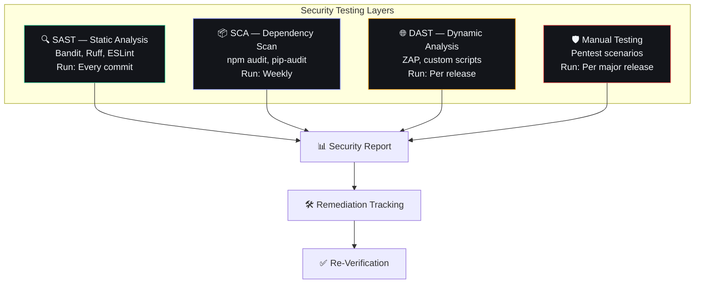

# Security Testing

## Document Control

| Field | Value |
|---|---|
| Document ID | QA-SCT-009 |
| Version | 1.0.0 |
| Status | Approved |
| Date | 2026-07-10 |
| Classification | Confidential |
| Owner | Developer |

---

## 1. Executive Summary

### Purpose
Define the security testing strategy for Second Brain OS. This document covers automated and manual security verification procedures to identify vulnerabilities, validate security controls, and ensure compliance with OWASP Top 10 and SOC 2 security principles.

### Scope
Covers security testing for all components: Next.js frontend, FastAPI backend, Supabase database/RLS, AI agents, third-party integrations, authentication, and data storage.

### Security Testing Philosophy
- **Shift left** — Find vulnerabilities as early as possible
- **Defense in depth** — Multiple layers of security controls
- **Automate what you can, verify what you must**
- **Zero trust** — Verify every request, every time

---

## 2. Security Testing Framework



---

## 3. OWASP Top 10 Coverage

| Category | Coverage | Verification Method |
|---|---|---|
| **A01: Broken Access Control** | RLS policies, user_id filtering | SAST + Manual |
| **A02: Cryptographic Failures** | HTTPS, password hashing (bcrypt) | Configuration review |
| **A03: Injection** | SQL via Supabase SDK, XSS via sanitizer | SAST + DAST |
| **A04: Insecure Design** | Rate limiting, circuit breakers | Design review |
| **A05: Security Misconfiguration** | CORS, headers, env vars | SAST + Manual |
| **A06: Vulnerable Components** | npm/pip audit | SCA |
| **A07: Auth Failures** | JWT validation, session management | Manual + DAST |
| **A08: Data Integrity Failures** | CSRF tokens, audit trail | Manual |
| **A09: Logging Failures** | Structured logging, no sensitive data | Code review |
| **A10: SSRF** | Outbound request allowlisting | Design review |

---

## 4. Automated Security Tests

### 4.1 SAST — Static Analysis

| Tool | Scope | Configuration | Run Frequency |
|---|---|---|---|
| **Bandit** | Python security linter | `bandit.yaml` | Every commit |
| **Ruff** | Python lint (includes security rules) | `pyproject.toml` | Every commit |
| **ESLint** | TypeScript/React security rules | `.eslintrc.json` | Every commit |
| **Trivy** | Container vulnerability scan | `trivy.yaml` | Weekly |

```bash
# Bandit scan
bandit -r apps/api/ packages/ services/ -f json -o reports/bandit.json

# Ruff security check
ruff check --select S,INP,PLC apps/api/ packages/

# Trivy container scan
trivy image secondbrain-api:latest --severity HIGH,CRITICAL
```

### 4.2 SCA — Dependency Scanning

```bash
# Python
pip-audit --requirement apps/api/requirements.txt

# Node.js
cd apps/web && npm audit --audit-level=high

# All dependencies (weekly in CI)
python scripts/check-dependencies.py
```

### 4.3 DAST — Dynamic Analysis

```bash
# OWASP ZAP baseline scan
bash scripts/owasp-check.sh

# SQL injection pattern scan
bash scripts/sql-injection-audit.sh

# Attack scenario simulation
python scripts/attack-scenarios.py
```

### 4.4 Custom Security Tests

```python
# scripts/attack-scenarios.py
"""
Simulates 6 attack scenarios against the API.
Designed to validate security controls without causing damage.
"""

class XSSInjectionTest:
    """Test that stored XSS is prevented."""
    payloads = [
        "<script>alert('xss')</script>",
        "",
        "javascript:alert('xss')",
    ]
    
    async def test_task_title_xss(self):
        for payload in self.payloads:
            response = await api_client.post("/tasks", json={
                "title": payload,
                "description": "Test XSS"
            })
            # Verify payload is sanitized, not stored raw
            assert payload not in response.json().get("title", "")

class CSRFTest:
    """Test that CSRF protection works."""
    async def test_missing_csrf(self):
        response = await api_client.post("/tasks", 
            json={"title": "CSRF test"},
            headers={"X-CSRF-Token": ""}
        )
        assert response.status_code == 403

class RateLimitTest:
    """Test rate limiting is enforced."""
    async def test_rate_limits(self):
        for _ in range(200):
            response = await api_client.get("/tasks")
        assert response.status_code == 429
```

---

## 5. Manual Security Tests

### 5.1 Pentest Scenarios (Run by Developer)

| Scenario | Test Description | Expected Result |
|---|---|---|
| **Auth Bypass** | Access `/api/v1/tasks` without JWT | 401 Unauthorized |
| **User Isolation** | User A reads user B's tasks using ID guess | Empty result or 404 |
| **IDOR** | Change `user_id` in request body | Server ignores body user_id |
| **Mass Assignment** | Send unexpected fields in POST body | Extra fields ignored/stripped |
| **JWT Tampering** | Modify JWT payload in token | 401, token rejected |
| **Path Traversal** | `../../../etc/passwd` in file path | 400 Bad Request |
| **NoSQL Injection** | `$gt`, `$ne` operators in query params | Operators sanitized |
| **LLM Prompt Injection** | `Ignore previous instructions` in chat message | Guardrails filter override attempts |

### 5.2 Authentication Tests

| Test | Method | Expected |
|---|---|---|
| Login with valid credentials | POST /auth/login | 200 + JWT |
| Login with invalid password | POST /auth/login | 401 |
| Login with nonexistent email | POST /auth/login | 401 (generic message) |
| Access protected route without token | GET /api/v1/tasks | 401 |
| Access protected route with expired token | GET /api/v1/tasks | 401 |
| Access protected route with malformed token | GET /api/v1/tasks | 401 |
| Refresh valid token | POST /auth/refresh | 200 + new JWT |

### 5.3 Authorization Tests

| Test | Method | Expected |
|---|---|---|
| User A accesses their own resource | GET /api/v1/tasks/user-a | 200 + data |
| User A accesses user B's resource | GET /api/v1/tasks/user-b | 404 or empty |
| User A modifies user B's resource | PUT /api/v1/tasks/user-b-task | 404 |
| User A deletes user B's resource | DELETE /api/v1/tasks/user-b-task | 404 |

### 5.4 Input Validation Tests

| Test | Method | Expected |
|---|---|---|
| Oversized payload (>1MB) | POST with large JSON | 413 Payload Too Large |
| Invalid content type | POST with text/plain | 415 Unsupported Media Type |
| SQL injection attempt | `' OR '1'='1` in query params | Not vulnerable (SDK escapes) |
| XSS in task title | POST with `<script>` payload | Sanitized or rejected |
| Command injection | `; rm -rf /` in input field | Rejected as invalid value |

---

## 6. Security Scanning Schedule

| Scan | Frequency | Tool | Failure Threshold |
|---|---|---|---|
| SAST (Python) | Every commit | Bandit | High+ findings: 0 |
| SAST (TypeScript) | Every commit | ESLint | Error-level: 0 |
| Dependency scan | Weekly | npm audit / pip-audit | High+ severity: 0 |
| Container scan | Weekly | Trivy | Critical: 0, High: < 3 |
| DAST | Per release | OWASP ZAP | High+ findings: 0 |
| Full pentest | Per major release | Custom scripts | Medium+ findings: 0 |
| Secret scan | Every commit | git-secrets | Any secret found: 0 |

---

## 7. Security Test Automation

```yaml
# .github/workflows/security.yml
name: Security Scan
on:
  push:
    branches: [main, develop]
  schedule:
    - cron: '0 6 * * 1'  # Weekly Monday

jobs:
  sast:
    runs-on: ubuntu-latest
    steps:
      - uses: actions/checkout@v4
      - uses: actions/setup-python@v5
      - run: pip install bandit
      - run: bandit -r apps/api/ packages/ -f json -o bandit-report.json
      - uses: actions/upload-artifact@v4
        with:
          name: bandit-report
          path: bandit-report.json

  dependency-scan:
    runs-on: ubuntu-latest
    steps:
      - uses: actions/checkout@v4
      - uses: actions/setup-node@v4
      - run: cd apps/web && npm audit --audit-level=high
      - uses: actions/setup-python@v5
      - run: pip install pip-audit
      - run: pip-audit --requirement apps/api/requirements.txt
```

---

## 8. Vulnerability Disclosure & Remediation

### 8.1 Severity Matrix

| Severity | Definition | Remediation SLA |
|---|---|---|
| **Critical** | Remote code execution, auth bypass, data leak | < 24 hours |
| **High** | Access control bypass, XSS, SSRF | < 72 hours |
| **Medium** | Rate limiting bypass, missing headers | < 1 week |
| **Low** | Information disclosure, best practice gap | < 1 month |

### 8.2 Remediation Workflow

```
Vulnerability Found → Create GitHub Issue → Severity Assessment
→ Fix (PR) → Review → Merge → Deploy → Verify in Production
```

---

## 9. Security Headers Validation

| Header | Expected Value | Test |
|---|---|---|
| `Content-Security-Policy` | `default-src 'self'` | Check response headers |
| `X-Content-Type-Options` | `nosniff` | Check response headers |
| `X-Frame-Options` | `DENY` | Check response headers |
| `Strict-Transport-Security` | `max-age=31536000` | Check response headers |
| `X-XSS-Protection` | `1; mode=block` | Check response headers |
| `Referrer-Policy` | `strict-origin-when-cross-origin` | Check response headers |
| `Permissions-Policy` | `camera=(), microphone=()` | Check response headers |

---

## 10. Performance Targets

| Metric | Target |
|---|---|
| SAST scan time | < 2 minutes |
| Dependency scan time | < 1 minute |
| DAST scan time | < 10 minutes |
| Full security suite | < 20 minutes |
| False positive rate | < 15% |

---

## 11. Edge Cases

| Edge Case | Handling |
|---|---|
| Tool false positive | Document rationale, suppress with review |
| Incomplete scan (tool crash) | CI job marked as skipped, manual review triggered |
| Rate limiting on dependencies API | Cache vulnerability database locally |
| Network-isolated scanning | Pre-computed vulnerability database |

---

## 12. Failure Scenarios

| Scenario | Impact | Mitigation |
|---|---|---|
| Critical vulnerability found in production | Immediate fix or rollback | Incident response process |
| Dependency with no fix available | Risk acceptance with monitoring | Document in security log |
| DAST causes service degradation | Run on staging only | Environment isolation check |
| Secret accidentally committed | Immediate rotation, force push cleanup | Pre-commit hooks, secret scanner |

---

## 13. Risks

| Risk | Likelihood | Impact | Mitigation |
|---|---|---|---|
| Free tier limits on scanning tools | Medium | Low | Run scans locally |
| False sense of security | Low | High | Paired with manual review |
| Tool not catching logic bugs | Medium | Medium | Manual pentest per release |
| Auth token exposure in logs | Low | Critical | Structured logging, redaction |

---

## 14. Related Documents

| Document | Relation |
|---|---|
| docs/security/24_Security.md | Overall security architecture |
| docs/security/ThreatModel.md | Threat modeling |
| docs/security/46_DataPrivacy.md | Data privacy |
| docs/security/PenTest.md | Penetration test details |
| docs/operations/40_IncidentResponse.md | Security incident response |

---

## 15. Appendices

### 15.1 Security Testing Checklist (Pre-Release)

- [ ] No secrets/credentials in code
- [ ] All API endpoints require auth (except health)
- [ ] RLS policies verified on all tables
- [ ] Input sanitization active on all user inputs
- [ ] CORS configured for frontend origin only
- [ ] Rate limiting active on public endpoints
- [ ] Audit logging active on all mutations
- [ ] HTTPS enforced (HSTS header set)
- [ ] CSRF protection active
- [ ] JWT expiration configured (< 24 hours)
- [ ] All dependencies scanned (no high+ issues)
- [ ] Bandit scan passed (no high+ findings)
- [ ] Prompt injection tested for chat
- [ ] Error messages don't leak internals
- [ ] File upload validation active (if applicable)

### 15.2 Environment Variables for Security

```bash
# Required for every environment
JWT_SECRET=<random-64-char-string>
JWT_ALGORITHM=HS256
JWT_EXPIRY_HOURS=24
CORS_ORIGINS=https://secondbrain-os.vercel.app
RATE_LIMIT_MAX=100
RATE_LIMIT_WINDOW=60
ENCRYPTION_KEY=<random-32-char-string>
```
