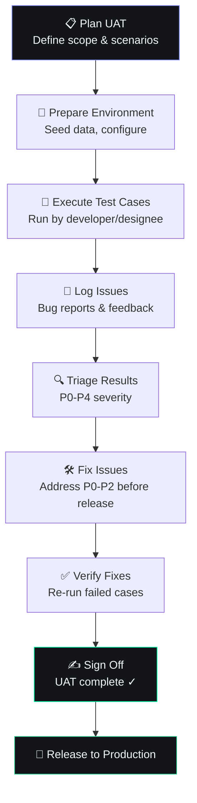

# User Acceptance Testing (UAT)

## Document Control

| Field | Value |
|---|---|
| Document ID | QA-UAT-006 |
| Version | 1.0.0 |
| Status | Draft |
| Date | 2026-07-10 |
| Classification | Internal |
| Owner | Developer |

---

## 1. Executive Summary

### Purpose
Define the User Acceptance Testing (UAT) framework for Second Brain OS. UAT validates that the system meets real-world user needs, workflows are intuitive, and data integrity is maintained across all modules before production release.

### Scope
Covers UAT for all 27+ enterprise-grade modules across frontend, backend, AI agents, and scheduler components. Applies to major releases (minor version bumps) and new module launches.

### UAT Philosophy
- **Test with real data** — Use production-like datasets
- **Test real workflows** — Not isolated features but end-to-end journeys
- **Test for outcomes** — Does the system improve the user's productivity?
- **Fix before release** — No P0/P1 bugs in production

---

## 2. UAT Process



---

## 3. How This Differs from Regular Testing

| Aspect | Unit/Integration Tests | UAT |
|---|---|---|
| **Who runs it** | Automated CI | Human (developer/designee) |
| **Data** | Mock/fake data | Realistic seed data |
| **Scope** | Single function/endpoint | End-to-end workflows |
| **Goal** | Find code bugs | Validate usability & correctness |
| **Pass condition** | Assertions pass | Workflow feels natural |
| **Frequency** | Every commit | Per major/minor release |
| **Time** | Seconds to minutes | 30–120 minutes per session |

---

## 4. UAT Test Categories

### 4.1 Core CRUD (All 15 Modules)

| Module | Create | Read | Update | Delete | List |
|---|---|---|---|---|---|
| Tasks | ✓ | ✓ | ✓ | ✓ | ✓ |
| Courses | ✓ | ✓ | ✓ | ✓ | ✓ |
| Goals | ✓ | ✓ | ✓ | ✓ | ✓ |
| Habits | ✓ | ✓ | ✓ | ✓ | ✓ |
| Sleep | ✓ | ✓ | ✓ | ✓ | ✓ |
| Income | ✓ | ✓ | ✓ | ✓ | ✓ |
| Projects | ✓ | ✓ | ✓ | ✓ | ✓ |
| Ideas | ✓ | ✓ | ✓ | ✓ | ✓ |
| Resources | ✓ | ✓ | ✓ | ✓ | ✓ |
| Opportunities | ✓ | ✓ | ✓ | ✓ | ✓ |
| Time entries | ✓ | ✓ | ✓ | ✓ | ✓ |
| Memory | ✓ | ✓ | ✓ | ✓ | ✓ |
| Notifications | ✓ | ✓ | ✓ | ✓ | ✓ |
| Feature Flags | ✓ | ✓ | ✓ | ✓ | ✓ |
| Reviews | ✓ | ✓ | ✓ | ✓ | ✓ |

### 4.2 AI Agent Tests

| Agent | Test Scenario |
|---|---|
| Daily Briefing | Generate briefing for realistic task/goal/habit data |
| Weekly Review | Generate review with mixed progress data |
| Memory Agent | Verify consolidation across multiple sessions |
| Learning Agent | Detect pattern from repeated behavior |
| Opportunity Radar | Score realistic opportunities |
| Sleep Agent | Generate wind-down for given sleep data |
| Nudge Agent | Generate nudges for overdue status |
| Task Agent | Break down realistic daily workload |
| Roadmap Agent | Generate roadmap for active goals |
| Opportunity Matching | Score opportunities against user profile |

### 4.3 Cross-Module Workflows

| Workflow | Steps | Modules Involved |
|---|---|---|
| Morning routine | Log sleep → View briefing → Review tasks | Sleep, Briefing, Tasks |
| Study session | Review course → Track time → Log progress | Courses, Time, Goals |
| Idea to project | Capture idea → Validate → Create project | Ideas, Projects |
| Weekly review | Review completed → Assess goals → Plan next week | Reviews, Goals, Tasks |
| Income tracking | Log income → Review hourly rate → Check analytics | Income, Analytics |

---

## 5. UAT Test Template

```markdown
### TC-[Module]-[Number]: [Test Name]

**Priority:** P0 / P1 / P2
**Category:** CRUD / AI / Cross-Module / Edge Case
**Pre-conditions:** [What must be true before starting]

**Test Data:**
- User: test-user@example.com
- Seed data: 5 tasks, 3 goals, 2 habits (see seed script)

**Steps:**
1. [Step 1]
2. [Step 2]
3. [Step 3]

**Expected Result:**
[What should happen]

**Actual Result:**
[Pass / Fail / Notes]
```

---

## 6. UAT Test Cases

### 6.1 Task Module — Complete Workflow

```
TC-TASK-001: Task Creation and Completion Flow
Priority: P0
Category: CRUD

Pre-conditions: User is logged in, on Tasks page

Steps:
1. Click "Create Task" button
2. Enter title "Complete UAT for v2.0"
3. Set priority to "High"
4. Set due date to tomorrow
5. Click "Save"
6. Verify task appears in task list
7. Mark task as complete
8. Verify task moves to completed section

Expected: Task created, visible in list, completable
```

### 6.2 AI Briefing Module

```
TC-BRF-001: Daily Briefing Generation
Priority: P1
Category: AI

Pre-conditions: User has 5+ tasks, 3 habits, 2 goals active

Steps:
1. Navigate to Dashboard
2. Click "Generate Briefing"
3. Wait for generation (may take 3-10 seconds)
4. Read generated briefing

Expected:
- Briefing includes task summary (top 3 priorities)
- Habit streak information present
- Goal progress mentioned
- At least one suggestion/recommendation
- AI tone is helpful, not robotic
```

### 6.3 Cross-Module Morning Workflow

```
TC-CROSS-001: Complete Morning Workflow
Priority: P0
Category: Cross-Module

Pre-conditions: Sleep logged for last night, tasks exist

Steps:
1. Open dashboard → See sleep summary from last night
2. View daily briefing → See intelligent summary
3. Review today's tasks → See prioritized list
4. Complete a task → See animation/confirmation
5. Track a habit → See updated streak

Expected: Smooth flow between modules, consistent data
```

---

## 7. UAT Runbook

### 7.1 Before UAT Session

| Task | Owner |
|---|---|
| Deploy latest build to staging | Developer |
| Run seed script for test data | Developer |
| Verify all health checks pass | Developer |
| Prepare issue tracker (GitHub Projects) | Developer |
| Allocate 30-120 minutes for session | Developer |

### 7.2 During UAT Session

| Task | Notes |
|---|---|
| Execute test cases in order | Start with P0, end with P2 |
| Record actual vs expected | Screenshot any visual bugs |
| Log edge cases discovered | Add to test case library |
| Time each workflow | Note if something feels slow |
| Try to break things | Input validation, rapid clicks |

### 7.3 After UAT Session

| Task | Owner |
|---|---|
| Triage all logged issues | Developer |
| Fix P0/P1 before next session | Developer |
| Update test cases for new issues | Developer |
| Assign P2/P3 to next sprint | Developer |
| Update UAT runbook if process gaps found | Developer |

---

## 8. Severity Classification for UAT

| Severity | Definition | Release Blocking |
|---|---|---|
| **P0** | Workflow completely broken, data corruption | Yes |
| **P1** | Major feature unusable, wrong data displayed | Yes |
| **P2** | Feature works but has usability issue | No (fix in next minor) |
| **P3** | Cosmetic issue, minor annoyance | No (fix in next patch) |
| **P4** | Suggestion / enhancement | No (backlog) |

---

## 9. UAT Exit Criteria

| Criterion | Minimum | Target |
|---|---|---|
| P0 issues | 0 | 0 |
| P1 issues | 0 | 0 |
| P2 issues | < 5 | < 3 |
| P3/P4 resolved | All triaged | All assigned |
| Test cases executed | 90% | 100% |
| Test cases passed | 80% | 90% |
| Edge cases documented | All found | All documented |

---

## 10. Test Data Seed Script

```python
# scripts/seed_uat_data.py
"""
Seeds realistic test data for UAT sessions.
Run before each UAT session.
"""
import uuid
from datetime import datetime, timedelta

def seed_uat_data(user_id: str):
    # 5 tasks at various statuses
    tasks = [
        {"title": "Complete project proposal", "status": "in_progress", "priority": "high"},
        {"title": "Review pull request #42", "status": "pending", "priority": "medium"},
        {"title": "Update documentation", "status": "pending", "priority": "low"},
        {"title": "Prepare slide deck for standup", "status": "completed", "priority": "medium"},
        {"title": "Fix login redirect bug", "status": "in_progress", "priority": "high"},
    ]
    
    # 3 goals at various stages
    goals = [
        {"title": "Learn TypeScript advanced patterns", "progress": 65, "status": "active"},
        {"title": "Complete AI course certification", "progress": 30, "status": "active"},
        {"title": "Read 12 books this year", "progress": 42, "status": "active"},
    ]
    
    # 2 habits with streaks
    habits = [
        {"name": "Morning meditation", "streak": 15, "frequency": "daily"},
        {"name": "Code for 1 hour", "streak": 7, "frequency": "daily"},
    ]
    
    # Sleep logs for last 7 days
    sleep_logs = [
        {"date": (datetime.now() - timedelta(days=i)).date(),
         "duration_hours": round(7.0 + (i % 3) * 0.5, 1),
         "quality": "good" if i % 2 == 0 else "fair"}
        for i in range(7)
    ]
    
    # 3 ideas
    ideas = [
        {"title": "Browser extension for quick capture", "stage": "validating"},
        {"title": "Automated weekly report generator", "stage": "raw"},
        {"title": "Integration with Notion", "stage": "building"},
    ]
    
    # Income entries for last 30 days
    income_entries = [
        {"amount": 500, "source": "Freelance project", "date": (datetime.now() - timedelta(days=i*3)).date()}
        for i in range(10)
    ]
    
    # 3 opportunities
    opportunities = [
        {"title": "Senior Frontend Developer at TechCorp", "match_score": 85},
        {"title": "Open Source Contributor Program", "match_score": 72},
        {"title": "Technical Writing Workshop Lead", "match_score": 63},
    ]
    
    # Time entries for this week
    time_entries = [
        {"project": "Second Brain OS", "duration_minutes": 120, "deep_work": True},
        {"project": "Learning", "duration_minutes": 45, "deep_work": False},
    ]
    
    return {
        "tasks": tasks,
        "goals": goals,
        "habits": habits,
        "sleep_logs": sleep_logs,
        "ideas": ideas,
        "income_entries": income_entries,
        "opportunities": opportunities,
        "time_entries": time_entries,
    }
```

---

## 11. Performance Targets

| Metric | Target | Measurement |
|---|---|---|
| UAT session duration | < 2 hours | Timer |
| Test cases executed per session | > 40 | Count |
| Bugs found per session | 3-8 | Issue tracker |
| False positive bugs | < 20% | Retest rate |
| Time from UAT → release | < 1 week | Calendar |

---

## 12. Edge Cases

| Edge Case | UAT Action |
|---|---|
| Empty state | Test each module with no data |
| Loading states | Test on slow network (3G throttling) |
| Error states | Trigger API errors, check UI feedback |
| Offline behavior | Disconnect network, verify graceful handling |
| Concurrent edits | Open two tabs, edit same record |
| Long lists (>100 items) | Check pagination and scroll performance |
| Special characters in input | Enter `<>/&'"` in text fields |

---

## 13. Failure Scenarios

| Scenario | Impact | Mitigation |
|---|---|---|
| No test data available | Cannot verify workflows | Always run seed script first |
| Environment inconsistency | Different behavior than staging | Use staging environment |
| UAT fatigue (long session) | Missed bugs | Max 2 hours, take breaks |
| Feature changed after UAT | Regression | Run UAT again for affected modules |

---

## 14. Risks

| Risk | Likelihood | Impact | Mitigation |
|---|---|---|---|
| Skipping UAT for small releases | Medium | Medium | Always run at least P0 tests |
| Test data doesn't match real use | Medium | Low | Review seed data quarterly |
| Developer bias in testing | High | Medium | Consider co-founder/friend as tester |
| Incomplete test coverage | Low | Medium | Maintain test case library |

---

## 15. Release Checklist Integration

```markdown
## Pre-Release UAT Checklist

- [ ] All P0 test cases pass
- [ ] All P1 test cases pass
- [ ] No P0/P1 issues open
- [ ] Seed data refreshed
- [ ] Cross-module workflows tested
- [ ] AI agents tested with realistic data
- [ ] Edge cases verified (empty, error, loading)
- [ ] UAT summary documented
- [ ] Sign-off obtained
```

---

## 16. Related Documents

| Document | Relation |
|---|---|
| docs/qa/28_Testing.md | Overall testing strategy |
| docs/qa/29_QA.md | QA process |
| docs/qa/E2ETesting.md | Automated E2E tests |
| docs/qa/PerformanceTesting.md | Performance test methodology |

---

## 17. Appendices

### 17.1 UAT Session Template

```markdown
# UAT Session Log

**Date:** YYYY-MM-DD
**Release:** vX.Y.Z
**Tester:** [Name]
**Duration:** [Hours]

## Summary
[Brief overview of what was tested]

## Results
- Tests executed: [N]
- Tests passed: [N]
- Tests failed: [N]
- P0 issues: [N]
- P1 issues: [N]
- P2 issues: [N]
- P3/P4 items: [N]

## Key Findings
1. [Finding 1]
2. [Finding 2]
3. [Finding 3]

## Sign-off
- [ ] Ready for release
- [ ] Conditional (list blockers)
- [ ] Not ready (list reasons)
```
