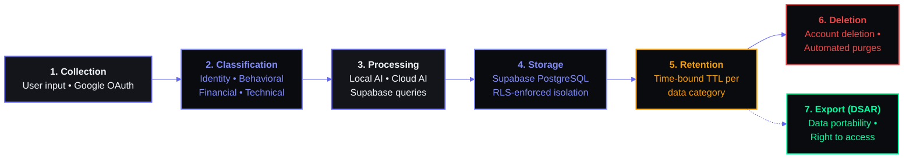

# Data Privacy & GDPR Compliance Document

## Document Control

| Property | Details |
|---|---|
| **Document ID** | SEC-DPR-001 |
| **Document Name** | Data Privacy & GDPR Compliance |
| **Version** | 1.0 |
| **Status** | Draft |
| **Author** | Data Protection Team |
| **Owner** | Data Protection Officer (DPO) |
| **Classification** | Restricted |
| **Last Updated** | 2026-06-11 |
| **Next Review** | 2026-09-11 |
| **Approved By** | [DPO Name] |
| **Related Documents** | SEC-040 Incident Response Plan, SEC-042 Access Control Policy, SEC-044 Data Retention Policy, PRD-001 Product Requirements |

---



## 1. Executive Summary

### 1.1 Purpose

This document defines the data privacy framework, GDPR compliance posture, and DPDP Act 2023 compliance measures for **Second Brain OS (ARIA OS)** — a personal AI productivity system designed for individual users (BTech CSE students). It establishes policies, procedures, and technical controls to protect user personal data across all system components.

### 1.2 Scope

This policy covers all personal data collected, stored, processed, and transmitted by Second Brain OS, including:

- **Identity & Authentication**: name, email, avatar, session tokens
- **Productivity Data**: tasks, habits, goals, projects, courses, time entries
- **Financial Data**: income entries, hourly rates
- **Behavioral Data**: sleep logs, habit streaks, time tracking patterns
- **Creative Data**: ideas, resources, opportunities
- **Communication Data**: AI chat messages, email correspondence
- **Technical Data**: IP addresses, user agent, browser fingerprints

The scope encompasses all system components: Next.js frontend (Vercel), FastAPI backend (Railway), Supabase database, Ollama local AI, Claude API (Anthropic), and Resend email service.

### 1.3 Applicable Regulations

| Regulation | Jurisdiction | Applicability |
|---|---|---|
| **GDPR (General Data Protection Regulation)** | European Union | Applies to any EU/EEA user who accesses the system |
| **DPDP Act 2023 (Digital Personal Data Protection Act)** | India | Applies as the developer is an Indian resident (BTech CSE student); data principals are Indian citizens |
| **IT Act 2000 (amended)** | India | Supplemental data protection and cybersecurity requirements |
| **DPDP Rules 2025 (draft)** | India | Emerging compliance requirements for digital platforms |

### 1.4 Data Protection Philosophy

Second Brain OS operates on a **data minimization** and **privacy-by-default** philosophy:

1. **User-owned**: All data belongs to the user. The system is a tool, not a data aggregator.
2. **Local-first**: AI processing defaults to local Ollama models where possible, minimizing data exposure to external APIs.
3. **Opt-in cloud AI**: Cloud AI features (Claude API) require explicit, revocable user consent.
4. **Transparency**: Every data flow is documented. Users are informed what data is collected, why, and with whom it is shared.
5. **Minimal retention**: Data is retained only as long as necessary for the stated purpose. Automatic deletion schedules are enforced.
6. **Access control**: Row-Level Security ensures users can only access their own data. No shared tenancy leakage.

---

## 2. Data Inventory & Classification

### 2.1 Data Inventory Table

| Data Category | Specific Fields | Source | Storage Location | Retention Period | Purpose | Legal Basis |
|---|---|---|---|---|---|---|
| **Identity Data** | Full name, email address, avatar URL | Google OAuth | Supabase `users` table | Until account deletion | User identification, profile display, email communication | Contract (service delivery) |
| **Authentication Data** | Session tokens, refresh tokens, OAuth provider ID | Supabase Auth, Google OAuth | Supabase Auth (`auth.users`) | Until token expiry or account deletion | Authentication, session management | Contract (service delivery) |
| **Tasks** | Title, description, due date, priority, status, tags, category, recurrence | User input (frontend) | Supabase `tasks` table | Completed + 90 days active, archived 1 year, then deleted | Productivity management | Contract (core service) |
| **Habits** | Habit name, frequency, streak count, reminders, start date | User input (frontend) | Supabase `habits` table | Current + 1 year, then deleted | Habit tracking | Contract (core service) |
| **Habit Logs** | Date, completion status, notes | User input (frontend) | Supabase habits linked logs | 1 year, then deleted | Habit completion history | Contract (core service) |
| **Goals** | Title, description, target date, progress, milestones | User input (frontend) | Supabase `goals` table | Until completion + 1 year, then deleted | Goal tracking | Contract (core service) |
| **Projects** | Name, description, status, timeline, links | User input (frontend) | Supabase `projects` table | Until completion + 1 year, then deleted | Project management | Contract (core service) |
| **Courses** | Course name, provider, progress, notes, resources | User input (frontend) | Supabase `courses` table | Until completion + 1 year, then deleted | Course tracking | Contract (core service) |
| **Income Entries** | Amount, date, source, description, hourly rate | User input (frontend) | Supabase `income` table | Current + 7 years (tax compliance), then deleted | Financial tracking, tax records | Legal obligation (Indian income tax) |
| **Time Entries** | Start time, end time, duration, task/project link | User input (frontend) | Supabase `time_entries` table | 2 years, then deleted | Time tracking analytics | Contract (core service) |
| **Sleep Logs** | Sleep time, wake time, duration, quality rating, notes | User input (frontend) | Supabase `sleep_logs` table | Current + 1 year, then deleted | Sleep pattern analysis | Contract (core service) |
| **Ideas** | Title, description, tags, status | User input (frontend) | Supabase `ideas` table | Until archived + 1 year, then deleted | Idea management | Contract (core service) |
| **Resources** | URL, title, description, tags, category | User input (frontend) | Supabase `resources` table | Indefinite (until user deletes) | Resource bookmarking | Contract (core service) |
| **Opportunities** | Title, description, source, status, deadline | User input or auto-detected (Opportunity Radar) | Supabase `opportunities` table | Until archived + 1 year, then deleted | Opportunity tracking | Consent (AI feature) |
| **Chat Messages** | User message, AI response, timestamp, session ID | User input (frontend), AI response (Claude/Ollama) | Supabase `chat_messages` table | Last 500 messages active; full history archived 5 years | AI assistant conversation | Consent (AI feature opt-in) |
| **Briefings** | Generated daily/weekly summary of tasks, habits, sleep | AI agent (Claude/Ollama) | Supabase `briefings` table | 90 days, then deleted | Automated productivity briefing | Consent (AI feature opt-in) |
| **Analytics** | Page views, feature usage, click events, session duration | Frontend telemetry | Supabase `analytics_events` table | 12 months (aggregated), 30 days (raw) | Product improvement | Legitimate interest |
| **Technical Data** | IP address, user agent string, browser name/version, operating system | HTTP request headers | Supabase `analytics_events` + server logs | 30 days | Security monitoring, rate limiting, debugging | Legitimate interest |
| **Email Communications** | Email address, email content, delivery status | System (via Resend) | Resend logs + Supabase `email_logs` table | 90 days | Notification delivery | Consent (notification opt-in) |

### 2.2 Data Classification

| Classification | Definition | Examples | Handling Requirements |
|---|---|---|---|
| **Public** | Non-sensitive, intended to be visible to anyone | None — all data is private by design | Standard encryption at rest and in transit |
| **Internal** | General operational data not attributed to specific users | Feature flags, app configuration settings, deployment status | Access controlled via developer authentication; standard encryption |
| **Confidential** | User's personal productivity data that identifies patterns or habits | Tasks, habits, goals, projects, courses, ideas, resources, time entries | Encryption at rest + in transit; Row-Level Security (RLS); access limited to user and system |
| **Restricted** | Highly sensitive personal data that could cause harm if disclosed | Income entries, sleep logs, chat messages, AI briefings, authentication tokens | Encryption at rest + in transit; RLS; strict access control; minimal retention; AI processing requires explicit opt-in |

### 2.3 Data Flow Diagram

```
┌─────────────────────────────────────────────────────────────────────────────┐
│                           DATA FLOW DIAGRAM                                 │
│                           Second Brain OS                                   │
└─────────────────────────────────────────────────────────────────────────────┘

  USER (Browser/Mobile)
        │
        │  HTTPS/TLS 1.3
        â–¼
┌───────────────────┐         ┌───────────────────┐
│                   │         │                   │
│   VERCEL (CDN)    │ ──────► │  NEXT.JS APP      │
│   Frontend Host   │         │  (React 18)       │
│                   │         │                   │
└───────────────────┘         └────────┬──────────┘
                                       │
                                       │  HTTPS/TLS 1.3
                                       â–¼
┌──────────────────────────────────────────────────────────────────────────────┐
│                                                                              │
│                        FASTAPI BACKEND (Railway)                             │
│                                                                              │
│  ┌─────────────┐  ┌─────────────┐  ┌─────────────┐  ┌──────────────────┐   │
│  │ Auth Routes │  │ API Routes  │  │ AI Clients  │  │ Email Service    │   │
│  │ /auth/*     │  │ /api/*      │  │ /ai/*       │  │ /email/*         │   │
│  └─────────────┘  └─────────────┘  └──────┬──────┘  └────────┬─────────┘   │
│                                           │                   │             │
│              ┌────────────────────────────┘                   │             │
│              ▼                                                ▼             │
│    ┌──────────────────┐                              ┌──────────────┐      │
│    │ OLLAMA (Local)   │                              │ RESEND API   │      │
│    │ Local AI Model   │                              │ Email Delivery│      │
│    │ No data retained │                              │ Logs 90 days │      │
│    └──────────────────┘                              └──────────────┘      │
│              │                                                             │
│              ▼                                                             │
│    ┌──────────────────┐                                                   │
│    │ CLAUDE API       │                                                   │
│    │ Anthropic Cloud  │                                                   │
│    │ Stores 30 days   │                                                   │
│    └──────────────────┘                                                   │
│                                                                              │
└──────────────────────────────┬───────────────────────────────────────────────┘
                               │
                               │  HTTPS/TLS 1.3
                               â–¼
┌──────────────────────────────────────────────────────────────────────────────┐
│                                                                              │
│                         SUPABASE (PostgreSQL)                                │
│                                                                              │
│  ┌──────────────┐  ┌──────────────┐  ┌──────────────┐  ┌───────────────┐   │
│  │  tasks       │  │  habits      │  │  goals       │  │  projects     │   │
│  ├──────────────┤  ├──────────────┤  ├──────────────┤  ├───────────────┤   │
│  │  courses     │  │  ideas       │  │  resources   │  │  opportunities│   │
│  ├──────────────┤  ├──────────────┤  ├──────────────┤  ├───────────────┤   │
│  │  income      │  │  sleep_logs  │  │ time_entries │  │  briefings    │   │
│  ├──────────────┤  ├──────────────┤  ├──────────────┤  ├───────────────┤   │
│  │ chat_messages│  │ users        │  │preferences   │  │email_logs     │   │
│  └──────────────┘  └──────────────┘  └──────────────┘  └───────────────┘   │
│                                                                              │
│  Security: Row-Level Security (RLS) enabled on all tables                   │
│  Encryption: AES-256 at rest, TLS 1.3 in transit                            │
│  Access: user_id filter on all queries                                      │
│                                                                              │
└──────────────────────────────────────────────────────────────────────────────┘

                              EXTERNAL INTEGRATIONS
┌──────────────────────────────────────────────────────────────────────────────┐
│                                                                              │
│  ┌──────────────┐  ┌──────────────┐  ┌──────────────┐  ┌────────────────┐  │
│  │ Google OAuth │  │ Claude API   │  │ Resend Email │  │ Ollama (local) │  │
│  │ Identity     │  │ AI Processing│  │ Notification │  │ AI Processing  │  │
│  │ Provider     │  │ Anthropic    │  │ Delivery     │  │ User Machine   │  │
│  └──────────────┘  └──────────────┘  └──────────────┘  └────────────────┘  │
│                                                                              │
└──────────────────────────────────────────────────────────────────────────────┘
```

---

## 3. GDPR Compliance

### 3.1 Applicable Rights

Second Brain OS enables all GDPR data subject rights as follows:

| GDPR Right | Article | Implementation | Mechanism |
|---|---|---|---|
| **Right to be informed** | Art. 13-14 | Privacy notice (Section 11, Appendix B) | Published privacy policy + in-app consent dialogs |
| **Right of access** | Art. 15 | Data export (JSON download) | Settings → Export My Data |
| **Right to rectification** | Art. 16 | Edit all user-created data | In-app edit forms for all data types |
| **Right to erasure** | Art. 17 | Account deletion | Settings → Delete Account → Confirm |
| **Right to restrict processing** | Art. 18 | Toggle AI features off | Settings → AI Features → Disable |
| **Right to data portability** | Art. 20 | Full JSON export | Settings → Export My Data → Download |
| **Right to object** | Art. 21 | Stop all data processing | Account deletion (complete opt-out) |
| **Rights related to automated decision-making** | Art. 22 | AI profiling notice | Disclosure: "AI generates briefings and recommendations based on your data" + opt-in |

#### 3.1.1 Right to be Informed

Users are informed at the point of data collection via:
- **Sign-up flow**: Privacy notice summary displayed during Google OAuth sign-in
- **AI opt-in dialog**: Clear disclosure of what data is sent to Claude API when user enables cloud AI
- **Privacy policy**: Full policy available at `/privacy` route
- **In-app notices**: Cookie/consent banner on first visit

#### 3.1.2 Right of Access

Users can access all their data at any time via:
1. In-app data viewer (browse all modules)
2. Settings → Export My Data (downloadable JSON)
3. DSAR request (email to dpo@secondbrainos.app for manual compilation)

#### 3.1.3 Right to Rectification

All user-created data is editable through the respective module UI:
- Tasks: Edit title, description, dates, priority, tags
- Habits: Edit name, frequency, reminders
- Goals/Projects: Edit all fields
- Profile: Edit name, avatar (via Google OAuth re-authentication)
- Chat messages: Cannot edit individual messages (append-only), but entire conversation can be deleted

#### 3.1.4 Right to Erasure

See Section 3.5 — Data Erasure / Right to be Forgotten.

#### 3.1.5 Right to Restrict Processing

Users can restrict specific processing activities:
- **AI Processing Toggle**: Disable cloud AI (Claude) → falls back to local Ollama or algorithmic responses
- **Analytics Opt-Out**: Disable usage analytics → only essential telemetry collected
- **Email Notifications Toggle**: Disable all non-essential email communications

When processing is restricted:
- AI features degrades to local-only or rule-based fallbacks
- Analytics collection stops for that user
- Core productivity features remain fully functional

#### 3.1.6 Right to Data Portability

See Section 3.6 — Data Portability.

#### 3.1.7 Right to Object

Users may object to any processing by:
1. Disabling specific features (AI, notifications, analytics)
2. Deleting their account entirely (complete objection to all processing)

If a user objects to core service processing (tasks, habits, etc.), account deletion is the only option as these are necessary for service delivery.

#### 3.1.8 Rights Related to Automated Decision-Making

The system uses AI for:
- **Daily briefings**: AI-generated summaries of tasks, habits, sleep patterns
- **Opportunity Radar**: AI-detected opportunities matching user skills/interests
- **AI Chat**: Conversational assistant

Disclosure: Users are informed that briefings and recommendations are AI-generated. No fully automated decisions with legal or similarly significant effects are made. Users may opt out of AI features entirely.

### 3.2 Lawful Basis for Processing

| Processing Activity | Data Categories | Lawful Basis | Explanation |
|---|---|---|---|
| Account creation & authentication | Identity, authentication | **Contract** (Art. 6(1)(b)) | Necessary to create and maintain user account |
| Task, habit, goal, project management | Productivity data | **Contract** (Art. 6(1)(b)) | Core service functionality user signed up for |
| Financial tracking | Income entries | **Contract** + **Legal obligation** (Art. 6(1)(c)) | Core service + Indian income tax retention requirements |
| Sleep tracking | Sleep logs | **Contract** (Art. 6(1)(b)) | Core service functionality |
| Time tracking | Time entries | **Contract** (Art. 6(1)(b)) | Core service functionality |
| Idea/project/resource management | Creative data | **Contract** (Art. 6(1)(b)) | Core service functionality |
| AI chat (local Ollama) | Chat messages | **Contract** (Art. 6(1)(b)) | Service feature; data stays local |
| AI chat (Claude API) | Chat messages | **Consent** (Art. 6(1)(a)) | Explicit opt-in required for cloud AI processing |
| AI briefings | Productivity + sleep data | **Consent** (Art. 6(1)(a)) | Explicit opt-in required |
| Opportunity Radar | Skills, interests, education | **Consent** (Art. 6(1)(a)) | Explicit opt-in required |
| Email notifications | Identity, communication | **Consent** (Art. 6(1)(a)) | Opt-in at sign-up; can withdraw anytime |
| Usage analytics | Technical, behavioral | **Legitimate interest** (Art. 6(1)(f)) | Product improvement, bug detection; minimal data, anonymized where possible |
| Security monitoring | Technical data | **Legitimate interest** (Art. 6(1)(f)) | Protecting system and users from abuse |
| Backup & disaster recovery | All data | **Legitimate interest** (Art. 6(1)(f)) | Ensuring service continuity and data integrity |

### 3.3 Consent Management

#### 3.3.1 How Consent is Obtained

| Consent Type | Collection Point | Mechanism | Granularity |
|---|---|---|---|
| AI processing (Claude API) | Settings → AI Features toggle | Explicit toggle switch + disclosure dialog | Per-user, can be toggled on/off at any time |
| AI briefings | Onboarding flow + Settings | Explicit checkbox + description of data used | Per-user |
| Opportunity Radar | Onboarding flow + Settings | Explicit checkbox | Per-user |
| Email notifications | Sign-up flow + Settings | Explicit checkbox (marketing); transactional emails are contract-necessary | Per notification type |
| Analytics | First visit banner + Settings | Opt-out toggle (implied consent) | Per-user |

#### 3.3.2 How Consent is Recorded

Consent preferences are stored in the `user_preferences` table in Supabase:

```json
{
  "user_id": "uuid",
  "ai_consent": {
    "claude_api": true,
    "briefings": false,
    "opportunity_radar": false,
    "consent_granted_at": "2026-01-15T10:30:00Z",
    "consent_version": "1.0"
  },
  "notification_preferences": {
    "email_digest": true,
    "task_reminders": true,
    "marketing": false
  },
  "analytics_opt_out": false
}
```

Each consent grant includes:
- Timestamp of consent
- Version of consent language
- Clear record of what was consented to

#### 3.3.3 How Consent is Withdrawn

Users can withdraw consent at any time via Settings page:

| Consent | Withdrawal Method | Immediate Effect |
|---|---|---|
| Claude API AI | Toggle OFF | Chat falls back to Ollama (local-only). No further data sent to Anthropic. |
| AI Briefings | Toggle OFF | Briefing generation stops. Existing briefings retained until auto-deletion. |
| Opportunity Radar | Toggle OFF | Scanning stops. Existing opportunities retained. |
| Email notifications | Toggle OFF | Non-essential emails cease within 24 hours. |
| Analytics | Toggle ON "Opt Out" | Analytics collection stops. Previously collected data retained for up to 30 days. |

#### 3.3.4 Consent Withdrawal Consequences

| Feature | Without Claude API Consent | Without Briefings Consent | Without Email Consent |
|---|---|---|---|
| AI Chat | Local-only (Ollama), reduced capability | Works normally | Works normally |
| Daily Briefings | Not generated | Not generated | Sent (if enabled via web) |
| Opportunity Radar | Not functional | Works normally | Not affected |
| Email Notifications | Not affected | Not affected | Stopped |
| Core Features (Tasks, Habits, etc.) | Full functionality | Full functionality | Full functionality |

### 3.4 Data Subject Access Request (DSAR) Procedure

#### 3.4.1 Procedure Overview

| Step | Owner | Timeline | Description |
|---|---|---|---|
| **1. Request Submission** | User | Day 0 | User submits DSAR via email (dpo@secondbrainos.app) or in-app request form (Settings → Privacy → Access My Data) |
| **2. Identity Verification** | Support Team | Day 0-1 | Send verification email to registered email address. User must click verification link. For email requests, request must come from registered email address. |
| **3. Request Logging** | Support Team | Day 1 | Log DSAR in tracking system with: request ID, user ID, submission date, requested data scope, verification status |
| **4. Data Compilation** | Engineering | Day 1-7 | Compile data package: (a) Supabase export via SQL query filtering by user_id; (b) Chat message export; (c) Analytics data export; (d) System logs related to user |
| **5. Review & Redaction** | Support Team | Day 7-10 | Review data package for: (a) any third-party data that must be redacted; (b) system data not attributable to user; (c) ensure completeness |
| **6. Delivery** | Support Team | Day 10-28 | Deliver via encrypted email attachment or secure download link (expires 14 days). Format: JSON or CSV (user's choice). |
| **7. Confirmation** | User | Day 28 | Request confirmation of receipt. Document closure. |

#### 3.4.2 DSAR Response Template

```
Subject: Response to Data Subject Access Request — [Request ID]
Date: [Response Date]
To: [User Email]

Dear [User Name],

We have processed your Data Subject Access Request received on [Request Date].

Please find attached your personal data collected and processed by Second Brain OS.

Contents of this package:
- Account & profile data
- Tasks, habits, goals, projects, courses
- Financial records (income entries)
- Sleep logs and time entries
- Ideas, resources, opportunities
- AI chat messages
- Usage analytics summary
- Technical logs (IP addresses, user agent)

Format: JSON
Request fulfillment date: [Date]
Next data update: [Date]

If you believe any data is missing or inaccurate, please reply to this email.

This request was fulfilled within 30 days as required by GDPR Article 15.

Best regards,
Data Protection Team
Second Brain OS
dpo@secondbrainos.app
```

#### 3.4.3 Timeline & SLA

- **GDPR**: Response within 30 days of verification (can extend to 60 days for complex requests)
- **DPDP Act 2023**: Response within 45 days of verification

### 3.5 Data Erasure / Right to be Forgotten

#### 3.5.1 Procedure

| Step | Owner | Timeline | Description |
|---|---|---|---|
| **1. Request Initiation** | User | Day 0 | User navigates to Settings → Delete Account. Reads warning about irreversible data loss. Confirms deletion. |
| **2. Identity Confirmation** | System | Day 0 | Send confirmation email with unique deletion link. User must click link within 24 hours. |
| **3. Grace Period** | System | Day 0-7 | 7-day grace period during which user can cancel deletion by clicking link in email. User can log in but cannot create new data. |
| **4. Data Deletion** | System | Day 7 | Automated deletion script runs: (a) Delete all rows where user_id = UUID from all data tables; (b) Delete auth user from Supabase Auth (`auth.users`); (c) Delete user preferences; (d) Anonymize analytics events (remove user_id, retain aggregated count). |
| **5. Confirmation** | System | Day 7 | Send deletion confirmation email. |
| **6. Residual Data Check** | Engineer | Day 30 | Verify no residual data remains in database backups. Backups are overwritten on 30-day rotation cycle. |

#### 3.5.2 Deletion Scope

| Data Type | Deleted | Anonymized | Retained (justified) |
|---|---|---|---|
| Tasks | ✅ Hard delete | — | — |
| Habits & logs | ✅ Hard delete | — | — |
| Goals | ✅ Hard delete | — | — |
| Projects | ✅ Hard delete | — | — |
| Courses | ✅ Hard delete | — | — |
| Income | ✅ Hard delete | — | — |
| Sleep logs | ✅ Hard delete | — | — |
| Time entries | ✅ Hard delete | — | — |
| Ideas | ✅ Hard delete | — | — |
| Resources | ✅ Hard delete | — | — |
| Opportunities | ✅ Hard delete | — | — |
| Chat messages | ✅ Hard delete | — | — |
| Briefings | ✅ Hard delete | — | — |
| Auth user | ✅ Delete from auth.users | — | — |
| Email logs | — | — | Retained 90 days (operational) |
| Analytics events | — | ✅ user_id removed | Aggregated counts for product analytics |
| Error logs | — | ✅ user_id removed | 30 days for debugging |
| Backups | — | — | Overwritten on 30-day cycle |

#### 3.5.3 Exceptions

Data erasure may be delayed or refused where:
- **Legal obligation**: Income records must be retained for 7 years under Indian income tax law
- **Ongoing investigation**: Data required for legal proceedings or fraud investigation
- **Contractual necessity**: Cannot erase data required to fulfill a contract with the user

#### 3.5.4 SQL Deletion Script (Reference)

```sql
-- Delete all user data across all tables
DELETE FROM tasks WHERE user_id = '{user_uuid}';
DELETE FROM habits WHERE user_id = '{user_uuid}';
DELETE FROM habit_logs WHERE user_id = '{user_uuid}';
DELETE FROM goals WHERE user_id = '{user_uuid}';
DELETE FROM projects WHERE user_id = '{user_uuid}';
DELETE FROM courses WHERE user_id = '{user_uuid}';
DELETE FROM income WHERE user_id = '{user_uuid}';
DELETE FROM sleep_logs WHERE user_id = '{user_uuid}';
DELETE FROM time_entries WHERE user_id = '{user_uuid}';
DELETE FROM ideas WHERE user_id = '{user_uuid}';
DELETE FROM resources WHERE user_id = '{user_uuid}';
DELETE FROM opportunities WHERE user_id = '{user_uuid}';
DELETE FROM chat_messages WHERE user_id = '{user_uuid}';
DELETE FROM briefings WHERE user_id = '{user_uuid}';
DELETE FROM user_preferences WHERE user_id = '{user_uuid}';

-- Anonymize analytics
UPDATE analytics_events
SET user_id = NULL, ip_address = NULL
WHERE user_id = '{user_uuid}';

-- Delete auth user (admin API)
-- supabase.auth.admin.deleteUser('{user_uuid}')
```

### 3.6 Data Portability

#### 3.6.1 Export Format

All exports are provided in **JSON** format (machine-readable, structured, commonly used).

#### 3.6.2 What's Included

| Data Category | Included | Notes |
|---|---|---|
| Profile data | ✅ | Name, email, avatar URL |
| Tasks | ✅ | All fields including timestamps |
| Habits + logs | ✅ | Habit definitions + all completion logs |
| Goals | ✅ | All fields including milestones |
| Projects | ✅ | All fields including links |
| Courses | ✅ | All fields including notes |
| Income entries | ✅ | All fields |
| Sleep logs | ✅ | All entries |
| Time entries | ✅ | All entries |
| Ideas | ✅ | All fields |
| Resources | ✅ | All fields |
| Opportunities | ✅ | All fields |
| Chat messages | ✅ | Full conversation history |
| Briefings | ✅ | All generated briefings |
| User preferences | ✅ | Settings, consent records |

#### 3.6.3 What's Excluded

| Data Category | Excluded | Reason |
|---|---|---|
| Authentication tokens | ✅ | Security — tokens are ephemeral and session-bound |
| Analytics events | ✅ | Aggregated/anonymized — cannot be attributed to user after export window |
| Error logs | ✅ | May contain system data not belonging to user |
| Application configuration | ✅ | System-level, not user-generated |
| Database metadata | ✅ | Internal IDs, foreign keys without user data |

#### 3.6.4 Delivery Method

- **Instant download**: Available immediately via Settings → Export My Data
- **Email delivery**: For large exports or DSAR requests, delivered as encrypted attachment
- **Secure link**: Download link with 14-day expiry, delivered via email

#### 3.6.5 Timeline

- **Self-service export**: Instant (available 24/7 via settings)
- **Manual DSAR export**: Within 30 days (GDPR) or 45 days (DPDP Act)

### 3.7 Breach Notification

#### 3.7.1 Notification Timeline

| Scenario | Notification To | Timeline | Regulation |
|---|---|---|---|
| Personal data breach (likely to result in risk to rights and freedoms) | Supervisory authority (DPC/DPBI) | Within 72 hours | GDPR Art. 33 |
| High-risk data breach | Affected users | Without undue delay | GDPR Art. 34 |
| Personal data breach | Data Protection Board of India | Within 72 hours | DPDP Act 2023 |
| Personal data breach | Affected data principals | Within 72 hours | DPDP Act 2023 |

#### 3.7.2 Notification Content

**To Supervisory Authority**:
1. Nature of the personal data breach including categories and approximate number of data subjects and records concerned
2. Name and contact details of the Data Protection Officer
3. Likely consequences of the personal data breach
4. Measures taken or proposed to address the breach and mitigate its effects

**To Affected Users**:
1. Description of the nature of the breach
2. Categories of data affected
3. Name and contact details of the Data Protection Officer
4. Description of likely consequences
5. Description of measures taken to address the breach
6. Recommendations to mitigate potential adverse effects

#### 3.7.3 Notification Method

| Method | Priority | Use Case |
|---|---|---|
| Email (via Resend) | Primary | All breach notifications to affected users |
| In-app banner | Secondary | Supplementary notification for active users |
| Website notice | Tertiary | Public disclosure for widespread breaches |
| Social media (Twitter/X) | Tertiary | Wide broadcast for significant breaches |

#### 3.7.4 Supervisory Authority

| Jurisdiction | Authority | Contact |
|---|---|---|
| European Union | Lead DPA (based on user location) | Via IMI system |
| Ireland (hosting if EU-based) | Data Protection Commission (DPC) | https://www.dataprotection.ie |
| India | Data Protection Board of India (DPBI) | https://www.meity.gov.in |

---

## 4. India DPDP Act 2023 Compliance

### 4.1 Key Requirements

| DPDP Act Requirement | Status | Implementation |
|---|---|---|
| **Consent Manager** | 🟡 Partial | Consent collected via UI toggles; formal consent manager (withdrawal, records) needed |
| **Data Fiduciary Responsibilities** | 🟢 Compliant | Developer acts as Data Fiduciary; all obligations documented in this policy |
| **Data Principal Rights** | 🟢 Compliant | All rights (access, correction, erasure, portability, grievance redressal) implemented |
| **Data Breach Notification** | 🟡 Partial | Procedure defined (Section 3.7); notification to DPBI needs final template |
| **Data Localization** | 🟢 Compliant | Supabase can be configured for Mumbai region (ap-south-1); data stored in India |
| **Children's Data** | 🟢 N/A | System is designed for adults 18+; no children's data collected |
| **Data Retention** | 🟡 Partial | Retention defined (Section 7); automated enforcement needed |
| **Grievance Redressal** | 🟡 Partial | DPO contact defined; formal grievance mechanism needs implementation |
| **Data Protection Impact Assessment** | 🔴 Missing | DPIA not yet conducted; template provided in Appendix F |
| **Data Fiduciary Registration** | 🟢 Compliant | Not required (fewer than 1 million users); monitor threshold |

### 4.2 Compliance Gap Analysis

| Requirement | Current Status | Action Needed | Priority | Target Date | Owner |
|---|---|---|---|---|---|
| Consent collection | 🟡 Partial (OAuth implicit) | Add explicit consent UI with granular preferences | **P1** | 2026-07-15 | Frontend |
| Privacy policy | 🔴 Missing (not published) | Create and publish privacy notice at /privacy | **P1** | 2026-07-01 | Legal |
| Data retention policy | 🟡 Defined but not enforced | Implement automated Supabase cron jobs for data deletion | **P1** | 2026-08-01 | Backend |
| Breach notification process | 🟡 Procedure defined | Implement automated notification system (email + in-app) | **P1** | 2026-08-15 | Backend |
| Grievance redressal mechanism | 🔴 Missing | Add grievance contact form in settings + auto-response | **P2** | 2026-09-01 | Frontend |
| Data Protection Impact Assessment | 🔴 Not conducted | Schedule and conduct DPIA | **P2** | 2026-09-30 | DPO |
| Consent manager dashboard | 🔴 Not implemented | Build consent management UI with withdrawal history | **P2** | 2026-10-01 | Frontend |
| Data fiduciary registration | 🟢 Not required | Monitor user count; register if >1M users | **P3** | Ongoing | Operations |
| DPDP Act privacy notice addendum | 🔴 Missing | Add India-specific disclosures to privacy policy | **P2** | 2026-07-15 | Legal |
| Data localization verification | 🟡 Supabase configured | Verify Supabase project region is India (ap-south-1) | **P2** | 2026-07-01 | Backend |

### 4.3 Data Principal Rights under DPDP Act 2023

| Right | Section | Implementation | Timeline |
|---|---|---|---|
| Right to access | Sec. 11 | Settings → Export My Data | Instant |
| Right to correction | Sec. 12 | Edit forms in all modules | Instant |
| Right to erasure | Sec. 13 | Settings → Delete Account | 7 days |
| Right to grievance redressal | Sec. 14 | Contact DPO via email | 45 days |
| Right to nominate | Sec. 15 | Not implemented (future feature) | Future |

### 4.4 Consent Manager Requirements

Under DPDP Act 2023, a consent manager must:
1. Enable data principals to give, manage, review, and withdraw consent
2. Be interoperable across platforms
3. Record consent in an auditable manner

**Implementation Plan**:
- Build a consent dashboard at Settings → Privacy → Consent Manager
- Display all active consents with grant dates and versions
- Provide one-click withdrawal
- Maintain audit log of consent changes

---

## 5. AI & Data Privacy

### 5.1 AI Data Processing

| AI Component | Data Sent | Data Stored | Duration | User Control |
|---|---|---|---|---|
| **Ollama (Local Model)** | User message text + conversation context | Nothing stored — runs entirely on user's local machine | N/A | Full control — operates locally, no network calls |
| **Claude API (Anthropic)** | User message text + conversation context + system instructions | Anthropic stores for 30 days (abuse monitoring); may train on non-API requests | 30 days (Anthropic) | Opt-in required — can be disabled at any time |
| **Briefing Agent** | Task data, habit data, sleep logs, goals (queried from DB) | Generated briefing text stored in Supabase `briefings` table | 90 days (auto-deleted) | Opt-in required — can disable briefing generation |
| **Opportunity Radar** | User skills, interests, enrolled courses, past projects (queried from DB) | Nothing stored in real-time — matches against opportunity database | Real-time only | Opt-in required — can disable scanning |
| **AI Chat History** | Full conversation (user messages + AI responses) | Stored in Supabase `chat_messages` table | Last 500 active; full history archived 5 years | User can delete individual conversations or full history |

### 5.2 AI Data Flow Details

#### 5.2.1 Claude API Flow

```
User types message in chat
        │
        â–¼
Frontend sends message to FastAPI /api/chat endpoint
        │
        â–¼
Backend retrieves conversation history (last N messages)
        │
        â–¼
Backend constructs message payload:
  {
    "model": "claude-3-opus-20240229",
    "messages": [...conversation_history..., user_message],
    "system": "You are a helpful AI assistant. [NO PERSONAL DATA IN SYSTEM PROMPT]"
  }
        │
        â–¼
Backend sends request to Anthropic Claude API (api.anthropic.com)
        │
        â–¼
Anthropic receives: message content + metadata (timestamps, message IDs)
Anthropic does NOT receive: user's real name, email, or other PII unless in message
        │
        â–¼
Backend receives response, stores user_message + assistant_message in Supabase
        │
        â–¼
Response sent to frontend, displayed to user
```

#### 5.2.2 Privacy Measures Implemented

| Measure | Implementation | Status |
|---|---|---|
| **No PII in system prompts** | System prompt contains no user-identifiable information; only behavioral context ("User has 3 incomplete tasks") | ✅ |
| **User control of history** | Users can delete individual messages or entire conversations | ✅ |
| **Local-first fallback** | If Claude API consent is withdrawn, chat falls back to Ollama (local model) | ✅ |
| **Data minimization** | Only the most recent N messages sent as context (configurable, default 20) | ✅ |
| **Opt-in required** | Claude API features disabled by default — user must explicitly enable | ✅ |
| **Clear disclosure** | "Your messages are sent to Anthropic (Claude) for AI processing" displayed in chat when cloud AI is active | ✅ |

### 5.3 Privacy Measures for AI

#### 5.3.1 Disclosure Requirements

All AI features include clear, contextual disclosure:

- **Cloud AI Chat**: Banner at top of chat: "AI responses are powered by Claude (Anthropic). Your messages are sent to Anthropic's servers for processing. [Privacy Info] [Disable]"
- **Briefing Agent**: Settings description: "Generate daily briefings using AI. Your task, habit, and sleep data will be processed by [Claude/Ollama]."
- **Opportunity Radar**: Settings description: "AI scans your skills and interests to find matching opportunities. Data is processed in real-time and not stored."

#### 5.3.2 Opt-In Mechanism

Cloud AI features are **opt-in only**:

```
┌──────────────────────────────────────────────────┐
│              Enable Cloud AI Features           │
│                                                  │
│  Enable Claude API for AI Chat                  │
│  Your messages will be sent to Anthropic's       │
│  servers. See [Privacy Policy] for details.     │
│                                                  │
│           [○] Off  ● On                         │
│                                                  │
│  Only enable if you consent to cloud AI          │
│  processing of your chat data.                   │
│                                                  │
│        [Learn More]   [Save Settings]            │
└──────────────────────────────────────────────────┘
```

#### 5.3.3 Data Deletion for AI

| Action | Effect |
|---|---|
| Delete single message | Removes message from Supabase; already sent to Claude cannot be recalled |
| Delete conversation | Removes all messages in conversation from Supabase |
| Delete all chat history | Removes all chat_messages for user |
| Disable Claude API | No new data sent to Anthropic; existing data retained in Supabase |
| Delete account | All chat data deleted per erasure procedure (Section 3.5) |

#### 5.3.4 Algorithmic Fallback

When AI features are disabled or unavailable, the system falls back to:
- **Chat**: Rule-based responses ("I'm currently in offline mode. Enable AI features for full responses.")
- **Briefings**: Template-based summaries (no AI generation)
- **Opportunity Radar**: Keyword-based matching (no AI analysis)

---

## 6. Data Security Measures

### 6.1 Technical Controls

| Control | Implementation | Status | Description |
|---|---|---|---|
| **Encryption at rest** | Supabase PostgreSQL (AES-256) | ✅ Built-in | All data stored on disk encrypted with AES-256. Supabase manages encryption keys. |
| **Encryption in transit** | HTTPS/TLS 1.3 (Vercel + Railway) | ✅ Built-in | All frontend-backend and backend-external API communications over TLS 1.3. |
| **Database encryption** | Supabase column-level encryption | 🟡 Partial | Additional encryption for highly sensitive fields (income amounts) using pgcrypto |
| **Access control** | Row-Level Security (RLS) | 🟡 Partial (not all tables enabled) | RLS policies must be enabled on ALL user-data tables; audit to verify |
| **Authentication** | Google OAuth 2.0 + JWT (Supabase Auth) | ✅ Implemented | All API requests authenticated via JWT bearer token |
| **Authorization** | `user_id` filter on all queries | ✅ Implemented | Every query includes `user_id = auth.uid()` filter |
| **API security** | Rate limiting (100 req/min/user) | ✅ Implemented | Rate limiter middleware in FastAPI; returns 429 on exceed |
| **Input validation** | Pydantic models (FastAPI) | ✅ Implemented | All request bodies validated against Pydantic schemas; strict type enforcement |
| **Secret management** | Environment variables (.env) | ✅ Implemented | All API keys, tokens, secrets stored in environment variables, not in code |
| **Audit logging** | Logger middleware | ✅ Implemented | Structured JSON logging for all API requests; log_request, log_response, log_error |
| **SQL injection protection** | Supabase SDK (parameterized queries) | ✅ Built-in | Supabase JavaScript/Python SDKs use parameterized queries; no raw SQL |
| **CORS** | Whitelist of allowed origins | ✅ Implemented | Only specific frontend URLs allowed to access API |
| **Session management** | HTTP-only cookies + short-lived JWTs | ✅ Implemented | Access tokens: 1 hour; Refresh tokens: 30 days |
| **DDoS protection** | Vercel + Railway built-in | ✅ Built-in | Platform-level DDoS protection at edge |

### 6.2 Organizational Controls

| Control | Implementation | Next Review |
|---|---|---|
| **Data protection training** | Self-study: GDPR (ICO training), DPDP Act (MeitY guidelines), OWASP Top 10 | 2026-09-30 |
| **Regular data review** | Quarterly review of data inventory, retention schedules, access logs | 2026-09-11 |
| **Incident response plan** | Documented in SEC-040 Incident Response Plan | 2026-09-11 |
| **Vendor due diligence** | All vendors reviewed: Supabase (SOC 2), Vercel (SOC 2), Railway (SOC 2 in progress), Anthropic (SOC 2), Resend (SOC 2) | 2026-12-31 |
| **Risk assessment** | Annual security risk assessment | 2026-12-31 |
| **Code review** | All changes reviewed before deployment | Ongoing |
| **Dependency scanning** | `npm audit` and `pip-audit` run in CI pipeline | Every deployment |

### 6.3 Row-Level Security (RLS) Policy Template

Every table in Supabase with user data must have an RLS policy:

```sql
-- Example RLS policy for tasks table
CREATE POLICY "Users can only access their own tasks"
ON tasks
FOR ALL
USING (auth.uid() = user_id)
WITH CHECK (auth.uid() = user_id);
```

**RLS Audit Checklist**:
- [ ] `tasks` — RLS enabled
- [ ] `habits` — RLS enabled
- [ ] `habit_logs` — RLS enabled
- [ ] `goals` — RLS enabled
- [ ] `projects` — RLS enabled
- [ ] `courses` — RLS enabled
- [ ] `income` — RLS enabled
- [ ] `sleep_logs` — RLS enabled
- [ ] `time_entries` — RLS enabled
- [ ] `ideas` — RLS enabled
- [ ] `resources` — RLS enabled
- [ ] `opportunities` — RLS enabled
- [ ] `chat_messages` — RLS enabled
- [ ] `briefings` — RLS enabled
- [ ] `user_preferences` — RLS enabled

---

## 7. Data Retention & Deletion Policy

### 7.1 Retention Schedule

| Data Type | Active Retention | Archive Retention | Total Retention | Deletion After | Legal Basis for Retention |
|---|---|---|---|---|---|
| **Tasks** | Until completed + 90 days | 1 year (archived) | 1 year + 90 days | 1 year post-completion | Service delivery |
| **Habits** | Current + 1 year | None | 1 year | 1 year post-last-edit | Service delivery |
| **Habit Logs** | Current + 1 year | None | 1 year | 1 year | Service delivery |
| **Goals** | Until completion + 1 year | None | 1 year post-completion | 1 year post-completion | Service delivery |
| **Projects** | Until completion + 1 year | None | 1 year post-completion | 1 year post-completion | Service delivery |
| **Courses** | Until completion + 1 year | None | 1 year post-completion | 1 year post-completion | Service delivery |
| **Income Entries** | Current + 7 years | None | 7 years | 7 years | Indian income tax law (Sec. 44AA, Rule 6F) |
| **Sleep Logs** | Current + 1 year | None | 1 year | 1 year | Service delivery |
| **Time Entries** | Current + 2 years | None | 2 years | 2 years | Service delivery |
| **Ideas** | Until archived + 1 year | None | 1 year post-archive | 1 year post-archive | Service delivery |
| **Resources** | Indefinite (until user deletes) | None | User-controlled | User deletion | Service delivery |
| **Opportunities** | Until archived + 1 year | None | 1 year post-archive | 1 year post-archive | Service delivery |
| **Chat Messages** | Last 500 messages (active) | Full history archived | 5 years | 5 years | User preference (consent) |
| **Briefings** | 90 days | None | 90 days | 90 days | Service delivery (consent) |
| **Session Data** | During active session | None | Session end | Session end | Authentication |
| **Analytics (raw)** | 30 days | None | 30 days | 30 days | Legitimate interest |
| **Analytics (aggregated)** | 12 months | Permanent (anonymized) | Indefinite (no PII) | Never (anonymized) | Legitimate interest |
| **Error Logs** | 30 days | None | 30 days | 30 days | Security operations |
| **Email Logs** | 90 days | None | 90 days | 90 days | Service delivery |
| **Authentication Tokens** | Until expiry | None | Token lifetime | Expiry | Authentication |
| **Database Backups** | 30 days (incremental) | None | 30 days | 30 days | Disaster recovery |

### 7.2 Deletion Procedure

#### 7.2.1 Automated Deletion (Cron Jobs)

Scheduled deletion via Supabase cron function or periodic Python script:

```python
# Pseudocode for automated data retention enforcement
def enforce_retention():
    """Run daily to delete expired data"""

    # Delete completed tasks older than 1 year + 90 days
    db.execute("""
        DELETE FROM tasks
        WHERE status = 'completed'
        AND completed_at < NOW() - INTERVAL '1 year 90 days'
    """)

    # Delete habit logs older than 1 year
    db.execute("""
        DELETE FROM habit_logs
        WHERE created_at < NOW() - INTERVAL '1 year'
    """)

    # Delete briefings older than 90 days
    db.execute("""
        DELETE FROM briefings
        WHERE created_at < NOW() - INTERVAL '90 days'
    """)

    # Delete raw analytics older than 30 days
    db.execute("""
        DELETE FROM analytics_events
        WHERE created_at < NOW() - INTERVAL '30 days'
    """)

    # Delete error logs older than 30 days
    db.execute("""
        DELETE FROM error_logs
        WHERE created_at < NOW() - INTERVAL '30 days'
    """)

    # Delete email logs older than 90 days
    db.execute("""
        DELETE FROM email_logs
        WHERE created_at < NOW() - INTERVAL '90 days'
    """)
```

#### 7.2.2 Manual Deletion (User-Initiated)

- **Individual data deletion**: User can delete individual items (tasks, habits, etc.) via UI
- **Conversation deletion**: User can delete entire chat conversations
- **Account deletion**: Complete erasure (see Section 3.5)

#### 7.2.3 Hard Delete vs Soft Delete

| Data Type | Deletion Method | Rationale |
|---|---|---|
| All user data (via account deletion) | **Hard delete** (`DELETE` SQL) | Privacy: no residual data accessible |
| Individual items (tasks, habits, etc.) | **Hard delete** (`DELETE` SQL) | User expectation of permanent deletion |
| Analytics events | **Hard delete** after 30 days | Retention schedule |
| Backups | **Hard delete** on 30-day rotation | Automatic overwrite |
| Chat messages | **Hard delete** (individual or bulk) | User expectation |

**No soft delete** is used for any user data. Soft delete (e.g., `deleted_at` column) creates unnecessary privacy risk.

#### 7.2.4 Confirmation Process

After any deletion:
1. User receives success message in-app
2. For account deletion: confirmation email sent
3. No data recovery possible after deletion

---

## 8. Third-Party Data Processors

### 8.1 Processor List

| Processor | Service Provided | Data Accessed | Processing Location | Data Protection | Security Certification | DPA Status |
|---|---|---|---|---|---|---|
| **Supabase** | Database (PostgreSQL), Authentication, Storage | All user data (tasks, habits, income, chat, etc.) | US (us-east-1) or EU (eu-west-1) or India (ap-south-1) | DPA in place, encryption at rest (AES-256), RLS | SOC 2 Type II, ISO 27001, GDPR compliance | Available at supabase.com/dpa |
| **Vercel** | Frontend hosting (Next.js), Edge Network | IP address, user agent, request metadata | Global edge network (100+ locations) | DPA in place, TLS 1.3, WAF | SOC 2 Type II, ISO 27001, GDPR compliance | Available at vercel.com/dpa |
| **Railway** | Backend hosting (FastAPI) | Transient API request data, environment variables | US (us-west-1) | DPA available upon request | SOC 2 Type II (planned 2026) | Available upon request |
| **Anthropic (Claude)** | AI processing (chat, briefings) | Chat messages, conversation context | US | DPA in place, 30-day data retention | SOC 2 Type II, GDPR compliance | Available at anthropic.com/dpa |
| **Resend** | Email delivery (notifications) | Email address, email content, delivery metadata | US (us-east-1) | DPA in place, encryption in transit | SOC 2 Type II, GDPR compliance | Available at resend.com/dpa |
| **Google (OAuth)** | Authentication (OAuth 2.0) | Email address, name, avatar URL | Global | DPA in place (Google Workspace) | SOC 2 Type II, ISO 27001, GDPR compliance | Available at cloud.google.com/dpa |

### 8.2 Data Processing Agreements (DPAs)

| Processor | DPA Status | Key Provisions |
|---|---|---|
| **Supabase** | ✅ Executed | Scope: database hosting, auth; duration: until account termination; data types: all user data; security measures: encryption, access controls; sub-processors: AWS |
| **Vercel** | ✅ Executed | Scope: frontend hosting, CDN; duration: service term; data types: request metadata; security measures: TLS, WAF; sub-processors: AWS, Cloudflare |
| **Railway** | 🟡 Requested | Scope: backend hosting; duration: service term; data types: transient API data; security measures: encryption, network isolation; sub-processors: AWS |
| **Anthropic** | ✅ Executed | Scope: AI processing; duration: 30-day retention; data types: chat messages; security measures: encryption, access control; sub-processors: AWS |
| **Resend** | ✅ Executed | Scope: email delivery; duration: 90-day retention; data types: email content/address; security measures: encryption; sub-processors: AWS |
| **Google** | ✅ Executed (Google Workspace) | Scope: identity verification; duration: OAuth session; data types: name, email, avatar; security measures: Google's security infrastructure; sub-processors: global Google infrastructure |

### 8.3 Sub-Processor List

| Main Processor | Sub-Processor | Service | Location |
|---|---|---|---|
| Supabase | AWS (Amazon Web Services) | Cloud infrastructure | US, EU, APAC (region-configurable) |
| Vercel | AWS, Cloudflare | Edge network, CDN | Global |
| Railway | AWS | Cloud infrastructure | US (us-west-2) |
| Anthropic | AWS, Google Cloud | Cloud infrastructure | US |
| Resend | AWS | Cloud infrastructure | US |
| Google | — | Internal infrastructure | Global |

### 8.4 Vendor Assessment Checklist

Each new third-party processor is assessed against:
1. **Data protection**: Do they have a published DPA? SOC 2 report?
2. **Data minimization**: Do they need all the data we're sending?
3. **Data retention**: What is their data retention policy?
4. **Security certifications**: SOC 2, ISO 27001, PCI-DSS?
5. **Sub-processors**: Who do they share data with?
6. **Jurisdiction**: Where is data processed? Adequacy decision?
7. **Breach notification**: Do they notify within 72 hours?
8. **Right to audit**: Is contractual audit possible?

---

## 9. Privacy by Design

### 9.1 Principles Applied

| Principle | Application in Second Brain OS | Evidence |
|---|---|---|
| **Data minimization** | Only essential fields collected; no mandatory fields beyond email/name (via OAuth) | Schema review: all tables have minimum required columns |
| **Purpose limitation** | Each data field has documented purpose (Section 2.1); no secondary use without consent | Data inventory table |
| **Storage limitation** | Retention schedules enforced (Section 7.1); auto-deletion cron jobs | Retention policy + cron scripts |
| **Accuracy** | All user data is editable via UI; user controls their own data | Edit forms in all modules |
| **Integrity & confidentiality** | RLS on all tables; encryption at rest and in transit; access controls | RLS policies, TLS 1.3, AES-256 |
| **Accountability** | Documented procedures; DPO contact; audit logging | This document, logger middleware |
| **Transparency** | Published privacy policy; in-context disclosures for AI features | Disclosure banners |
| **User control** | Granular consent toggles; data export; account deletion | Settings page |

### 9.2 Privacy by Default

| Feature | Default Setting | Rationale |
|---|---|---|
| **Cloud AI (Claude API)** | **OFF** | User must explicitly opt-in to send data to Anthropic |
| **AI Briefings** | **OFF** | User must opt-in to AI processing of productivity data |
| **Opportunity Radar** | **OFF** | User must opt-in to skill scanning |
| **Email Notifications** | **OFF** (all non-essential) | Only essential account emails enabled by default |
| **Analytics Collection** | **ON** (minimal, essential) | Page views, feature usage; user can opt out entirely |
| **Data Sharing** | **NONE** | No data shared with third parties without explicit consent |
| **Data Export** | **Available** | Self-service export always available |
| **Session Recording** | **OFF** | No session recording or replay |

### 9.3 Privacy Features Implemented

| Feature | Location | Description |
|---|---|---|
| Consent toggles | Settings → Privacy | Granular control over AI, notifications, analytics |
| Data export | Settings → Export My Data | One-click JSON export of all user data |
| Account deletion | Settings → Delete Account | Complete self-service erasure |
| Chat history management | Chat UI → Settings | Delete individual messages or full conversations |
| AI disclosure banners | Chat UI, Briefing settings | Contextual notice when cloud AI is active |
| Privacy policy | /privacy route | Full disclosure of data practices |
| Cookie/consent banner | First visit | Notice of analytics collection |

### 9.4 Data Protection by Design Checklist

- [x] Data inventory created (Section 2.1)
- [x] Data classification defined (Section 2.2)
- [x] Retention schedule defined (Section 7.1)
- [x] Deletion procedure implemented (Section 7.2)
- [x] Access controls (RLS) in place (Section 6.1)
- [x] Encryption at rest and in transit (Section 6.1)
- [x] Consent management (Section 3.3)
- [x] DSAR procedure (Section 3.4)
- [x] Breach notification procedure (Section 3.7)
- [x] Privacy policy (Appendix B)
- [x] Third-party processor assessment (Section 8)

---

## 10. Incident Response for Data Breach

### 10.1 Breach Response Procedure

| Phase | Step | Owner | Timeline | Actions |
|---|---|---|---|---|
| **1. Detection** | 1.1 Identify breach | Engineering | Immediate | Monitor alerts from: Supabase audit logs, Vercel/ Railway monitoring, error rate spikes, user reports of unauthorized access |
| | 1.2 Classify severity | Security Lead | < 1 hour | **Low**: Single user, non-sensitive data; **Medium**: Multiple users, non-sensitive; **High**: Sensitive data exposed; **Critical**: Widespread, financial/PII data |
| **2. Containment** | 2.1 Isolate affected systems | Engineering | < 1 hour | Revoke compromised keys; rotate secrets; block malicious IPs; scale down compromised instances |
| | 2.2 Preserve evidence | Engineering | < 2 hours | Snapshot logs; capture system state; preserve forensic evidence without destroying data |
| **3. Assessment** | 3.1 Determine scope | Security Lead | < 4 hours | What data was accessed? How many users affected? What systems compromised? Is data exfiltrated? |
| | 3.2 Legal assessment | DPO | < 6 hours | Does it meet breach notification threshold? Which regulations apply? |
| **4. Notification** | 4.1 Internal escalation | Security Lead | < 2 hours | Notify: DPO, Engineering Lead, Founder. Set up incident channel. |
| | 4.2 Regulatory notification | DPO | < 72 hours (GDPR/DPDP) | Notify supervisory authority (DPC or DPBI) with breach details |
| | 4.3 User notification | DPO | Without undue delay | For high-risk breaches: notify affected users (see 10.2) |
| **5. Investigation** | 5.1 Root cause analysis | Engineering | < 7 days | Identify vulnerability or failure that caused breach; determine if active exploitation continues |
| | 5.2 Data recovery | Engineering | < 7 days | Restore from clean backup if needed; assess data integrity |
| **6. Remediation** | 6.1 Fix vulnerability | Engineering | < 14 days | Patch, update, reconfigure, or rebuild affected systems |
| | 6.2 Improve detection | Engineering | < 14 days | Add monitoring alerts, logging, or WAF rules to prevent recurrence |
| **7. Post-Mortem** | 7.1 Incident report | Security Lead | < 30 days | Document: timeline, scope, impact, root cause, remediation, lessons learned |
| | 7.2 Prevention plan | All | < 30 days | Implement additional controls identified in post-mortem |

### 10.2 Severity Classification

| Severity | Definition | Examples | Response | Notification |
|---|---|---|---|---|
| **Low** | Single user, non-sensitive data exposed | User accidentally accessed by another user (RLS bypass failed but caught) | Investigate, fix RLS policy | Log only; no user/regulatory notification |
| **Medium** | Multiple users, non-sensitive data; or single user, sensitive data | Chat messages exposed for one user; task list exposed for multiple users | Contain, fix, document | Notify affected users; no regulatory notification unless required |
| **High** | Sensitive data for multiple users exposed | Income data or chat history for multiple users leaked | Contain, fix, notify | Notify affected users + supervisory authority |
| **Critical** | Widespread data exposure; authentication compromise | Database dump; auth token leak; full system compromise | Emergency response, system shutdown, full investigation | Notify all users + supervisory authority + public disclosure |

### 10.3 Notification Templates

#### 10.3.1 User Breach Notification Template

```
Subject: Security Incident — Second Brain OS — Action Required

Date: {date}
From: Second Brain OS Security Team <security@secondbrainos.app>

Dear {user_name},

We are writing to inform you of a security incident that may have affected your
account on Second Brain OS.

━━━━━━━━━━━━━━━━━━━━━━━━━━━━━━━
WHAT HAPPENED
━━━━━━━━━━━━━━━━━━━━━━━━━━━━━━━

On {incident_date}, we detected {brief description of incident}. Our investigation
indicates that {what was accessed} may have been accessed without authorization.

━━━━━━━━━━━━━━━━━━━━━━━━━━━━━━━
WHAT DATA WAS IMPACTED
━━━━━━━━━━━━━━━━━━━━━━━━━━━━━━━

Based on our investigation, the following data may have been affected:
• {list data categories affected}

We have no evidence that your {passwords / financial information / specific data
type not stored} was compromised, as {explanation of protection}.

━━━━━━━━━━━━━━━━━━━━━━━━━━━━━━━
WHAT WE HAVE DONE
━━━━━━━━━━━━━━━━━━━━━━━━━━━━━━━

• {Action 1: e.g., Revoked compromised access tokens}
• {Action 2: e.g., Patched the vulnerability}
• {Action 3: e.g., Engaged security researchers}
• {Action 4: e.g., Notified relevant authorities}

━━━━━━━━━━━━━━━━━━━━━━━━━━━━━━━
WHAT YOU SHOULD DO
━━━━━━━━━━━━━━━━━━━━━━━━━━━━━━━

• {Recommendation 1: e.g., Change your Google account password}
• {Recommendation 2: e.g., Review recent account activity}
• {Recommendation 3: e.g., Enable two-factor authentication on Google}
• {Recommendation 4: e.g., Be cautious of phishing attempts}

━━━━━━━━━━━━━━━━━━━━━━━━━━━━━━━
CONTACT
━━━━━━━━━━━━━━━━━━━━━━━━━━━━━━━

If you have questions or concerns, please contact:
• Email: dpo@secondbrainos.app
• Response time: Within 24 hours

We take your privacy and security seriously. We apologize for this incident and
are working to prevent it from happening again.

Sincerely,
Data Protection Team
Second Brain OS
```

#### 10.3.2 Regulatory Notification Template

```
Subject: Personal Data Breach Notification — Second Brain OS
Date: {date}
To: {Supervisory Authority}

Pursuant to Article 33 of the GDPR / Section 8(6) of the DPDP Act 2023,
we hereby notify you of a personal data breach.

1. CONTACT INFORMATION
   Data Controller: Second Brain OS (Developer: [Name], [Address])
   DPO: [DPO Name], dpo@secondbrainos.app, [Phone]

2. NATURE OF THE BREACH
   • Date of breach: {date}
   • Date of discovery: {date}
   • Nature: {description}
   • Category of data subjects: {users affected}
   • Approximate number of data subjects: {count}
   • Approximate number of records: {count}
   • Categories of data: {list}

3. LIKELY CONSEQUENCES
   • {consequence 1}
   • {consequence 2}

4. MEASURES TAKEN
   • {measure 1}
   • {measure 2}
   • {measure 3}

5. RECOMMENDATIONS
   • {recommendation for affected users}

This notification is being made within 72 hours of becoming aware of the breach.

Sincerely,
[DPO Name]
Data Protection Officer
Second Brain OS
```

---

## 11. Appendices

### Appendix A: Full Data Inventory Table

(See Section 2.1 — Data Inventory Table above for the complete inventory.)

### Appendix B: Privacy Notice Template

```
# Privacy Notice — Second Brain OS

**Last Updated:** {date}
**Version:** 1.0

## 1. Who We Are

Second Brain OS (ARIA OS) is a personal AI productivity system developed by
{Developer Name}, a BTech CSE student based in India.

**Data Protection Officer:** {DPO Name}
**Contact:** dpo@secondbrainos.app

## 2. What Data We Collect

We collect the following categories of personal data:

| Category | Data | Purpose |
|---|---|---|
| Identity | Name, email, avatar | Account creation, communication |
| Productivity | Tasks, habits, goals, projects | Core service functionality |
| Financial | Income entries, rates | Financial tracking |
| Behavioral | Sleep logs, time entries | Pattern analysis |
| Creative | Ideas, resources | Idea management |
| Communication | Chat messages | AI assistant |
| Technical | IP address, browser | Security, analytics |

## 3. How We Use Your Data

• To provide and maintain the service
• To improve the service (anonymized analytics)
• With your consent: AI processing via Claude API
• To send notifications (with your consent)

## 4. Legal Basis

We process your data under:
• **Contract**: Core service features (tasks, habits, etc.)
• **Consent**: AI features, notifications
• **Legitimate interest**: Analytics, security
• **Legal obligation**: Tax records (income)

## 5. Who We Share Data With

See our full list of data processors at {link to processor list}.

## 6. Your Rights

You have the right to:
• Access your data (Settings → Export)
• Correct your data (edit forms)
• Delete your data (Settings → Delete Account)
• Restrict processing (disable AI features)
• Port your data (JSON export)
• Object to processing
• Withdraw consent at any time

## 7. Data Retention

Data is retained per schedule in our Data Retention Policy.
Generally: productivity data retained 1-2 years, income retained 7 years (tax),
chat messages retained 5 years.

## 8. International Transfers

Your data may be processed in the US or EU by our third-party processors
(Supabase, Vercel, Anthropic, Resend). We ensure appropriate safeguards
via Standard Contractual Clauses (SCCs) and Data Processing Agreements.

## 9. Contact

**DPO:** dpo@secondbrainos.app
**Grievance Officer:** {Name}, grievances@secondbrainos.app
**Response time:** Within 24 hours for queries; 45 days for grievances.

## 10. Changes to This Notice

We will notify you of material changes via email or in-app notice.
```

### Appendix C: Consent Form Template

```
┌──────────────────────────────────────────────────────────────────────┐
│                    CONSENT FORM — AI PROCESSING                      │
│                        Second Brain OS                              │
├──────────────────────────────────────────────────────────────────────┤
│                                                                      │
│  FEATURE: Cloud AI Chat (Claude by Anthropic)                        │
│                                                                      │
│  I consent to Second Brain OS sending my chat messages and           │
│  conversation context to Anthropic (Claude API) for AI processing.   │
│                                                                      │
│  I understand that:                                                  │
│  ☐ My messages will be processed by Anthropic in the US              │
│  ☐ Anthropic retains messages for 30 days (abuse monitoring)         │
│  ☐ I can withdraw consent at any time via Settings                   │
│  ☐ Withdrawal will not affect core service functionality            │
│  ☐ My data will not be used for model training (API-only usage)     │
│                                                                      │
│  [  ] I CONSENT to cloud AI processing of my chat messages           │
│  [  ] I DO NOT CONSENT (local-only AI processing)                   │
│                                                                      │
│  ──────────────────────────────────────────────────────────────      │
│  User: {name} ({email})                                             │
│  Date: {date}                                                        │
│  Consent Version: 1.0                                                │
│                                                                      │
└──────────────────────────────────────────────────────────────────────┘
```

### Appendix D: DSAR Request Form Template

```
┌──────────────────────────────────────────────────────────────────────┐
│            DATA SUBJECT ACCESS REQUEST (DSAR) FORM                   │
│                        Second Brain OS                              │
├──────────────────────────────────────────────────────────────────────┤
│                                                                      │
│  Request Date: {date}                                                │
│                                                                      │
│  USER INFORMATION                                                    │
│  Full Name: {name}                                                   │
│  Email Address: {email} (must match registered email)                │
│  User ID (if known): {uuid}                                          │
│                                                                      │
│  REQUEST SCOPE                                                       │
│  I am requesting access to:                                          │
│  ☐ All my personal data                                              │
│  ☐ Specific categories (select below):                               │
│     ☐ Account & profile data                                         │
│     ☐ Tasks, habits, goals, projects, courses                        │
│     ☐ Financial records (income)                                     │
│     ☐ Sleep logs & time entries                                      │
│     ☐ Ideas, resources, opportunities                                │
│     ☐ AI chat messages                                               │
│     ☐ Usage analytics                                                │
│     ☐ Technical logs                                                 │
│                                                                      │
│  PREFERRED FORMAT                                                    │
│  ☐ JSON (machine-readable)                                           │
│  ☐ CSV (spreadsheet-compatible)                                      │
│  ☐ Both                                                              │
│                                                                      │
│  DELIVERY METHOD                                                     │
│  ☐ Encrypted email attachment                                        │
│  ☐ Secure download link                                              │
│                                                                      │
│  ──────────────────────────────────────────────────────────────      │
│  FOR OFFICIAL USE ONLY                                               │
│  Request ID: DSAR-{year}-{sequential}                                │
│  Verification Status: ☐ Verified ☐ Pending ☐ Failed                 │
│  Verification Date: {date}                                           │
│  Fulfillment Date: {date}                                            │
│  Data Package Size: {size}                                           │
│  Notes:                                                              │
│                                                                      │
└──────────────────────────────────────────────────────────────────────┘
```

### Appendix E: Data Erasure Request Form

```
┌──────────────────────────────────────────────────────────────────────┐
│                 DATA ERASURE REQUEST FORM                            │
│                        Second Brain OS                              │
├──────────────────────────────────────────────────────────────────────┤
│                                                                      │
│  Request Date: {date}                                                │
│                                                                      │
│  USER INFORMATION                                                    │
│  Full Name: {name}                                                   │
│  Email Address: {email} (must match registered email)                │
│  User ID (if known): {uuid}                                          │
│                                                                      │
│  ERASURE SCOPE                                                       │
│  I request erasure of:                                               │
│  ☐ My entire account and all associated data                         │
│  ☐ Specific data categories:                                         │
│     ☐ Chat messages only                                             │
│     ☐ Analytics data only                                            │
│     ☐ Financial data only (note: may be required for tax purposes)   │
│     ☐ {other: specify}                                               │
│                                                                      │
│  REASON FOR ERASURE                                                  │
│  ☐ Withdrawing consent                                               │
│  ☐ Objecting to processing                                           │
│  ☐ Data no longer needed                                             │
│  ☐ Other: {specify}                                                  │
│                                                                      │
│  ACKNOWLEDGMENT                                                      │
│  ☐ I understand that data erasure is permanent and irreversible      │
│  ☐ I understand that some data may be retained for legal/            │
│     compliance purposes (income records: 7 years, Indian tax law)    │
│  ☐ I understand that I will lose access to all features              │
│                                                                      │
│  Signature/Confirmation: {name}                                      │
│                                                                      │
│  ──────────────────────────────────────────────────────────────      │
│  FOR OFFICIAL USE ONLY                                               │
│  Request ID: ERASE-{year}-{sequential}                               │
│  Verification: ☐ Email sent ☐ Link clicked                          │
│  Grace Period End: {date + 7 days}                                   │
│  Deletion Executed: ☐ Yes ☐ No  Date: {date}                        │
│  Confirmation Sent: ☐ Yes ☐ No                                      │
│                                                                      │
└──────────────────────────────────────────────────────────────────────┘
```

### Appendix F: DPIA (Data Protection Impact Assessment) Template

```
┌──────────────────────────────────────────────────────────────────────┐
│            DATA PROTECTION IMPACT ASSESSMENT (DPIA)                  │
│                        Second Brain OS                              │
├──────────────────────────────────────────────────────────────────────┤
│                                                                      │
│  DPIA ID: DPIA-{year}-{sequential}                                   │
│  Assessment Date: {date}                                             │
│  Assessor: {name/role}                                               │
│  Review Date: {date + 1 year}                                        │
│                                                                      │
│  1. SYSTEM DESCRIPTION                                                │
│     Name: Second Brain OS (ARIA OS)                                  │
│     Type: Personal AI Productivity System                            │
│     Data Controller: {Developer Name}                                │
│     Data Processors: Supabase, Vercel, Railway, Anthropic, Resend    │
│                                                                      │
│  2. DATA PROCESSING DESCRIPTION                                      │
│     • What data: See Data Inventory (Section 2.1)                    │
│     • Why: Productivity management, AI assistance, analytics         │
│     • How: User input → Frontend → API → Database/AI                 │
│     • Where: Supabase (PostgreSQL), Anthropic (Claude), local model  │
│     • Retention: See Retention Schedule (Section 7.1)                │
│                                                                      │
│  3. NECESSITY & PROPORTIONALITY                                      │
│     • Is processing necessary for purpose? Yes                       │
│     • Can purpose be achieved with less data? Partially              │
│       (some analytics can be reduced, AI can be local-only)          │
│     • Are there less intrusive alternatives? Yes — local AI          │
│     • What safeguards are in place? RLS, encryption, consent         │
│                                                                      │
│  4. RISK ASSESSMENT                                                  │
│     Risk | Likelihood | Impact | Risk Level | Mitigation              │
│     ──────┼────────────┼────────┼───────────┼─────────────────────   │
│     Data breach | Low | High | Medium | RLS, encryption, monitoring  │
│     Unauthorized access | Low | High | Medium | Auth, RLS, audit     │
│     AI data exposure | Low | Medium | Low | Opt-in, disclosure       │
│     Data loss | Low | High | Medium | Backups, redundancy            │
│     Consent withdrawal complexity | Medium | Low | Low | Clear UI    │
│                                                                      │
│  5. RISK TREATMENT                                                   │
│     Accepted risks: Consent withdrawal complexity (mitigated by UI)  │
│     Mitigated risks: Breach, unauthorized access (controls in place) │
│     Transferred risks: AI processing (to Anthropic via DPA)          │
│     Avoided risks: No unnecessary data collection                    │
│                                                                      │
│  6. CONSULTATION                                                    │
│     • Is DPA consultation required? No (low-medium risk)             │
│     • Have data subjects been consulted? Via privacy notice          │
│                                                                      │
│  7. APPROVAL                                                        │
│     Assessor: {name} Date: {date}                                    │
│     DPO: {name} Date: {date}                                         │
│     Next Review: {date + 1 year}                                     │
│                                                                      │
└──────────────────────────────────────────────────────────────────────┘
```

### Appendix G: Third-Party Security Assessment Checklist

```
┌──────────────────────────────────────────────────────────────────────┐
│            THIRD-PARTY SECURITY ASSESSMENT CHECKLIST                 │
│                        Second Brain OS                              │
├──────────────────────────────────────────────────────────────────────┤
│                                                                      │
│  Vendor Name: ___________________  Assessment Date: ________________ │
│  Service: _______________________  Assessor: _______________________ │
│                                                                      │
│  ── DATA PROTECTION ──                                               │
│  ☐ Vendor has published DPA                                         │
│  ☐ DPA covers subcontractors                                        │
│  ☐ Data processing described in DPA matches our usage               │
│  ☐ Vendor provides data retention/deletion commitments              │
│  ☐ Vendor notifies within 72 hours of breach                        │
│  ☐ Vendor allows right to audit (contractual or third-party)        │
│                                                                      │
│  ── SECURITY CERTIFICATIONS ──                                       │
│  ☐ SOC 2 Type II (or equivalent)                                    │
│  ☐ ISO 27001 (or equivalent)                                        │
│  ☐ GDPR compliance statement                                        │
│  ☐ DPDP Act compliance (if India-based)                             │
│  ☐ Penetration testing conducted (annual)                           │
│                                                                      │
│  ── TECHNICAL CONTROLS ──                                            │
│  ☐ Encryption at rest (AES-256 or equivalent)                       │
│  ☐ Encryption in transit (TLS 1.2+)                                 │
│  ☐ Access controls (least privilege, MFA)                           │
│  ☐ Audit logging                                                    │
│  ☐ Incident response plan                                           │
│  ☐ Vulnerability management program                                 │
│  ☐ Data backup and disaster recovery                                │
│                                                                      │
│  ── DATA LOCALIZATION ──                                             │
│  ☐ Data processing location: ______________                         │
│  ☐ Sub-processor locations: _______________                         │
│  ☐ Data residency options available: ☐ Yes ☐ No                    │
│  ☐ Data export mechanisms (SCCs, adequacy decisions)                │
│                                                                      │
│  ── RISK RATING ──                                                   │
│  Overall Risk: ☐ Low ☐ Medium ☐ High ☐ Critical                     │
│  Notes: ___________________________________________________________ │
│  Approved by: _______________________ Date: _______________________ │
│                                                                      │
└──────────────────────────────────────────────────────────────────────┘
```

### Appendix H: Revision History

| Version | Date | Author | Changes | Approved By |
|---|---|---|---|---|
| 1.0 | 2026-06-11 | Data Protection Team | Initial document | [DPO Name] |
| — | — | — | — | — |
| — | — | — | — | — |

---

*This document is maintained by the Data Protection Team. For questions or concerns regarding data privacy, contact dpo@secondbrainos.app.*
