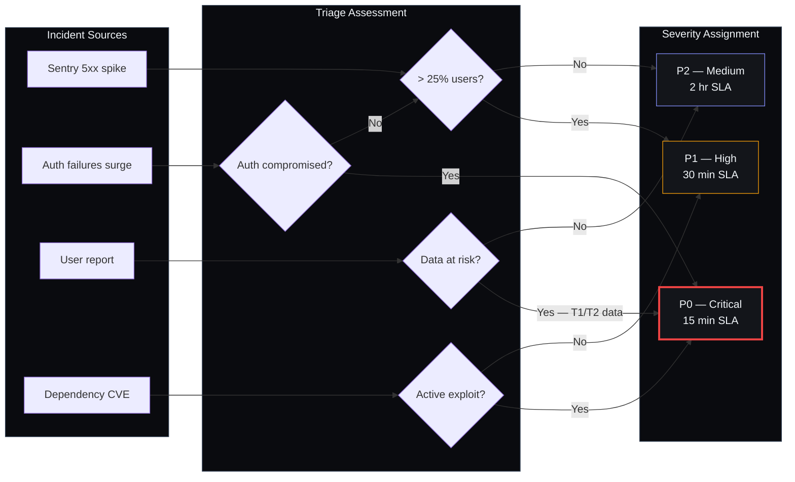
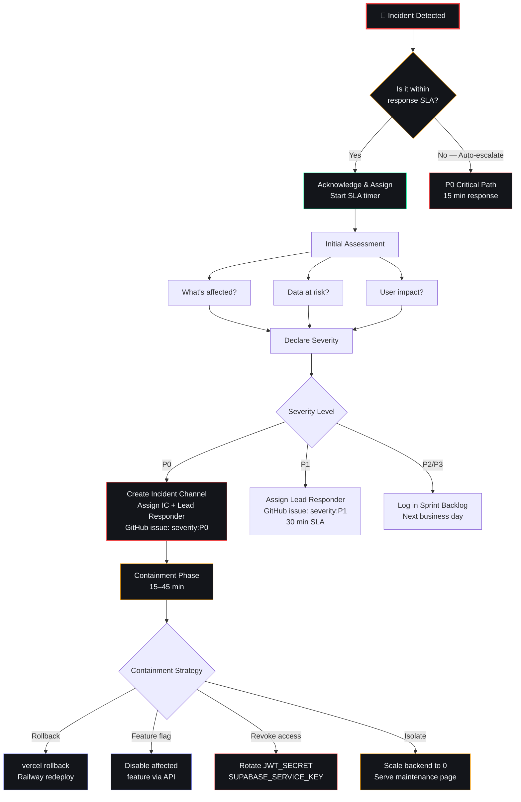

# Incident Response Playbook

## Document Control

| Field | Value |
|---|---|
| **Document ID** | SEC-IR-001 |
| **Version** | 1.0.0 |
| **Status** | Active |
| **Classification** | Restricted — Internal Only |
| **Last Updated** | 2026-07-11 |
| **Next Review** | 2026-10-11 |
| **Owner** | Developer (Staff Security Engineer) |
| **Approved By** | Developer |
| **Related Documents** | SEC-POLICY-DC-001 Data Classification, SEC-POLICY-VULN-001 Vulnerability Management, SEC-001 Security Architecture, COMP-SOC2-001, SEC-040 Incident Response Reference, VulnerabilityInventory.md |

---

## 1. Purpose and Scope

### 1.1 Purpose

This playbook defines the incident response (IR) process for Second Brain OS (ARIA OS). It provides step-by-step procedures for detecting, triaging, containing, eradicating, recovering from, and learning from security incidents of all severity levels.

### 1.2 Scope

This playbook covers security incidents affecting:

- The ARIA OS application stack (FastAPI backend, Next.js frontend, APScheduler)
- Data stored in Supabase (T1 Restricted, T2 Confidential)
- AI agent infrastructure (Ollama, Anthropic API)
- CI/CD pipeline and source code repository
- Third-party integrations (Vercel, Railway, Resend, Sentry)

---

## 2. Severity Matrix

| Level | Label | Definition | Response SLA | Fix SLA | Examples |
|---|---|---|---|---|---|
| **P0** | Critical | Complete service outage, data loss, active security breach, or confirmed T1/T2 data exfiltration | 15 min acknowledge | 1 hour fix | API down, DB corruption, auth subsystem broken, confirmed breach |
| **P1** | High | Major feature unavailable, degradation > 25% of users, suspected breach (unconfirmed), T2 data at risk | 30 min acknowledge | 4 hour fix | AI not responding, scheduler stopped, suspicious access pattern detected |
| **P2** | Medium | Partial feature degradation, < 25% of users affected, non-critical data exposure | 2 hour acknowledge | 24 hour fix | One module failing, slow responses, dependency vulnerability (no known exploit) |
| **P3** | Low | Non-critical bug, cosmetic issue, missing edge case, policy violation without data exposure | 24 hour acknowledge | Next sprint | UI glitch, typo in prompt, missing HTTP header |
| **P4** | Wishlist | Enhancement, tech debt, minor improvement, proactive security hardening | Next release | Next planning cycle | Performance optimization, refactor, additional test coverage |

### 2.1 SLA Definitions

| Metric | Definition |
|---|---|
| **Acknowledge** | Time from alert/report to incident responder confirming they are handling the incident |
| **Triage** | Time from acknowledge to severity assignment and initial containment decision |
| **Contain** | Time from triage to containment actions (rollback, feature flag, access revoke) |
| **Fix** | Time from containment to confirmed resolution deployed |
| **Postmortem** | Time from resolution to postmortem document submitted (P0/P1 only) |

---

## 3. Detection Sources

| Source | Description | Coverage | Escalation Path |
|---|---|---|---|
| **Sentry Error Tracking** | Automated alerts on 5xx errors, crash rates, unhandled exceptions | All API endpoints, frontend errors | P1 if > 5% error rate |
| **Structured Logging** | ERROR level logs in `packages/shared/utils/logger.py` with request IDs | All API requests | P1 if auth/authz errors spike |
| **Audit Trail** | `packages/shared/utils/audit.py` logs all CRUD operations on T2/T1 data | All data mutations | P2 if unauthorized access detected |
| **Supabase Dashboard** | Database CPU, connections, query performance monitoring | Supabase instance | P1 if resource exhaustion |
| **Vercel Dashboard** | Deployment status, edge function errors, build failures | Frontend deployment | P2 if build fails |
| **Railway Dashboard** | Backend health, resource usage, restart events | Backend deployment | P1 if service down |
| **Dependency Scans** | `npm audit`, `pip-audit`, Trivy, Gitleaks in CI | Every PR + weekly | P2 for critical/high findings |
| **OWASP SAST/DAST** | `scripts/owasp-check.ps1`, `scripts/attack-scenarios.py` | Quarterly | P2 for new critical/high |
| **User Reports** | GitHub issues, email, in-app feedback | All features | Variable by severity |
| **Penetration Tests** | Scheduled (quarterly) + ad-hoc | Full stack | P1 for new critical findings |

---

## 4. Response Team

### 4.1 Roles and Responsibilities

| Role | Primary | Responsibilities |
|---|---|---|
| **Incident Commander (IC)** | Developer | Overall coordination, decision-making, stakeholder communication |
| **Lead Responder** | Developer | Technical investigation, containment, eradication, recovery |
| **Communications Lead** | Developer | Internal/external notifications, status updates, documentation |
| **Scribe** | Developer | Timeline documentation, evidence preservation, postmortem draft |
| **Subject Matter Expert** | Developer (self) | Deep technical expertise for specific subsystems |

**Note:** For a single-developer team, all roles are fulfilled by the Developer. The role names provide a framework for structured response — the developer should switch between these hats deliberately and document actions in each role.

### 4.2 Escalation Matrix

| Level | Escalate To | Contact Method | Response Time |
|---|---|---|---|
| P0 | Developer (primary) | Phone / SMS / Email | Immediate |
| P0 (unresponsive > 15 min) | Backup contact | Phone / Email | 15 min |
| P1 | Developer | Slack / Email DM | 30 min |
| P2 | Developer (next business day) | GitHub Issue / Email | 2 hours |
| P3-P4 | Developer (sprint planning) | GitHub Issue / Project Board | Next sprint |
### 4.3 Triage Decision Tree




---

## 5. Step-by-Step Response Procedures

### 5.1 P0 — Critical Incident

#### Phase 1: Detection and Acknowledge (0–15 min)



**Actions:**
1. Confirm incident and start acknowledge timer
2. Assess scope: service down? data breach? auth compromised?
3. Open dedicated incident document (use template in §7)
4. Create GitHub issue with `severity:P0` label
5. Set status to `investigating`

#### Phase 2: Containment (15–45 min)

| Action | Details | Who |
|---|---|---|
| **Rollback deployment** | If recent deploy caused the issue: `vercel rollback` + Railway redeploy previous | Lead Responder |
| **Kill switch (feature flag)** | Disable affected feature via `/api/v1/feature-flags/` | Lead Responder |
| **Revoke access** | If breach: rotate `JWT_SECRET`, `SUPABASE_SERVICE_KEY`, `ANTHROPIC_API_KEY` | Lead Responder |
| **Disable user** | If individual account compromised: revoke sessions, force password reset | Lead Responder |
| **Enable WAF rules** | If under attack: tighten Vercel WAF rate limits | IC |
| **Isolate instance** | If active exploit: scale backend to 0, serve maintenance page | Lead Responder |

#### Phase 3: Eradication (45 min – 4 hours)

| Action | Details |
|---|---|
| **Root cause analysis** | Determine how the incident occurred |
| **Remove persistence** | Ensure attacker/issue cannot re-establish |
| **Patch vulnerability** | Apply fix (code change, config update, dependency upgrade) |
| **Verify fix** | Test in dev/staging before production deploy |

#### Phase 4: Recovery (1–4 hours)

| Action | Details |
|---|---|
| **Restore service** | Deploy fix to production |
| **Restore data** | If data loss: restore from Supabase backup |
| **Verify integrity** | Confirm data integrity with consistency checks |
| **Monitor** | Watch error rates, latency, access logs for 30+ minutes post-recovery |
| **Set status** | Change status to `monitoring` |

#### Phase 5: Postmortem (within 48 hours)

- Complete postmortem document (template in §8)
- Identify root cause and contributing factors
- Define action items with owners and due dates
- Share findings with stakeholders

### 5.2 P1 — High Incident

| Phase | Timeline | Actions |
|---|---|---|
| **Acknowledge** | 0–30 min | Confirm incident, assess scope, create GitHub issue (`severity:P1`) |
| **Triage** | 30 min – 2 hours | Determine severity, affected components, containment strategy |
| **Contain** | 2–4 hours | Apply feature flag, increase monitoring, document findings |
| **Fix** | 4–8 hours | Deploy fix, re-run tests, verify in staging |
| **Postmortem** | 72 hours | Complete postmortem if P1 is escalated from P0 or involves T1/T2 data |

### 5.3 P2 — Medium Incident

| Phase | Timeline | Actions |
|---|---|---|
| **Acknowledge** | 0–2 hours | Review report, create GitHub issue (`severity:P2`) |
| **Triage** | 2–8 hours | Investigate root cause, assess impact |
| **Fix** | 24 hours – 7 days | Schedule fix in current or next sprint |
| **Close** | After fix | Update issue, verify resolution |

### 5.4 P3 — Low Incident

| Phase | Timeline | Actions |
|---|---|---|
| **Acknowledge** | 0–24 hours | Create GitHub issue (`severity:P3`) with label |
| **Triage** | 1–3 days | Assign priority in sprint planning |
| **Fix** | Next sprint | Implement fix during regular development |
| **Close** | After fix | Verify and close |

### 5.5 P4 — Wishlist

| Phase | Timeline | Actions |
|---|---|---|
| **Acknowledge** | Next release | Create GitHub issue (`severity:P4`, `enhancement`) |
| **Triage** | Next planning | Add to backlog for prioritization |
| **Fix** | Per prioritization | Implement when prioritized |
| **Close** | After implementation | Verify and close |

---

## 6. Communication Templates

### 6.1 Internal Alert (Slack / SMS)

```
[INCIDENT] P{severity} — {title}

Summary: {brief description}
Affected: {services/components affected}
User Impact: {who and how}
Status: {investigating / contained / monitoring / resolved}
SLA: {acknowledge by} / {fix by}
Incident Commander: {name}
Channel: {link or reference}
```

### 6.2 User Notification (Email / In-App)

```
Subject: [Second Brain OS] Service Update — {date}

We are writing to inform you about a service incident affecting
Second Brain OS.

What happened:
{plain language description, no technical jargon}

What we did:
{actions taken to resolve}

Current status:
{resolved / monitoring / investigating}

Your data:
{data impact statement — e.g., "No user data was accessed or exposed"}

If you have questions, contact: developer@secondbrain-os.com

— Second Brain OS Team
```

### 6.3 Data Breach Notification (Regulatory)

```
Subject: [SECURITY INCIDENT] Personal Data Breach Notification — {date}

To the relevant Supervisory Authority:

This is a notification of a personal data breach pursuant to
Article 33 of the GDPR / applicable data protection regulation.

1. Nature of the breach: {description of breach}
2. Categories of data involved: {T2/T1 classification}
3. Categories of data subjects: {users affected}
4. Approximate number of data subjects: {count}
5. Approximate number of records: {count}
6. Contact: developer@secondbrain-os.com
7. Likely consequences: {assessment}
8. Measures taken: {containment and mitigation}
9. Proposed follow-up: {remediation plan}
```

### 6.4 Status Update Template

```
Status Update #{number} — {incident title}
Time: {ISO 8601}
Severity: P{level}
Status: {investigating / contained / monitoring / resolved}

What we know:
- {finding 1}
- {finding 2}

Actions taken:
- {action 1}
- {action 2}

Next steps:
- {step 1}
- {step 2}
```

---

## 7. Incident Log Template

```markdown
# Incident Log — {Title}

## Overview

| Field | Value |
|---|---|
| Incident ID | INC-{YYYYMMDD}-{NNN} |
| Severity | P0/P1/P2/P3/P4 |
| Status | Investigating / Contained / Monitoring / Resolved |
| Detection Source | Alert / User Report / Scan / Manual |
| Date Detected | {ISO 8601} |
| Date Resolved | {ISO 8601} |
| Duration | {total response time} |
| Incident Commander | {name} |
| Lead Responder | {name} |

## Timeline

| Time (UTC) | Action | Actor |
|---|---|---|
| HH:MM | Detection | System / User |
| HH:MM | Acknowledge | IC |
| HH:MM | Severity declared | IC |
| HH:MM | Containment action | Lead |
| HH:MM | Fix deployed | Lead |
| HH:MM | Verification | Lead |
| HH:MM | Resolution confirmed | IC |

## Impact Assessment

- Users affected: {number}
- Data compromised: {Tier classification, if any}
- Service downtime: {duration}
- Financial impact: {if applicable}

## Root Cause

{Detailed root cause analysis}

## Evidence

- Logs: {link/ref}
- Screenshots: {link/ref}
- Reports: {link/ref}

## Action Items

| # | Action | Owner | Due Date | Status |
|---|---|---|---|---|
| 1 | {action} | {owner} | {date} | Open/Closed |
```

---

## 8. Postmortem Template

```markdown
# Postmortem — {Incident Title}

## Incident Summary

| Field | Value |
|---|---|
| Incident ID | INC-{YYYYMMDD}-{NNN} |
| Severity | P0/P1 |
| Detection Date | {ISO 8601} |
| Resolution Date | {ISO 8601} |
| Duration | {total time} |
| Responders | {names} |

## Executive Summary

{2-3 sentence summary of what happened and impact}

## What Went Well

- {list of effective actions}

## What Went Wrong

- {list of failures or gaps}

## Root Cause

{detailed root cause}

## Action Items

| # | Action Item | Owner | Due Date | Type |
|---|---|---|---|---|
| 1 | {action} | {owner} | {date} | prevent / detect / respond |
| 2 | {action} | {owner} | {date} | prevent / detect / respond |

## Lessons Learned

{what the team learned from this incident}

## Timeline

{detailed timeline from incident log}
```

---

## 9. Tabletop Exercise Procedures

### 9.1 Exercise Frequency

| Exercise Type | Frequency | Duration |
|---|---|---|
| **Walkthrough** | Monthly (15 min) | Review recent incidents, update playbook |
| **Tabletop Exercise** | Quarterly (60 min) | Simulate scenario, walk through response |
| **Full Simulation** | Annually (4 hours) | Live simulation with actual rollback |

### 9.2 Tabletop Scenarios

#### Scenario A: Data Breach (T1 Restricted)

**Setup:** An alert fires indicating an unusual API key usage pattern. Investigation shows the `SUPABASE_SERVICE_KEY` was logged in a debug output that was committed to a public branch for 12 minutes before being caught by Gitleaks.

**Inject:** 
- How do you rotate the compromised key?
- What is the blast radius? (which services used that key in the last hour?)
- Do you need to notify users? Regulators?
- What compensating controls could have prevented this?

#### Scenario B: Service Outage (P0)

**Setup:** You deploy a routine update to the backend. Within 2 minutes, Sentry alerts fire showing 500 errors on 90% of requests. The database connection pool is saturated.

**Inject:**
- What is your rollback procedure?
- How do you verify the old version is healthy?
- What data integrity checks do you perform?
- When do you re-deploy the fix?

#### Scenario C: AI Provider Failure

**Setup:** The Anthropic API returns 429 rate limits for 30 minutes. The Ollama local instance has a circuit breaker open (5+ failures). Users report that ARIA chat is unresponsive and no daily briefings were generated.

**Inject:**
- What is the graceful degradation path?
- Are there any prompts that timed out mid-generation with partial data?
- How do you restore scheduled jobs that missed their window?

#### Scenario D: Dependency Supply Chain Attack

**Setup:** A `npm audit` alert fires showing a critical CVE in a direct dependency with known exploit in the wild. The package is `next` and the fix requires a major version upgrade.

**Inject:**
- Do you apply the emergency fix or use compensating controls?
- What WAF rules can you enable immediately?
- How do you communicate the risk to users?
- What is the timeline for the full upgrade?

### 9.3 Exercise Template

```markdown
# Tabletop Exercise — {Scenario Name}

| Field | Value |
|---|---|
| Date | {ISO 8601} |
| Duration | {minutes} |
| Participants | {names} |
| Scenario | {description} |
| Inject Points | {key moments} |

## Discussion Notes

### Detection
- How was this detected?
- Were monitoring tools sufficient?

### Response
- Did the team follow the playbook?
- Were roles clear?
- What decisions were difficult?

### Gaps Identified
- {gap 1}
- {gap 2}

### Action Items
| # | Item | Owner | Due |
|---|---|---|---|
```

---

## 10. Post-Incident Review Process

| Step | Owner | Timeline |
|---|---|---|
| 1. Complete incident log | Scribe | Within 24 hours of resolution |
| 2. Draft postmortem | IC | Within 48 hours (P0) / 72 hours (P1) |
| 3. Review with all responders | IC | Within 1 week |
| 4. Assign action items | IC | During review |
| 5. Update playbook | IC | Within 1 week of review |
| 6. Track action items to closure | Developer | Per due dates |
| 7. Quarterly incident review | Developer | Every quarter |

---

## 11. Revision History

| Version | Date | Author | Changes | Approved By |
|---|---|---|---|---|
| 1.0.0 | 2026-07-11 | Developer | Initial incident response playbook | Developer |
