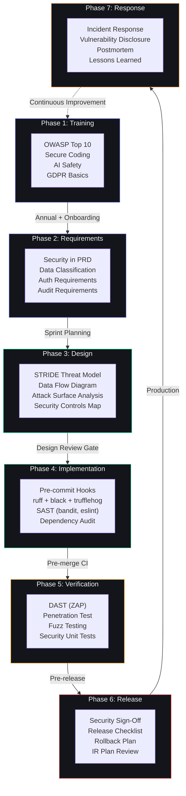

# Secure Development Lifecycle (SDL) — Second Brain OS

## Document Control

| Field | Value |
|---|---|
| **Document ID** | SEC-SDL-001 |
| **Version** | 1.0.0 |
| **Status** | Active |
| **Classification** | Internal — Security Team |
| **Last Updated** | 2026-07-11 |
| **Next Review** | 2026-10-11 |
| **Review Cycle** | Quarterly |
| **Methodology** | Microsoft SDL |
| **Approved By** | Developer |
| **Applicable To** | All development teams contributing to Second Brain OS |

---

## Table of Contents

1. [Introduction](#1-introduction)
2. [SDL Phases Overview](#2-sdl-phases-overview)
3. [Phase 1: Training](#3-phase-1-training)
4. [Phase 2: Requirements](#4-phase-2-requirements)
5. [Phase 3: Design](#5-phase-3-design)
6. [Phase 4: Implementation](#6-phase-4-implementation)
7. [Phase 5: Verification](#7-phase-5-verification)
8. [Phase 6: Release](#8-phase-6-release)
9. [Phase 7: Response](#9-phase-7-response)
10. [SDL Gates in CI/CD Pipeline](#10-sdl-gates-in-cicd-pipeline)
11. [Related Documents](#11-related-documents)

---

## 1. Introduction

### 1.1 Purpose

The Secure Development Lifecycle (SDL) is a structured methodology for embedding security into every phase of the software development process — from initial training through post-release incident response. This document defines the SDL for Second Brain OS, following the Microsoft SDL methodology adapted for a modern CI/CD-driven monorepo.

### 1.2 Scope

This policy applies to all code changes across the Second Brain OS monorepo, including:

- **Frontend:** Next.js TypeScript application (`apps/web/`)
- **Backend:** FastAPI Python application (`apps/api/`)
- **AI System:** Agent modules and prompt files (`packages/ai/`, `prompts/`)
- **Scheduler:** APScheduler cron jobs (`services/scheduler/`)
- **Infrastructure:** Docker configurations, CI/CD workflows, Terraform files
- **Documentation:** All documentation in `docs/` and `prompts/`

### 1.3 Guiding Principles

| Principle | Description |
|---|---|
| **Shift Left** | Find and fix security issues as early as possible in the development process. |
| **Defense in Depth** | Multiple layers of security controls — no single point of failure. |
| **Least Privilege** | Every component operates with the minimum permissions required. |
| **Secure by Default** | Security is opt-out, not opt-in. Default configurations are secure. |
| **Fail Securely** | When a system fails, it fails in a secure state (deny by default). |
| **Privacy by Design** | Personal data is protected throughout the entire lifecycle. |

### 1.4 SDL vs CI/CD Mapping

| SDL Phase | Development Stage | CI/CD Integration |
|---|---|---|
| Training | Ongoing | Annual refresher, onboarding |
| Requirements | Sprint planning, PRD review | Ticket template enforcement |
| Design | Architecture review, feature spec | Design review checklist gate |
| Implementation | Coding, code review | Pre-commit hooks, linting, SAST |
| Verification | Testing, QA | Automated testing, DAST, pen test |
| Release | Deployment | Release sign-off gate |
| Response | Post-production | Incident response runbook |

---

## 2. SDL Phases Overview



Each phase feeds into the next. The loop from Response back to Training ensures continuous improvement through lessons learned from security incidents.

---

## 3. Phase 1: Training

### 3.1 Required Security Training

All developers contributing code to Second Brain OS must complete the following training:

| Training | Frequency | Format | Duration |
|---|---|---|---|
| OWASP Top 10 (2021) | Annually | Self-paced online | 2 hours |
| Secure coding practices (Python/TypeScript) | Onboarding + annually | Workshop | 1 hour |
| AI safety & prompt injection prevention | Onboarding + annually | Workshop | 1 hour |
| Incident response familiarisation | Onboarding | Walkthrough | 30 minutes |
| Data privacy & GDPR basics | Onboarding | Self-paced | 30 minutes |

### 3.2 OWASP Top 10 Coverage

| # | Vulnerability | Mitigation in This Project |
|---|---|---|
| A01 | Broken Access Control | JWT auth, RLS policies, user_id filtering on all queries |
| A02 | Cryptographic Failures | bcrypt for passwords, HTTPS enforced, JWT HS256 |
| A03 | Injection | Supabase parameterised queries, XSS sanitizer (`xss.py`) |
| A04 | Insecure Design | STRIDE threat modelling per feature |
| A05 | Security Misconfiguration | Pydantic Settings validation, `.env.example` as source of truth |
| A06 | Vulnerable Components | Dependabot, npm audit, pip audit, Trivy scans |
| A07 | Auth Failures | JWT validation middleware, API key rotation, rate limiting |
| A08 | Data Integrity Failures | CSRF protection, signed audit logs |
| A09 | Logging Failures | Structured JSON logging with request IDs |
| A10 | SSRF | URL validation, no raw user-driven network requests |

### 3.3 Training Records

Training completion is tracked in the project's HR/training system. Developers must provide evidence of completion before being granted merge rights to the `main` branch.

---

## 4. Phase 2: Requirements

### 4.1 Security Requirements in PRD

Every Product Requirements Document (PRD) or feature specification MUST include a **Security Considerations** section that addresses:

- What data does this feature handle? (classification tier per SEC-POLICY-DC-001)
- What authentication/authorisation boundaries exist?
- What are the trust boundaries?
- What compliance requirements apply (GDPR, SOC 2)?
- What third-party dependencies are introduced?
- What audit events must be logged?
- What rate limiting or abuse prevention is needed?

### 4.2 Security Requirements Checklist

- [ ] Data classification tier identified (T1–T4)
- [ ] Authentication mechanism defined
- [ ] Authorisation boundaries documented
- [ ] Input validation requirements specified
- [ ] Output encoding requirements specified
- [ ] Session management requirements defined
- [ ] Audit logging requirements specified
- [ ] Rate limiting / abuse prevention defined
- [ ] Third-party dependency security reviewed
- [ ] Compliance requirements documented

### 4.3 Requirements Template

```markdown
### Security Requirements

| Concern | Requirement | Priority |
|---|---|---|
| Data classification | T2 — Confidential | Must |
| Auth | JWT Bearer token, API key fallback | Must |
| Rate limiting | 30 req/min per user | Should |
| Audit logging | Log all mutations with user_id, timestamp, diff | Must |
```

---

## 5. Phase 3: Design

### 5.1 Threat Modelling per Feature (STRIDE)

Every feature with a security boundary or handling classified data MUST undergo threat modelling using the **STRIDE** methodology:

| Category | Threat | Example |
|---|---|---|
| **S**poofing | Impersonating another user or service | Forged JWT token |
| **T**ampering | Modifying data in transit or at rest | Man-in-the-middle on API call |
| **R**epudiation | Denying an action occurred | Missing audit log for deletion |
| **I**nformation Disclosure | Exposing sensitive data to unauthorised parties | Leaking user_id in error response |
| **D**enial of Service | Degrading service availability | Flooding chat endpoint |
| **E**levation of Privilege | Gaining unauthorised capabilities | Bypassing RLS via direct Supabase query |

### 5.2 Design Review Checklist

A security-focused design review is REQUIRED before implementation begins on any feature that:

- Handles T1 or T2 classified data
- Introduces a new external integration or third-party API
- Changes authentication or authorisation flows
- Modifies the AI agent system or prompt submission pipeline
- Adds new data storage or modifies existing schema

#### Design Review Checklist

- [ ] STRIDE threats identified and documented
- [ ] Trust boundaries clearly defined
- [ ] Data flow diagram created (or updated)
- [ ] Attack surface analysis completed
- [ ] Security controls mapped to each threat
- [ ] Residual risks documented and accepted
- [ ] API rate limiting requirements specified
- [ ] Prompt injection mitigations designed
- [ ] Audit event schema defined
- [ ] Compliance requirements addressed

### 5.3 Design Review Artefacts

Each design review produces:

1. **Threat Model** — STRIDE analysis document (updated `docs/security/ThreatModel.md`)
2. **Data Flow Diagram** — Updated architecture diagram showing trust boundaries
3. **Security Controls Map** — Mapping of controls to identified threats
4. **Risk Acceptance** — Any residual risks with documented acceptance

---

## 6. Phase 4: Implementation

### 6.1 Approved Tools & Libraries

All code must be written using the project's approved technology stack:

| Category | Approved Tools | Blocked Tools |
|---|---|---|
| Python linter | `ruff` | `pylint` (deprecated) |
| Python formatter | `black` | `autopep8`, `yapf` |
| Python type checker | `mypy` (via pyproject.toml) | — |
| TypeScript linter | `eslint` | `tslint` (deprecated) |
| TypeScript formatter | `prettier` | — |
| SAST (Python) | `bandit` | — |
| SAST (TypeScript) | `eslint-plugin-security` | — |
| Secret scanning | `trufflehog` (pre-commit hook) | — |
| Dependency scanning | `npm audit`, `pip-audit` | — |
| Container scanning | `trivy` | — |

### 6.2 Prohibited Practices

- **No secrets in code:** API keys, tokens, passwords must never be hardcoded or committed. Use environment variables only.
- **No deprecated packages:** Any package flagged by `npm audit` (high/critical) or `pip-audit` must be patched within the SLA defined in AGENTS.md §27.
- **No `print()` statements:** Use structured logging via `shared/utils/logger.py`.
- **No `any` TypeScript type:** Use `unknown` with type guards.
- **No inline SQL:** Use Supabase SDK parameterised queries exclusively.
- **No inline Pydantic models in routers:** Define schemas in `database/schemas/`.

### 6.3 Static Analysis (SAST)

| Tool | Trigger | Scope | Action on Failure |
|---|---|---|---|
| `ruff` | Pre-commit + CI | All Python files | Block commit/merge |
| `black --check` | Pre-commit + CI | All Python files | Block commit/merge |
| `bandit` | CI (security job) | All Python files | Block merge |
| `eslint` (with security plugin) | Pre-commit + CI | All TypeScript files | Block commit/merge |
| `eslint-plugin-security` | CI (security job) | All TypeScript files | Warn, block on high |
| `trufflehog` | Pre-commit | All committed files | Block commit |
| `validate_prompts.py` | Pre-commit + CI | All `prompts/*.md` files | Block merge |

### 6.4 Dependency Scanning

| Tool | Frequency | Scope | Action |
|---|---|---|---|
| `npm audit` | Every CI run + weekly Dependabot | `apps/web/` | Block merge on critical/high |
| `pip-audit` | Every CI run + weekly Dependabot | `apps/api/`, `services/scheduler/` | Block merge on critical/high |
| `trivy` | CI (security job) | Docker images | Block merge on critical/high |
| Dependabot | Weekly | All ecosystems | Automated PR creation |

### 6.5 Pre-Commit Security Hooks

The following pre-commit hooks (configured in `.pre-commit-config.yaml`) enforce security gates locally:

```bash
# Security-focused pre-commit hooks
ruff check --fix             # Python lint + security
trufflehog filesystem .      # Secret scanning
black --check                # Formatting check
validate_prompts.py          # Prompt frontmatter validation
```

---

## 7. Phase 5: Verification

### 7.1 Dynamic Analysis (DAST)

OWASP ZAP is used for dynamic application security testing:

| Scope | Frequency | Tool | Artefact |
|---|---|---|---|
| API endpoints | Quarterly | OWASP ZAP (via `scripts/zap-pentest.sh`) | ZAP report |
| Frontend | Quarterly | OWASP ZAP | ZAP report |
| Authentication | Quarterly | Custom auth scan | Auth test report |

See `scripts/run-pentest.sh` for the full pen test orchestrator.

### 7.2 Penetration Testing

| Type | Frequency | Scope | Responsible |
|---|---|---|---|
| Full pen test | Quarterly | API, frontend, auth, AI endpoints | Developer + automated suite |
| Targeted pen test | Per feature | New security-sensitive features | Developer |
| SQL injection audit | Quarterly | All Supabase query patterns | `scripts/sql-injection-audit.sh` |
| OWASP SAST | Quarterly | All source code | `scripts/owasp-check.sh` |
| Custom attack scenarios | Quarterly | 6 attack vectors | `scripts/attack-scenarios.py` |

### 7.3 Fuzz Testing

Fuzz testing is applied to:

| Target | Tool | Frequency |
|---|---|---|
| API input validation | Custom Pydantic fuzzer (via test suite) | Per commit |
| NLP/chat input | LLM prompt injection test suite | Per release |
| File upload (resources) | Malformed file payloads | Quarterly |

### 7.4 Security Unit Tests

All security-related features must have corresponding unit tests:

| Category | Test File | Tests |
|---|---|---|
| XSS sanitisation | `tests/test_shared_utils.py` | 15+ XSS tests |
| CSRF protection | `tests/test_shared_utils.py` | CSRF token validation |
| Rate limiting | `tests/test_config_core.py` | Rate limiter behaviour |
| JWT validation | `tests/test_config_core.py` | Token expiry, malformed tokens |
| API key auth | `tests/test_config_core.py` | API key rotation, validation |
| Prompt sanitisation | `tests/test_prompt_loader.py` | Input sanitisation |

### 7.5 Verification Gates

| Gate | Phase | Tool | Criteria |
|---|---|---|---|
| SAST | Pre-merge | ruff, bandit, eslint | Zero critical/high findings |
| DAST | Pre-release | OWASP ZAP | Zero high-risk findings |
| Dependency scan | Pre-merge | npm/pip audit | Zero critical/high |
| Secret scan | Pre-commit | trufflehog | No secrets found |
| Security unit tests | Pre-merge | pytest | 100% pass rate |
| Pen test | Quarterly | Full suite | Zero critical/high findings |

---

## 8. Phase 6: Release

### 8.1 Security Review Sign-Off

Before any production release, a **Security Review Sign-Off** is required. The sign-off confirms:

- [ ] All SAST findings resolved (or accepted with rationale)
- [ ] All dependency vulnerabilities resolved (or accepted with rationale)
- [ ] All security unit tests passing
- [ ] DAST scan completed with no critical/high findings
- [ ] Pen test (if due) completed and findings addressed
- [ ] Secrets verified absent from the release branch
- [ ] Incident response plan reviewed for this release
- [ ] Data classification verified for any new features
- [ ] Audit logging confirmed for all new mutations
- [ ] Feature flag configuration reviewed (if applicable)

### 8.2 Release Security Checklist

```markdown
## Release Security Sign-Off: vX.Y.Z

**Date:** YYYY-MM-DD
**Release Manager:** @person

### Gates
- [ ] SAST (CI job): Passed
- [ ] Dependency scan (CI job): Passed
- [ ] Secret scan (pre-commit): Passed
- [ ] Security unit tests: 100% passing
- [ ] DAST (quarterly): N/A (not due) / Passed
- [ ] Pen test (quarterly): N/A (not due) / Passed
- [ ] Incident response plan reviewed: Yes/No

### New Features
- [Feature 1]: Security review complete
- [Feature 2]: Security review complete

### Risk Acceptance
- Finding #123: Accepted — low severity, scheduled for next sprint

### Sign-Off
- [ ] Security Lead
- [ ] CTO / Tech Lead
```

### 8.3 Incident Response Plan Review

Prior to each major release, the on-call engineer must review the incident response plan ([40_IncidentResponse.md](../operations/40_IncidentResponse.md)) and confirm familiarity with:

- Escalation matrix
- Rollback procedures
- Communication templates
- Postmortem process

---

## 9. Phase 7: Response

### 9.1 Vulnerability Disclosure Program

Security vulnerabilities can be reported through:

| Channel | Details |
|---|---|
| Email | developer@secondbrain-os.com (encrypted preferred) |
| GitHub | Repository Security tab — "Report a vulnerability" |
| SLA | Acknowledgement within 24 hours, fix within 7 days (critical) |

### 9.2 Incident Response Runbook Activation

When a security incident is confirmed, the appropriate runbook from [39_Runbooks.md](../operations/39_Runbooks.md) is activated:

| Incident Type | Runbook Reference |
|---|---|
| Authentication failure / breach | Runbook RB-005 |
| Data exposure / leak | Security incident — contact Security Lead |
| AI prompt injection detected | Security incident — disable chat, analyse |
| Dependency vulnerability (active exploit) | Runbook RB-006 (High Error Rate) |
| Account compromise | Runbook RB-005 |

### 9.3 Post-Incident Activities

After any security incident:

1. **Contain** — Isolate affected systems, revoke compromised credentials.
2. **Eradicate** — Remove the root cause (patch, configuration change, dependency update).
3. **Recover** — Restore normal operations, monitor for recurrence.
4. **Postmortem** — Within 48 hours for P0/P1 incidents, within 5 business days for P2+.

### 9.4 Lessons Learned Loop

Findings from security incidents feed back into:

1. **Training** — Update security training materials based on real incidents.
2. **Requirements** — Add new security requirements categories if gaps found.
3. **Design** — Update STRIDE threat models with new attack vectors.
4. **Implementation** — Add new SAST rules, pre-commit hooks, or code patterns.
5. **Verification** — Add new security test cases, update pen test scenarios.
6. **Release** — Strengthen release gates based on incident findings.

---

## 10. SDL Gates in CI/CD Pipeline

### 10.1 Pipeline Mapping

| CI Job | SDL Phase | Gates Enforced | Fail Action |
|---|---|---|---|
| **Frontend** (§17.1) | Implementation, Verification | `npm run lint`, `npm run type-check`, `npm run build` | Block merge |
| **Backend** (§17.1) | Implementation, Verification | `ruff check`, `black --check`, `pytest --cov` | Block merge |
| **Prompts** (§17.1) | Implementation | `validate_prompts.py`, prompt content tests | Block merge |
| **Docker** (§17.1) | Implementation, Release | Image build, smoke test | Block merge |
| **Security** (§17.1) | Implementation, Verification | `npm audit`, Trivy scan, OSSF Scorecard | Block merge |
| **Pentest** (§17.1) | Verification | OWASP SAST, SQL injection audit, attack scenarios | Block merge |
| **Lighthouse** (§17.1) | Verification | Performance, accessibility, SEO audit | Block merge |

### 10.2 Phase-to-Pipeline Detail

| SDL Phase | CI Jobs | Manual Activities |
|---|---|---|
| **1. Training** | None | Annual training, onboarding |
| **2. Requirements** | None | PRD security section, requirements checklist |
| **3. Design** | None | STRIDE threat modelling, design review |
| **4. Implementation** | Frontend, Backend, Prompts, Security | Pre-commit hooks, code review |
| **5. Verification** | Security, Pentest, Lighthouse, Docker | DAST (quarterly), pen test (quarterly), fuzz tests |
| **6. Release** | Docker (smoke test) | Security review sign-off, rollback prep |
| **7. Response** | None (post-deployment) | Incident response runbook, postmortem |

### 10.3 Gate Override Policy

SDL gates may be overridden ONLY in the following circumstances:

1. **Emergency security fix** — P0 vulnerability patch requiring immediate deployment.
2. **CI infrastructure failure** — Tool is broken, not code. Fix is in progress with an ETA.
3. **False positive** — Finding is confirmed not applicable. Documented acceptance required.

All overrides must be approved by the Security Lead or CTO and documented in the release notes.

---

## 11. Related Documents

| Document | Relationship |
|---|---|
| [24_Security.md](./24_Security.md) | Enterprise security architecture — overarching security posture and controls. |
| [40_IncidentResponse.md](../operations/40_IncidentResponse.md) | Incident severity definitions, escalation matrix, and response procedures. |
| [ThreatModel.md](./ThreatModel.md) | Full STRIDE threat model with asset inventory, attack trees, and risk scoring. |
| [soc2_control_matrix.md](./soc2_control_matrix.md) | SOC 2 control mappings — this SDL maps to SOC 2 CC1, CC2, CC3, CC5, CC7 criteria. |
| [AGENTS.md](../../AGENTS.md) | Project master reference — Section 16 (Testing Standards), Section 17 (CI/CD Pipeline), Section 23 (Security Compliance). |
| [monitoring-guide.md](../operations/monitoring-guide.md) | Monitoring and observability — alerting rules that detect security events. |
| [44_DeveloperOnboarding.md](../operations/44_DeveloperOnboarding.md) | Developer onboarding checklist — includes security training and SDL familiarisation. |
| [policy/data-classification.md](./policies/data-classification.md) | Data classification policy — SEC-POLICY-DC-001, defines T1–T4 data tiers. |
| [policy/incident-response.md](./policies/incident-response.md) | Incident response policy — SEC-POLICY-IR-001, full incident response playbook. |
| [policy/vulnerability-management.md](./policies/vulnerability-management.md) | Vulnerability management policy — SEC-POLICY-VM-001, CVE tracking and SLA. |

---

## Revision History

| Version | Date | Author | Changes |
|---|---|---|---|
| 1.0.0 | 2026-07-11 | Developer | Initial SDL document: all 7 phases (Training, Requirements, Design, Implementation, Verification, Release, Response) with Microsoft SDL methodology mapped to CI/CD pipeline. |

